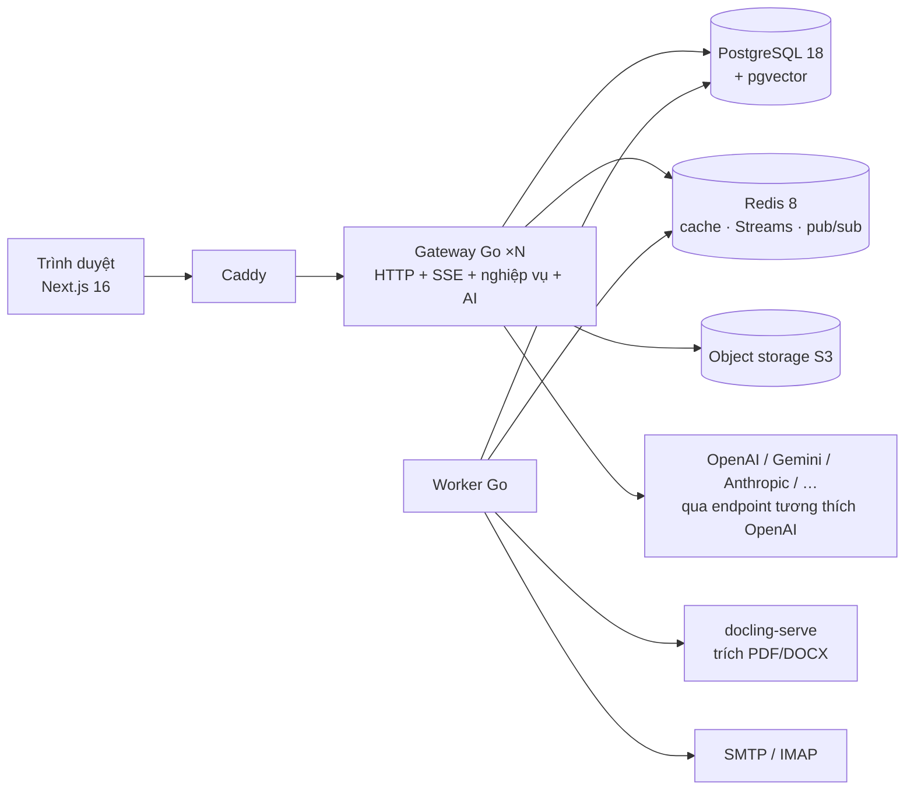
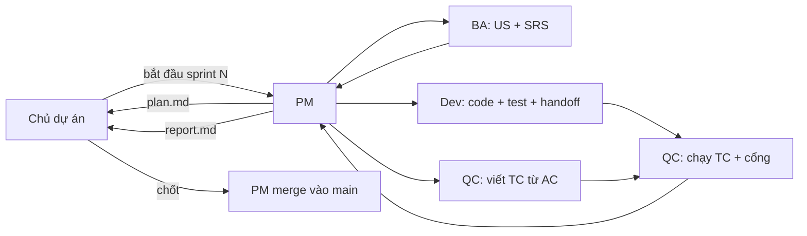

# EduPilot v2

Nền tảng vận hành lớp học có AI cho một học phần đại học: hỏi đáp hai kênh (chat riêng tư + Threads công khai) có tường lửa dữ liệu cá nhân, escalation sang giảng viên, CRM sinh viên và điểm danh, sổ điểm tính theo quy chế môn học, chấm tự luận tự động có giảng viên duyệt, tài liệu và lịch, luyện đề, cấu hình LLM nhiều nhà cung cấp, và màn quan sát lớp học.

Đồ án tốt nghiệp — viết mới hoàn toàn (D45) từ ý tưởng của Project III. Mã Project III nằm ở [`legacy/`](legacy/) **chỉ để tham khảo**: không build, không chạy, không import.

> **Trạng thái:** đã vào `main`: sprint 1 (P0), sprint 1.5 (prototype giao diện bấm được toàn bộ tính năng — 449 test case PASS; xem mục 5 "Xem prototype") và sprint 2 (PG — nền Go không trạng thái, cổng PG PASS, 536 test case). Đang làm: sprint 3 (PU + P1 LLM Gateway), sprint 4 (P2 Lớp học). Tiến độ: [`docs/PROGRESS.md`](docs/PROGRESS.md) · Lộ trình: [`docs/sprints/ROADMAP.md`](docs/sprints/ROADMAP.md).

---

## Mục lục
1. [Bài toán và mục tiêu đo được](#1-bài-toán-và-mục-tiêu-đo-được)
2. [Kiến trúc](#2-kiến-trúc)
3. [Công nghệ](#3-công-nghệ)
4. [Cấu trúc thư mục](#4-cấu-trúc-thư-mục)
5. [Chạy trên máy](#5-chạy-trên-máy)
6. [Kiểm thử và CI](#6-kiểm-thử-và-ci)
7. [Luật bất biến](#7-luật-bất-biến)
8. [Tài liệu](#8-tài-liệu)
9. [Quy trình làm việc: đội agent và sprint](#9-quy-trình-làm-việc-đội-agent-và-sprint)
10. [Lộ trình 10 sprint](#10-lộ-trình-10-sprint)
11. [Vì sao viết mới](#11-vì-sao-viết-mới)

---

## 1. Bài toán và mục tiêu đo được

Một học phần đại cương: 1.000 sinh viên, 20 lớp, 5 trợ giảng, ≈ 3.000 câu hỏi mỗi tuần (tải thiết kế **T1**, `docs/SYSTEM_DESIGN.md`). Vòng đời khép kín: sinh viên hỏi → AI trả lời hoặc chuyển giảng viên → bài nộp được chấm nháp → giảng viên duyệt, công bố → điểm danh, điểm cộng, điểm thành phần gộp thành điểm cuối kỳ theo quy chế → giảng viên thấy lớp đang yếu ở đâu.

| Mã | Mục tiêu | Chỉ số |
| --- | --- | --- |
| G1 | Dữ liệu cá nhân không lọt ra kênh công khai, không ra LLM ở dạng định danh | Recall ≥ 95%; 0 MSSV / họ tên thật trong payload gửi LLM |
| G3 | Chấm tự luận sát giảng viên | QWK ≥ 0,7; MAE ≤ 1,0 (thang 10) trên ≥ 60 bài chấm tay |
| G4 | Đổi LLM không sửa code | Đổi provider trên giao diện, mọi luồng vẫn qua |
| G5 | Điểm cuối kỳ đúng tuyệt đối | 30/30 khớp bảng tính tay; không dùng LLM để tính |
| G6 | Hiệu năng ở T1 | Sự kiện SSE đầu ≤ 300 ms; TTFT ≤ 1,5 s (cache) / ≤ 4 s (RAG); API đọc p95 ≤ 300 ms |

Đầy đủ: [`docs/PRD.md`](docs/PRD.md) (module M0–M14, tiêu chí nghiệm thu), [`docs/FLOWS.md`](docs/FLOWS.md) (luồng F1–F18).

## 2. Kiến trúc

Một **modular monolith Go** không trạng thái + Postgres + Redis. Không có service Python (D46): AI (gọi LLM, RAG, che danh tính, chấm bài) chạy trong cùng tiến trình Go.



- **Gateway không trạng thái** — phiên = JWT; rate limit, idempotency, ánh xạ che danh tính = Redis; file = object storage + URL ký sẵn. Nhân bản ngang bằng `--scale gateway=N`.
- **Việc nặng không chạy trong request** — trích tài liệu, chấm bài, mail, báo cáo đi qua Redis Streams; API trả `202` + job id, tiến độ qua SSE.
- **Mọi lời gọi LLM qua `internal/llm`** với Scheduler ba làn ưu tiên (`INTERACTIVE` > `NEAR_REALTIME` > `BATCH`), hạn mức, cầu dao — chấm bài hàng loạt không làm chat của sinh viên treo.
- **Luật tốc độ đường hỏi–đáp (D47):** đúng một lời gọi LLM sinh chữ có stream mỗi câu hỏi; truy xuất tất định (vector + từ khoá bằng SQL); phân loại một lần bằng luật + embedding; không vòng lặp agent mở.

Chi tiết: [`docs/ARCHITECTURE.md`](docs/ARCHITECTURE.md) (lược đồ dữ liệu, API, cấu trúc package, biến môi trường), [`docs/SYSTEM_DESIGN.md`](docs/SYSTEM_DESIGN.md) (ước lượng tải, SLO, lộ trình mở rộng).

## 3. Công nghệ

Phiên bản nền chốt ở D48.

| Tầng | Công nghệ |
| --- | --- |
| Backend | Go 1.27 · `chi` v5 · `pgx` v5 + `sqlc` + `pgvector-go` · `goose` · `go-redis` v9 · `openai-go` · `shopspring/decimal` (điểm, cấm `float64`) · `slog` + OpenTelemetry |
| Frontend | Next.js 16 (App Router, React Server Components, Turbopack) · React 19 · TypeScript · TanStack Query · zustand · recharts · `lucide-react` · Be Vietnam Pro |
| Dữ liệu | PostgreSQL 18 + pgvector (HNSW) · Redis 8 · object storage tương thích S3 |
| Hạ tầng local | Docker Compose · Caddy 2.11 (TLS nội bộ, proxy `/api` → gateway, không đệm SSE) · PgBouncer 1.26 (transaction mode) · MinIO · Mailpit (SMTP 1025, UI 8025) · `docling-serve` (từ sprint 5) |
| Kiểm thử | `go test -race` · testcontainers-go · `kin-openapi` (contract test, chỉ trong test — D52) · Playwright · `@redocly/cli` · k6 · `golangci-lint` |
| Công cụ | pnpm 12 · Node 24 LTS · GitHub Actions |

Thư viện ngoài bảng ở `ARCHITECTURE.md` §3 không được thêm khi chưa có quyết định.

## 4. Cấu trúc thư mục

```text
.
├── backend-go/              # Gateway + worker Go (một go.mod) — chi tiết: backend-go/README.md
│   ├── cmd/gateway/         # điểm vào HTTP (+ lệnh `migrate`, `token` cho dev)
│   ├── cmd/worker/          # consumer nền (outbox, việc dài)
│   ├── internal/
│   │   ├── platform/        # config, log, otel, redis, db (pgx), blob (MinIO), outbox, clock
│   │   ├── httpapi/         # router chi, middleware, lỗi thống nhất, cursor, Idempotency-Key, ETag, SSE
│   │   ├── auth/            # JWT, bcrypt, RBAC, khung CourseAccessGuard
│   │   ├── jobs/            # việc dài: 202 + GET /jobs/{id}
│   │   ├── store/           # sqlc (queries/*.sql)
│   │   ├── contract/        # response thật khớp api/openapi.yaml
│   │   └── testroutes/      # route chỉ cho test (build tag `testroutes`, image mặc định không có)
│   ├── db/migrations/       # goose, từ 00001
│   ├── api/openapi.yaml     # hợp đồng API — endpoint nào cũng phải có ở đây
│   └── Dockerfile           # multi-stage, image < 10 MB, nonroot, không shell
├── frontend/                # Next.js 16
│   ├── src/app/             # route
│   └── src/shared/          # token, primitive, lớp dữ liệu dùng chung (PU)
├── seed/documents/          # PDF môn học dùng làm dữ liệu seed
├── scripts/
│   ├── dev.mjs              # pnpm dev: dựng stack, chờ healthy
│   ├── ui-antipatterns.sh   # chặn phản mẫu giao diện (DESIGN.md §21)
│   └── team-up.sh           # dựng pane agent trên herdr
├── deploy/                  # Caddyfile, cấu hình PgBouncer
├── benchmarks/              # k6 (load/), số đo (reports/), đánh giá offline
├── docs/                    # PRD, kiến trúc, phase, spec, sprint, quyết định, research
├── legacy/                  # mã Project III — CHỈ ĐỌC
├── docker-compose.local.yml # stack dev; docker-compose.test.yml bật route thử
└── .github/workflows/ci.yml
```

Quy ước Go: `internal/<module>/{handler,service,repo}.go`; handler mỏng, logic ở service, SQL ở `internal/store/queries/*.sql` (sqlc). Frontend: `frontend/src/features/<module>/`, mọi màn dùng primitive ở `frontend/src/shared/`.

## 5. Chạy trên máy

### Yêu cầu
- Docker (Docker Desktop, OrbStack hoặc colima) — ≥ 4 CPU, 8 GB RAM cho VM
- Node 24 LTS + pnpm 12 (`corepack enable` hoặc `brew install pnpm`)
- Go 1.27 (chỉ cần khi chạy test / build ngoài Docker)
- macOS: `brew install node@24 pnpm go colima docker docker-compose golangci-lint gh`

### Dựng stack
```bash
pnpm install
pnpm dev            # tạo .env.local từ .env.example nếu chưa có, build, chạy migration, chờ mọi service healthy
pnpm dev:status     # trạng thái container
pnpm dev:logs       # theo dõi log
pnpm dev:down       # dừng (giữ volume)
# chạy 2 bản gateway sau Caddy
docker compose --env-file .env.local -f docker-compose.local.yml -p edupilot up -d --scale gateway=2 --wait
```

| Service | Địa chỉ trên máy | Ghi chú |
| --- | --- | --- |
| caddy | https://localhost | cửa vào duy nhất: `/api/*` → gateway, còn lại → frontend; chứng chỉ "Caddy Local Authority" |
| gateway | https://localhost/api/v1/healthz | `{"status":"ok"}`; `/api/v1/readyz` kiểm DB + Redis. Không công bố cổng riêng (nhân bản được) |
| frontend | http://localhost:3000 | Next.js chạy trực tiếp — **không dùng được để đăng nhập** (khác scheme/site với API nên trình duyệt không gửi cookie `SameSite=Lax` kèm `fetch`). Đăng nhập và mọi thao tác thật: https://localhost (Caddy, cùng một origin) |
| mailpit | http://localhost:8025 | hộp thư giả; SMTP `localhost:1025` |
| minio | http://localhost:9001 | console object storage |
| postgres | `localhost:5433` | user/db `edupilot`; ứng dụng đi qua PgBouncer (trong mạng compose) |
| redis | `localhost:6380` | |

Biến môi trường: [`.env.example`](.env.example) (chỉ giá trị dev giả). Gateway thiếu biến bắt buộc (hoặc biến rỗng) thì thoát mã 1 với một dòng log nêu đủ tên biến thiếu. Danh sách đầy đủ: `docs/ARCHITECTURE.md` §8.

Không ghi secret vào repo. Khoá LLM thật chỉ đặt trong `.env.local` (đã bị `.gitignore`); mọi test dùng provider `fake`.

### Xem prototype (sprint 1.5)
```bash
pnpm -C frontend build && pnpm -C frontend start     # http://localhost:3000
```
`/login` là màn đăng nhập thật (email + mật khẩu, cần stack `pnpm dev` và mở qua https://localhost). Công cụ chọn vai mô phỏng (Sinh viên A/B/C/D, `Đổi vai`, `Đặt lại dữ liệu demo`) chỉ còn ở bản dựng `NEXT_PUBLIC_DEV_TOOLS=1` (`pnpm -C frontend build:gate`), mục "Tài khoản mẫu" dưới form. Dữ liệu là mô phỏng (`frontend/src/mock/`), trạng thái lưu ở trình duyệt; màn mock được thay dần bằng màn thật theo từng sprint (D51). Kịch bản đi trọn: [`docs/DEMO_SCRIPT.md`](docs/DEMO_SCRIPT.md).

## 6. Kiểm thử và CI

```bash
# Go (xem backend-go/README.md: testcontainers trên colima cần ~/.testcontainers.properties)
make -C backend-go lint        # go vet + golangci-lint, cả build tag mặc định và testroutes
make -C backend-go test        # go test -race -tags testroutes ./... (gồm contract test)
make -C backend-go sqlc-check  # sqlc diff
# OpenAPI
pnpm exec redocly lint backend-go/api/openapi.yaml
# Frontend
pnpm -C frontend lint && pnpm -C frontend build
bash scripts/ui-antipatterns.sh
# Tải (stack đang chạy)
export JWT_SECRET_KEY="$(grep '^JWT_SECRET_KEY=' .env.local | cut -d= -f2-)"   # cùng khoá với gateway đang chạy
TOKEN="$(cd backend-go && go run ./cmd/gateway token --role STUDENT)" && k6 run -e BASE=https://localhost -e TOKEN="$TOKEN" benchmarks/load/smoke.js
```

Quản trị viên đầu tiên (không có route HTTP tạo ADMIN; mật khẩu CHỈ từ biến `ADMIN_PASSWORD` hoặc stdin, không có cờ `--password`; chạy lại cùng email thì thoát 0 và không đổi gì):

```bash
ADMIN_PASSWORD='…' ./bin/gateway admin create --email admin@edupilot.local --name "Quản trị"
```

CI (`.github/workflows/ci.yml`, runner `ubuntu-24.04`) chạy job **Go** (`go vet` hai bộ tag, `golangci-lint`, `sqlc diff`, `go test -race -tags testroutes`) và **Frontend** (lint, build, `ui-antipatterns.sh`) trên mọi push và pull request; không đụng `legacy/`, không dùng secret, không gọi LLM thật. Số đo nền của bản Go: [`benchmarks/reports/pg-baseline.md`](benchmarks/reports/pg-baseline.md).

## 7. Luật bất biến

Tóm tắt; bản đầy đủ và có hiệu lực là [`CLAUDE.md`](CLAUDE.md).

1. Go sở hữu nghiệp vụ và AI; không service Python.
2. Danh tính lấy từ JWT — tool của agent không nhận MSSV/user id từ LLM.
3. Mọi lời gọi LLM / embedding đi qua `internal/llm`.
4. Hai kênh, một tường lửa: nội dung công khai qua tường lửa PII trước khi lưu; tên và MSSV được thay placeholder quanh MỌI lời gọi LLM.
5. Tính điểm là code thuần (`decimal`); LLM không tính hay làm tròn điểm; giảng viên xác nhận công thức và công bố điểm.
6. Migration bằng goose từ `00001`, không sửa migration đã merge.
7. Danh sách nào cũng phân trang con trỏ; ghi có tác dụng phụ phải idempotent; sửa đồng thời dùng `version` → 409.
8. MSSV tự khai không bao giờ mở dữ liệu; chỉ email đã xác minh hoặc `user_id` từ phiên là danh tính.
9. Giao diện: đỏ là tín hiệu, không phải nền; một hành động chính mỗi vùng; sinh viên không thấy từ kỹ thuật AI; không gamify.

## 8. Tài liệu

| File | Nội dung |
| --- | --- |
| [`docs/PRD.md`](docs/PRD.md) | Yêu cầu, module M0–M14, tiêu chí nghiệm thu, mục tiêu G1–G7 |
| [`docs/FLOWS.md`](docs/FLOWS.md) | 18 luồng end-to-end F1–F18, cả nhánh lỗi |
| [`docs/ARCHITECTURE.md`](docs/ARCHITECTURE.md) | Thành phần, lược đồ dữ liệu, REST, provider LLM, env, kiểm thử |
| [`docs/SYSTEM_DESIGN.md`](docs/SYSTEM_DESIGN.md) | Tải T1, nút cổ chai, SLO, lộ trình mở rộng |
| [`docs/DECISIONS.md`](docs/DECISIONS.md) | Nhật ký quyết định D1–D52 |
| [`docs/design/DESIGN.md`](docs/design/DESIGN.md), [`docs/UX.md`](docs/UX.md) | Hệ thiết kế "Red Thread / Academic Instrument", hợp đồng từng route, luật UX |
| [`docs/phases/`](docs/phases/) | Backlog kỹ thuật: P0, PG, PU, P1–P10, PR — lát việc + cổng nghiệm thu |
| [`docs/specs/`](docs/specs/) | User story + SRS theo feature (BA viết) |
| [`docs/sprints/`](docs/sprints/) | Kế hoạch, handoff, test case, QC report, góp ý, báo cáo từng sprint |
| [`docs/thesis-notes/`](docs/thesis-notes/) | Nguyên liệu luận văn theo sprint |
| [`docs/research/`](docs/research/) | Báo cáo nghiên cứu công nghệ / hạ tầng có PoC (vai Research) |
| [`docs/DEMO_SCRIPT.md`](docs/DEMO_SCRIPT.md) | Kịch bản demo bảo vệ 15 phút |
| [`docs/PROGRESS.md`](docs/PROGRESS.md) | Đang ở đâu, nợ gì |

## 9. Quy trình làm việc: đội agent và sprint

Một người (chủ dự án) + năm phiên agent trên [herdr](https://herdr.dev), giao tiếp qua file trong repo ([`docs/team/`](docs/team/); mọi vai đọc [`docs/team/CONTEXT.md`](docs/team/CONTEXT.md) trước):

| Vai | Việc | Sửa được |
| --- | --- | --- |
| `pm` | Lập sprint, giao việc, quyết góp ý kỹ thuật, tổng hợp, dừng hỏi chủ dự án | `docs/sprints/**`, `docs/PROGRESS.md`, `docs/thesis-notes/**` |
| `ba` | User story + SRS theo feature | `docs/specs/**` |
| `dev` | Thi công từng story theo lát dọc | mã nguồn |
| `qc` | Viết test case từ AC (song song với dev), kiểm thử thăm dò, chạy, báo PASS/FAIL, chạy cổng phase | `docs/sprints/N/qc/**`, test mới |
| `research` | Kiểm chứng công nghệ, hạ tầng, rủi ro bằng nguồn chính + PoC, đề xuất cho PM | `docs/research/**` |



- Spec đã duyệt chỉ đổi qua `docs/sprints/N/proposals.md` khi PM chấp nhận; **không thoả hiệp ngang hàng** (dev không xin QC nới test, QC không sửa test cho khớp code, BA không sửa AC cho khớp code).
- Câu hỏi đụng hành vi sản phẩm, quyền, điểm số, dữ liệu cá nhân luôn về chủ dự án.
- Chạy cuốn chiếu: trong lúc QC kiểm sprint N, PM lập kế hoạch và BA viết spec sprint N+1; nhánh `sprint/N+1-…` xếp chồng lên nhánh N khi N chưa vào `main`. Chủ dự án chốt báo cáo → merge `--no-ff` vào `main`.
- Không mở subagent khi PM chưa cho phép (tiết kiệm token).

## 10. Lộ trình 10 sprint

| Sprint | Phase | Kết quả chính |
| --- | --- | --- |
| 1 ✅ | P0 Chuẩn bị | Mặt bằng mới, khung Go + Next.js, stack local, CI, kịch bản demo |
| 1.5 ✅ | Prototype giao diện (D51) | Prototype bấm được toàn bộ tính năng, đổi 4 vai, Threads mô phỏng như thật, đi trọn kịch bản demo 15 phút |
| 2 ✅ | PG Nền Go | DB/migration/sqlc, Redis, blob, outbox, chuẩn API, SSE, contract test, Caddy + PgBouncer, nhân bản gateway |
| 3 | PU + P1 | Token, app shell, primitive; LLM gateway + Scheduler + cấu hình provider |
| 4 | P2 | Tài khoản an toàn, mở lớp, phân công, mã tham gia, "Hôm nay" |
| 5 | P3 + P8 | Chat riêng + Threads, tường lửa PII, che danh tính; tài liệu, thư viện, lịch |
| 6 | P4 + P5 | Escalation + mail, kiểm duyệt; điểm danh, CRM, hồ sơ 360 |
| 7 | P6 | Sổ điểm, công thức từ quy chế, điểm cuối kỳ |
| 8 | P7 | Bài tập, nộp bài, chấm nháp AI, công bố, phúc khảo |
| 9 | P9 | Ngân hàng câu hỏi, luyện đề, QUIZ |
| 10 | P10 | Observation, đánh giá E1–E6, test tải T1, hoàn thiện → **vạch bảo vệ** |

Chi tiết ghép phase, cổng và mục cắt được khi trễ: [`docs/sprints/ROADMAP.md`](docs/sprints/ROADMAP.md).

## 11. Vì sao viết mới

Đọc mã Project III ([`docs/thesis-notes/legacy-perf.md`](docs/thesis-notes/legacy-perf.md)) cho thấy hệ cũ chậm vì **thiết kế**, không vì ngôn ngữ: mỗi câu hỏi gọi LLM 2–6 lần nối tiếp trước khi hiện chữ đầu (tạo thread kèm AI: 6 lần, 4 lần là cùng một phép phân loại), danh sách thread N+1, DB đặt xa, trích tài liệu chạy chung tiến trình với chat, sáu runtime trong một container CPU yếu. Các quyết định D45 (viết mới), D46 (chỉ Go), D47 (luật tốc độ), D48 (phiên bản nền) trả lời trực tiếp từng nguyên nhân.
