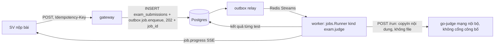

# Chấm code C/C++ tự động cho bài thi hằng tuần

**Câu hỏi.** Dùng sandbox nào để biên dịch và chạy C/C++ không tin cậy cho bài thi hằng tuần (tải T1: 1.000 SV / 20 lớp, dồn nộp 5 phút cuối), tích hợp vào worker Go thế nào, chấm và giữ liêm chính ra sao — và có phải mở lại D46 không?

## Kết luận

- **Chọn `criyle/go-judge`** (Go, MIT): một container sandbox có REST API, chạy bên cạnh worker. Worker Go gọi `POST /run` (biên dịch → chạy từng test → so khớp); không cần thư viện ngoài phía Go (chỉ `net/http` + `encoding/json`).
- **Phải mở lại D46**, nhưng ở mức nhỏ: D46 bỏ dịch vụ Python, còn đây là thêm **một container viết bằng Go**, không có ngôn ngữ backend mới. Câu chữ D46 "chỉ Go + `docling-serve`" đổi thành "… + `go-judge` (sandbox chấm code)".
- **PoC trên colima chạy đúng:** AC, WA, CE, TLE (vòng lặp vô hạn), MLE, RE, OLE đều phân loại đúng. Fork bomb không tạo được tiến trình thứ hai (`procPeak=1`). Đọc `/etc/shadow`, `/proc/1/environ`, `/opt/go-judge`: bị chặn hết. Mở kết nối ra mạng: `connect` trả lỗi (−1). `#include "/dev/random"` bị giết khi biên dịch.
- **Thông lượng đo được** (colima 4 CPU, bài dùng `<bits/stdc++.h>`, 1 lần biên dịch + 10 test): **≈ 180–197 bài/phút**; 60 bài nộp cùng lúc chấm xong trong 18,2 s.
- **Rủi ro chính:**
  1. Container phải chạy `--privileged --cgroupns=host`. Lệnh trong README (thiếu `--cgroupns=host`) chết ngay khi khởi động trên colima; công thức "không privileged" ở issue #131 cũng thất bại trên colima.
  2. Bản mới nhất **v1.13.0 bật seccomp mặc định và hỏng trên arm64/colima** — mọi lệnh `/run` trả `lstat stdout: operation not permitted`; v1.12.3 và v1.11.4 chạy được. PoC chạy v1.13.0 với `-no-seccomp`.
  3. Sandbox thoát ra được thì là root trên VPS chung với DB.
- **Chủ dự án cần quyết:** (a) chấp nhận mở D46 thêm container `go-judge`; (b) chấp nhận container `--privileged` trên VPS demo chung với DB, hoặc tách sang máy riêng; (c) pin bản: v1.13.0 với `-no-seccomp`, hay v1.12.3; (d) phạm vi liêm chính (đề xuất: khoá chat AI bằng `quiz_lock` có sẵn + so độ giống sau giờ thi tự viết bằng Go + log rời tab chỉ để tham khảo; **không** gửi code SV sang MOSS).

Độ chắc chắn: **cao** cho go-judge trên colima (PoC thật). **Trung bình** cho VPS amd64 (chưa chạy; seccomp v1.13.0 có thể chạy được trên amd64 — `[SUY LUẬN]`).

## 1. Sandbox — so sánh

| Tiêu chí | **go-judge** v1.13.0 | Judge0 CE v1.13.1 | `ioi/isolate` | nsjail 3.6 | gVisor `runsc` | Piston |
| --- | --- | --- | --- | --- | --- | --- |
| Ngôn ngữ / dạng | Go, máy chủ REST/gRPC/WS | Ruby on Rails + Postgres + Redis riêng, dùng isolate | C, CLI | C++, CLI | Go, runtime OCI cho Docker | Node API, dùng isolate |
| Giấy phép | MIT | GPL-3.0 | GPL-2.0+ | Apache-2.0 | Apache-2.0 | MIT |
| Bản mới / hoạt động | v1.13.0, 2026-09-28; 619★ | **bản cuối 2024-04-18**; 4,5k★ | không có release; commit 2026-08 | 3.6, 2026-03 | 2026-09-30 | không release từ 2021; commit 2026-07 |
| Cách ly | namespace (user, pid, mount, **net**, ipc, uts), cgroup v2, rlimit, `no_new_privs`, bỏ capability; seccomp Moby (từ v1.13) | qua isolate | namespace + cgroup, không seccomp | namespace + cgroup + seccomp Kafel | kernel giả lập trong user space | qua isolate |
| Giới hạn CPU / đồng hồ / RAM / tiến trình / output | có hết, theo từng lệnh | có | có | có | qua Docker | có |
| cgroup v2 | có (đã thử) | **chỉ v1** — tài liệu cài yêu cầu `systemd.unified_cgroup_hierarchy=0` | có (cần libsystemd) | có | — | có (README yêu cầu v2) |
| Docker `--privileged` | **có** (+ `--cgroupns=host`) | có (`privileged: true` trong compose) | cần root | có (ví dụ README) | không, nhưng phải cài runtime vào Docker host | có |
| Chạy trên colima macOS | **đã chạy (PoC)** | không (colima dùng cgroup v2) | [SUY LUẬN] được | [SUY LUẬN] được | phải cài vào VM colima, ngoài compose | [SUY LUẬN] được |
| API cho worker Go | REST JSON có sẵn | REST có sẵn | phải tự viết lớp bọc | phải tự viết lớp bọc | worker phải nắm Docker socket (quyền rất lớn) | REST có sẵn |
| Công sức tích hợp | thấp | trung bình (thêm 3 service) | cao | cao | cao | thấp–trung bình |

Loại: Judge0 (cgroup v1, ba service thêm, GPL, phát hành ngừng từ 2024); isolate / nsjail (phải viết dịch vụ bọc — go-judge chính là thứ đó); gVisor (không phải trình chấm; worker cần quyền Docker); Piston (Node, không phát hành từ 2021, cũng cần privileged).

## 2. Tích hợp với kiến trúc hiện có



- Dùng lại `internal/jobs` (`Runner.Register("exam.judge", fn)`, outbox `job.enqueue`, sự kiện SSE `job.progress` có sẵn) — đúng luật 12 (202 + job + SSE).
- Mã nguồn lưu trong Postgres (cột `text`, giới hạn ví dụ 64 KiB). Test ẩn trong DB hoặc blob (MinIO), worker đọc rồi gửi bằng `copyIn: {"content": …}`. go-judge giữ file trong bộ nhớ (`/dev/shm` của **container sandbox**), gateway/worker không ghi đĩa (luật 10). File chạy đã biên dịch (`copyOutCached`) xoá bằng `DELETE /file/{id}` sau khi chấm.
- Idempotent khi chấm lại: khoá `(submission_id, judge_version)`; ghi kết quả bằng `INSERT … ON CONFLICT DO NOTHING`; "chấm lại" = tăng `judge_version` (đổi test / sửa đề). Sandbox không có trạng thái nên gọi lại an toàn.
- Lỗi của sandbox (`Internal Error`, HTTP 5xx, mất kết nối) → `IE` → job thử lại theo retry/dead-letter có sẵn; không bao giờ ghi IE thành điểm 0.
- Đồng thời: worker giữ semaphore = `-parallelism` của go-judge. PoC: 120 yêu cầu dồn cùng lúc vẫn xếp hàng bên trong go-judge, nhưng HTTP treo lâu — worker nên tự giới hạn và đặt hạn từng lệnh `/run`.
- Bảo mật: go-judge chỉ trong mạng compose (không `ports`), bật `-auth-token` (secret từ `.env`), không truyền secret nào khác vào container. go-judge không bao giờ nhận danh tính SV — chỉ có mã nguồn và dữ liệu test.

Compose (dev + VPS). Đã chạy thật trên colima bằng `docker compose` (image PoC, `cgroup: host`, `-auth-token`): `/run` không token → **401**, có token → 200 và `Accepted`; `/file` cũng 401 khi thiếu token; riêng `/version` trả 200 không cần token.

```yaml
judge:
  build: { context: ./deploy/judge }        # Dockerfile như docs/research/poc/code-judge/Dockerfile
  privileged: true
  cgroup: host                              # = --cgroupns=host; thiếu → "cgroup path is empty", container thoát
  shm_size: 256m
  command: ["-http-addr=:5050", "-parallelism=${JUDGE_PARALLELISM:-2}", "-auth-token=${JUDGE_TOKEN}", "-no-seccomp"]  # hoặc bỏ -no-seccomp nếu pin v1.12.3
  # không có "ports": chỉ worker gọi qua mạng nội bộ
```

Trên VPS S1 (4 vCPU dùng chung với gateway, Postgres, `docling-serve`) nên đặt `-parallelism=2` và bật `-enable-cpu-rate` nếu cần chừa CPU [SUY LUẬN — chưa đo trên VPS].

## 3. Mô hình chấm

| Hạng mục | Đề xuất |
| --- | --- |
| Trình biên dịch | gcc/g++ **14.2.0** (Debian trixie, đã kiểm trong image PoC). C: `gcc -std=c11 -O2 -pipe -o a a.c -lm`. C++: `g++ -std=c++17 -O2 -pipe -o a a.cc`. Ghim phiên bản trong Dockerfile. |
| Giới hạn biên dịch | CPU 10 s, đồng hồ 20 s, RAM 512 MiB, 50 tiến trình (cc1plus, as, ld); stderr cắt 8 KiB. |
| Giới hạn chạy | Theo bài: thời gian CPU (mặc định 1 s), đồng hồ = 3 × CPU, RAM (mặc định 256 MiB), **1 tiến trình**, stdout tối đa 1 MiB. |
| Kết quả | CE (biên dịch lỗi), AC, WA, TLE, MLE, OLE, RE (exit ≠ 0, tín hiệu, syscall bị chặn), IE (lỗi hệ thống, không tính điểm). Ánh xạ trực tiếp từ `status` của go-judge (đã thấy ở PoC: `Time Limit Exceeded`, `Memory Limit Exceeded`, `Output Limit Exceeded`, `Signalled`, `Nonzero Exit Status`). |
| So khớp | Mặc định bỏ khoảng trắng cuối dòng và dòng trống cuối tệp (PoC dùng cách này). Tuỳ chọn theo bài: so chính xác; so theo token (bỏ mọi khoảng trắng); số thực có sai số. Checker tuỳ chỉnh = chương trình C++ (kiểu testlib) do GV viết, chạy như **lệnh thứ hai** trong go-judge với đầu vào + đầu ra SV + đáp án → không chạy code GV ngoài sandbox. |
| Điểm | % test đạt × điểm bài (hoặc trọng số từng test); dùng `shopspring/decimal` (luật 5). Test mẫu hiện cho SV, test ẩn chỉ hiện kết quả (AC/WA…), không lộ đầu vào. Kết quả AI-free; công bố điểm vẫn cần GV bấm (luật dự án). |
| Thứ tự | Một test TLE/MLE không dừng các test còn lại (điểm từng phần); muốn nhanh thì có thể dừng sớm khi mọi test còn lại cùng nhóm. |

Lưu ý từ PoC: chương trình in vô hạn ra màn hình bị tính **TLE** (bị cắt ở 1 MiB, rồi hết giờ CPU); chương trình in hữu hạn nhưng quá lớn (5 MB) thì đúng **OLE**. Cả hai đều bị chặn, chỉ khác tên kết quả.

Tải xấu nhất. 1 lớp 60 bài dồn cùng lúc: 18,2 s là xong. 20 lớp × 60 bài trong 5 phút = 240 bài/phút, vượt ≈ 190 bài/phút đo được → hàng đợi kéo dài thêm khoảng 1–2 phút sau hạn chót [SUY LUẬN, dựa trên số đo; bài TLE tốn tới 3 s đồng hồ mỗi test]. Nên giới hạn nộp (ví dụ 1 lần / 30 s / SV) và chỉ chấm bản nộp cuối khi tải cao.

## 4. Liêm chính tối thiểu khả thi

| Biện pháp | Đề xuất | Lý do |
| --- | --- | --- |
| Khoá chat AI trong giờ thi | Dùng `quiz_lock:<user_id>` của P9 L2b (Redis, TTL = thời gian còn lại) cho cả bài thi lập trình | Đã có thiết kế, không thêm gì |
| Phát hiện code giống nhau | **Tự viết winnowing trong Go**: chạy sau giờ thi trên toàn lớp, trừ dấu vân tay của code mẫu GV ("base file"), xếp hạng các cặp nghi vấn cho GV xem — **chỉ gợi ý, không tự trừ điểm** | Không tìm thấy thư viện Go cho C/C++ (`mibk/dupl` chỉ cho mã Go). JPlag (Java, GPL-3.0) và Dolos (Node, MIT) tốt hơn nhưng là runtime mới — được dùng **tay**, ngoài hệ thống. MOSS là dịch vụ ngoài (Stanford): gửi bài SV ra ngoài, có thể chứa tên / MSSV trong chú thích → không dùng |
| Ghi log rời tab / dán | Client gửi sự kiện `visibilitychange`, `blur`, `paste` (độ dài, không nội dung) kèm thời điểm; GV xem trên trang bài nộp | Chỉ để tham khảo: dễ giả, có cả lý do vô hại → không tự kết luận gian lận |
| Môi trường | Không cho xem test ẩn; trả lỗi biên dịch đã cắt ngắn; giới hạn tần suất nộp | Chống dò test bằng cách nộp nhiều lần |

PoC winnowing (`docs/research/poc/code-judge/sim`): token hoá C/C++ (định danh → `I`, số → `N`, chuỗi → `S`, bỏ chú thích), k = 5, cửa sổ w = 4, độ giống Jaccard:

```
A gốc ~ B đổi tên biến + định dạng lại + thêm chú thích   Jaccard=1.00
A gốc ~ C cùng đề, lời giải khác (O(n²))                 Jaccard=0.27
B     ~ C                                                Jaccard=0.27
```

Mức nền 0,27 đến từ phần khung chung (`#include`, `main`, `cin`) → phải trừ code mẫu và đặt ngưỡng theo phân bố của lớp, không dùng ngưỡng cố định.

## 5. PoC

Mã: `docs/research/poc/code-judge/` (`Dockerfile`, `judge/main.go` = client chấm như worker sẽ làm, `sim/main.go` = winnowing). Môi trường: colima 4 CPU / 8 GiB, aarch64, kernel 6.8.0-117-generic, Docker 29.5.2 (cgroup v2, driver cgroupfs), Go 1.27.1.

```bash
docker build -t rj-gojudge:poc docs/research/poc/code-judge           # debian:trixie-slim + g++ 14.2.0 + go-judge v1.13.0; 124 MB
docker run -d --name rj-judge --privileged --cgroupns=host --shm-size=256m -p 15050:5050 \
  rj-gojudge:poc -http-addr=:5050 -parallelism=4 -no-seccomp
(cd docs/research/poc/code-judge/judge && go run . -url http://localhost:15050)
(cd docs/research/poc/code-judge/judge && go run . -url http://localhost:15050 -burst 60)
```

Dò quyền chạy container (kết quả thật):

```
--privileged (đúng lệnh README)                → "cgroup path is empty", container thoát
--privileged --cgroupns=host                   → "Starting http server", cgroupType=2
--cgroupns=host -v /sys/fs/cgroup:rw --security-opt seccomp=unconfined            → init_fs: mount /: permission denied
  + --security-opt apparmor=unconfined                                           → fork/exec /proc/self/exe: permission denied
  + --cap-add SYS_ADMIN                                                          → prefork environment failed
v1.13.0 (seccomp mặc định), /run echo hi       → "container: stdout: lstat stdout: operation not permitted"
v1.12.3 / v1.11.4 cùng cờ                      → Accepted, stdout "hi"
v1.13.0 + -no-seccomp                          → Accepted, stdout "hi"
```

Chấm 11 bài, 3 test a+b mỗi bài, giới hạn 1 s CPU / 256 MiB / 1 tiến trình (kết quả thật, rút gọn):

```
AC a+b                → AC   100%  0.14s  t1..t3 Accepted cpu=0ms mem=280KiB proc=1
WA                    → WA     0%  0.06s  out=-1 / -10 / 0
CE                    → CE     0%  0.01s  Nonzero Exit Status: a.cc: In function 'int main()':
TLE vòng lặp vô hạn   → TLE    0%  3.07s  Time Limit Exceeded cpu=1001/1003/1004ms
MLE chạm dần 512 MiB  → MLE    0%  0.51s  Memory Limit Exceeded mem=262160KiB
RE segfault           → RE     0%  0.08s  Signalled
OLE in vô hạn         → TLE    0%  3.39s  Time Limit Exceeded mem=644KiB (stdout cắt ở 1 MiB)
  (in hữu hạn 5 MB, kiểm riêng)       → Output Limit Exceeded, outLen=1048577
fork bomb             → TLE    0%  3.68s  Time Limit Exceeded proc=1  (fork() không tạo được tiến trình thứ hai)
đọc file hệ thống     → WA     0%  0.08s  /etc/shadow=CHAN /etc/passwd=CHAN /proc/1/environ=CHAN /opt/go-judge=CHAN /root/.bashrc=CHAN
mạng ra ngoài         → WA     0%  0.06s  socket=3 connect=-1
CE include /dev/random→ CE     0%  1.01s  Memory Limit Exceeded: g++: fatal error: Killed signal terminated program cc1plus
```

Thông lượng (1 biên dịch + 10 test mỗi bài, tất cả AC):

```
<cstdio>            burst=1:  0.2s   burst=30: 1.4s  (1256 bài/phút)  burst=60: 3.2s  (1109 bài/phút)
<bits/stdc++.h>     burst=1:  1.4s   burst=30: 13.1s (138 bài/phút)   burst=60: 18.2s (197 bài/phút)   burst=120: 40.1s (180 bài/phút)
docker stats rj-judge lúc rảnh: 35.6 MiB
```

Biên dịch `<bits/stdc++.h>` chiếm phần lớn thời gian (1,4 s / bài). Precompiled header có thể giảm mạnh con số này — chưa thử, chỉ làm khi đo thấy cần.

## Bằng chứng (nguồn)

- go-judge [README v1.13.0](https://github.com/criyle/go-judge/blob/v1.13.0/README.md): lệnh Docker `--privileged --shm-size=256m`; mount mặc định chỉ đọc `/lib /usr /bin …`, tmpfs `/w /tmp`; danh sách trạng thái; "If no permission to create cgroup, the cgroup related limit will not be effective"; "Windows and macOS support are experimental".
- [`cmd/go-judge/config/config.go` v1.13.0](https://github.com/criyle/go-judge/blob/v1.13.0/cmd/go-judge/config/config.go): `NetShare` mặc định false (mạng tách riêng), `SeccompConf` "default: embedded Moby profile", `NoSeccomp`, `Parallelism` (mặc định = số CPU), `AuthToken`, `OutputLimit` 256 MiB, `EnableCPURate`.
- Issue [#131](https://github.com/criyle/go-judge/issues/131): công thức chạy không privileged (`--cgroupns=host -v /sys/fs/cgroup:rw --security-opt seccomp=unconfined`) — **không** chạy được trên colima (PoC); tác giả: go-judge "drops all capabilities with `no_new_priv` flags when running user programs".
- Issue / PR #198, #199 (2026-09-27): "Enable seccomp by default" → nguyên nhân hỏng của v1.13.0 trên arm64 (PoC). Nên báo lỗi upstream kèm bước tái hiện.
- Judge0 [CHANGELOG v1.13.1](https://github.com/judge0/judge0/blob/master/CHANGELOG.md): khuyến nghị Ubuntu 22.04 + `systemd.unified_cgroup_hierarchy=0`; [docker-compose.yml](https://github.com/judge0/judge0/blob/master/docker-compose.yml): `privileged: true`, kèm Postgres 16.2 + Redis 7.2.4 riêng.
- nsjail [README](https://github.com/google/nsjail): namespace, seccomp Kafel, cgroup v1/v2, ví dụ `docker run --privileged`. Piston [README](https://github.com/engineer-man/piston): dùng isolate, cần cgroup v2, `docker run --privileged`. isolate: LICENSE GPL-2.0+, cần libsystemd. Thông tin repo (sao, giấy phép, release) lấy từ GitHub API ngày 2026-10-03.

## Ảnh hưởng

- `DECISIONS.md`: mở lại D46 (thêm container `go-judge`); quyết định mới về liêm chính (không dùng MOSS, winnowing chỉ gợi ý).
- `ARCHITECTURE.md`: thêm dòng dịch vụ `judge` vào bảng hạ tầng + biến `JUDGE_URL`, `JUDGE_TOKEN`, `JUDGE_PARALLELISM`; module mới `internal/exam` (hoặc mở rộng P9 quiz) + kind `exam.judge`.
- `SYSTEM_DESIGN.md`: S1 thêm 1 container; luồng tải "dồn nộp" (mục 2 ở trên); giới hạn tần suất nộp.
- `PRODUCTION_READINESS.md`: container privileged — nên tách sang VPS riêng hoặc chấp nhận rủi ro có ghi chép; tắt `-enable-debug`; theo dõi CVE go-judge và Debian gcc.
- Cách lùi: nếu go-judge có vấn đề thì chuyển sang isolate + dịch vụ bọc Go tự viết (khoảng vài trăm dòng). API phía worker vẫn giữ nguyên.

## Đề xuất cho PM

`Chấm code C/C++: chọn go-judge (Go, MIT) làm container sandbox gọi từ worker qua REST — PoC colima chặn đúng TLE/MLE/OLE/RE/fork bomb/đọc file/mạng, ≈190 bài/phút (4 CPU, bits/stdc++, 10 test); cần mở lại D46 (thêm 1 container Go, không Python) và chủ dự án quyết: chạy --privileged --cgroupns=host trên VPS chung hay tách máy, pin v1.13.0 -no-seccomp hay v1.12.3 (seccomp mặc định của v1.13.0 hỏng trên arm64); liêm chính = quiz_lock + winnowing tự viết (chỉ gợi ý, không MOSS) + log rời tab tham khảo — docs/research/2026-10-03-code-judge.md.`
