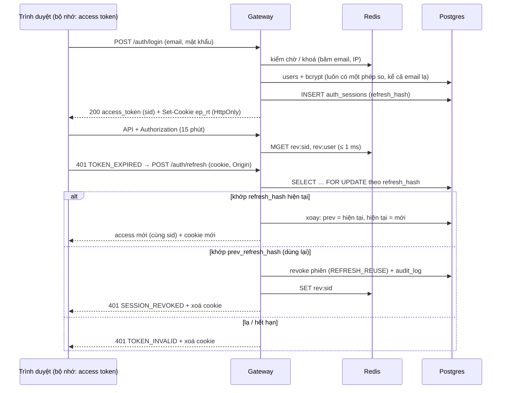
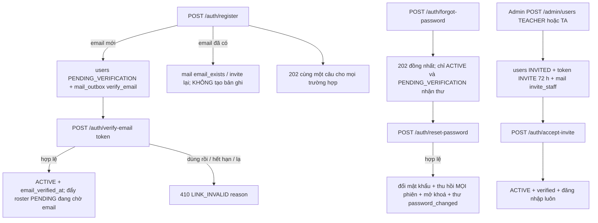
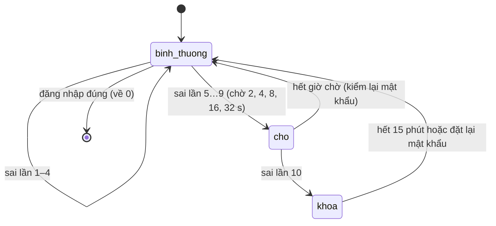

# SRS FEAT-account-security Tài khoản an toàn (F1): phiên, đăng ký, xác minh, quên mật khẩu, mời giảng viên, chống dò
Phiên bản 1.5 · 2026-10-03 · Trạng thái: **APPROVED** (PM 2026-10-03; Q1–Q19 theo mặc định của BA; câu [CHỦ DỰ ÁN] Q2–Q8, Q17 chốt theo mặc định và báo chủ dự án trong báo cáo sprint 4; PM đã cập nhật `ARCHITECTURE.md` §5, §9)

**v1.5 (2026-10-03)** — góp ý #4 `docs/sprints/4/proposals.md` (PM `ACCEPTED`; nguồn: dev; trích: "AC7 \"chỉ nhận `Content-Type: application/json`\" mâu thuẫn với lệnh tay AC3/AC6/AC7 (`curl -X POST …/auth/refresh` không thân, không Content-Type)… Từ chối khi header có mà khác JSON (415); cho qua khi không có header. **ACCEPTED** — điều kiện: kiểm Origin / `Sec-Fetch-Site` là bắt buộc ở mọi endpoint dùng cookie"). Không đổi số AC. Đổi: US-P2-02 AC7, `SRS.md` 4.1 (kiểm nguồn gốc).

**v1.4 (2026-10-03)** — góp ý #3 `docs/sprints/4/proposals.md` (PM `ACCEPTED`; nguồn: dev; trích: "AC13 yêu cầu `vitest run src/shared/session/safeNext.test.ts`, nhưng `vitest` không có trong bảng thư viện `ARCHITECTURE.md`… Kiểm `safeNext` bằng test Playwright không cần trình duyệt (`e2e/safe-next.spec.ts`)"). Không đổi số AC. Đổi: US-P2-02 AC13 (lệnh `Kiểm`).

**v1.3 (2026-10-03)** — góp ý #2 `docs/sprints/4/proposals.md` (PM `ACCEPTED`; nguồn: dev; trích: "AC6 ghi \"dừng / bật container Mailpit\"; container Mailpit dùng chung giữa các gói `go test`… AC10 nêu `smtpmock` (thư viện ngoài bảng ARCHITECTURE). Dùng `testutil.FakeSMTP` tự viết (~100 dòng, dừng/bật đúng cổng, trả 550/451) cho các ca lỗi; Mailpit thật cho ca gửi thành công"). Không đổi số AC. Đổi: US-P2-01 AC6 và AC10 (dòng `Kiểm`: bỏ `smtpmock`, dùng `testutil.FakeSMTP`), `SRS.md` mục 9.

**v1.2 (2026-10-03)** — góp ý #1 `docs/sprints/4/proposals.md` (PM `ACCEPTED`; nguồn: dev; trích: "Đổi cách kiểm AC12(c) thành `TestOnlyAuthPackageTouchesTokenTables` (quét mã nguồn ngoài `auth`/`store`, 0 chỗ chạm `auth_tokens|auth_sessions|AuthToken|AuthSession`). depguard chỉ chặn theo gói import; `internal/store` là gói chung"). Không đổi số AC. Đổi: US-P2-01 AC12(c) và dòng `Kiểm`.

**v1.1 (2026-10-03)** — trả lời câu hỏi QC (`docs/sprints/4/qc/tc-US-P2-0*.md`, `tc-GATE-P2.md`; mỗi chỗ sửa ghi "Q-QC-…"). Không đổi hợp đồng API. Đổi: US-P2-02 AC4 (không có ân hạn khi hai refresh song song — Q-QC-P202-1), US-P2-01 AC3 (Mailpit là ngoại lệ — Q-QC-P201-1), US-P2-04 thêm AC13 (log truy cập không ghi token — Q-QC-P204-2), US-P2-05 AC7 (phép `fold` — Q-QC-P205-3), US-P2-06 AC9 (`--password` không tồn tại — Q-QC-P206-2), `SRS.md` 4.1, 4.2.1, 4.2.4, 4.2.6, 5.6, 8.1 (ghi chú cho QC: TTL rút gọn, `APP_ENV`, `SMTP_HOST`, `X-Forwarded-For`), 8.3, 8.5, FR-35. Các câu còn lại chỉ trả lời ở tệp TC.

Nguồn: `docs/phases/P2.md` lát L1b (nguồn chính) và L2 (phần `internal/user` của Admin), `docs/sprints/4/plan.md`, PRD M0 + §3 + §5, FLOWS F1, `ARCHITECTURE.md` §4 (00004), §5 (Tài khoản, Quản trị lớp), §8, `PRODUCTION_READINESS.md`, `AGENTS.md` ("Cấm tuyệt đối"), `DECISIONS.md` D36, D45, D46, D51; spec nền `docs/specs/FEAT-pg-foundation/` v1.6 (mã lỗi 6.1, Redis 5.6, env 8.1, outbox 5.3, RBAC FR-37…FR-44), `docs/specs/FEAT-ui-foundation/` (`apiClient`, khung, 7.5 điều hướng), `docs/specs/FEAT-llm-gateway/`; mã hiện có: `backend-go/internal/auth/{auth,jwt,middleware,password,cli}.go`, `internal/httpapi/ratelimit.go`, `internal/platform/{outbox,clock,redis}`. Story: `US.md` (US-P2-01…06, 78 AC). Truy vết: mục 11.

## 1. Mục đích và phạm vi

Thay bản đăng nhập mô phỏng bằng **tài khoản thật an toàn** mà mọi phase sau kế thừa: phiên ngắn (access JWT 15 phút) + refresh token xoay vòng trong cookie `httpOnly`, thu hồi được, phát hiện dùng lại; sinh viên tự đăng ký và xác minh email; giảng viên / TA được Admin mời bằng liên kết một lần (Admin không bao giờ biết mật khẩu); quên / đổi mật khẩu; chống dò mật khẩu; lõi gửi mail có hàng đợi. Đây là **lần đổi hợp đồng auth đầu tiên sau PG** (thêm claim `sid`, thêm `/auth/*`, `/me/sessions`, `/me/password`, `/admin/users`); mọi API cũ giữ nguyên.

**Trong phạm vi:** migration `00004_auth_hardening` (và `00003` cùng commit — `US.md` US-P2-01); `internal/auth` (phiên, token liên kết, chính sách mật khẩu, chống dò); `internal/mail` + consumer `mail.send`; `internal/user` phần Admin; lệnh `gateway admin create`; frontend `/login`, `/register`, `/verify-email`, `/forgot-password`, `/reset-password`, `/invite/[token]`, `/settings` (phần bảo mật), `/admin/users`; thay cổng token dev của sprint 3; `openapi.yaml` + golden.

**Ngoài phạm vi:** OIDC / đăng nhập tài khoản trường (PR, tuỳ chọn); hai lớp xác thực, CAPTCHA, đổi email, chấp thuận điều khoản (PR); dọn dữ liệu cũ (Nợ PR); hồ sơ `/me/profile` và `user_settings` (`FEAT-course-foundation` US-P2-07); gán lớp, mã tham gia, roster (`FEAT-course-foundation`); mail theo sự kiện lớp / ticket (P4).

## 2. Người dùng và quyền

| Thao tác | Chưa đăng nhập | STUDENT | TA | TEACHER | ADMIN | Ghi chú |
| --- | --- | --- | --- | --- | --- | --- |
| `register`, `verify-email`, `resend-verification`, `login`, `forgot-password`, `reset-password`, `accept-invite`, `tokens/preview` | ✓ | ✓ | ✓ | ✓ | ✓ | Công khai; không nhận vai từ thân; đăng ký chỉ ra STUDENT |
| `refresh`, `logout` | cần cookie `ep_rt` + `Origin` hợp lệ | | | | | Không dùng `Authorization` |
| `GET/DELETE /me/sessions*`, `POST /me/password` | ✗ 401 | ✓ (chính mình) | ✓ | ✓ | ✓ | Không có tham số `user_id` |
| `GET/POST /admin/users`, `PATCH /admin/users/{id}`, `POST …/resend-invite` | ✗ 401 | ✗ 403 | ✗ 403 | ✗ 403 | ✓ | 403 kể cả `GET` |
| Tạo `TEACHER` / `TA` | | ✗ | ✗ | ✗ | ✓ qua lời mời | `register` không bao giờ |
| Tạo `ADMIN` | | | | | ✗ qua HTTP | chỉ `gateway admin create` (CLI) |
| Đổi vai | | | | | TEACHER ↔ TA | không đổi từ / sang ADMIN, STUDENT |
| Thấy mật khẩu / băm / token của ai | | không ai | | | không ai | không có đường nào trả ra |
| Thấy MSSV trong `/admin/users` | | | | | ✗ | dữ liệu tối thiểu (Q7) |

Nguyên tắc: danh tính từ JWT (claim thắng DB — PG FR-40); `user_id` không bao giờ từ tham số; vai Admin cũng chịu chờ / khoá như mọi người; **MSSV tự khai không bao giờ mở được dữ liệu** (mục 4.2.5).

## 3. Luồng chính và các nhánh lỗi

### 3.1 Đăng nhập, làm mới, phát hiện dùng lại

### 3.2 Đăng ký → xác minh; quên mật khẩu; lời mời

### 3.3 Chống dò (theo băm email, không phân biệt có tài khoản hay không)

### 3.4 Nhánh lỗi

| Tình huống | Hệ thống phản ứng | Người dùng thấy |
| --- | --- | --- |
| Sai mật khẩu / email lạ / tài khoản INVITED | 401 `INVALID_CREDENTIALS` y hệt, thời gian cân bằng | "Email hoặc mật khẩu không đúng." |
| Sai ≥ 5 lần, đang chờ hoặc khoá | 429 `LOGIN_THROTTLED` + `retry_after`, không kiểm mật khẩu | "Bạn đã thử quá nhiều lần. Thử lại sau 00:32." |
| Tài khoản bị Admin khoá, mật khẩu đúng | 403 `ACCOUNT_DISABLED` (mật khẩu sai → vẫn `INVALID_CREDENTIALS`) | "Tài khoản đã bị khoá. Hãy liên hệ quản trị viên." |
| Access token hết hạn | `apiClient` làm mới 1 lần, phát lại 1 lần | Không thấy gì |
| Phiên bị thu hồi (đổi mật khẩu, khoá, dùng lại refresh, thiết bị khác thu hồi) | 401 `SESSION_REVOKED` | "Bạn đã bị đăng xuất. Hãy đăng nhập lại." (+ lý do khi biết) |
| Refresh token dùng lại | Thu hồi cả phiên + `audit_log` | Đăng xuất; đăng nhập lại |
| Origin lạ gọi `refresh` / `logout` | 403 `FORBIDDEN` `reason=origin` | — |
| Liên kết hết hạn / dùng rồi / lạ | 410 `LINK_INVALID` + `reason` | Trang giải thích + nút lấy liên kết mới (nếu có) |
| Mật khẩu yếu | 422 `VALIDATION_FAILED` `PASSWORD_*` (token không bị tiêu) | Lỗi dưới ô |
| Gửi lại thư trong 60 s | 429 `RATE_LIMITED` | Nút khoá đếm ngược |
| Redis chết | rate limit IP mở cửa; lockout vẫn chạy nhờ DB; thu hồi access token tạm không kiểm | Không thấy |
| SMTP chết | thử lại 3 lần → `DEAD` (+ outbox dead-letter) | Người dùng bấm `Gửi lại` sau |
| Chưa xác minh email mà vào lớp | 403 `EMAIL_NOT_VERIFIED` | "Hãy xác minh email trước khi vào lớp." |

## 4. Yêu cầu chức năng

### 4.1 Phiên (US-P2-02)

**Thuật toán đăng nhập.** (1) chuẩn hoá email (cắt khoảng trắng, chữ thường); (2) kiểm chờ / khoá theo `ep:auth:fail:{emailhash}` và IP (4.2.2) — đang chờ / khoá → 429 `LOGIN_THROTTLED` **trước** khi kiểm mật khẩu; (3) tra `users`; luôn chạy một phép bcrypt (mật khẩu thật hoặc băm giả cùng cost) → so hằng thời gian; (4) sai / không có / `INVITED` / không có `password_hash` → ghi lần sai, trả `INVALID_CREDENTIALS`; (5) đúng nhưng `DISABLED` → 403 `ACCOUNT_DISABLED`; (6) đúng → xoá bộ đếm, tạo `auth_sessions`, phát access token + cookie, cập nhật `last_login_at`, ghi `login_attempts`.

**Access token** (HS256): claims của PG (`sub, role, email, jti, iat, nbf, exp, iss, aud`) **cộng `sid`** (uuid phiên). `exp = iat + ACCESS_TOKEN_TTL`. `Principal` thêm `SessionID`. Token dev của `gateway token` không có `sid` (bỏ qua kiểm thu hồi; **từ chối ở `APP_ENV=production`**).

**Refresh token**: 32 byte `crypto/rand`, base64url (43 ký tự), DB lưu `sha256` hex. Xoay mỗi lần dùng; `prev_refresh_hash` giữ **một** thế hệ để phát hiện dùng lại. `expires_at` trượt `REFRESH_TOKEN_TTL` kể từ lần dùng nhưng không quá `absolute_expires_at = created_at + SESSION_ABSOLUTE_TTL`. Khoá hàng (`SELECT … FOR UPDATE`) để hai yêu cầu cùng phiên tuần tự. **Không có khoảng ân hạn** (Q9): hai `refresh` song song cùng một cookie → một thành công, yêu cầu còn lại thấy token ở `prev_refresh_hash` ⇒ dùng lại ⇒ 401 `SESSION_REVOKED` + thu hồi cả phiên (Q-QC-P202-1).

**Thu hồi:** thu hồi một phiên = `auth_sessions.revoked_at/reason` + `SET ep:auth:rev:sid:{sid}` (TTL `ACCESS_TOKEN_TTL + 60 s`); thu hồi mọi phiên của người dùng = cập nhật DB + `SET ep:auth:rev:user:{uid}` = mốc ms (access token có `iat*1000 ≤ mốc` bị từ chối). Middleware kiểm bằng một `MGET` sau khi xác minh chữ ký; Redis lỗi → chấp nhận token + log `error` (≤ 1 lần / 30 s).

**Đăng xuất:** thu hồi phiên theo cookie; luôn 204 và xoá cookie, kể cả khi không còn phiên (idempotent).

**Kiểm nguồn gốc (CSRF) cho `refresh` và `logout`:** `Origin` có mặt ⇒ phải thuộc `CORS_ORIGINS` (hoặc cùng origin với `APP_PUBLIC_URL`); không có `Origin` mà `Sec-Fetch-Site` ∈ {`cross-site`, `same-site`} ⇒ 403; không có cả hai ⇒ client không phải trình duyệt, cho qua. Chỉ nhận `POST`; `Content-Type` có mặt mà khác `application/json` → 415, vắng mặt thì cho qua (góp ý #4); kiểm `Origin` / `Sec-Fetch-Site` ở trên là **bắt buộc ở mọi endpoint dùng cookie**. Cookie `SameSite=Lax` là lớp thứ hai.

**Phía frontend:** `tokenStore` (bộ nhớ) + `AuthProvider` có bốn trạng thái: `initializing` (đang gọi `refresh` lúc tải trang) → `authenticated` | `anonymous` | `revoked` (kèm lý do). `apiClient`: 401 `TOKEN_EXPIRED` → làm mới một lần (gộp trong tab; `navigator.locks` tên `ep-refresh` giữa các tab) → phát lại mỗi request tối đa một lần (POST giữ nguyên `Idempotency-Key`); 401 `SESSION_REVOKED` → không làm mới; làm mới thất bại → `auth:expired` → `/login?next=…`. `next` qua `safeNext()` (chỉ đường dẫn nội bộ).

### 4.2 Quy tắc an toàn

**4.2.1 Chính sách mật khẩu** (`auth.ValidatePasswordPolicy(password, email)`; một hàm cho `register`, `reset-password`, `accept-invite`, `POST /me/password`): ≥ 10 ký tự Unicode; ≤ 72 byte; không thuộc danh sách phổ biến (`common_passwords.txt`, `go:embed`, ≥ 1.000 mục dài ≥ 10 ký tự, so không phân biệt hoa thường và bỏ dấu); không chứa phần trước `@` của email nếu dài ≥ 4; không chỉ một ký tự lặp hay dãy tăng liên tiếp (`abcdefghij`, `1234567890`); không bắt buộc ký tự đặc biệt. Phép so danh sách phổ biến dùng `fold(x)`: chuẩn hoá Unicode NFD, bỏ dấu kết hợp, `đ`/`Đ` → `d`, chữ thường; **giữ nguyên** khoảng trắng và mọi ký tự khác; **không** ánh xạ leetspeak (`@`→`a`…) và không cắt hậu tố số (Q-QC-P205-3); cả mật khẩu và mục trong danh sách đều qua `fold`. Mã lỗi: `PASSWORD_TOO_SHORT`, `PASSWORD_TOO_LONG`, `PASSWORD_COMMON`, `PASSWORD_CONTAINS_EMAIL`, `PASSWORD_LOW_ENTROPY`, `PASSWORD_SAME_AS_OLD` (chỉ đổi mật khẩu).

**4.2.2 Chờ, khoá, giới hạn** (mặc định; cấu hình ở 8.1):

| Quy tắc | Giá trị |
| --- | --- |
| Lịch chờ sau lần sai thứ n (5…9) | 2, 4, 8, 16, 32 giây (`2^(n−4)` giây) |
| Khoá | lần sai thứ 10 → 15 phút; thư `account_locked` một lần mỗi lần khoá |
| Bộ đếm hết hiệu lực | 30 phút không sai; đăng nhập đúng; đặt lại mật khẩu thành công |
| Chặn IP | 30 lần đăng nhập sai / 15 phút / IP → 15 phút |
| `login` | 10 lần / phút / IP |
| `register` | 5 lần / giờ / IP |
| `forgot-password` | 5 lần / giờ / IP **và** 3 lần / giờ / băm email |
| `resend-verification`, `resend-invite` | 1 lần / 60 giây / (băm email hoặc `user_id`) |
| `verify-email`, `reset-password`, `accept-invite`, `tokens/preview` | 20 lần / phút / IP |
| `refresh` | 60 lần / phút / IP |
| `POST /me/password` | 5 lần sai / 10 phút / người dùng |

Mọi bộ đếm theo email dùng `sha256(email chữ thường)` nên **không phân biệt tài khoản có tồn tại**. Với tài khoản có thật, `users.failed_logins` / `locked_until` là nguồn sự thật bền (sống sót khi Redis mất); Redis giữ bản sao nhanh và là nơi duy nhất giữ cho email lạ. IP lấy theo `TRUSTED_PROXY_CIDRS` (PG). Vượt giới hạn → 429 `RATE_LIMITED` + `Retry-After` (riêng đăng nhập: `LOGIN_THROTTLED`).

**4.2.3 Chống dò email:** `register` và `forgot-password` trả cùng một thân / mã / khoá JSON dù email có hay không; xử lý nặng (bcrypt, xếp thư) cân bằng thời gian trong dung sai 35 %; thư gửi tới chủ hộp thư (không lộ qua phản hồi).

**4.2.4 Liên kết một lần:** `Issue` phát token 32 byte (43 ký tự) và chỉ lưu `sha256`; dùng bằng `UPDATE … SET used_at = now() WHERE token_hash = $1 AND used_at IS NULL AND revoked_at IS NULL AND expires_at > now() RETURNING …` (nguyên tử; hai yêu cầu song song → một thắng). Hạn: `VERIFY_EMAIL` 24 giờ, `RESET_PASSWORD` 30 phút, `INVITE` 72 giờ. Phát token mới cùng `(user, kind)` thu hồi token cũ chưa dùng. **Không yêu cầu** cân bằng thời gian cho các endpoint nhận token (token 256 bit, tra theo băm — thời gian không lộ thông tin khai thác được; Q-QC-P204-1); QC chỉ ghi chênh lệch. Phản hồi lỗi: 410 `LINK_INVALID` + `details.reason` ∈ `expired` | `used` | `invalid` (token lạ và đã bị thay đều là `invalid`).

**4.2.5 MSSV tự khai (quy tắc an toàn số 1):** `users.student_code` chỉ là thông tin khai báo. **Không truy vấn nào dùng nó để nối tài khoản vào lớp hay mở dữ liệu.** Danh sách trắng truy vấn sqlc được phép tham chiếu MSSV (so sánh để *chặn / cảnh báo*, không để *cho phép*): (a) `EnrollmentConflictByStudentCode` (`FEAT-course-foundation` US-P2-09: MSSV trùng ⇒ ghi `PENDING` + cảnh báo `EMAIL_MISMATCH`), (b) `RosterStudentCodeConflict` (US-P2-10: dòng import trùng MSSV khác email ⇒ báo lỗi dòng), (c) `UpdateProfile` (ghi). `TestNoQueryLinksByStudentCode` liệt kê tên truy vấn sqlc có `student_code` trong điều kiện và so với danh sách trên.

**4.2.6 Khởi tạo Admin đầu tiên:** `gateway admin create --email E --name N`; mật khẩu từ biến `ADMIN_PASSWORD` hoặc stdin (không từ tham số dòng lệnh); qua chính sách; tạo `ADMIN`, `ACTIVE`, `email_verified_at = now()`; idempotent theo email (đã có → thoát 0, không đổi mật khẩu); ghi `audit_log` (`actor_id = NULL`, `admin_bootstrap`). Không có route HTTP tạo ADMIN. Lệnh **không có cờ `--password`** (cờ lạ → thoát 2, thông báo "Dùng biến ADMIN_PASSWORD hoặc stdin."; Q-QC-P206-2).

### 4.3 Danh sách FR

| FR | Hệ thống phải… | AC |
| --- | --- | --- |
| FR-1 | Migration `00004`: 4 bảng + 3 enum đủ cột, CHECK, index; kèm `00003` cùng commit | 01-AC1, AC2, AC11 |
| FR-2 | Token liên kết chỉ lưu băm, phát một lần, thu hồi token cũ khi phát mới | 01-AC3 |
| FR-3 | Mail: xếp cùng transaction với nghiệp vụ; consumer `mail.send` qua go-mail; hai phần chữ thuần + HTML | 01-AC4, AC5 |
| FR-4 | Thử lại 3 lần (1 s, 5 s, 30 s) rồi dead-letter; lỗi vĩnh viễn không thử lại; idempotent khi giao lại | 01-AC6, AC7, AC10 |
| FR-5 | 7 mẫu thư tiếng Việt, thoát HTML, thiếu biến → `DEAD` | 01-AC8 |
| FR-6 | `mail_outbox.payload` không có bí mật; token phát lúc gửi | 01-AC9 |
| FR-7 | Chỉ `internal/auth` chạm bảng token / phiên; không API đọc `mail_outbox` | 01-AC12 |
| FR-8 | `login`: access 15 phút + `sid` + cookie `ep_rt` đúng cờ; thân không có refresh | 02-AC1 |
| FR-9 | Lỗi đăng nhập đồng nhất, cân bằng thời gian | 02-AC2 |
| FR-10 | `refresh` xoay vòng, chỉ lưu băm, trượt + trần tuyệt đối | 02-AC3 |
| FR-11 | Dùng lại refresh cũ ⇒ thu hồi cả phiên + audit | 02-AC4 |
| FR-12 | Các nhánh lỗi của refresh; `logout` idempotent | 02-AC5, AC6 |
| FR-13 | Kiểm `Origin` / `Sec-Fetch-Site`, chỉ `POST` JSON cho endpoint cookie | 02-AC7 |
| FR-14 | Middleware kiểm thu hồi (sid / mốc người dùng) qua Redis, mở cửa khi Redis chết; token dev | 02-AC8 |
| FR-15 | Một lần làm mới tại một thời điểm (gộp trong tab + Web Locks) | 02-AC9, AC10 |
| FR-16 | Không token ở storage; khôi phục phiên khi tải lại; bỏ cổng token dev | 02-AC11 |
| FR-17 | `/login` thật; `safeNext` chống chuyển hướng mở | 02-AC12, AC13 |
| FR-18 | Phân quyền route và điều hướng sau đăng nhập; hai chế độ mock / thật cùng tồn tại | 02-AC14, AC16 |
| FR-19 | Cấu hình `ACCESS_TOKEN_TTL`, `REFRESH_TOKEN_TTL`, `SESSION_ABSOLUTE_TTL`, `COOKIE_DOMAIN`; thay `JWT_EXPIRATION` | 02-AC15 |
| FR-20 | Cùng origin frontend + API qua Caddy | 02-AC17 |
| FR-21 | `register` chỉ ra STUDENT, từ chối trường lạ | 03-AC1 |
| FR-22 | `register` / `forgot` đồng nhất, chống dò email | 03-AC2, 04-AC1 |
| FR-23 | MSSV tự khai không nối lớp; định dạng MSSV | 03-AC3 |
| FR-24 | Xác minh email: một lần, hết hạn, lạ; chạy đua | 03-AC4, AC5 |
| FR-25 | Gửi lại sau 60 s, thu hồi token cũ | 03-AC6 |
| FR-26 | Chưa xác minh: đăng nhập được, không vào lớp; xác minh đẩy roster chờ | 03-AC7 |
| FR-27 | Chuẩn hoá và kiểm đầu vào đăng ký | 03-AC8 |
| FR-28 | Thư xác minh đúng lời, không chứa mật khẩu / MSSV | 03-AC9 |
| FR-29 | `/register`, `/verify-email` | 03-AC10, AC12 |
| FR-30 | API công khai không nhận vai từ thân; không tự nâng quyền | 03-AC11 |
| FR-31 | Đặt lại mật khẩu: một lần, thu hồi mọi phiên, mở khoá, xác minh email, không tự đăng nhập | 04-AC2, AC3 |
| FR-32 | Máy B bị đăng xuất sau khi đặt lại | 04-AC4 |
| FR-33 | Đổi mật khẩu giữ phiên hiện tại, thu hồi phiên khác | 04-AC5 |
| FR-34 | `GET/DELETE /me/sessions*`, chống IDOR, IP rút gọn | 04-AC6, AC7 |
| FR-35 | `/forgot-password`, `/reset-password`, `/settings` (bảo mật), `tokens/preview`, thư, log không ghi token | 04-AC8, AC9, AC11, AC12, AC13 |
| FR-36 | Quyền của `/me/*` và đường công khai | 04-AC10 |
| FR-37 | Lịch chờ, khoá 15 phút, thư khoá, không lộ tồn tại, đặt lại bộ đếm | 05-AC1…AC4 |
| FR-38 | Khoá bền khi Redis chết; giới hạn IP / hành động | 05-AC5, AC6 |
| FR-39 | Chính sách mật khẩu một nơi; băm bcrypt; nhật ký tối thiểu | 05-AC7…AC9 |
| FR-40 | Giao diện chờ / khoá; cơ chế áp cho mọi người | 05-AC10, AC11 |
| FR-41 | Admin mời TEACHER / TA; nhận lời mời; Admin không biết mật khẩu; gửi lại | 06-AC1…AC4 |
| FR-42 | Khoá / mở khoá thu hồi tức thì; đổi vai TEACHER ↔ TA; các chặn tự thao tác | 06-AC5, AC6 |
| FR-43 | Quyền Admin; danh sách cursor, dữ liệu tối thiểu; `gateway admin create` | 06-AC7…AC9 |
| FR-44 | `/admin/users`, `/invite/[token]`, lỗi, luồng đầu cuối | 06-AC10…AC13 |

## 5. Dữ liệu

Migration `backend-go/db/migrations/00004_auth_hardening.sql` (goose; `-- +goose Up/Down`). Quy ước theo PG 5: `id uuid DEFAULT uuidv7()`, `timestamptz`, trigger `set_updated_at` cho bảng có `updated_at`, `snake_case`. **Không ALTER** `users` (đã đủ cột: `email_verified_at`, `failed_logins`, `locked_until`, `status`, `last_login_at`, `version`). Bốn bảng này là bảng nền (không thuộc lớp) — ngoại lệ có chủ ý của luật 13 (không có `course_id`); danh sách luôn phân trang con trỏ hoặc có trần cứng.

### 5.1 Enum mới

| Enum | Giá trị |
| --- | --- |
| `auth_token_kind` | `VERIFY_EMAIL`, `RESET_PASSWORD`, `INVITE` |
| `mail_status` | `QUEUED`, `SENT`, `DEAD` |
| `login_outcome` | `SUCCESS`, `BAD_PASSWORD`, `UNKNOWN_EMAIL`, `THROTTLED`, `LOCKED`, `DISABLED` |

### 5.2 `auth_sessions`

| Cột | Kiểu | Null | Mặc định | Ghi chú |
| --- | --- | --- | --- | --- |
| `id` | `uuid` | NOT NULL | `uuidv7()` | PK; chính là `sid` trong JWT |
| `user_id` | `uuid` | NOT NULL | — | `REFERENCES users(id) ON DELETE CASCADE` |
| `refresh_hash` | `char(64)` | NOT NULL | — | sha256 hex của refresh hiện tại; `CHECK (refresh_hash ~ '^[0-9a-f]{64}$')`; UNIQUE |
| `prev_refresh_hash` | `char(64)` | NULL | — | thế hệ trước; cùng CHECK khi có giá trị |
| `user_agent` | `text` | NULL | — | cắt ≤ 300 ký tự |
| `device_label` | `text` | NULL | — | suy ra khi tạo, ví dụ "Chrome trên macOS" (≤ 80) |
| `ip` | `inet` | NULL | — | IP đầy đủ; **không** trả ra API |
| `created_at` | `timestamptz` | NOT NULL | `now()` | |
| `rotated_at` | `timestamptz` | NULL | — | lần xoay gần nhất |
| `last_used_at` | `timestamptz` | NOT NULL | `now()` | |
| `expires_at` | `timestamptz` | NOT NULL | — | trượt |
| `absolute_expires_at` | `timestamptz` | NOT NULL | — | `CHECK (absolute_expires_at >= expires_at)` ở thời điểm ghi (mỗi lần xoay `expires_at = LEAST(now()+TTL, absolute_expires_at)`) |
| `revoked_at` | `timestamptz` | NULL | — | |
| `revoked_reason` | `text` | NULL | — | `CHECK` ∈ {`LOGOUT`,`REVOKED_BY_USER`,`PASSWORD_CHANGED`,`PASSWORD_RESET`,`REFRESH_REUSE`,`ACCOUNT_DISABLED`,`ROLE_CHANGED`,`ADMIN`}; `CHECK ((revoked_at IS NULL) = (revoked_reason IS NULL))` |
| `updated_at` | `timestamptz` | NOT NULL | `now()` | trigger |

Index: PK · `auth_sessions_refresh_hash_key` UNIQUE (refresh_hash) · `auth_sessions_prev_hash_idx` (prev_refresh_hash) WHERE prev_refresh_hash IS NOT NULL · `auth_sessions_user_active_idx` (user_id, last_used_at DESC, id DESC) WHERE revoked_at IS NULL · `auth_sessions_expires_idx` (expires_at) (cho việc dọn — Nợ PR).

### 5.3 `auth_tokens`

| Cột | Kiểu | Null | Mặc định | Ghi chú |
| --- | --- | --- | --- | --- |
| `id` | `uuid` | NOT NULL | `uuidv7()` | PK |
| `user_id` | `uuid` | NOT NULL | — | `REFERENCES users(id) ON DELETE CASCADE` |
| `kind` | `auth_token_kind` | NOT NULL | — | |
| `token_hash` | `char(64)` | NOT NULL | — | sha256 hex; `CHECK (token_hash ~ '^[0-9a-f]{64}$')`; UNIQUE |
| `expires_at` | `timestamptz` | NOT NULL | — | |
| `used_at` | `timestamptz` | NULL | — | |
| `revoked_at` | `timestamptz` | NULL | — | bị thay bởi token mới |
| `created_by` | `uuid` | NULL | — | Admin / giảng viên phát lời mời; NULL = hệ thống |
| `created_at` | `timestamptz` | NOT NULL | `now()` | |

`CHECK (NOT (used_at IS NOT NULL AND revoked_at IS NOT NULL))`. Index: PK · `auth_tokens_token_hash_key` UNIQUE · `auth_tokens_user_kind_idx` (user_id, kind, created_at DESC). Không `updated_at` (dòng gần như chỉ ghi một lần; `used_at` / `revoked_at` là dấu thời gian riêng).

### 5.4 `login_attempts`

| Cột | Kiểu | Null | Mặc định | Ghi chú |
| --- | --- | --- | --- | --- |
| `id` | `uuid` | NOT NULL | `uuidv7()` | PK |
| `email_hash` | `char(64)` | NOT NULL | — | sha256 hex của email chữ thường; `CHECK (email_hash ~ '^[0-9a-f]{64}$')` |
| `user_id` | `uuid` | NULL | — | khi tài khoản tồn tại; không FK (sống lâu hơn tài khoản) |
| `ip` | `inet` | NULL | — | |
| `user_agent` | `text` | NULL | — | ≤ 200 ký tự |
| `outcome` | `login_outcome` | NOT NULL | — | |
| `created_at` | `timestamptz` | NOT NULL | `now()` | |

Index: PK · `login_attempts_email_idx` (email_hash, created_at DESC) · `login_attempts_ip_idx` (ip, created_at DESC) · `login_attempts_user_idx` (user_id, created_at DESC) WHERE user_id IS NOT NULL. Không `updated_at` (chỉ thêm). Thời hạn lưu mặc định 90 ngày; dọn ở PR (Nợ, Q6).

### 5.5 `mail_outbox`

| Cột | Kiểu | Null | Mặc định | Ghi chú |
| --- | --- | --- | --- | --- |
| `id` | `uuid` | NOT NULL | `uuidv7()` | PK; khoá khử trùng của consumer |
| `to_addr` | `text` | NOT NULL | — | `CHECK (to_addr = lower(to_addr) AND to_addr ~ '^[^@\s]+@[^@\s]+$')` |
| `template` | `text` | NOT NULL | — | `CHECK (template ~ '^[a-z][a-z0-9_]{0,63}$')` (P4 thêm mẫu không cần ALTER) |
| `payload` | `jsonb` | NOT NULL | `'{}'` | định danh và dữ liệu hiển thị; **không bí mật** |
| `status` | `mail_status` | NOT NULL | `'QUEUED'` | |
| `attempts` | `integer` | NOT NULL | `0` | `CHECK (attempts BETWEEN 0 AND 4)` |
| `last_error` | `text` | NULL | — | ≤ 1.000 ký tự; không email, token, nội dung thư |
| `dedupe_key` | `text` | NULL | — | UNIQUE khi có giá trị |
| `sent_at` | `timestamptz` | NULL | — | |
| `created_at` | `timestamptz` | NOT NULL | `now()` | |
| `updated_at` | `timestamptz` | NOT NULL | `now()` | trigger |

`CHECK ((status = 'SENT') = (sent_at IS NOT NULL))`. Index: PK · `mail_outbox_dedupe_key_key` UNIQUE (dedupe_key) WHERE dedupe_key IS NOT NULL · `mail_outbox_queued_idx` (created_at, id) WHERE status = 'QUEUED'. `mail_outbox` không có API HTTP đọc.

### 5.6 Phát token lúc gửi (không để bí mật nằm ở hàng đợi)

Luồng: handler ghi `mail_outbox {template, to_addr, payload:{user_id,…}}` **và** `outbox {topic:"mail.send", payload:{mail_id}}` trong cùng transaction với thay đổi nghiệp vụ. Consumer `mail.send` (worker, hạ tầng outbox của PG: thử lại 1 s / 5 s / 30 s, dead-letter): (1) đọc dòng, nếu `SENT` → bỏ qua; (2) nếu mẫu cần liên kết (`verify_email`, `reset_password`, `invite_staff`, `invite_student`) gọi `auth.Tokens.Issue` **trong bộ nhớ** để lấy bản rõ và dựng liên kết; (3) dựng thư từ mẫu; (4) gửi SMTP; (5) `status=SENT`, `sent_at`. Gửi lại sau lỗi tạo token mới và thu hồi token trước (token trước chưa từng tới người nhận). Bản rõ của token chỉ tồn tại ở **nội dung thư gửi đi** (hộp thư người nhận; ở dev là Mailpit) và bộ nhớ consumer; QC quét "0 lần" ở DB / log / Redis / outbox / audit, không quét Mailpit (Q-QC-P201-1). Nếu SMTP đã nhận mà tiến trình chết trước (5), lần thử lại gửi thư thứ hai và token đầu hết hiệu lực — chấp nhận; người dùng bấm "gửi lại". Loại lỗi SMTP: 4xx ⇒ thử lại; 5xx, mẫu lạ, thiếu biến, người nhận sai ⇒ `DEAD` ngay.

### 5.7 Khoá Redis (tiền tố `ep:` theo PG 5.6; mọi khoá có TTL)

| Khoá | Kiểu | TTL | Nội dung |
| --- | --- | --- | --- |
| `ep:auth:fail:{emailhash32}` | HASH `{n, last_ms, locked_until_ms}` | 30 phút kể từ lần sai cuối (kéo dài tới hết khoá) | bộ đếm sai, lịch chờ, khoá (`emailhash32` = 32 ký tự đầu của sha256 hex) |
| `ep:auth:ipfail:{ip}` | STRING (đếm) | 15 phút | số lần đăng nhập sai theo IP |
| `ep:auth:blockip:{ip}` | STRING | 15 phút | IP bị chặn |
| `ep:auth:resend:{kind}:{emailhash32}` | STRING | 60 giây | giới hạn gửi lại |
| `ep:auth:forgot:{emailhash32}` | STRING (đếm) | 1 giờ | 3 lần / giờ / email |
| `ep:rl:auth:{action}:ip:{ip}:{phút-unix}` | STRING (INCR) | 120 giây | giới hạn theo hành động và IP (`login`, `register`, `forgot`, `token`, `refresh`) |
| `ep:rl:auth:chgpw:{user_id}:{10phút-unix}` | STRING | 20 phút | đổi mật khẩu sai |
| `ep:auth:rev:sid:{sid}` | STRING `1` | `ACCESS_TOKEN_TTL + 60 s` | phiên bị thu hồi |
| `ep:auth:rev:user:{user_id}` | STRING (mốc ms) | `ACCESS_TOKEN_TTL + 60 s` | mọi access token cũ hơn mốc bị từ chối |

Mọi khoá chỉ chứa băm, IP, định danh, số; không email rõ, mật khẩu, token.

## 6. API

Tiền tố `/api/v1`; JSON; `message` tiếng Việt; lỗi định dạng PG `{code,message,trace_id,details?,retry_after?}`; mọi phản hồi `/auth/*` có `Cache-Control: no-store`.

### 6.1 Mã lỗi mới (6 mã, bổ sung vào bảng mã của PG 6.1 — tổng 22 + 6 (P1) + 6 = 34)

| Status | `code` | Khi nào | `details` |
| --- | --- | --- | --- |
| 401 | `INVALID_CREDENTIALS` | email / mật khẩu sai, email lạ, tài khoản `INVITED`; `message` cố định "Email hoặc mật khẩu không đúng." | — |
| 429 | `LOGIN_THROTTLED` | đang chờ / khoá / IP bị chặn (kèm `Retry-After`, `retry_after`); `message` "Bạn đã thử quá nhiều lần. Hãy thử lại sau ít phút." | — |
| 403 | `ACCOUNT_DISABLED` | mật khẩu **đúng** nhưng tài khoản `DISABLED` | — |
| 401 | `SESSION_REVOKED` | access token hoặc refresh thuộc phiên đã bị thu hồi | `{"reason":"logout"|"password_changed"|"password_reset"|"refresh_reuse"|"account_disabled"|"role_changed"|"revoked_by_user"|"admin"}` khi biết |
| 410 | `LINK_INVALID` | liên kết xác minh / đặt lại / mời không dùng được | `{"reason":"expired"|"used"|"invalid"}` |
| 403 | `EMAIL_NOT_VERIFIED` | thao tác cần email đã xác minh (vào lớp) | — |

Dùng lại mã PG: `VALIDATION_FAILED` (`details[].code` ∈ `PASSWORD_*`, `WRONG_PASSWORD`, `STUDENT_CODE_FORMAT`, `INVALID_EMAIL`, `INVALID_NAME`), `FORBIDDEN` (`reason`: `role` | `origin`), `RATE_LIMITED`, `CONFLICT` (`details.field`/`reason`), `VERSION_CONFLICT`, `NOT_FOUND`, `IDEMPOTENCY_KEY_REQUIRED`, `UNAUTHENTICATED`, `TOKEN_EXPIRED`, `TOKEN_INVALID`.

### 6.2 Bảng thao tác (16 đường dẫn, 18 thao tác)

| # | Thao tác | Xác thực | Idempotency-Key | Giới hạn | Thành công |
| --- | --- | --- | --- | --- | --- |
| 1 | `POST /auth/register` | công khai | không (đồng nhất tự nhiên) | 5/giờ/IP | 202 |
| 2 | `POST /auth/verify-email` | công khai | không | 20/phút/IP | 200 |
| 3 | `POST /auth/resend-verification` | công khai hoặc JWT | không | 60 s/email | 202 |
| 4 | `POST /auth/login` | công khai | không | 10/phút/IP + chờ/khoá | 200 + cookie |
| 5 | `POST /auth/refresh` | cookie `ep_rt` + Origin | không | 60/phút/IP | 200 + cookie |
| 6 | `POST /auth/logout` | cookie + Origin | không | — | 204 |
| 7 | `POST /auth/forgot-password` | công khai | không | 5/giờ/IP, 3/giờ/email | 202 |
| 8 | `POST /auth/reset-password` | công khai | không | 20/phút/IP | 200 |
| 9 | `POST /auth/accept-invite` | công khai | không | 20/phút/IP | 200 + cookie |
| 10 | `POST /auth/tokens/preview` | công khai | không | 20/phút/IP | 200 |
| 11 | `GET /me/sessions` | JWT | — | — | 200 |
| 12 | `DELETE /me/sessions/{id}` | JWT | — | — | 204 |
| 13 | `DELETE /me/sessions` | JWT | — | — | 200 `{revoked}` |
| 14 | `POST /me/password` | JWT | không | 5 sai/10 phút | 204 |
| 15 | `GET /admin/users` | ADMIN | — | — | 200 |
| 16 | `POST /admin/users` | ADMIN | **bắt buộc** | — | 201 |
| 17 | `PATCH /admin/users/{id}` | ADMIN | — (dùng `version`) | — | 200 |
| 18 | `POST /admin/users/{id}/resend-invite` | ADMIN | không | 60 s/người | 200 `{expires_at}` |

Các thao tác 3, 10, 12, 14, 18 và đường `register` công khai bổ sung / cụ thể hoá so với `ARCHITECTURE.md` §5 (thêm `tokens/preview`, `DELETE /me/sessions/{id}`, `POST /me/password`, `resend-invite`): đề nghị PM cập nhật `ARCHITECTURE.md` §5 (`QUESTIONS.md` Q12). CLI `gateway admin create` không phải HTTP.

### 6.3 Cookie và tiêu đề

| Hạng mục | Giá trị |
| --- | --- |
| Tên | `ep_rt` |
| Giá trị | 43 ký tự base64url (refresh token) |
| Cờ | `HttpOnly; Secure; SameSite=Lax; Path=/api/v1/auth` |
| `Max-Age` | `REFRESH_TOKEN_TTL` giây (mặc định 1.209.600), đặt lại mỗi lần xoay (không quá hạn tuyệt đối) |
| `Domain` | không đặt (chỉ host hiện tại) trừ khi `COOKIE_DOMAIN` có giá trị |
| Xoá | `ep_rt=; Max-Age=0; Path=/api/v1/auth; HttpOnly; Secure; SameSite=Lax` |
| Mọi `/auth/*` | `Cache-Control: no-store`, `Pragma: no-cache` |
| Trang `/verify-email`, `/reset-password`, `/invite/*` (Next) | `Referrer-Policy: no-referrer`, `Cache-Control: no-store` |

### 6.4 Thân yêu cầu / phản hồi

- **register** `{email, password, full_name, student_code?}` → 202 `{"message":"Nếu email này dùng được, chúng tôi đã gửi thư xác nhận. Kiểm tra hộp thư của bạn."}`. Trường lạ → 422.
- **verify-email** `{token}` → 200 `{"status":"verified"}`.
- **resend-verification** `{email?}` (bắt buộc khi không có JWT) → 202 `{"message":"Nếu email này cần xác minh, chúng tôi đã gửi lại thư."}`.
- **login** `{email, password}` → 200 `{access_token, token_type:"Bearer", expires_in:900, user:{id,email,full_name,role,status,email_verified}}`.
- **refresh** (không thân) → 200 cùng dạng `login`.
- **forgot-password** `{email}` → 202 `{"message":"Nếu email này có tài khoản, chúng tôi đã gửi hướng dẫn đặt lại mật khẩu."}`.
- **reset-password** `{token, new_password}` → 200 `{"status":"password_reset"}`.
- **accept-invite** `{token, password}` → 200 cùng dạng `login` (cookie mới).
- **tokens/preview** `{kind:"RESET_PASSWORD"|"INVITE", token}` → 200 `{valid:true, kind, expires_at, full_name?, role?}`; `full_name` / `role` chỉ cho `INVITE`.
- **GET /me/sessions** → `{"items":[{id, current, device_label, ip_masked, created_at, last_used_at}]}` (≤ 50, `last_used_at` giảm dần, phiên hiện tại đứng đầu).
- **DELETE /me/sessions** → `{"revoked": n}` (mọi phiên **trừ** hiện tại).
- **POST /me/password** `{current_password, new_password}` → 204.
- **GET /admin/users** `?role=&status=&q=&cursor=&limit=` → `{items:[{id,email,full_name,role,status,last_login_at,version}], next_cursor}`.
- **POST /admin/users** `{email, full_name, role:"TEACHER"|"TA"}` → 201 `{id,email,full_name,role,status:"INVITED",version}`.
- **PATCH /admin/users/{id}** `{status?:"ACTIVE"|"DISABLED", role?:"TEACHER"|"TA", full_name?, version}` → 200 như mục danh sách.
- **resend-invite** → 200 `{expires_at}`.

### 6.5 Mẫu thư (tiêu đề + thân chữ thuần; bản HTML cùng nội dung có nút liên kết; chân thư: "— EduPilot · Thư tự động từ hệ thống, vui lòng không trả lời.")

| Mẫu | Tiêu đề | Thân (biến trong `{{ }}`) |
| --- | --- | --- |
| `verify_email` | Xác minh email EduPilot của bạn | "Chào {{.FullName}},\n\nBạn vừa đăng ký tài khoản EduPilot bằng địa chỉ email này. Để hoàn tất, hãy xác minh email bằng liên kết dưới đây (dùng một lần, có hiệu lực 24 giờ):\n\n{{.Link}}\n\nNếu không phải bạn đăng ký, hãy bỏ qua thư này — sẽ không có tài khoản nào được kích hoạt." |
| `email_exists` | Bạn đã có tài khoản EduPilot | "Chào {{.FullName}},\n\nCó người vừa dùng địa chỉ email này để đăng ký EduPilot, nhưng email đã có tài khoản.\n\nNếu là bạn: đăng nhập tại {{.LoginURL}}, hoặc đặt lại mật khẩu nếu quên tại {{.ForgotURL}}.\nNếu không phải bạn: bỏ qua thư này, tài khoản của bạn không bị ảnh hưởng." |
| `reset_password` | Đặt lại mật khẩu EduPilot | "Chào {{.FullName}},\n\nChúng tôi nhận được yêu cầu đặt lại mật khẩu cho tài khoản EduPilot của bạn. Dùng liên kết dưới đây để đặt mật khẩu mới (dùng một lần, có hiệu lực 30 phút):\n\n{{.Link}}\n\nNếu không phải bạn yêu cầu, hãy bỏ qua thư này — mật khẩu hiện tại vẫn giữ nguyên." |
| `password_changed` | Mật khẩu EduPilot của bạn đã được đổi | "Chào {{.FullName}},\n\nMật khẩu tài khoản EduPilot của bạn vừa được đổi lúc {{.At}} (giờ Việt Nam). Mọi thiết bị khác đã bị đăng xuất.\n\nNếu không phải bạn: đặt lại mật khẩu ngay tại {{.ForgotURL}} và báo cho giảng viên hoặc quản trị viên." |
| `invite_staff` | Lời mời tham gia EduPilot | "Chào {{.FullName}},\n\n{{.InviterName}} mời bạn làm {{.RoleVN}} trên EduPilot. Hãy đặt mật khẩu để bắt đầu (liên kết dùng một lần, có hiệu lực 72 giờ):\n\n{{.Link}}\n\nQuản trị viên không biết và không bao giờ cần mật khẩu của bạn. Nếu bạn không mong đợi lời mời này, hãy bỏ qua thư." |
| `invite_student` | Bạn được thêm vào lớp trên EduPilot | "Chào {{.FullName}},\n\nGiảng viên {{.TeacherName}} đã thêm bạn vào lớp {{.CourseName}} – {{.ClassCode}} trên EduPilot. Hãy đặt mật khẩu để vào lớp (liên kết dùng một lần, có hiệu lực 72 giờ):\n\n{{.Link}}\n\nNếu bạn không học lớp này, hãy bỏ qua thư." |
| `account_locked` | Tài khoản EduPilot bị khoá tạm thời | "Chào {{.FullName}},\n\nCó nhiều lần đăng nhập sai vào tài khoản EduPilot của bạn. Để an toàn, tài khoản bị khoá tạm thời 15 phút, đến {{.Until}} (giờ Việt Nam).\n\nNếu đó là bạn, hãy đợi hết giờ rồi đăng nhập lại, hoặc đặt lại mật khẩu tại {{.ForgotURL}}. Nếu không phải bạn, nên đặt lại mật khẩu ngay." |

Quy tắc dựng: `html/template` (thoát tự động) cho HTML, `text/template` cho chữ thuần; `{{.At}}`, `{{.Until}}` định dạng `15:04 02/01/2006` múi giờ `Asia/Ho_Chi_Minh`; `{{.RoleVN}}` ∈ "giảng viên" | "trợ giảng"; liên kết: `verify_email` → `${APP_PUBLIC_URL}/verify-email?token=<t>`, `reset_password` → `${APP_PUBLIC_URL}/reset-password?token=<t>`, `invite_*` → `${APP_PUBLIC_URL}/invite/<t>`; `LoginURL` = `${APP_PUBLIC_URL}/login`, `ForgotURL` = `${APP_PUBLIC_URL}/forgot-password`. Tiêu đề **không** chứa tên người. `email_exists` gửi cho INVITED thay bằng `invite_staff` / `invite_student` mới; DISABLED không gửi gì. Mọi mẫu có test golden (`internal/mail/testdata/golden/<mẫu>.txt`).

## 7. Giao diện

### 7.1 Màn và trạng thái

| Route | Khung | Hành động chính | Trạng thái cần có |
| --- | --- | --- | --- |
| `/login` | `AuthShell` (cột đơn ≤ 420 px, logo 40 px / 32 px ở 390) | `Đăng nhập` | idle, đang gửi, lỗi thông tin, chờ / khoá (đếm ngược), mạng lỗi, phiên bị thu hồi (dòng thông báo) |
| `/register` | `AuthShell` | `Tạo tài khoản` | idle, lỗi từng ô, đang gửi, "Kiểm tra email" (đếm ngược gửi lại) |
| `/verify-email` | `AuthShell` | `Đăng nhập` (sau khi xong) | đang xác minh (khung xương), thành công, đã dùng, hết hạn (+ gửi lại), lạ |
| `/forgot-password` | `AuthShell` | `Gửi hướng dẫn` | idle, đã gửi (câu chung), đếm ngược gửi lại |
| `/reset-password` | `AuthShell` | `Đổi mật khẩu` | đang kiểm token, form, thành công, liên kết không dùng được |
| `/invite/[token]` | `AuthShell` | `Đặt mật khẩu và vào` | đang kiểm, form, liên kết không dùng được |
| `/settings` | khung ứng dụng | `Đổi mật khẩu` (phần Mật khẩu) | khung xương, rỗng ("Không có thiết bị nào khác."), lỗi chuẩn |
| `/admin/users` | khung ứng dụng | `Mời giảng viên` | khung xương, rỗng, lỗi, Drawer tạo, `UndoLine` khoá |

`AuthShell`: nền `--ep-paper`, không sidebar, một cột, chân trang "Cần giúp? Liên hệ giảng viên hoặc quản trị viên của bạn." Không từ kỹ thuật (`token`, `session`, `refresh`, `JWT`, `bcrypt`, `OIDC`). Nút là động từ. Lỗi nêu *vấn đề + dữ liệu có an toàn không + cách khắc phục*.

### 7.2 Chuỗi chính (tiếng Việt, cố định để test)

| Màn | Chuỗi |
| --- | --- |
| `/login` | Tiêu đề "Đăng nhập EduPilot"; nhãn "Email", "Mật khẩu"; nút "Đăng nhập"; liên kết "Quên mật khẩu?", "Chưa có tài khoản? Đăng ký"; lỗi "Email hoặc mật khẩu không đúng."; chờ "Bạn đã thử quá nhiều lần. Thử lại sau 00:32."; bị thu hồi "Bạn đã bị đăng xuất. Hãy đăng nhập lại."; đổi mật khẩu "Bạn đã bị đăng xuất vì mật khẩu của tài khoản vừa được đổi." |
| `/register` | "Tạo tài khoản EduPilot"; "Họ và tên", "Email", "Mã số sinh viên (không bắt buộc)" + chú thích "Chỉ để giảng viên đối chiếu; không dùng để vào lớp."; "Mật khẩu" + gợi ý "Ít nhất 10 ký tự, không phải mật khẩu phổ biến."; nút "Tạo tài khoản"; sau gửi: "Kiểm tra email của bạn" + "Nếu email này dùng được, chúng tôi đã gửi thư xác nhận." + "Gửi lại thư" |
| `/verify-email` | thành công "Email đã được xác minh." + "Đăng nhập"; đã dùng "Liên kết này đã được dùng. Nếu bạn đã xác minh, hãy đăng nhập."; hết hạn "Liên kết đã hết hạn." + "Gửi lại thư" |
| `/forgot-password` | "Quên mật khẩu"; "Gửi hướng dẫn"; sau gửi "Nếu email này có tài khoản, chúng tôi đã gửi hướng dẫn đặt lại mật khẩu." |
| `/reset-password` | "Đặt mật khẩu mới"; "Mật khẩu mới", "Nhập lại mật khẩu"; nút "Đổi mật khẩu"; thành công "Mật khẩu đã được đổi. Hãy đăng nhập lại."; không dùng được "Liên kết đã hết hạn hoặc đã được dùng." + "Yêu cầu liên kết mới" |
| `/invite/[token]` | "Chào {Họ tên}, bạn được mời làm {Giảng viên / Trợ giảng} trên EduPilot."; nút "Đặt mật khẩu và vào"; không dùng được "Lời mời đã hết hạn hoặc đã được dùng. Hãy nhờ quản trị viên gửi lại." |
| `/settings` | "Mật khẩu" / "Thiết bị đang đăng nhập"; "Thiết bị này"; "Đăng xuất thiết bị này"; "Đăng xuất mọi thiết bị khác" → xác nhận "Đăng xuất 2 thiết bị khác. Họ sẽ phải đăng nhập lại." |
| `/admin/users` | "Mời giảng viên"; Drawer "Email", "Họ và tên", "Vai" (Giảng viên / Trợ giảng); xong "Đã gửi link mời, hạn 72 giờ."; "Gửi lại lời mời"; "Khoá tài khoản" / "Mở khoá"; undo "Đã khoá {tên} · Hoàn tác"; rỗng "Chưa có người dùng khớp bộ lọc." |

Bảng ánh xạ `apiClient` (FEAT-ui-foundation SRS 6.2) thêm 6 mã mới: `INVALID_CREDENTIALS` → "Email hoặc mật khẩu không đúng."; `LOGIN_THROTTLED` → "Bạn đã thử quá nhiều lần. Thử lại sau {N} giây."; `ACCOUNT_DISABLED` → "Tài khoản đã bị khoá. Hãy liên hệ quản trị viên."; `SESSION_REVOKED` → "Bạn đã bị đăng xuất. Hãy đăng nhập lại."; `LINK_INVALID` → "Liên kết đã hết hạn hoặc đã được dùng."; `EMAIL_NOT_VERIFIED` → "Hãy xác minh email trước khi vào lớp."

### 7.3 `safeNext()` — chấp nhận / từ chối

Chấp nhận: chuỗi bắt đầu bằng đúng một `/`, ký tự thứ hai không phải `/` hay `\`, không chứa ký tự điều khiển hay `%2F%2F`, không có `:` trước `?`/`#`, độ dài ≤ 512. Ví dụ hợp lệ: `/`, `/chat`, `/join/BX4P9TW`, `/class/members?tab=pending`. Bị bỏ (về `/`): `//evil.example`, `https://evil.example`, `/\evil.example`, `javascript:alert(1)`, `/%2F%2Fevil.example`, `\\evil`.

### 7.4 Hai chế độ cùng tồn tại — màn mock 1.5 và đăng nhập thật (chốt cho sprint này)

**Nguyên tắc:** chỉ còn **một** nguồn danh tính — JWT. Cookie `ep_demo_*` và bộ đổi vai bị bỏ hẳn khi `FEAT-course-foundation` US-P2-12 xong; trước đó (US-P2-02 → US-P2-11) nguồn `demo` còn tồn tại **chỉ** ở build `NEXT_PUBLIC_DEV_TOOLS=1` để QC chạy `audit.mjs` khi chưa có seed. Từ khi có phiên `jwt`, nó luôn thắng.

Màn mock lấy **vai** từ `role` trong JWT và **người mock** theo bảng (khoá = email đã xác minh trong phiên; `mock/identity.ts`):

| Email (tài khoản seed) | Vai | Người mock | Tên |
| --- | --- | --- | --- |
| `admin@edupilot.local` | admin | admin | Đỗ Hoàng Nam |
| `teacher@edupilot.local` | teacher | teacher | TS. Lê Thu Hà |
| `ta@edupilot.local` | ta | ta | Phạm Quốc Bảo |
| `sv.gioi@edupilot.local` | student | sv-1 | Nguyễn Minh Trung (Sinh viên A) |
| `sv.kha@edupilot.local` | student | sv-2 | Trần Thu Uyên (B) |
| `sv.nguyco@edupilot.local` | student | sv-3 | Lê Quang Huy (C) |
| `sv.moi@edupilot.local` | student | sv-4 | Phạm Ngọc Linh (D) |
| email khác, vai staff / admin | theo JWT | người mock cùng vai | tên thật từ JWT |
| email khác, student | student | sv-2 | tên thật từ JWT |

Màn mock vẫn hiển thị dải "Bản mô phỏng · dữ liệu giả"; trạng thái mock tiếp tục ở `localStorage` khoá `ep_demo_state` (dữ liệu giả, **không phải** thông tin đăng nhập). Màn mock không bao giờ gọi API thật của người khác. Lớp mock chọn theo lớp thật qua `class_code` (761987 ↔ `int1006-1`, 761988 ↔ `int1006-2`; lớp khác → lớp mock đầu).

**Khác biệt mock 1.5 ↔ thật (spec thật thắng, D51):**

| # | Hạng mục | Mock 1.5 | Bản thật |
| --- | --- | --- | --- |
| 1 | `/login` | chọn vai (Giảng viên / TA / Admin / Sinh viên A–D), không mật khẩu | email + mật khẩu; chờ / khoá; `next`; liên kết quên / đăng ký |
| 2 | Đổi vai giữa chừng | menu "Đổi vai" | không có; muốn đổi người thì Đăng xuất rồi Đăng nhập (dev: nút "Tài khoản mẫu" chỉ ở `NEXT_PUBLIC_DEV_TOOLS=1`) |
| 3 | Phiên | cookie `ep_demo_*`, không hết hạn | access 15 phút + refresh 14 ngày (tuyệt đối 30), thu hồi được |
| 4 | Menu hồ sơ | "Đổi vai", "Đặt lại dữ liệu demo" | "Cài đặt" (`/settings`), "Đăng xuất"; "Đặt lại dữ liệu demo" chỉ ở dev tools |
| 5 | `/admin/users` danh sách | GV, TA, Admin + 57 SV giả, tên mock | người dùng thật phân trang con trỏ; không MSSV; không "tạo sinh viên" |
| 6 | `Mời giảng viên` | mô phỏng, dòng "Đã gửi link mời" | tạo `INVITED` thật + thư thật (Mailpit); liên kết 72 giờ; gửi lại |
| 7 | Khoá / mở khoá | đổi trạng thái cục bộ | thu hồi mọi phiên ≤ 1 s; đăng nhập báo "đã bị khoá" |
| 8 | Màn tài khoản F1 | không có | `/register`, `/verify-email`, `/forgot-password`, `/reset-password`, `/invite/[token]`, `/settings` |
| 9 | Chặn route theo vai | theo vai mô phỏng | theo vai JWT + API 403 thật |
| 10 | Thư | không có thư (dòng giả) | thư thật vào Mailpit / SMTP trường |

## 8. Phi chức năng

### 8.1 Biến môi trường (bổ sung vào PG 8.1; kiểm khi khởi động, sai → thoát 1 nêu tên biến)

| Biến | Mặc định | Ràng buộc |
| --- | --- | --- |
| `ACCESS_TOKEN_TTL` | `15m` | 1 phút–1 giờ; **thay** `JWT_EXPIRATION` |
| `REFRESH_TOKEN_TTL` | `336h` | ≥ 1 giờ |
| `SESSION_ABSOLUTE_TTL` | `720h` | ≥ `REFRESH_TOKEN_TTL` |
| `COOKIE_DOMAIN` | rỗng | rỗng = chỉ host hiện tại |
| `APP_PUBLIC_URL` | **bắt buộc** | `https://…` (dev: `https://localhost`); dựng liên kết thư |
| `SMTP_HOST`, `SMTP_PORT`, `SMTP_USER`, `SMTP_PASS`, `MAIL_FROM` | dev: `mailpit`, `1025`, rỗng, rỗng, `EduPilot <no-reply@edupilot.local>` | bắt buộc ở worker |
| `SMTP_TLS` | `none` (dev) | `none` \| `starttls` \| `tls`; production ≠ `none` |
| `MAIL_SEND_TIMEOUT` | `10s` | |
| `BCRYPT_COST` | `12` (PG) | production ≥ 10 |
| `AUTH_LOGIN_IP_PER_MIN` | `10` | |
| `AUTH_LOGIN_IP_FAIL_PER_15M` | `30` | |
| `AUTH_REGISTER_IP_PER_HOUR` | `5` | |
| `AUTH_FORGOT_IP_PER_HOUR` / `AUTH_FORGOT_EMAIL_PER_HOUR` | `5` / `3` | |
| `AUTH_RESEND_SECONDS` | `60` | |
| `AUTH_TOKEN_IP_PER_MIN` | `20` | |
| `AUTH_REFRESH_IP_PER_MIN` | `60` | |
| `AUTH_CHANGE_PW_FAIL_PER_10M` | `5` | |
| `LOCKOUT_BACKOFF_FROM` / `LOCKOUT_LOCK_AT` / `LOCKOUT_DURATION` | `5` / `10` / `15m` | `LOCKOUT_LOCK_AT > LOCKOUT_BACKOFF_FROM` |
| `VERIFY_TOKEN_TTL` / `RESET_TOKEN_TTL` / `INVITE_TOKEN_TTL` | `24h` / `30m` / `72h` | |
| `ADMIN_PASSWORD` | (chỉ lệnh `admin create`) | không đọc ở `serve` |
| `SEED_DEFAULT_PASSWORD` | `.env.example` có giá trị qua chính sách | seed (US-P2-12) |

**Ghi chú cho QC (Q-QC-GATEP2-2, Q-QC-P202-2, Q-QC-P201-2, Q-QC-P203-2):** (a) mọi hạn thời gian ở bảng trên ghi đè được bằng biến môi trường; QC được dựng **stack riêng** với giá trị rút gọn (ví dụ `ACCESS_TOKEN_TTL=20s`, `LOCKOUT_DURATION=30s`) cho các TC chờ lâu, kèm **một lần đo thật** cho mỗi loại mốc quan trọng; hạn 24 giờ / 30 phút / 72 giờ của liên kết kiểm bằng cách làm hết hạn token trong DB test (`age_token`). Giá trị mặc định (không đổi) vẫn là mặc định của production. (b) `docker-compose.test.yml` đặt `APP_ENV=test`; QC dựng bản gateway thứ ba bằng override `APP_ENV=production` với `JWT_SECRET_KEY` không phải giá trị mẫu và `BCRYPT_COST ≥ 10` để kiểm token dev bị từ chối. (c) `SMTP_HOST` / `SMTP_PORT` của worker ghi đè được (compose override, `up -d --force-recreate --no-deps worker`) — QC dùng máy chủ SMTP giả để mô phỏng 4xx / 5xx; chỉ ở stack test. (d) Caddy đặt `X-Forwarded-For`; gateway chỉ tin header từ `TRUSTED_PROXY_CIDRS` (mặc định gồm dải mạng compose).

`.env.example` thêm các biến trên (không giá trị thật); `JWT_EXPIRATION` bị xoá khỏi mã, compose, `.env.example`, `gateway token --ttl` (mặc định = `ACCESS_TOKEN_TTL`).

### 8.2 Hiệu năng và SLO

| Chỉ số | Mục tiêu | Ghi chú |
| --- | --- | --- |
| `POST /auth/login` | p95 ≤ 600 ms ở 20 yêu cầu/s | bcrypt cost 12 ≈ 250 ms CPU; giới hạn bcrypt đồng thời = số lõi (`ponytail:` bán kết quả bằng hàng đợi, nâng khi đo ở T1) |
| `POST /auth/refresh` | p95 ≤ 100 ms | một truy vấn + một ghi |
| Kiểm thu hồi mỗi request | thêm ≤ 1 ms (một `MGET`) | |
| `GET /me/sessions`, `/admin/users` | p95 ≤ 300 ms (SLO đọc) | chỉ mục ở 5 |
| Ghi (`register`, `reset`, `change`, `PATCH`) | p95 ≤ 500 ms kể cả bcrypt (SLO ghi); hai bcrypt liên tiếp không cho phép | |
| Thu hồi có hiệu lực | ≤ 1 s | Redis |
| Thư tới hộp thư (Mailpit) | ≤ 5 s kể từ lúc xếp | outbox poll 500 ms |
| Đỉnh T1 | 1.000 đăng nhập trong 5 phút ≈ 3,3/s | đủ trong ngân sách |

### 8.3 Bảo mật (tóm tắt các bất biến)

Token và mật khẩu: chỉ băm ở DB, không ở log / `audit_log` / `outbox` / `mail_outbox` / Redis; refresh chỉ ở cookie `httpOnly`; access chỉ ở bộ nhớ; `Cache-Control: no-store` ở `/auth/*`; so sánh hằng thời gian; bcrypt ≤ 72 byte (từ chối, không cắt); phản hồi đồng nhất chống dò email / tài khoản; thời gian cân bằng; CSRF: Origin + `SameSite=Lax` + `POST` JSON; liên kết một lần nguyên tử; thu hồi tức thì; admin không thấy / đặt mật khẩu; MSSV tự khai không mở dữ liệu; `gateway token` bị chặn ở production; `safeNext`; `Referrer-Policy: no-referrer` ở trang có token trong URL; không từ kỹ thuật cho sinh viên. Bảo mật thư: SPF / DKIM / SMTP relay của trường là việc của PR. **Log truy cập:** Caddy và frontend **không** ghi giá trị token trong query (`token`) hay đường dẫn `/invite/*` (bộ lọc log che bằng `REDACTED`, hoặc tắt log đường đó); các trang chứa token gửi `Referrer-Policy: no-referrer` (Q-QC-P204-2).

### 8.4 Dữ liệu cá nhân và lưu giữ (đề xuất; Q6 — [CHỦ DỰ ÁN])

| Dữ liệu | Nơi lưu | Mục đích | Ai xem | Lưu bao lâu |
| --- | --- | --- | --- | --- |
| IP, user-agent của phiên | `auth_sessions` | thu hồi, "thiết bị đang đăng nhập" | chính chủ (IP rút gọn) | tới khi phiên hết hạn + 30 ngày |
| Email (băm), IP, kết quả đăng nhập | `login_attempts` | chống dò, điều tra | không ai qua UI ở P2 | 90 ngày |
| Địa chỉ email, tên trong thư | `mail_outbox` | gửi thư | không ai qua UI | `SENT` 30 ngày, `DEAD` 90 ngày |
| Token liên kết (băm) | `auth_tokens` | xác minh, đặt lại, mời | không ai | dùng / hết hạn + 30 ngày |

Việc dọn (job nền) là **Nợ PR** — ghi vào `PROGRESS.md`; P2 chỉ có chỉ mục `*_expires_idx` / `created_at` phục vụ.

### 8.5 Vận hành

Gateway không trạng thái (luật 10): phiên = JWT + bảng `auth_sessions`; bộ đếm ở Redis; cookie không phụ thuộc bản sao. Hai bản gateway chia sẻ khoá chặn. Worker gửi mail; nhiều worker không gửi đôi (khoá `mail_outbox.status`). Thu hồi qua `ep:auth:rev:*`. `/auth/*` đi qua Caddy cùng origin với frontend (US-P2-02 AC17); Caddy phải chuyển `Cookie` và `Set-Cookie` nguyên vẹn và áp bộ lọc log của 8.3.

### 8.6 Thư viện

Dùng sẵn: `golang-jwt/jwt` v5, `x/crypto/bcrypt`, `go-redis`, `chi`, `validator`, `pgx`, `sqlc`. Thêm: `go-mail` (đã có trong bảng `ARCHITECTURE.md` §3). Không thêm thư viện danh sách mật khẩu (tệp nhúng); không thêm thư viện phân tích `User-Agent` (hàm nhỏ tự viết, `ponytail:` — nhận biết Chrome / Firefox / Safari / Edge và Windows / macOS / Linux / Android / iOS, còn lại "Trình duyệt khác").

## 9. Kiểm thử

| Tầng | Công cụ | Nội dung |
| --- | --- | --- |
| Đơn vị | `go test -race ./internal/auth/... ./internal/mail/... ./internal/user/...` | phiên, xoay, dùng lại, CSRF, chờ / khoá (đồng hồ giả), chính sách mật khẩu, token một lần (đua 50 goroutine), mẫu thư, quyền (ma trận), IDOR |
| Tích hợp (`-tags integration`, Postgres + Redis + Mailpit thật + `testutil.FakeSMTP` tự viết) | `go test -tags integration …` | gửi thư thật, thử lại / dead-letter, Redis chết, giới hạn chia sẻ giữa hai bản |
| Cổng P2 (lọc theo tên) | `go test -race ./internal/auth/... -run 'Refresh\|Revoke\|Lockout\|Verify\|Reset\|Invite' -v` | tên test của mục này đều chứa một trong sáu từ khoá (đã đặt tên như vậy) |
| Contract | `go test ./internal/contract/...` | `openapi.yaml` thêm 16 đường / 18 thao tác; golden mới `auth/*.json`; golden PG không sửa |
| Giao diện | `frontend/e2e/account.spec.ts` (+ `data-layer.spec.ts` ca `auto refresh`) | các `-g` trong US |
| Quét | `scripts/ui-antipatterns.sh`, `grep` cấm (`DEV_AUTH`, `localStorage` token, `ep_demo_*`) | |
| Tay (QC) | `docs/sprints/4/qc/` | TC tấn công: dùng lại refresh, CSRF, đoán liên kết, hai lần dùng, mạo danh MSSV (phối hợp `FEAT-course-foundation`), timing, nhìn DevTools |

Ca `@real` cần stack thật và **không chạy ở CI**. Test timing dùng trung vị 20 mẫu và dung sai 35 % để tránh chập chờn; test đua dùng ≥ 50 goroutine.

## 10. Câu hỏi mở và quyết định đã chốt

**Đã chốt (nguồn):** access 15 phút + refresh xoay vòng `httpOnly; Secure; SameSite=Lax`, phát hiện dùng lại, thu hồi (P2.md L1b, F1); liên kết xác minh 24 giờ, đặt lại 30 phút, mời 72 giờ; khoá 15 phút sau 10 lần; mật khẩu ≥ 10 ký tự + danh sách phổ biến; Admin không biết mật khẩu; `/register` chỉ STUDENT; MSSV tự khai không mở dữ liệu; token băm; không localStorage; lõi mail ở P2 (D36); `00001` đã đủ 4 vai; L2b xong ở PG; OIDC thuộc PR.

**Quyết định của BA và câu hỏi mở (kèm mặc định an toàn):** `QUESTIONS.md` Q1–Q19; câu đụng quyền / dữ liệu cá nhân / chính sách đánh dấu **[CHỦ DỰ ÁN]**.

## 11. Truy vết PRD → FLOWS → phase → US → FR → test

| PRD | FLOWS | Phase / lát | US | FR | Test |
| --- | --- | --- | --- | --- | --- |
| M0 (tài khoản an toàn: phiên, thu hồi) | F1 "Phiên" | P2 L1b | US-P2-01, US-P2-02 | FR-1…FR-20 | `TestRefresh*`, `TestRevoke*`, `account.spec.ts` |
| M0 (sinh viên tự đăng ký, xác minh; MSSV không mở dữ liệu) | F1 "Đường chính (sinh viên)", "Quy tắc số 1" | P2 L1b | US-P2-03 | FR-21…FR-30 | `TestRegister*`, `TestVerify*` |
| M0 (quên mật khẩu, thu hồi phiên) | F1 "Quên mật khẩu", "Phiên" | P2 L1b | US-P2-04 | FR-31…FR-36 | `TestReset*`, `TestChangePassword*`, `TestSessions*` |
| M0 (khoá khi dò), §5 bảo mật | F1 "Chống dò" | P2 L1b | US-P2-05 | FR-37…FR-40 | `TestLockout*`, `TestPasswordPolicy*`, `TestRateLimitTable` |
| M0 (Admin tạo giảng viên / TA; khoá) | F1 "Đường chính (giảng viên / TA)" | P2 L1b, L2 | US-P2-06 | FR-41…FR-44 | `TestInvite*`, `TestAcceptInvite*`, `TestDisable*` |

**Yêu cầu của `P2.md` L1b → AC:** `00004` (`auth_sessions`, `auth_tokens`, `login_attempts`, `mail_outbox`) → 01-AC1, AC2; access 15 phút + refresh xoay vòng cookie → 02-AC1, AC3; phát hiện dùng lại → thu hồi chuỗi → 02-AC4; frontend bỏ localStorage + `apiClient` tự làm mới một lần → 02-AC10, AC11; lõi mail (`internal/mail`, go-mail, `html/template`, `mail_outbox`, retry) → 01-AC4…AC10; đăng ký → mail xác minh (băm, 24 giờ), chưa xác minh không vào lớp, gửi lại sau 60 giây → 03-AC4, AC6, AC7; quên / đặt lại (30 phút, đồng nhất, thu hồi mọi phiên), đổi mật khẩu thu hồi phiên khác, `/settings` thiết bị → 04-AC1, AC2, AC5, AC6, AC7, AC9; Admin tạo giảng viên / TA → link mời 72 giờ, Admin không bao giờ biết mật khẩu → 06-AC1…AC3; chống dò (chờ tăng dần, khoá, mail, IP, chính sách mật khẩu) → 05-AC1…AC9; quy tắc nối danh sách lớp → `FEAT-course-foundation` US-P2-10 (phần tài khoản: 03-AC3, 03-AC7). Cổng P2 (`-run 'Refresh|Revoke|Lockout|Verify|Reset|Invite'`, `account.spec.ts`) → bảng mục 9. "Bạn tự kiểm": quên mật khẩu máy A → máy B đăng xuất → 04-AC4; DevTools không token → 02-AC11; đọc diff `internal/auth` → QC.
