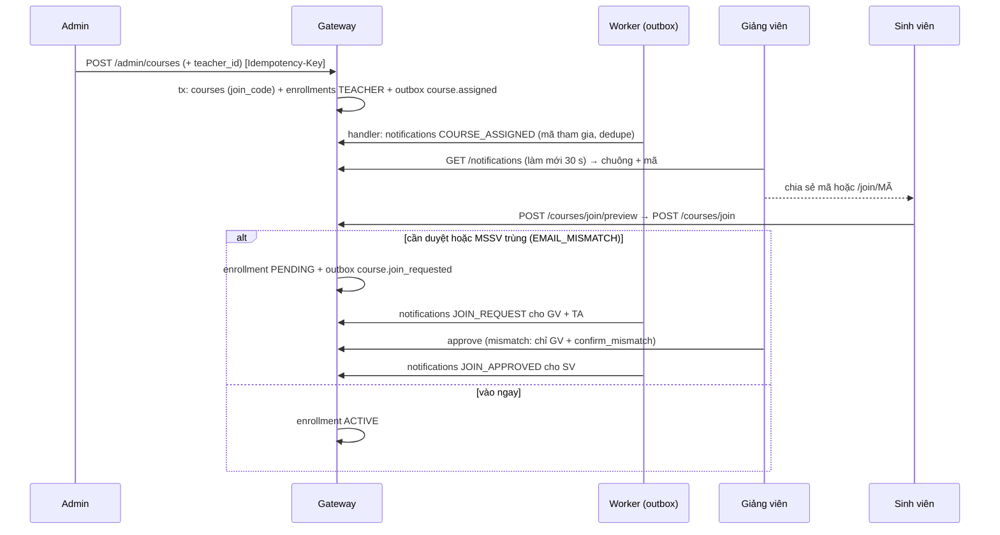
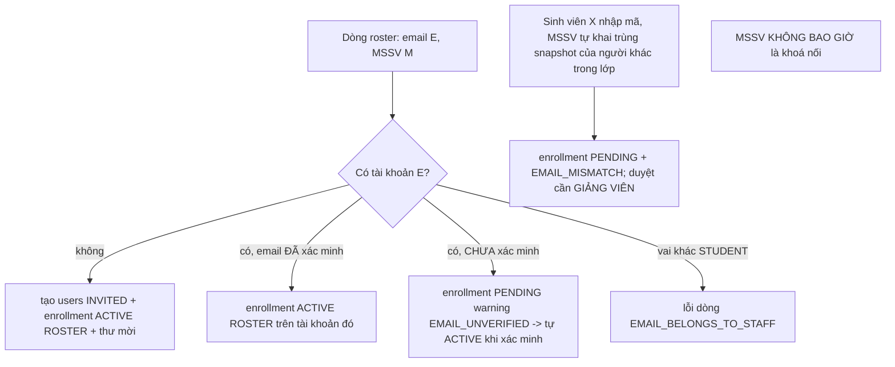

# SRS FEAT-course-foundation Nền lớp học (F2, M0, M14): lược đồ, quyền theo lớp, mở lớp, mã tham gia, roster, "Hôm nay", seed
Phiên bản 1 · 2026-10-03 · Trạng thái: **APPROVED** (PM 2026-10-03; Q1–Q20 theo mặc định của BA; câu [CHỦ DỰ ÁN] Q3–Q8, Q16, Q20 chốt theo mặc định và báo chủ dự án trong báo cáo sprint 4; PM đã cập nhật `ARCHITECTURE.md` §5, §9)

Nguồn: `docs/phases/P2.md` lát L1, L2, L2a, L2c, L3 (nguồn chính); `docs/sprints/4/plan.md`; PRD M0 + M14 + §3; FLOWS F1 ("quy tắc an toàn số 1"), F2, F14; `ARCHITECTURE.md` §4 (00003), §5, §8, §9; `design/DESIGN.md` §14.1, §10, §13; `design/INTEGRATION.md` mục 2, 4; `PRODUCTION_READINESS.md`; `AGENTS.md`; D36, D45, D51; spec nền `docs/specs/FEAT-pg-foundation/` v1.6 (RBAC FR-37…FR-44, outbox 5.3, Redis 5.6, cursor 6.4, Idempotency 6.6, env 8.1), `docs/specs/FEAT-account-security/` (SRS), `docs/specs/FEAT-llm-gateway/`, `docs/specs/FEAT-ui-foundation/`; mã hiện có: `backend-go/internal/auth/{auth,middleware}.go` (khung `CourseAccessGuard`, `CourseResolver`, `CourseAccess`), `internal/platform/{outbox,clock,redis}`, `internal/httpapi/{ratelimit,idempotency}.go`. Story: `US.md` (US-P2-07…12, 83 AC). Truy vết: mục 11.

## 1. Mục đích và phạm vi

Biến "lớp" thành đơn vị của dữ liệu và của quyền: lược đồ lớp (00003, dạng cuối), `CourseAccessGuard` thật dựa trên `enrollments`, Admin mở / gán / lưu trữ lớp, giảng viên nhận thông báo kèm mã tham gia, sinh viên vào lớp bằng mã (kiểu Teams) hoặc roster, quy tắc **MSSV tự khai không bao giờ mở dữ liệu**, trang "Hôm nay" theo vai trò xếp bằng luật cứng, chuông thông báo thật, và `scripts/seed.mjs` dựng 2 lớp × 30 sinh viên bằng chính API thật. Đây là phase đầu tiên có dữ liệu theo lớp — cách ly lớp ở đây là nền của mọi phase sau.

**Trong phạm vi:** migration `00003_course_foundation` (nộp cùng `00004` — `FEAT-account-security` US-P2-01); `internal/course` (lớp, ghi danh, mã, roster, chia sẻ, buổi học tối thiểu), `internal/today` (+ Provider của P2), `internal/notify` (chuông), phần cá nhân của `internal/user` (hồ sơ, tuỳ chọn); `auth.CourseResolver` thật; handler, `openapi.yaml`, golden; frontend `/` (Hôm nay), `/admin/courses`, `/join`, `/join/[code]`, `/class/settings`, `/class/members`, `/settings` (phần hồ sơ), bộ chọn lớp, chuông; `scripts/seed.mjs`.

**Ngoài phạm vi:** `PUT …/settings` của lớp và ngưỡng leo thang (P4); tạo / sửa / xoá buổi học bằng giao diện, xem trước, điểm danh (P5 — P2 chỉ có `GET …/sessions` và `POST …/sessions/generate` tối thiểu); upload, ingest, thư viện tài liệu (P3 / P8 — P2 chỉ tạo bảng và chia sẻ); chia sẻ ngân hàng câu hỏi (P9) và nháp công thức điểm (P6) — hợp đồng có sẵn, trả `NOT_AVAILABLE`; thông báo đẩy SSE và mail theo sự kiện lớp (P4); nhân bản lớp, xuất dữ liệu lớp, nhập roster từ hệ thống trường (PR); dữ liệu seed của các phase sau.

## 2. Người dùng và quyền

Vai trong lớp lấy từ `enrollments.role_in_course` của lớp đó (không phải vai JWT). "Thành viên" = ghi danh `ACTIVE`. `PENDING` và `REMOVED` **không** có quyền truy cập lớp.

| # | Thao tác | Admin | Giảng viên của lớp | TA của lớp | Sinh viên thành viên | Người ngoài lớp / `PENDING` / `REMOVED` |
| --- | --- | --- | --- | --- | --- | --- |
| 1 | `GET/POST /admin/courses`, `PUT /admin/courses/{id}`, `POST …/assign`, `POST …/archive` | ✓ | 403 | 403 | 403 | 403 |
| 2 | `GET /me/courses`, `GET/PUT /me/profile`, `GET/PUT /me/settings`, `GET /notifications`, `POST /notifications/{id}/read`, `GET /me/today` | ✓ (chính mình; `me/courses` rỗng) | ✓ | ✓ | ✓ | ✓ (chính mình) |
| 3 | `GET /courses/{id}` | ✓ (bản cơ bản) | ✓ (+ số liệu) | ✓ (+ số liệu) | ✓ (không mã) | 403 |
| 4 | `GET /courses/{id}/sessions`, `GET /courses/{id}/today` | **403** | ✓ | ✓ | ✓ (today dạng sinh viên) | 403 |
| 5 | `POST …/sessions/generate` | 403 | ✓ | ✓ | 403 | 403 |
| 6 | `GET …/join-code`, `GET …/members` | ✓ | ✓ | ✓ (xem) | 403 | 403 |
| 7 | `POST …/join-code/regenerate`, `PUT …/join-settings`, `DELETE …/members/{uid}`, `PUT …/assistants`, `GET …/assistant-candidates` | ✓ | ✓ | 403 | 403 | 403 |
| 8 | `POST …/members/{uid}/approve`, `…/reject`, `…/undo` | ✓ | ✓ | ✓ (không duyệt `EMAIL_MISMATCH`) | 403 | 403 |
| 9 | `POST /courses/join/preview`, `POST /courses/join` | 403 | 403 | 403 | ✓ (email đã xác minh) | ✓ nếu là STUDENT đã xác minh (đó là cách vào lớp) |
| 10 | `POST …/roster/import`, `GET …/share-sources`, `POST …/share-from`, `POST …/setup/dismiss` | **403** | ✓ | 403 | 403 | 403 |

Ghi chú quyền: **ADMIN không đọc nội dung lớp mặc định** (`AGENTS.md`): Admin chỉ qua route quản lý (hàng 3, 6, 7, 8) — không `sessions`, `today`, import, share; **Admin không thêm sinh viên vào lớp** (hàng 10, 9 → 403). Giảng viên chỉ quản lý lớp **của mình** (chia sẻ cần là giảng viên của cả lớp nguồn). Mọi lỗi quyền: 403 `FORBIDDEN` `details.reason ∈ {"role","course","source_course","mismatch_needs_teacher"}`; không JWT → 401. Danh tính / `user_id` luôn từ JWT, không từ tham số.

## 3. Luồng chính và các nhánh lỗi

### 3.1 F2 — mở lớp → phân công → vào lớp

### 3.2 Quy tắc nối tài khoản vào lớp (an toàn số 1)

### 3.3 Nhánh lỗi

| Tình huống | Hệ thống phản ứng | Người dùng thấy |
| --- | --- | --- |
| Mã sai / cũ / tắt / hết hạn / lớp lưu trữ / sai tên miền | 404 `JOIN_CODE_INVALID` đồng nhất (cùng thời gian) | "Mã không hợp lệ hoặc đã hết hạn. Kiểm tra lại với giảng viên." |
| ≥ 5 lần sai / 10 phút (người dùng) hoặc 20 (IP) | 429 `RATE_LIMITED` + `retry_after`, kể cả mã đúng | "Bạn đã thử quá nhiều lần. Thử lại sau 07:41." |
| Lớp đầy | 409 `COURSE_FULL` | "Lớp đã đủ sĩ số. Hãy báo giảng viên." |
| Cần duyệt | 200 `PENDING` | "Đã gửi yêu cầu, chờ giảng viên duyệt." |
| Email chưa xác minh | 403 `EMAIL_NOT_VERIFIED` | "Hãy xác minh email trước khi vào lớp." |
| Lớp đã lưu trữ, thao tác ghi | 409 `COURSE_ARCHIVED` | "Lớp này đã được lưu trữ." |
| Sai `version` | 409 `VERSION_CONFLICT` | "Cài đặt này vừa được người khác đổi…" |
| Gán sai vai | 422 | "Người này không phải giảng viên." |
| Tệp roster hỏng / quá lớn | 422 / 413 | "Không đọc được tệp. Hãy dùng CSV UTF-8 hoặc XLSX." |
| Chia sẻ nội dung chưa hỗ trợ | 422 `NOT_AVAILABLE` | "Nội dung này chưa dùng lại được ở bản hiện tại." |
| Ngoài lớp / `PENDING` / `REMOVED` | 403 `FORBIDDEN` `reason=course` | Màn chặn quyền hoặc "Bạn chưa vào lớp nào" |
| Provider "Hôm nay" lỗi | bỏ Provider đó, vẫn trả phần còn lại | Không thấy |
| Redis chết | bộ đếm mã mở cửa (log); today không cache | Không thấy |

## 4. Yêu cầu chức năng

### 4.1 `CourseAccessGuard` thật (US-P2-07)

Giao diện (mở rộng khung PG; thay `CourseResolver.CanAccess` trả `bool`): `Resolve(ctx, Principal, courseID) (CourseAccess{CourseID, Role: TEACHER|TA|STUDENT|ADMIN, Status}, error)`; guard nhận **chế độ** do từng route khai: 

| Chế độ | Qua khi |
| --- | --- |
| `Member` | `enrollments` `ACTIVE` bất kỳ vai |
| `Staff` | `ACTIVE`, vai `TEACHER` hoặc `TA` |
| `Teacher` | `ACTIVE`, vai `TEACHER` |
| `StaffOrAdmin` | `Staff` **hoặc** JWT `ADMIN` |
| `Manage` | `Teacher` **hoặc** JWT `ADMIN` |
| `MemberOrAdmin` | `Member` **hoặc** JWT `ADMIN` (chỉ `GET /courses/{id}`) |

Bảng route → chế độ: `GET /courses/{id}` `MemberOrAdmin`; `GET …/sessions`, `GET …/today` `Member`; `POST …/sessions/generate` `Staff`; `GET …/join-code`, `GET …/members` `StaffOrAdmin`; `POST …/members/{uid}/approve|reject|undo` `StaffOrAdmin` (+ kiểm riêng `EMAIL_MISMATCH` → `Manage`); `POST …/join-code/regenerate`, `PUT …/join-settings`, `DELETE …/members/{uid}`, `PUT …/assistants`, `GET …/assistant-candidates` `Manage`; `POST …/roster/import`, `GET …/share-sources`, `POST …/share-from`, `POST …/setup/dismiss` `Teacher`. Route `/admin/*` dùng `RequireRole(ADMIN)` (không qua guard lớp).

Quy tắc: một truy vấn có chỉ mục (`enrollments (course_id, user_id)`), **không cache** (mời ra → 403 ngay yêu cầu sau); `id` không phải uuid → 404; lỗi DB → 503; từ chối → 403 `reason="course"` (hoặc `role`); `CourseAccess.Role` từ `enrollments`, không từ JWT; vai `ADMIN` chỉ xuất hiện ở các chế độ có "hoặc ADMIN". Lớp `ARCHIVED`: guard cho qua (đọc được); các **handler ghi** trả 409 `COURSE_ARCHIVED`.

**Ma trận kiểm** (`TestGuardMatrix`): vai JWT {STUDENT, TA, TEACHER, ADMIN} × tình trạng {`ACTIVE` vai tương ứng, `ACTIVE` vai khác, `PENDING`, `REMOVED`, không có} × 6 chế độ.

### 4.2 Lớp và mã tham gia (US-P2-08, 09)

- **Mã tham gia:** 7 ký tự từ `ABCDEFGHJKMNPQRSTUVWXYZ23456789` (31 ký tự; không `0 O 1 I L`), `crypto/rand` (`rand.Int` với `big.Int`, tránh thiên lệch), duy nhất toàn hệ thống (`UNIQUE`), thử lại ≤ 5 lần khi trùng. Không gian 31⁷ ≈ 2,75·10¹⁰.
- **Mã cố định (seed):** chỉ khi `APP_ENV ≠ production`, thân `POST /admin/courses` có thể chứa `join_code` (đúng bảng ký tự).
- **Tạo lại mã:** thay `join_code` trong **một** `UPDATE` (mã cũ hết hiệu lực ngay, không có bảng mã cũ); sinh viên đã vào lớp không bị ảnh hưởng.
- **Đồng nhất lỗi:** `preview` và `join` có chung bước `lookupByCode` luôn thực hiện cùng số truy vấn và cùng so sánh hằng thời gian ở mọi nhánh thất bại (sai mã / cũ / tắt / hết hạn / lưu trữ / sai tên miền); phản hồi thất bại dựng từ một hàm duy nhất; `JOIN_CODE_INVALID` 404 là mã **duy nhất** cho các nguyên nhân đó.
- **Giới hạn đoán mã:** chỉ đếm thất bại (`JOIN_CODE_INVALID`): Redis ZSET `ep:join:fail:user:{uid}` (5 trong 10 phút) và `ep:join:fail:ip:{ip}` (20 trong 10 phút), cửa sổ trượt; vượt → 429 `RATE_LIMITED` **trước** khi tra mã (kể cả mã đúng); Redis chết → mở cửa + log `error` (≤ 1 lần / 30 s). Mã thử không ghi log (chỉ độ dài).
- **Cài đặt tham gia:** `enabled`, `expires_at` (null hoặc tương lai ≤ 366 ngày), `require_approval`, `allowed_email_domain` (so với **email đã xác minh**, không phân biệt hoa thường), `capacity` (null hoặc ≥ số `ACTIVE` STUDENT, ≤ 1.000).
- **Sĩ số:** đếm `enrollments` `STUDENT` `ACTIVE` (không đếm `PENDING`); kiểm lại khi duyệt.
- **Idempotent:** `UNIQUE (course_id, user_id)` + `INSERT … ON CONFLICT DO UPDATE` có điều kiện; 50 `join` song song → một dòng.
- **Vào lại sau khi bị mời ra:** dòng `REMOVED` → `PENDING` (mặc định an toàn, Q5); `student_code_snapshot` giữ nguyên.
- **`student_code_snapshot`:** sao `users.student_code` lúc ghi danh (bất biến, không cập nhật khi người dùng đổi MSSV).

### 4.3 Thành viên (US-P2-09)

Chuyển trạng thái hợp lệ: `PENDING → ACTIVE` (approve), `PENDING → REMOVED` (reject), `ACTIVE → REMOVED` (remove), `REMOVED → PENDING` (join lại), và `undo` đảo về `previous_status`. Mỗi chuyển ghi `previous_status`, `status_changed_at`, `status_changed_by`, `removed_at` (khi `REMOVED`). `undo` hợp lệ khi cùng quyền với hành động gốc và `now() − status_changed_at ≤ COURSE_UNDO_WINDOW` (60 giây). Không xoá / mời ra giảng viên hay TA bằng đường thành viên (đổi bằng `assign` / `assistants`). Thông báo: `JOIN_REQUEST` (GV + TA lớp), `JOIN_APPROVED`, `JOIN_REJECTED` (sinh viên). Mọi chuyển ghi `audit_log` (`entity=enrollment`, `before/after` không chứa email, MSSV).

### 4.4 Gán giảng viên và trợ giảng (US-P2-08)

`assign {teacher_id?, ta_ids?[]}`: một giảng viên `ACTIVE` mỗi lớp (partial unique); đổi giảng viên → dòng cũ `REMOVED`, dòng mới `ACTIVE` (`joined_via=ADMIN`; nếu người đó từng có dòng `REMOVED` thì **dùng lại dòng cũ**); `ta_ids` thay thế toàn bộ tập TA; chỉ người mới được thêm nhận `course.assigned`; toàn bộ trong một transaction cùng dòng outbox; `audit_log` trước / sau. `PUT …/assistants` (giảng viên của lớp hoặc Admin) có cùng ngữ nghĩa cho TA.

### 4.5 Roster và quy tắc nối (US-P2-10)

**Tệp:** multipart `file`; CSV UTF-8 (BOM tuỳ chọn; dấu `,` hoặc `;` tự nhận) hoặc XLSX (sheet đầu); ≤ 500 dòng dữ liệu, ≤ 2 MiB (route nâng `MAX_BODY_BYTES` lên 2 MiB), XLSX giải nén ≤ 20 MiB; magic bytes; **tệp không được lưu** (xử lý trong bộ nhớ, không ghi đĩa hay blob). Tiêu đề (không phân biệt hoa thường, bỏ dấu): email ∈ {`email`, `e-mail`, `mail`}; tên ∈ {`full_name`, `họ và tên`, `họ tên`, `name`}; MSSV ∈ {`student_code`, `mssv`, `mã số sinh viên`}. Chuẩn hoá: email chữ thường, tên cắt khoảng trắng ≤ 100 ký tự, MSSV chữ hoa `^[A-Z0-9]{6,15}$`; giá trị bắt đầu bằng `= + - @` giữ như chữ.

**Mã lỗi dòng:** `INVALID_EMAIL`, `MISSING_NAME`, `INVALID_STUDENT_CODE`, `DUPLICATE_EMAIL_IN_FILE`, `DUPLICATE_STUDENT_CODE_IN_FILE`, `STUDENT_CODE_CONFLICT` (MSSV đã là snapshot của người khác `ACTIVE`/`PENDING` trong lớp), `EMAIL_BELONGS_TO_STAFF`, `EMAIL_DISABLED`, `COURSE_FULL` (dòng vượt sĩ số). Số dòng = số dòng trong tệp (tiêu đề = 1).

**Bảng nối (mặc định `send_invites=true`):**

| Tài khoản có `email` của dòng | Kết quả | Đếm |
| --- | --- | --- |
| không có | `users` `INVITED` (`student_code` = MSSV dòng) + enrollment `ACTIVE` `ROSTER` + thư `invite_student` | `created_users` |
| có, `email_verified_at` có | enrollment `ACTIVE` `ROSTER` trên tài khoản đó | `linked_existing` |
| có, chưa xác minh | enrollment `PENDING` `warning=EMAIL_UNVERIFIED`; khi xác minh email → `ACTIVE` (hook `user.verified`) | `pending_unverified` |
| có, `INVITED` | enrollment `ACTIVE`; gửi lại thư mời nêu lớp này (token cũ bị thu hồi) | `linked_existing` |
| đã có enrollment `ACTIVE`/`PENDING` | không đổi | `already_member` |
| enrollment `REMOVED` | không đổi; báo "đã bị mời ra, dùng Khôi phục" | `skipped_removed` |
| vai khác STUDENT | lỗi `EMAIL_BELONGS_TO_STAFF` | `errors` |
| `DISABLED` | lỗi `EMAIL_DISABLED` | `errors` |

`dry_run=true` chạy toàn bộ phân loại trong transaction rồi **rollback**, không thư. Không dry-run: các dòng hợp lệ ghi trong **một** transaction (cùng dòng `mail_outbox` + `outbox` và `roster.imported`); `dedupe_key` thư = `invite_student:<user>:<course>`.

**Quy tắc vào bằng mã khi MSSV trùng (4.2.5 của `FEAT-account-security`):** khi `join` mà `users.student_code` của người vào **không rỗng** và tồn tại enrollment khác (`ACTIVE`/`PENDING`, vai STUDENT) trong cùng lớp có `student_code_snapshot` bằng đó → enrollment của người vào là `PENDING` + `warning=EMAIL_MISMATCH` **bất kể** `join_require_approval`. Duyệt: `approve` với `confirm_mismatch:true` bởi TEACHER / ADMIN.

### 4.6 Chia sẻ giữa lớp (US-P2-10)

`share-from {source_course_id, what[]}`: điều kiện: hai lớp cùng `subject_code`, người gọi là giảng viên `ACTIVE` của **cả hai**, cả hai chưa lưu trữ. Mỗi loại nội dung có một `Sharer` đăng ký (`Register(kind, Sharer)`); P2 đăng ký `documents`; `questions` (P9) và `grade_scheme` (P6) chưa có → 422 `VALIDATION_FAILED` `details=[{field:"what",code:"NOT_AVAILABLE",message:"…(phase P9)"}]`. `documents`: với mỗi `documents` của lớp nguồn có `status='READY'` và `type <> 'COURSE_POLICY'` → `INSERT INTO document_courses … ON CONFLICT DO NOTHING` và `UPDATE content_chunks SET course_ids = course_ids || target WHERE document_id = … AND NOT target = ANY(course_ids)` — một transaction, không đụng `embedding`. Một chiều (lớp đích không sửa được tài liệu nguồn). `share-sources`: lớp cùng `subject_code`, người gọi là giảng viên của cả hai, chưa lưu trữ, kèm `shareable_documents`.

### 4.7 "Hôm nay" (US-P2-11)

**Provider:** `Items(ctx, Viewer, Scope) ([]Item, error)`; `Viewer{UserID, Role, EmailVerified, MaskedEmail, Courses []CourseRef{ID, ClassCode, RoleInCourse}}` do gateway dựng; `Item{ID, Kind, Title, Reason, Urgency, Href, Course *CourseRef, Tier, Overdue, AgeMinutes, EstimateMinutes, Steps}`. Bộ gộp: gọi mọi Provider **song song** (hạn mỗi Provider 150 ms, lỗi → bỏ + log), lọc theo vai, xếp, cắt 50.

**Khoá xếp:** `(Overdue giảm dần, Tier tăng dần, AgeMinutes giảm dần, Course.ClassCode tăng dần, ID tăng dần)`.

**Bảng bậc (số nhỏ = gấp hơn; có chỗ dự trữ cho phase sau):**

| Vai | Bậc | Kind | Phase đăng ký | Có ở P2 |
| --- | --- | --- | --- | --- |
| Giảng viên / TA | 10 | `TICKET` | P4 | — |
| | 20 | `APPEAL` | P7 | — |
| | 30 | `GRADING_REVIEW` | P7 | — |
| | 40 | `EMAIL_MISMATCH` (chỉ GV) | **P2** | ✓ |
| | 45 | `JOIN_REQUEST` | **P2** | ✓ |
| | 50 | `AI_CONFIRM` | P4 | — |
| | 60 | `UNMATCHED_SUBMISSION` | P7 | — |
| | 70 | `GRADE_SCHEME_UNCONFIRMED` | P6 | — |
| | 80 | `COURSE_SETUP` (chỉ GV) | **P2** | ✓ |
| | 90 | `QUESTION_REVIEW` | P9 | — |
| | 95 | `STUDENT_ATTENTION` | P5 | — |
| Admin | 10 | `LLM_PROVIDER_ERROR` | **P2** (dữ liệu P1) | ✓ |
| | 20 | `LLM_BUDGET_EXHAUSTED` | **P2** | ✓ |
| | 30 | `LLM_BUDGET_WARN` | **P2** | ✓ |
| | 40 | `COURSE_NO_TEACHER` | **P2** | ✓ |
| | 50 | `INVITE_EXPIRED` | **P2** | ✓ |
| | 60+ | dead-letter, sao lưu | PR | — |
| Sinh viên | 10 | `VERIFY_EMAIL` | **P2** | ✓ |
| | 20 | `JOIN_CODE` | **P2** | ✓ |
| | 30 | `JOIN_PENDING` | **P2** | ✓ |
| | 40+ | hạn nộp, QUIZ, điểm, phúc khảo, câu trả lời GV, tài liệu mới | P7 / P9 / P6 / P4 / P8 | — |

`Overdue` do Provider đặt (P2: `JOIN_REQUEST` có yêu cầu cũ nhất > 48 giờ).

**Khuôn phản hồi:**
- Sinh viên: `{"no_course":bool,"email_verified":bool,"recommended":Item|null,"timeline":[{at,ends_at,title,place,state:"NOW|NEXT|DONE",course}],"continue":[]}`. `recommended` = mục đầu tiên theo khoá xếp trong các Kind của Sinh viên; `timeline` = buổi hôm nay (`Asia/Ho_Chi_Minh`) + buổi kế trong 7 ngày (tối đa 8).
- Giảng viên / TA: `{"count":n,"actions":[Item],"attention":[],"upcoming":[{at,title,place,course}]}`.
- Admin: `{"count":n,"actions":[Item]}`.
- Mọi phản hồi có `ETag` (băm thân) và `Cache-Control: private, no-cache`.

**Lý do (VN, sinh từ dữ liệu; số liệu và tuổi theo `platform/clock`):**

| Kind | `title` | `reason` | `href` |
| --- | --- | --- | --- |
| `VERIFY_EMAIL` | Xác minh email của bạn | "Chưa xác minh email thì chưa vào được lớp. Kiểm tra hộp thư {a***@x.com}." | `/verify-email` |
| `JOIN_CODE` | Nhập mã tham gia lớp | "Bạn chưa vào lớp nào. Nhập mã do giảng viên cung cấp để bắt đầu." | `/join` |
| `JOIN_PENDING` | Chờ giảng viên duyệt | "Yêu cầu vào lớp {mã lớp} đã gửi {tuổi}." | — |
| `JOIN_REQUEST` | {N} yêu cầu vào lớp {mã lớp} đang chờ duyệt | "Cũ nhất đã chờ {tuổi}." | `/class/members?course={id}&tab=pending` |
| `EMAIL_MISMATCH` | {N} yêu cầu có email chưa khớp MSSV · lớp {mã lớp} | "Cần bạn xác nhận: email đăng ký khác email trong danh sách lớp." | như trên |
| `COURSE_SETUP` | Thiết lập lớp mới · {mã lớp} | "{k}/4 bước xong: chia sẻ mã lớp → tải quy chế môn học → tạo lịch buổi học → tải tài liệu." | `/class/settings?course={id}` |
| `LLM_PROVIDER_ERROR` | Nhà cung cấp AI đang lỗi | "{tên} không phản hồi. Chat của sinh viên có thể dùng dự phòng." | `/settings/llm` |
| `LLM_BUDGET_*` | Ngân sách AI | "Chi phí AI hôm nay đã dùng {pct} % ngân sách." | `/settings/llm` |
| `COURSE_NO_TEACHER` | Lớp {mã lớp} chưa có giảng viên | "Hãy gán giảng viên để lớp nhận thông báo và mở mã tham gia." | `/admin/courses` |
| `INVITE_EXPIRED` | {N} lời mời giảng viên đã hết hạn | "Gửi lại lời mời để họ vào được hệ thống." | `/admin/users?status=INVITED` |

`{tuổi}`: "{n} phút" (< 60), "{n} giờ" (< 48 giờ), "{n} ngày"; tính bằng đồng hồ thật, làm tròn xuống.

**`COURSE_SETUP`:** bốn bước `steps[{key,label,done,href}]` tự tick: `share_code` (có ≥ 1 enrollment STUDENT `ACTIVE`/`PENDING`), `policy` (có `documents` loại `COURSE_POLICY` của chính lớp, `status ≠ FAILED`), `sessions` (có `class_sessions`), `documents` (có tài liệu loại ≠ `COURSE_POLICY` của lớp hoặc chia sẻ vào lớp, `status ≠ FAILED`); mục ẩn khi xong cả bốn **hoặc** `courses.settings.setup.dismissed_at` có giá trị (`POST …/setup/dismiss`, Giảng viên). Ở P2 chỉ `share_code` và `sessions` có thể xong bằng dữ liệu thật (tài liệu thuộc P3 / P8); giảng viên có thể bỏ qua mục.

**Cache:** `ep:today:{user_id}:{scope}` (`scope` = `all` | id lớp), JSON, TTL `TODAY_CACHE_TTL` 60 s. Vô hiệu: handler `today.invalidate` chạy cho mọi topic bảng 4.9 và xoá `ep:today:{uid}:all` + `ep:today:{uid}:{course_id}` của từng người bị ảnh hưởng (payload nêu `user_ids` hoặc handler suy ra từ `enrollments` của lớp: giảng viên + TA + người liên quan); `user.verified` xoá `all` và mọi lớp của người đó. TTL là lưới an toàn.

**Ngân sách truy vấn:** ≤ 5 truy vấn SQL mỗi yêu cầu không cache (một truy vấn dựng `Viewer`/enrollments; mỗi Provider dùng tổng hợp một truy vấn; Provider P2 dùng chung ảnh chụp `enrollments` đã nạp).

### 4.8 Seed (US-P2-12)

`scripts/seed.mjs` (Node ≥ 24, chỉ `fetch` có sẵn; biến: `API_URL` mặc định `https://localhost/api/v1`, `MAILPIT_URL` mặc định `http://localhost:8025`, `SEED_DEFAULT_PASSWORD`, `SEED_RNG` mặc định `20261029`, `SEED_BASE_DATE` mặc định hôm nay, `SEED_ADMIN_CMD` mặc định `docker compose exec -T gateway /app/gateway admin create`). Cờ: `--if-empty` (dùng bởi `pnpm dev`), `--verbose`. Chặn `APP_ENV=production` (thoát 1 trước mọi lời gọi).

**Kế hoạch (9 bước; mỗi bước kiểm trạng thái trước):**

| Bước | Việc | Qua API / lệnh |
| --- | --- | --- |
| 1 | Admin đầu tiên `admin@edupilot.local` | CLI `gateway admin create` (`ADMIN_PASSWORD` = mật khẩu mặc định) |
| 2 | Mời `teacher@…` (TEACHER, "TS. Lê Thu Hà") và `ta@…` (TA, "Phạm Quốc Bảo"); đọc thư Mailpit; `accept-invite` | `POST /admin/users`, `POST /auth/accept-invite` |
| 3 | Mở lớp 1 (`761987`, mã `AN7K2MQ`) và lớp 2 (`761988`, mã `BX4P9TW`), học phần `INT1006` "An ninh mạng", `2026-2027-HK1`, `capacity` lớp 2 = 30; gán giảng viên cả hai lớp, TA cho lớp 1; teacher đánh dấu đã đọc thông báo lớp 1 | `POST /admin/courses`, `POST …/assign`, `POST /notifications/{id}/read` |
| 4 | Buổi học: lớp 1 — 15 buổi hằng tuần, buổi 10 = hôm nay 09:00–11:30 P.302; lớp 2 — 6 buổi, buổi 4 = hôm nay 13:30–16:00 P.405 | `POST …/sessions/generate` |
| 5 | Lớp 1: import 30 sinh viên (A `sv.gioi`, B `sv.kha`, C `sv.nguyco`, `sv04…sv30`) với `send_invites=true`; đọc 30 thư mời; `accept-invite` bằng mật khẩu mặc định | `POST …/roster/import`, `POST /auth/accept-invite` |
| 6 | Đăng ký + xác minh (Mailpit) + đăng nhập: `sv31…sv51` (21 SV chỉ lớp 2), `sv52…sv54` (3 SV chờ duyệt), `sv.moi` (D), `sv.lech` (MSSV = MSSV của B); đăng ký `sv.chuaxm` **không** xác minh | `POST /auth/register`, `/auth/verify-email`, `/auth/login` |
| 7 | Lớp 2 (đang tắt duyệt): 21 SV chỉ lớp 2 + A + `sv05` + `sv06` vào bằng mã = 24 `ACTIVE`; rồi giảng viên bật duyệt (`PUT join-settings`); 3 SV `sv52…sv54` vào bằng mã → `PENDING` | `POST /courses/join`, `PUT …/join-settings` |
| 8 | `sv.lech` vào lớp 1 bằng mã → `PENDING` + `EMAIL_MISMATCH`; D **không** vào lớp nào | `POST /courses/join` |
| 9 | Giảng viên `setup/dismiss` cho lớp 1 (lớp 2 giữ việc "Thiết lập lớp mới"); in tóm tắt (số người, số lớp, mã, 7 tài khoản mẫu) | `POST …/setup/dismiss` |

Tổng sinh viên: lớp 1 = 30; chỉ lớp 2 = 21; chờ duyệt lớp 2 = 3; D, `sv.chuaxm`, `sv.lech` = 3 → **57**. Ba sinh viên học hai lớp: A, `sv05`, `sv06`. MSSV: A `20229001`, B `20229002`, C `20229003`, D `20229004`; còn lại `2022` + 4 chữ số do `SEED_RNG` sinh (không trùng nhau, không phải MSSV thật). Email `svNN@edupilot.local`. Tên sinh viên lấy từ danh sách họ + tên đệm + tên Việt cố định theo hạt giống (không dùng người thật). Mật khẩu = `SEED_DEFAULT_PASSWORD` (qua chính sách).

**Giới hạn tốc độ khi seed:** seed là một IP gửi hàng nghìn yêu cầu; `docker-compose.local.yml` (dev) đặt `RATE_LIMIT_IP_PER_MIN=5000`, `AUTH_LOGIN_IP_PER_MIN=1000`, `AUTH_REGISTER_IP_PER_HOUR=1000`, `AUTH_TOKEN_IP_PER_MIN=1000`; `docker-compose.test.yml` **giữ mặc định** để QC thử giới hạn thật. Không có cách tắt giới hạn ở production.

**Tự chạy:** `pnpm dev` với `SEED_ON_EMPTY_DB=true` chạy `node scripts/seed.mjs --if-empty` sau khi `/api/v1/readyz` xanh; "trống" = chưa có `ADMIN` hoặc chưa có đủ 2 lớp; lỗi giữa chừng → `pnpm dev` vẫn dựng xong stack, in cảnh báo, chạy lại bằng `pnpm seed`.

**API buổi học tối thiểu (`POST /courses/{id}/sessions/generate`, `Staff`, `Idempotency-Key` bắt buộc):** `{weekdays:[1..7] (1 = thứ Hai), start_time:"HH:MM", end_time:"HH:MM", room?, from:"YYYY-MM-DD", to:"YYYY-MM-DD", exclude_dates:["YYYY-MM-DD"], first_session_no?}` → tạo buổi cho mỗi ngày khớp trong `[from, to]` trừ ngày loại trừ, `session_no` nối tiếp số lớn nhất hiện có (hoặc `first_session_no`), tối đa 60 buổi mỗi lần (vượt → 422), bỏ qua buổi trùng `starts_at`, giờ theo `Asia/Ho_Chi_Minh`; phản hồi 201 `{created, first_session_no, last_session_no, skipped}`. `GET /courses/{id}/sessions` (`Member`): `{items:[{id,session_no,starts_at,ends_at,room,topic}]}` theo `starts_at` (cursor, tối đa 100).

### 4.9 Sự kiện outbox (topic `^[a-z][a-z0-9_.]{0,63}$`) và handler

Mỗi topic có thể có nhiều handler độc lập (idempotent; lỗi một handler → thử lại cả tin theo chính sách PG: 1 s, 5 s, 30 s rồi dead-letter).

| Topic | Payload | Handler | Việc |
| --- | --- | --- | --- |
| `course.assigned` | `{course_id,user_id,role,assigned_by}` | `notify.course_assigned`, `today.invalidate` | `notifications` `COURSE_ASSIGNED` (dedupe `course.assigned:<outbox_id>`) |
| `course.join_requested` | `{course_id,user_id,mismatch}` | `notify.join_requested`, `today.invalidate` | `JOIN_REQUEST` cho GV + TA (mismatch: chỉ nội dung khác; vẫn gửi GV + TA, TA không duyệt được) |
| `course.join_decided` | `{course_id,user_id,decision}` | `notify.join_decided`, `today.invalidate` | `JOIN_APPROVED` / `JOIN_REJECTED` |
| `course.member_changed` | `{course_id,user_id}` | `today.invalidate` | |
| `course.changed` | `{course_id}` | `today.invalidate` | sửa, lưu trữ, đổi cài đặt |
| `user.verified` | `{user_id}` | `roster.promote_pending`, `today.invalidate` | `PENDING`+`EMAIL_UNVERIFIED` → `ACTIVE` |
| `roster.imported` | `{course_id}` | `today.invalidate` | |

### 4.10 Danh sách FR

| FR | Hệ thống phải… | AC |
| --- | --- | --- |
| FR-1 | `00003` 8 bảng dạng cuối, CHECK, index (`course_id` đầu); không ALTER | 07-AC1, AC2, AC3 |
| FR-2 | `CourseAccessGuard` thật theo 6 chế độ, không cache; ADMIN từ chối mặc định | 07-AC4, AC5 |
| FR-3 | Đọc chunk luôn lọc `course_ids` (GIN), không đường đọc không lọc | 07-AC6 |
| FR-4 | `GET /me/courses`, `GET /courses/{id}` đúng phạm vi vai | 07-AC7, AC8, AC14 |
| FR-5 | Hồ sơ (MSSV đổi không đổi snapshot) và tuỳ chọn | 07-AC9, AC10 |
| FR-6 | Bộ chọn lớp thật; "Bạn chưa vào lớp nào"; màn mock theo lớp thật | 07-AC11, AC12, AC13 |
| FR-7 | Mở / sửa / lưu trữ lớp; mã tham gia `crypto/rand`; mã cố định ngoài production | 08-AC1, AC2, AC3 |
| FR-8 | Gán giảng viên / TA (một giảng viên `ACTIVE`), đổi giữa kỳ, giảng viên quản lý TA | 08-AC4, AC6 |
| FR-9 | Outbox `course.assigned` → thông báo ≤ 60 s, đúng một lần | 08-AC5 |
| FR-10 | API thông báo, chỉ của mình | 08-AC7 |
| FR-11 | Quyền Admin và danh sách lớp của Admin (không mã, không sinh viên) | 08-AC8, AC9 |
| FR-12 | `/admin/courses`, chuông thật, nhánh lỗi, luồng F2 phía Admin | 08-AC10…AC13 |
| FR-13 | `preview` / `join`: idempotent, vào hai lần một bản ghi | 09-AC1, AC2 |
| FR-14 | Lỗi đồng nhất `JOIN_CODE_INVALID`; giới hạn 5 / 10 phút | 09-AC3, AC4 |
| FR-15 | Tạo lại mã (mã cũ chết ngay); cài đặt tham gia có tác dụng thật | 09-AC5, AC6 |
| FR-16 | `require_approval`, duyệt / từ chối / mời ra / hoàn tác, mời ra mất quyền ngay | 09-AC7, AC8, AC9 |
| FR-17 | `EMAIL_MISMATCH` khi MSSV trùng; duyệt cần giảng viên | 09-AC10 |
| FR-18 | Điều kiện vào cửa; ma trận quyền; danh sách thành viên | 09-AC11, AC12, AC13 |
| FR-19 | `/join*`, `/class/settings`, `/class/members`, luồng đầu cuối | 09-AC14…AC17 |
| FR-20 | Import roster (CSV / XLSX), báo cáo đúng dòng, giới hạn, tệp hỏng | 10-AC1, AC2, AC8, AC12, AC13 |
| FR-21 | Nối chỉ bằng email đã xác minh; chống mạo danh MSSV / email; không bản ghi đôi | 10-AC3…AC6 |
| FR-22 | Import chỉ Giảng viên (Admin 403) | 10-AC7 |
| FR-23 | Chia sẻ tài liệu giữa lớp cùng `subject_code`; không lộ ngược; `NOT_AVAILABLE` | 10-AC9, AC10, AC11 |
| FR-24 | Khung `internal/today` (Provider, luật cứng, không LLM, bỏ Provider lỗi) và xếp hạng | 11-AC1, AC2 |
| FR-25 | Khuôn phản hồi Sinh viên / Giảng viên / TA / Admin và nguồn việc P2 | 11-AC3…AC6 |
| FR-26 | Cách ly "Hôm nay"; quyền theo vai | 11-AC7, AC8 |
| FR-27 | Cache 60 s, xoá theo outbox, ngân sách truy vấn | 11-AC9, AC10 |
| FR-28 | Trang `/` mọi vai, thay mock, nhánh lỗi | 11-AC11…AC14 |
| FR-29 | Seed qua API thật, số liệu đúng, idempotent, tự chạy, chặn production | 12-AC1…AC4, AC6…AC9 |
| FR-30 | `sessions/generate` + `GET sessions` tối thiểu | 12-AC5 |
| FR-31 | Bỏ nguồn phiên mô phỏng; QC dùng tài khoản seed; kịch bản F1 + F2 | 12-AC10, AC11, AC12 |

## 5. Dữ liệu

Migration `backend-go/db/migrations/00003_course_foundation.sql` (goose; nộp cùng `00004`). Quy ước PG 5: `id uuid DEFAULT uuidv7()`, `timestamptz`, trigger `set_updated_at` cho bảng có `updated_at`, `snake_case`, **không ALTER** sau khi merge. `users` FK được phép từ P2 (PG đã ghi). Bảng thuộc lớp có `course_id` và index phức hợp bắt đầu bằng `course_id`.

### 5.1 Enum mới

| Enum | Giá trị |
| --- | --- |
| `course_status` | `ACTIVE`, `ARCHIVED` |
| `enrollment_role` | `TEACHER`, `TA`, `STUDENT` |
| `enrollment_status` | `PENDING`, `ACTIVE`, `REMOVED` |
| `enrollment_joined_via` | `ADMIN`, `ROSTER`, `CODE` (`ADMIN` = được gán bởi Admin / giảng viên) |
| `document_type` | `LECTURE`, `COURSE_POLICY`, `EXAM_PAPER`, `ANSWER_KEY`, `OTHER` |
| `document_status` | `QUEUED`, `PROCESSING`, `READY`, `FAILED` |
| `chunk_audience` | `ALL` (chat sinh viên + staff), `STAFF` (chỉ TA / giảng viên), `GRADING` (chỉ Grading Engine, ví dụ `ANSWER_KEY`) |

Giá trị `chunk_audience` và `document_status` do BA đề xuất (ARCHITECTURE chỉ nêu tên cột); P3 / P8 có thể chỉnh **trước khi merge `00003`** — sau merge không ALTER (Q9).

### 5.2 `courses`

| Cột | Kiểu | Null | Mặc định | Ghi chú |
| --- | --- | --- | --- | --- |
| `id` | `uuid` | NOT NULL | `uuidv7()` | PK |
| `subject_code` | `text` | NOT NULL | — | `CHECK (subject_code ~ '^[A-Z0-9._-]{2,20}$')` (chuẩn hoá chữ hoa) |
| `class_code` | `text` | NOT NULL | — | `CHECK (class_code ~ '^[A-Za-z0-9._-]{3,20}$')`; UNIQUE |
| `name` | `text` | NOT NULL | — | `CHECK (char_length(name) BETWEEN 1 AND 120)` |
| `semester` | `text` | NOT NULL | — | `CHECK (semester ~ '^[0-9]{4}-[0-9]{4}-HK[123]$')` |
| `status` | `course_status` | NOT NULL | `'ACTIVE'` | |
| `escalation_threshold` | `numeric(3,2)` | NOT NULL | `0.60` | `CHECK (escalation_threshold BETWEEN 0 AND 1)`; P4 dùng |
| `settings` | `jsonb` | NOT NULL | `'{}'` | `CHECK (jsonb_typeof(settings) = 'object')`; P2 dùng khoá `setup.dismissed_at` |
| `join_code` | `char(7)` | NOT NULL | — | `CHECK (join_code ~ '^[ABCDEFGHJKMNPQRSTUVWXYZ23456789]{7}$')`; UNIQUE |
| `join_enabled` | `boolean` | NOT NULL | `true` | |
| `join_expires_at` | `timestamptz` | NULL | — | |
| `join_require_approval` | `boolean` | NOT NULL | `false` | |
| `allowed_email_domain` | `text` | NULL | — | `CHECK (allowed_email_domain IS NULL OR allowed_email_domain ~ '^[a-z0-9]([a-z0-9-]*[a-z0-9])?(\.[a-z0-9]([a-z0-9-]*[a-z0-9])?)+$')` |
| `capacity` | `integer` | NULL | — | `CHECK (capacity IS NULL OR capacity BETWEEN 1 AND 1000)` |
| `created_by` | `uuid` | NOT NULL | — | `REFERENCES users(id)` |
| `archived_at` | `timestamptz` | NULL | — | |
| `version` | `integer` | NOT NULL | `1` | `CHECK (version >= 1)` |
| `created_at`, `updated_at` | `timestamptz` | NOT NULL | `now()` | trigger |

`CHECK ((status = 'ARCHIVED') = (archived_at IS NOT NULL))`; `CHECK (status = 'ACTIVE' OR join_enabled = false)`. Index: PK · `courses_class_code_key` UNIQUE · `courses_join_code_key` UNIQUE · `courses_subject_idx` (subject_code) · `courses_status_created_idx` (status, created_at DESC, id DESC). (Không `course_id` đầu: bảng gốc của khái niệm lớp — ngoại lệ có chủ ý.)

### 5.3 `enrollments`

| Cột | Kiểu | Null | Mặc định | Ghi chú |
| --- | --- | --- | --- | --- |
| `id` | `uuid` | NOT NULL | `uuidv7()` | PK |
| `course_id` | `uuid` | NOT NULL | — | `REFERENCES courses(id)` |
| `user_id` | `uuid` | NOT NULL | — | `REFERENCES users(id)` |
| `role_in_course` | `enrollment_role` | NOT NULL | — | |
| `status` | `enrollment_status` | NOT NULL | — | |
| `joined_via` | `enrollment_joined_via` | NOT NULL | — | |
| `student_code_snapshot` | `text` | NULL | — | `CHECK (student_code_snapshot IS NULL OR student_code_snapshot ~ '^[A-Z0-9]{6,15}$')`; `CHECK (role_in_course = 'STUDENT' OR student_code_snapshot IS NULL)` |
| `warning` | `text` | NULL | — | `CHECK (warning IN ('EMAIL_MISMATCH','EMAIL_UNVERIFIED'))`; `CHECK (warning IS NULL OR role_in_course = 'STUDENT')` |
| `previous_status` | `enrollment_status` | NULL | — | để `undo` |
| `status_changed_at` | `timestamptz` | NOT NULL | `now()` | |
| `status_changed_by` | `uuid` | NULL | — | NULL = hệ thống / chính người đó |
| `removed_at` | `timestamptz` | NULL | — | `CHECK ((status = 'REMOVED') = (removed_at IS NOT NULL))` |
| `version` | `integer` | NOT NULL | `1` | |
| `created_at`, `updated_at` | `timestamptz` | NOT NULL | `now()` | trigger |

Index: PK · `enrollments_course_user_key` UNIQUE (course_id, user_id) · `enrollments_one_teacher_key` UNIQUE (course_id) WHERE role_in_course = 'TEACHER' AND status = 'ACTIVE' · `enrollments_course_status_idx` (course_id, status, role_in_course, status_changed_at DESC, user_id) · `enrollments_user_idx` (user_id, status) · `enrollments_snapshot_idx` (course_id, student_code_snapshot) WHERE student_code_snapshot IS NOT NULL AND status IN ('ACTIVE','PENDING') · `enrollments_pending_idx` (course_id, created_at) WHERE status = 'PENDING'.

### 5.4 `class_sessions`

| Cột | Kiểu | Null | Mặc định | Ghi chú |
| --- | --- | --- | --- | --- |
| `id` | `uuid` | NOT NULL | `uuidv7()` | PK |
| `course_id` | `uuid` | NOT NULL | — | `REFERENCES courses(id)` |
| `session_no` | `integer` | NOT NULL | — | `CHECK (session_no >= 1)` |
| `starts_at` | `timestamptz` | NOT NULL | — | |
| `ends_at` | `timestamptz` | NOT NULL | — | `CHECK (ends_at > starts_at)` |
| `room` | `text` | NULL | — | `CHECK (char_length(room) <= 40)` |
| `topic` | `text` | NULL | — | `CHECK (char_length(topic) <= 200)` |
| `version` | `integer` | NOT NULL | `1` | |
| `created_at`, `updated_at` | `timestamptz` | NOT NULL | `now()` | trigger |

Index: PK · `class_sessions_course_no_key` UNIQUE (course_id, session_no) · `class_sessions_course_starts_key` UNIQUE (course_id, starts_at) · `class_sessions_course_starts_idx` (course_id, starts_at).

### 5.5 `notifications`

| Cột | Kiểu | Null | Mặc định | Ghi chú |
| --- | --- | --- | --- | --- |
| `id` | `uuid` | NOT NULL | `uuidv7()` | PK |
| `user_id` | `uuid` | NOT NULL | — | `REFERENCES users(id)` |
| `course_id` | `uuid` | NULL | — | `REFERENCES courses(id)` |
| `type` | `text` | NOT NULL | — | `CHECK (type ~ '^[A-Z][A-Z0-9_]{0,39}$')`; P2: `COURSE_ASSIGNED`, `JOIN_REQUEST`, `JOIN_APPROVED`, `JOIN_REJECTED` |
| `title` | `text` | NOT NULL | — | `CHECK (char_length(title) BETWEEN 1 AND 200)` |
| `body` | `text` | NULL | — | `CHECK (char_length(body) <= 1000)` |
| `link` | `text` | NULL | — | `CHECK (link IS NULL OR link ~ '^/[^/\\]')` (đường dẫn nội bộ) |
| `dedupe_key` | `text` | NULL | — | |
| `read_at` | `timestamptz` | NULL | — | |
| `created_at`, `updated_at` | `timestamptz` | NOT NULL | `now()` | trigger |

Index: PK · `notifications_user_dedupe_key` UNIQUE (user_id, dedupe_key) WHERE dedupe_key IS NOT NULL · `notifications_user_created_idx` (user_id, created_at DESC, id DESC) · `notifications_unread_idx` (user_id, created_at DESC, id DESC) WHERE read_at IS NULL · `notifications_course_created_idx` (course_id, created_at DESC) WHERE course_id IS NOT NULL.

### 5.6 `user_settings`

`user_id uuid PRIMARY KEY REFERENCES users(id) ON DELETE CASCADE`; `notify_ticket_by_mail boolean NOT NULL DEFAULT true`; `notify_answer_by_mail boolean NOT NULL DEFAULT true`; `remind_deadline_by_mail boolean NOT NULL DEFAULT true`; `preferences jsonb NOT NULL DEFAULT '{}'` (`CHECK (jsonb_typeof(preferences) = 'object')`); `version integer NOT NULL DEFAULT 1`; `created_at`, `updated_at` (trigger). Không `id` riêng (khoá là `user_id`).

### 5.7 `documents` (tạo ở P2, dùng ở P8)

| Cột | Kiểu | Null | Mặc định | Ghi chú |
| --- | --- | --- | --- | --- |
| `id` | `uuid` | NOT NULL | `uuidv7()` | PK |
| `course_id` | `uuid` | NOT NULL | — | lớp sở hữu; `REFERENCES courses(id)` |
| `title` | `text` | NOT NULL | — | `CHECK (char_length(title) BETWEEN 1 AND 200)` |
| `type` | `document_type` | NOT NULL | `'LECTURE'` | |
| `filename` | `text` | NULL | — | ≤ 255 |
| `mime_type` | `text` | NULL | — | ≤ 100 |
| `size_bytes` | `bigint` | NULL | — | `CHECK (size_bytes IS NULL OR size_bytes >= 0)` |
| `sha256` | `char(64)` | NULL | — | `CHECK (sha256 IS NULL OR sha256 ~ '^[0-9a-f]{64}$')` |
| `blob_key` | `text` | NULL | — | khoá object storage |
| `status` | `document_status` | NOT NULL | `'QUEUED'` | |
| `error` | `text` | NULL | — | ≤ 1.000 ký tự, không PII |
| `page_count` | `integer` | NULL | — | `CHECK (page_count IS NULL OR page_count >= 0)` |
| `visible_to_students` | `boolean` | NOT NULL | `true` | |
| `use_for_rag` | `boolean` | NOT NULL | `true` | |
| `category` | `text` | NULL | — | ≤ 40 |
| `week_no` | `smallint` | NULL | — | `CHECK (week_no IS NULL OR week_no BETWEEN 1 AND 20)` |
| `download_count` | `integer` | NOT NULL | `0` | `CHECK (download_count >= 0)` |
| `uploaded_by` | `uuid` | NULL | — | `REFERENCES users(id)` |
| `version` | `integer` | NOT NULL | `1` | |
| `created_at`, `updated_at` | `timestamptz` | NOT NULL | `now()` | trigger |

`CHECK (type <> 'ANSWER_KEY' OR visible_to_students = false)`. Index: PK · `documents_course_created_idx` (course_id, created_at DESC, id DESC) · `documents_course_type_idx` (course_id, type) · `documents_course_week_idx` (course_id, week_no) WHERE week_no IS NOT NULL · `documents_course_sha_idx` (course_id, sha256) WHERE sha256 IS NOT NULL.

### 5.8 `content_chunks`

`id uuid PK`; `document_id uuid NOT NULL REFERENCES documents(id) ON DELETE CASCADE`; `course_ids uuid[] NOT NULL CHECK (cardinality(course_ids) >= 1)`; `audience chunk_audience NOT NULL DEFAULT 'ALL'`; `ord integer NOT NULL CHECK (ord >= 0)`; `page_no integer NULL`; `heading text NULL (≤ 200)`; `text text NOT NULL`; `token_count integer NULL`; `embedding vector(1536) NULL` (NULL tới khi nhúng); `created_at`, `updated_at` (trigger). Index: PK · `content_chunks_doc_ord_key` UNIQUE (document_id, ord) · `content_chunks_course_ids_gin` GIN (course_ids) · `content_chunks_doc_idx` (document_id). Chỉ mục HNSW cho `embedding` do `00015` (P10) thêm. Bất biến ứng dụng (không kiểm được bằng CHECK liên bảng): chunk của `ANSWER_KEY` có `audience='GRADING'`; mọi đọc chunk đi qua `store.ChunksForCourse` (luôn có `course_ids`).

### 5.9 `document_courses`

`document_id uuid NOT NULL REFERENCES documents(id) ON DELETE CASCADE`; `course_id uuid NOT NULL REFERENCES courses(id)`; `shared_by uuid NULL REFERENCES users(id)`; `created_at timestamptz NOT NULL DEFAULT now()`; PK `(document_id, course_id)`; index `document_courses_course_idx` (course_id, document_id). Không `updated_at` (dòng chỉ ghi một lần).

### 5.10 Khoá Redis (tiền tố `ep:` theo PG 5.6)

| Khoá | Kiểu | TTL | Nội dung |
| --- | --- | --- | --- |
| `ep:join:fail:user:{user_id}` | ZSET (member = mã yêu cầu ngẫu nhiên, score = ms) | 10 phút (làm mới mỗi lần ghi) | thất bại đoán mã theo người dùng (cửa sổ trượt) |
| `ep:join:fail:ip:{ip}` | ZSET | 10 phút | như trên, theo IP |
| `ep:today:{user_id}:{scope}` | STRING (JSON) | `TODAY_CACHE_TTL` 60 s | bản cache "Hôm nay"; `scope` = `all` hoặc id lớp |

Khoá chỉ chứa định danh và số; không mã tham gia, email, MSSV.

## 6. API

Tiền tố `/api/v1`; JSON (riêng `roster/import`: `multipart/form-data`); `message` tiếng Việt; lỗi PG `{code,message,trace_id,details?,retry_after?}`; danh sách phân trang con trỏ `{items, next_cursor}` (30 mặc định, ≤ 100, `(created_at DESC, id DESC)` trừ khi nêu khác).

### 6.1 Mã lỗi mới (3 mã; tổng sau P2 = 22 + 6 + 6 + 3 = 37)

| Status | `code` | Khi nào | `details` |
| --- | --- | --- | --- |
| 404 | `JOIN_CODE_INVALID` | mã sai / cũ / tắt / hết hạn / lớp lưu trữ / sai tên miền; `message` cố định "Mã không hợp lệ hoặc đã hết hạn. Kiểm tra lại với giảng viên." | — |
| 409 | `COURSE_FULL` | đã đủ `capacity` (join hoặc duyệt) | — |
| 409 | `COURSE_ARCHIVED` | thao tác ghi lên lớp đã lưu trữ | — |

Dùng lại mã PG / P1 / tài khoản: `FORBIDDEN` (`reason` ∈ `role`, `course`, `source_course`, `mismatch_needs_teacher`), `VALIDATION_FAILED` (`details[].code` ∈ `INVALID_EMAIL`, `MISSING_NAME`, `UNSUPPORTED_FILE`, `SUBJECT_MISMATCH`, `NOT_AVAILABLE`, `CODE_TAKEN`, `CAPACITY_BELOW_ACTIVE`, `EXPIRES_OUT_OF_RANGE`, `ROLE_MISMATCH`), `CONFLICT` (`details.field` / `reason` ∈ `class_code`, `undo_expired`), `VERSION_CONFLICT`, `RATE_LIMITED`, `EMAIL_NOT_VERIFIED`, `NOT_FOUND`, `PAYLOAD_TOO_LARGE`, `IDEMPOTENCY_KEY_REQUIRED`, `DEADLINE_EXCEEDED`.

### 6.2 Bảng thao tác (29 đường dẫn, 33 thao tác)

| # | Thao tác | Quyền (mục 2 / 4.1) | `Idempotency-Key` | Thành công |
| --- | --- | --- | --- | --- |
| 1 | `GET /admin/courses` | ADMIN | — | 200 cursor |
| 2 | `POST /admin/courses` | ADMIN | **bắt buộc** | 201 |
| 3 | `PUT /admin/courses/{id}` | ADMIN, `version` | — | 200 |
| 4 | `POST /admin/courses/{id}/assign` | ADMIN | tuỳ chọn | 200 |
| 5 | `POST /admin/courses/{id}/archive` | ADMIN | — (tự idempotent) | 200 |
| 6 | `GET /me/courses` | JWT | — | 200 cursor |
| 7 | `GET /courses/{id}` | `MemberOrAdmin` | — | 200 |
| 8 | `GET /courses/{id}/sessions` | `Member` | — | 200 cursor |
| 9 | `POST /courses/{id}/sessions/generate` | `Staff` | **bắt buộc** | 201 |
| 10 | `GET /courses/{id}/join-code` | `StaffOrAdmin` | — | 200 |
| 11 | `POST /courses/{id}/join-code/regenerate` | `Manage` | — | 200 |
| 12 | `PUT /courses/{id}/join-settings` | `Manage`, `version` | — | 200 |
| 13 | `GET /courses/{id}/members` | `StaffOrAdmin` | — | 200 cursor |
| 14 | `POST /courses/{id}/members/{uid}/approve` | `StaffOrAdmin` (+ mismatch → `Manage`) | — | 200 |
| 15 | `POST /courses/{id}/members/{uid}/reject` | `StaffOrAdmin` | — | 200 |
| 16 | `DELETE /courses/{id}/members/{uid}` | `Manage` | — | 200 |
| 17 | `POST /courses/{id}/members/{uid}/undo` | như hành động gốc | — | 200 |
| 18 | `PUT /courses/{id}/assistants` | `Manage` | — | 200 |
| 19 | `GET /courses/{id}/assistant-candidates` | `Manage` | — | 200 |
| 20 | `POST /courses/join/preview` | STUDENT đã xác minh | — | 200 |
| 21 | `POST /courses/join` | STUDENT đã xác minh | tuỳ chọn (tự idempotent) | 200 |
| 22 | `POST /courses/{id}/roster/import` | `Teacher` | **bắt buộc** | 200 |
| 23 | `GET /courses/{id}/share-sources` | `Teacher` | — | 200 |
| 24 | `POST /courses/{id}/share-from` | `Teacher` (+ giảng viên lớp nguồn) | **bắt buộc** | 200 |
| 25 | `POST /courses/{id}/setup/dismiss` | `Teacher` | — | 204 |
| 26 | `GET /notifications` | JWT | — | 200 cursor |
| 27 | `POST /notifications/{id}/read` | JWT (chủ) | — | 204 |
| 28 | `GET /me/today` | JWT | — | 200 |
| 29 | `GET /courses/{id}/today` | `Member` | — | 200 |
| 30 | `GET /me/profile` | JWT | — | 200 |
| 31 | `PUT /me/profile` | JWT, `version` | — | 200 |
| 32 | `GET /me/settings` | JWT | — | 200 |
| 33 | `PUT /me/settings` | JWT, `version` | — | 200 |

Router: đường tĩnh `/courses/join/preview` và `/courses/join` đăng ký **trước** `/courses/{id}`. Các thao tác 9, 18, 19, 23, 25 và `undo`, `sessions/generate` mở rộng so với `ARCHITECTURE.md` §5 (`assistants`, `assistant-candidates`, `share-sources`, `setup/dismiss`, `undo`, `GET /me/settings`, `PUT /me/profile` đã có; `sessions/generate` của P5 nhưng làm tối thiểu ở P2): đề nghị PM cập nhật `ARCHITECTURE.md` §5 (Q2).

### 6.3 Thân chính (rút gọn; trường tiền / thời gian: chuỗi thập phân / RFC 3339 UTC)

- **POST /admin/courses** `{subject_code, class_code, name, semester, capacity?, teacher_id?, ta_ids?, join_code?}` (`join_code` chỉ ngoài production) → 201 `{id, class_code, subject_code, name, semester, status, version, teacher:{id,full_name}|null}`; **không** trả `join_code` ở bất kỳ phản hồi nào của `admin/courses` (mã chỉ qua `GET …/join-code`).
- **POST /admin/courses/{id}/assign** `{teacher_id?, ta_ids?[]}` → `{teacher:{…}|null, assistants:[{id,full_name}], changed:{teacher,added_ta,removed_ta}}`.
- **GET /courses/{id}/join-code** → `{join_code, join_url, enabled, expires_at, require_approval, allowed_email_domain, capacity, active_students, pending, version}`; **POST regenerate** → `{join_code, join_url, version}`.
- **POST /courses/join/preview** `{code}` → `{name, class_code, semester, teachers:[{full_name}], state}`; **POST /courses/join** `{code}` → `{course_id, status:"ACTIVE"|"PENDING", already_member}`.
- **POST …/members/{uid}/approve** `{confirm_mismatch?}`; mọi `members` trả `{user_id,status,previous_status,warning}`.
- **POST …/roster/import** (`?dry_run=true`, trường form `send_invites`, mặc định `true`) → `{total, created_users, linked_existing, already_member, pending_unverified, skipped_removed, errors:[{row,field,code,message}], dry_run}`.
- **POST …/share-from** `{source_course_id, what:["documents"]}` → `{shared:{documents:n}, skipped:[{kind,reason}]}`.
- **GET /notifications** → `{items:[{id,type,title,body,link,course_id,read_at,created_at}], next_cursor, unread_count}`.
- **GET /me/profile** → `{id,email,full_name,role,student_code,email_verified,version}`; **PUT** `{full_name?, student_code?, version}`.
- **GET /me/today**, **GET /courses/{id}/today** → khuôn 4.7.

### 6.4 `openapi.yaml` và contract

Thêm 29 đường / 33 thao tác; golden mới `internal/contract/testdata/golden/course/*.json` (trường động `id`, `*_at`, `trace_id`, `join_code` được che); golden của PG, P1, tài khoản **không sửa**; thêm khoá lạ trong phản hồi → contract test đỏ; `security` toàn cục `bearerAuth` + `security: []` cho `courses/join/*` **không** (cần JWT) — mọi đường của spec này cần JWT.

## 7. Giao diện

### 7.1 Màn

| Route | Vai | Hành động chính | Trạng thái cần có |
| --- | --- | --- | --- |
| `/` | tất cả (theo vai) | (Sinh viên) hành động khuyến nghị; (GV / TA) mở việc đầu | khung xương, rỗng ("Hôm nay bạn không có việc gấp." / "Không có việc cần xử lý hôm nay."), lỗi, ô nhập mã (chưa có lớp) |
| `/join`, `/join/[code]` | Sinh viên | `Xem lớp` → `Tham gia lớp` | nhập, xem trước, thành công, chờ duyệt, đầy, sai mã, bị giới hạn, chưa xác minh |
| `/class/settings` | GV (sửa), TA (xem), Admin (qua "Quản lý lớp này" nếu mở được) | `Lưu cài đặt` | khung xương, lỗi, form có `version` |
| `/class/members` | GV, TA | `Duyệt` (tab Chờ duyệt) | khung xương, rỗng, lỗi, tab Thành viên / Chờ duyệt / Trợ giảng / Nhập danh sách |
| `/admin/courses` | Admin | `Mở lớp` | khung xương, rỗng, lỗi, Drawer, `ConfirmIrreversible` lưu trữ |
| `/settings` (phần Hồ sơ) | tất cả | `Lưu hồ sơ` | khung xương, lỗi, `version` |
| Thanh trên | tất cả | — | bộ chọn lớp, chuông |

### 7.2 Chuỗi chính

| Màn | Chuỗi |
| --- | --- |
| Bộ chọn lớp | "761987 · An ninh mạng"; "Tất cả lớp của tôi"; "Quản lý lớp này"; "Tham gia lớp bằng mã"; rỗng "Chưa có lớp" |
| "Bạn chưa vào lớp nào" | "Bạn chưa vào lớp nào" + "Nhập mã tham gia do giảng viên cung cấp để dùng tính năng này." + `Tham gia lớp bằng mã` |
| `/join` | "Tham gia lớp"; ô "Mã tham gia"; `Xem lớp`; xem trước "An ninh mạng · 761988 · TS. Lê Thu Hà · HK1 2026–2027"; `Tham gia lớp`; "Lớp này cần giảng viên duyệt."; thành công "Bạn đã vào lớp."; chờ "Đã gửi yêu cầu, chờ giảng viên duyệt."; sai "Mã không hợp lệ hoặc đã hết hạn. Kiểm tra lại với giảng viên."; đầy "Lớp đã đủ sĩ số. Hãy báo giảng viên."; giới hạn "Bạn đã thử quá nhiều lần. Thử lại sau 07:41."; chưa xác minh "Hãy xác minh email trước khi vào lớp." |
| `/class/settings` | "Mã tham gia"; `Sao chép mã`, `Sao chép liên kết` → "Đã sao chép"; `Tạo lại mã`; xác nhận "Tạo lại mã cho lớp 761988? Mã cũ sẽ ngừng hoạt động ngay. 24 sinh viên đang ở trong lớp không bị ảnh hưởng."; "Cho phép tham gia bằng mã", "Hết hạn", "Giới hạn sĩ số", "Giới hạn tên miền email", "Cần giảng viên duyệt"; `Lưu cài đặt`; TA: "Chỉ giảng viên được thay đổi."; "Dùng lại nội dung từ lớp khác" + `Dùng lại tài liệu` |
| `/class/members` | tab "Thành viên", "Chờ duyệt (N)", "Trợ giảng", "Nhập danh sách"; `Duyệt`, `Từ chối`, "Mời ra khỏi lớp"; undo "Đã duyệt 3 yêu cầu · Hoàn tác", "Đã mời {tên} ra khỏi lớp · Hoàn tác"; nhãn "Email chưa khớp MSSV"; xác nhận mismatch "Email của người này khác email trong danh sách lớp. Chỉ duyệt nếu bạn chắc đúng là sinh viên này."; rỗng "Chưa có yêu cầu nào chờ duyệt."; import "Nhập N sinh viên", lỗi "Dòng 7 · Email · Email không đúng dạng." |
| `/admin/courses` | `Mở lớp`; Drawer "Học phần", "Mã lớp", "Tên lớp", "Học kỳ", "Sĩ số", "Giảng viên", "Trợ giảng"; xong "Đã mở lớp. Đã gửi thông báo phân công cho {tên}."; `Lưu trữ` → "Lưu trữ lớp 761987: 30 sinh viên chỉ còn quyền đọc; mã tham gia ngừng hoạt động."; lỗi "Mã lớp này đã có."; rỗng "Chưa có lớp nào. Mở lớp đầu tiên." |
| Chuông | "Chưa có thông báo. Khi có việc cần bạn, nó sẽ hiện ở đây."; "Chưa tải được thông báo." |
| `/` Sinh viên | "Chào {tên}" + ngày; "Hôm nay bạn không có việc gấp."; "Tiếp tục học" (ẩn khi rỗng); ô nhập mã "Mã tham gia" + `Xem lớp` |
| `/` GV / TA | "{N} việc cần xử lý hôm nay"; "Không có việc cần xử lý hôm nay."; "Sắp tới"; lỗi "Chưa tải được việc hôm nay. Dữ liệu của bạn không bị ảnh hưởng." |

`apiClient` (FEAT-ui-foundation SRS 6.2) thêm 3 mã: `JOIN_CODE_INVALID` → câu chung ở trên; `COURSE_FULL` → "Lớp đã đủ sĩ số. Hãy báo giảng viên."; `COURSE_ARCHIVED` → "Lớp này đã được lưu trữ."

### 7.3 Thời gian tương đối (`shared/lib/timeAgo.ts`)

Tính theo **ngày lịch** (`Asia/Ho_Chi_Minh`) từ đồng hồ thật: cùng ngày lịch: < 1 phút "vừa xong", < 1 giờ "N phút trước", còn lại "N giờ trước"; ngày lịch liền trước "hôm qua HH:mm"; xa hơn "dd/MM". Không chuỗi tương đối cứng trong mã khác.

### 7.4 Lựa chọn lớp

`ep:ui:course` (localStorage; giá trị `all` hoặc uuid lớp; không bí mật) và tham số `?course=<uuid>`; thứ tự ưu tiên: `?course` hợp lệ (thành viên) > lưu trữ > lớp đầu của `GET /me/courses`; id không thuộc người dùng bị bỏ im lặng. Mọi `useQuery` có dữ liệu lớp đặt `courseId` vào khoá truy vấn.

### 7.5 Khác biệt mock 1.5 ↔ thật (D51: spec thật thắng)

| # | Màn | Mock 1.5 | Bản thật |
| --- | --- | --- | --- |
| 1 | `/admin/courses` | 2 lớp giả; `Mở lớp` giả lập, dòng "Đã gửi thông báo phân công" | dữ liệu thật; `Mở lớp` tạo lớp + mã + gán + thông báo thật; Drawer thật; lưu trữ thật (409 khi ghi); không thấy mã / sinh viên |
| 2 | Chuông | thông báo sinh từ sự kiện mock, thời gian theo đồng hồ giả | `GET /notifications` làm mới 30 s; thời gian theo đồng hồ thật và ngày lịch; chỉ 4 loại ở P2 (nhận lớp, xin vào lớp, duyệt, từ chối); thông báo ticket / điểm / tài liệu **chưa có** (phase sau) |
| 3 | `/join`, `/join/[code]` | mã `BX4P9TW` → chờ duyệt, `AN7K2MQ` → vào ngay; sai 5 lần "Thử lại sau 10 phút" | đúng như mock về câu chữ; bộ đếm thật theo người dùng + IP; `COURSE_FULL`; chưa xác minh email; quay lại đúng link sau đăng nhập |
| 4 | `/class/members` | 24 thành viên + 3 chờ giả; `Tạo lại mã` ở đây | thành viên thật phân trang; tab Chờ duyệt / Trợ giảng / Nhập danh sách; **`Tạo lại mã` chuyển sang `/class/settings`** (đúng phase file); nhãn "Email chưa khớp MSSV" |
| 5 | `/class/settings` | không có (mã nằm ở `/class/members`) | màn riêng: mã lớn, sao chép, tạo lại (xác nhận), cài đặt tham gia, dùng lại nội dung lớp khác |
| 6 | Bộ chọn lớp | lớp mock theo cookie `ep_demo_course` | lớp thật từ `GET /me/courses`, `?course=`, `ep:ui:course` |
| 7 | Sinh viên chưa vào lớp (D) | mock theo `courseIds` rỗng | thật: không `ACTIVE` enrollment |
| 8 | Duyệt / mời ra | đổi trạng thái cục bộ + Hoàn tác | API thật + `undo` ≤ 60 s (UI 5 s); mời ra mất quyền ngay |
| 9 | Import roster | không có | tab "Nhập danh sách" (dry-run, báo dòng lỗi, mời) |
| 10 | Hồ sơ `/settings` | không có | phần Hồ sơ thật (tên, MSSV tự khai có chú thích) |

### 7.6 Khác biệt `/` "Hôm nay" mock ↔ thật

| # | Mock 1.5 | Bản thật ở P2 |
| --- | --- | --- |
| 1 | SV: "Ôn lại Mật mã đối xứng — bạn sai 4/7 câu" (luyện đề), "QUIZ01 đóng sau 18 giờ" | **không có** (P9 / P7 đăng ký Provider); SV thấy xác minh email / nhập mã / chờ duyệt / buổi học; còn lại "Hôm nay bạn không có việc gấp." |
| 2 | GV: phiếu hỗ trợ, bài chấm, thread chờ xác nhận, điểm danh đang diễn ra, câu hỏi mới | **không có** (P4 / P5 / P7); GV thấy yêu cầu vào lớp, email lệch MSSV, thiết lập lớp mới, buổi sắp tới |
| 3 | Đếm "7 việc cần xử lý" từ dữ liệu mock | `count` từ Provider thật; giảm khi xử lý (≤ 60 s) |
| 4 | "Lớp cần chú ý" (8 sinh viên) | ẩn khi rỗng (P5 / P10) |
| 5 | Admin: dữ liệu mock | việc thật: nhà cung cấp AI lỗi, ngân sách, lớp không giảng viên, lời mời hết hạn |
| 6 | Dòng thời gian mock cố định 29/10 09:20 | buổi học thật theo đồng hồ thật |

## 8. Phi chức năng

### 8.1 Biến môi trường (bổ sung vào PG 8.1; sai → thoát 1 nêu tên biến)

| Biến | Mặc định | Ràng buộc |
| --- | --- | --- |
| `JOIN_FAIL_PER_USER` / `JOIN_FAIL_PER_IP` / `JOIN_FAIL_WINDOW` | `5` / `20` / `10m` | |
| `COURSE_UNDO_WINDOW` | `60s` | |
| `TODAY_CACHE_TTL` | `60s` | 5 s–5 phút |
| `ROSTER_MAX_ROWS` / `ROSTER_MAX_BYTES` / `ROSTER_MAX_XLSX_UNCOMPRESSED` | `500` / `2097152` / `20971520` | |
| `SEED_ON_EMPTY_DB`, `SEED_DEFAULT_PASSWORD`, `SEED_RNG`, `SEED_BASE_DATE`, `SEED_ADMIN_CMD`, `API_URL`, `MAILPIT_URL` | xem 4.8 | chỉ `scripts/seed.mjs` |
| `RATE_LIMIT_IP_PER_MIN`, `AUTH_LOGIN_IP_PER_MIN`, `AUTH_REGISTER_IP_PER_HOUR`, `AUTH_TOKEN_IP_PER_MIN` | dev (`docker-compose.local.yml`): `5000`, `1000`, `1000`, `1000`; test / production: mặc định của PG / tài khoản | không có cờ tắt |

### 8.2 Hiệu năng và SLO

| Chỉ số | Mục tiêu |
| --- | --- |
| Guard (một truy vấn `enrollments`) | thêm ≤ 5 ms / request lớp |
| `GET /me/courses`, `/courses/{id}`, `…/members`, `/me/today`, `/courses/{id}/today`, `/notifications` | p95 ≤ 300 ms (SLO đọc) |
| `POST /courses/join`, `approve`, `regenerate`, `PUT join-settings`, `assign` | p95 ≤ 500 ms (SLO ghi) |
| `roster/import` 500 dòng | ≤ 5 s (không bcrypt; thư xếp hàng) |
| Thông báo phân công tới chuông | ≤ 60 s (thực tế ≤ 2 s; chuông làm mới ≤ 30 s) |
| Việc "Hôm nay" xử lý xong biến | ≤ 60 s (≤ 2 s với sự kiện) |
| Số truy vấn SQL / request `today` | ≤ 5 |

### 8.3 Bảo mật và cách ly

Cách ly lớp: guard không cache; chunk luôn `course_ids`; mọi route lớp qua guard (kiểm bằng `chi.Walk`); PENDING / REMOVED không truy cập; ADMIN không đọc nội dung lớp và không thêm sinh viên; MSSV tự khai không bao giờ là khoá nối (so sánh MSSV chỉ để chặn / cảnh báo); `student_code_snapshot` bất biến; mã tham gia `crypto/rand`, đồng nhất lỗi, giới hạn đoán mã, mã không vào log; `notifications.link` chỉ nội bộ; roster không lưu tệp; `admin/courses` không trả mã tham gia hay danh sách sinh viên; thông báo không chứa MSSV / email người khác (trừ thông báo cho giảng viên nêu tên sinh viên xin vào lớp).

### 8.4 Dữ liệu cá nhân và lưu giữ (đề xuất; Q — **[CHỦ DỰ ÁN]**)

| Dữ liệu | Nơi lưu | Ai xem | Lưu bao lâu |
| --- | --- | --- | --- |
| Tên, email, MSSV tự khai | `users` | chính chủ; giảng viên / TA lớp (email, MSSV trong danh sách thành viên) | tới khi xoá tài khoản (PR) |
| `student_code_snapshot`, ghi danh | `enrollments` | giảng viên / TA lớp; không Admin | giữ để sổ điểm; xoá theo chính sách học kỳ (PR) |
| Tệp roster | **không lưu** | — | xử lý rồi bỏ |
| Thông báo | `notifications` | chủ | đề xuất 180 ngày kể từ khi đọc (dọn ở PR — Nợ) |

### 8.5 Vận hành

Gateway không trạng thái; bộ đếm đoán mã và cache `today` ở Redis; handler outbox idempotent; hai bản gateway chia sẻ bộ đếm; `scripts/seed.mjs` chạy ngoài gateway, chỉ qua HTTP.

### 8.6 Thư viện

Dùng sẵn: `pgx`, `sqlc`, `chi`, `go-redis`, `validator`, `go-mail`. Thêm: `excelize` (đã có trong bảng `ARCHITECTURE.md` §3). CSV dùng `encoding/csv` chuẩn. Seed: Node chuẩn (`fetch`), không thêm thư viện.

## 9. Kiểm thử

| Tầng | Công cụ | Nội dung |
| --- | --- | --- |
| Đơn vị | `go test -race ./internal/course/... ./internal/today/... ./internal/user/... ./internal/auth/...` | guard (ma trận ≥ 48), mã tham gia (bảng ký tự, phân bố, trùng), đồng nhất lỗi + thời gian, giới hạn (đồng hồ giả), trạng thái thành viên + `undo`, quy tắc nối, parse roster, chia sẻ, xếp hạng "Hôm nay" |
| Tích hợp (`internal/integration`, `-tags integration`; Postgres + Redis + Mailpit + worker thật) | `go test -tags integration ./internal/integration -run 'TestCourseIsolation\|TestAllCourseRoutesGuarded\|TestRosterLinkRequiresVerifiedEmail\|TestAssignTeacherNotifies\|…'` | cách ly lớp, mạo danh MSSV / email, thông báo ≤ 60 s, cache + vô hiệu |
| Cổng P2 | các lệnh của `P2.md` (gate P2) | `TestRosterLinkRequiresVerifiedEmail`, `TestAssignTeacherNotifies`, `TestCourseIsolation`, `internal/httpapi`, `internal/platform/outbox`, `internal/today`, `ui-antipatterns.sh`, `today.spec.ts` |
| Contract | `go test ./internal/contract/...` | 29 đường / 33 thao tác, golden mới; golden cũ không sửa |
| Giao diện | `frontend/e2e/{class-join,today,account}.spec.ts` | các `-g` trong US |
| Seed | `node scripts/seed.mjs` trên DB trống + đếm bằng SQL | AC12-AC1…AC9 |
| Tải nhẹ | `k6 run benchmarks/load/today.js` | p95 `today` ≤ 300 ms |
| Tay (QC) | `docs/sprints/4/qc/scenario-P2.md` | TC tấn công: mạo danh MSSV, đoán mã, lách lớp, mời ra, tạo lại mã, bấm đúp; đọc diff `internal/auth` |

Ca `@real` cần stack thật + seed và **không chạy ở CI**. Test đua ≥ 50 goroutine; test thời gian dùng trung vị 20 mẫu, dung sai 35 %.

## 10. Câu hỏi mở và quyết định đã chốt

**Đã chốt (nguồn):** `00003` dạng cuối, không ALTER (D45); L2b đã xong ở PG; `00001` đủ 4 vai; mã tham gia 7 ký tự bảng 31 ký tự, `crypto/rand`; lỗi đồng nhất `JOIN_CODE_INVALID`, 5 lần / 10 phút; thông báo nhận lớp ≤ 60 s; luật xếp hạng cứng không LLM; cache 60 s xoá theo outbox; mã seed `AN7K2MQ` / `BX4P9TW`; Admin không thêm sinh viên; MSSV không mở dữ liệu; quy tắc nối bằng email đã xác minh; `ANSWER_KEY` ⇒ không hiển thị cho sinh viên.

**Quyết định của BA và câu hỏi mở (kèm mặc định an toàn):** `QUESTIONS.md` Q1–Q20; câu đụng quyền / dữ liệu cá nhân / chính sách đánh dấu **[CHỦ DỰ ÁN]**.

## 11. Truy vết PRD → FLOWS → phase → US → FR → test

| PRD | FLOWS | Phase / lát | US | FR | Test |
| --- | --- | --- | --- | --- | --- |
| M0 (đơn vị là lớp; sinh viên chỉ thấy lớp mình; ngoài lớp 403) | F2 | P2 L1 | US-P2-07 | FR-1…FR-6 | `TestGuardMatrix`, `TestCourseIsolation`, `TestAllCourseRoutesGuarded` |
| M0 (Admin mở lớp, gán, thông báo ≤ 60 s) | F2 | P2 L2 | US-P2-08 | FR-7…FR-12 | `TestCreateCourse*`, `TestAssignTeacherNotifies` |
| M0 (mã tham gia, preview, duyệt, mời ra, tạo lại mã) | F2 | P2 L2a | US-P2-09 | FR-13…FR-19 | `TestJoin*`, `class-join.spec.ts` |
| M0 (hai đường vào lớp, chia sẻ giữa lớp), §5 an toàn | F1 "quy tắc số 1", F2 | P2 L1b, L2a | US-P2-10 | FR-20…FR-23 | `TestRosterLinkRequiresVerifiedEmail`, `TestShare*` |
| M14 ("Hôm nay") | F14 | P2 L2c | US-P2-11 | FR-24…FR-28 | `internal/today`, `today.spec.ts` |
| M0 / seed | F1 + F2 | P2 L3 | US-P2-12 | FR-29…FR-31 | `seed.mjs`, `scenario-P2.md` |

**Yêu cầu của `P2.md` → AC:** L1 `00003` (8 bảng, dạng cuối) → 07-AC1…AC3; `CourseAccessGuard` → 07-AC4, AC5; L2 `internal/course` CRUD / lưu trữ / `assign` → 08-AC1…AC4; `join_code` 7 ký tự `crypto/rand` → 08-AC2; thông báo `course.assigned` + chuông thật 30 s → 08-AC5, AC7, AC11; `/admin/courses` → 08-AC10; `/me/courses` + bộ chọn lớp (không thêm mục sidebar) → 07-AC7, AC11; hồ sơ / preferences → 07-AC9, AC10; L2a `preview` + `join` (idempotent, 5 / 10 phút, đồng nhất lỗi, audit) → 09-AC1…AC4; nối vào bản ghi roster sẵn có → 10-AC6; `require_approval` → 09-AC7; `/class/settings` (mã lớn, sao chép, tạo lại qua `ConfirmIrreversible`, cài đặt) → 09-AC5, AC6, AC15; `/class/members` (duyệt hàng loạt, mời ra + Hoàn tác 5 s) → 09-AC8, AC16; `/join*` (quay lại đúng link) → 09-AC14; import roster → 10-AC1…AC3, AC12; `share-from` → 10-AC9…AC11; L2b → đã xong ở PG (áp dụng: Idempotency ở 08-AC1, 10-AC1, 10-AC9, 12-AC5; cursor ở 08-AC9, 09-AC13; ETag ở 07-AC7; `version` ở 08-AC3, 09-AC6); L2c `internal/today` → 11-AC1, AC2; `GET /me/today` / `GET …/today` → 11-AC3…AC8; cache 60 s → 11-AC9; "Tất cả lớp của tôi" → 07-AC11, 11-AC4; Provider "Thiết lập lớp mới" → 11-AC5; sinh viên chưa có lớp → 07-AC12, 11-AC3; trang `/` → 11-AC11, AC12; L3 bộ chọn lớp → 07-AC11; `seed.mjs` → 12-AC1…AC9. Cổng P2 (`TestRosterLinkRequiresVerifiedEmail`, `TestAssignTeacherNotifies`, `TestCourseIsolation`, `internal/today`, `today.spec.ts`, `curl … /sessions` → 403) → bảng mục 9. "Bạn tự kiểm" của P2 (mạo danh MSSV, đi trọn luồng bằng tay, tạo lại mã, nhiều lớp, 6 tài khoản mẫu, import 2 dòng lỗi, `/` trong 3 giây, bấm đúp) → 10-AC4, 12-AC12, 09-AC5, 07-AC11, 12-AC3, 10-AC2, 11-AC11…AC12, 08-AC1.
