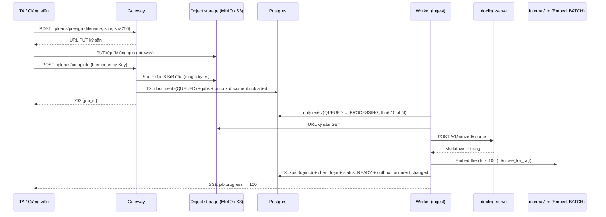
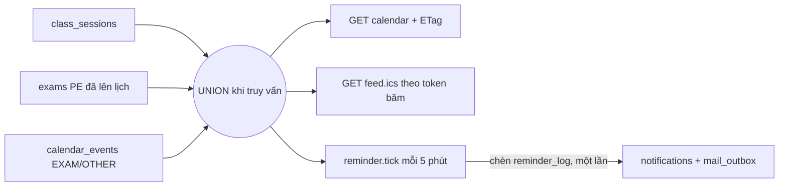

# SRS FEAT-docs-calendar Tài liệu, thư viện, lịch
Phiên bản 1.0 · 2026-10-10 · Trạng thái: DRAFT (chờ Tech Lead thẩm định `TL-REVIEW.md`, rồi PM duyệt)

Nguồn: `docs/phases/P8.md`; `docs/sprints/6/plan.md` (story 0, 2, 9, 10); PRD M9, M10, M11, G6; FLOWS F6, F13, F14; `ARCHITECTURE.md` §1, §4–§6, §8; `SYSTEM_DESIGN.md` 3.4, 5; `DECISIONS.md` D44, D46, D47; `DESIGN.md` §13, §14.14–§14.16, D59; `UX.md` quy tắc 2, 4, 5, 9, 10, mục 6; spec nền `FEAT-llm-gateway`, `FEAT-course-foundation`, `FEAT-weekly-exam`; schema thật `backend-go/db/migrations/00001`…`00006`; PoC `docs/research/2026-10-10-docling-arm64.md` (đang làm — các hằng số đánh dấu "tạm" chốt theo PoC).

## 1. Mục đích và phạm vi

Giảng viên tải tài liệu (PDF, DOCX, PPTX) lên; việc nền trích văn bản bằng `docling-serve`, chia đoạn, nhúng và lưu để AI hỏi–đáp có nguồn (F3, F6) — **ANSWER_KEY không bao giờ tới AI của sinh viên**. Sinh viên tìm, xem, tải tài liệu ở `/library` và hỏi AI giới hạn trong một tài liệu. Lịch gộp buổi học, bài thi PE và sự kiện giảng viên tạo, có feed ICS ký bằng token băm và nhắc 24 giờ không gửi trùng (F13).

**Trong phạm vi:** `internal/ingest`, `internal/rag`, `internal/document`, `internal/library`, `internal/calendar`; migration `00009_calendar`; route `/documents`, `/library`, `/library/[id]`, `/calendar`; tool `search_library`, `get_exam_schedule`, `get_upcoming_events` (nối vào khung của `FEAT-private-chat-pii`); seed tài liệu và lịch; `gate-p8.sh`.

**Ngoài phạm vi:** xem đầu `US.md`.

**Đánh số migration.** `P8.md` ghi `00013 calendar` và nói "không có migration tài liệu"; số `00013` đã bị chiếm (thực tế `00005_vn_fold`, `00006_weekly_exam` đã dùng). Sprint 6 dùng **`00009_calendar`** (sau `00007_chat_threads`, `00008_privacy` của `FEAT-private-chat-pii`). Tài liệu **không** có migration: dùng đúng `documents`, `content_chunks`, `document_courses` của `00003`.

**Thứ tự thi công (plan):** PoC (story 0) ∥ `FEAT-private-chat-pii` US-P3-01 → US-P8-01 → (P3 tiếp) → US-P8-02 → US-P8-03 (chỉ cần US-P3-01; chen được khi dev chờ).

## 2. Người dùng và quyền

Chế độ guard dùng đúng tên ở `FEAT-course-foundation` 4.1; vai trong lớp lấy từ `enrollments`, không từ JWT. Route nav (`frontend/src/shared/shell/nav.ts`): `/documents` = ta, teacher; `/library` = student; `/calendar` = student, ta, teacher.

| Hành động | STUDENT | TA | TEACHER | ADMIN | Chế độ |
| --- | --- | --- | --- | --- | --- |
| Tải lên, sửa cờ / loại / tên, sửa đoạn, thử lại, lập chỉ mục lại một tài liệu | ✗ | ✓ | ✓ | ✗ | `Staff` |
| Xoá tài liệu, lập chỉ mục lại cả lớp | ✗ | ✗ | ✓ | ✗ | `Teacher` |
| Xem `/documents` (mọi loại, mọi trạng thái, kể cả `ANSWER_KEY`), thống kê, danh sách đoạn | ✗ | ✓ | ✓ | ✗ | `Staff` |
| Dùng `/library` (tìm, xem, tải, hỏi AI về tài liệu) | ✓ | ✗ | ✗ | ✗ | `Member` + STUDENT |
| Xem lịch | ✓ | ✓ | ✓ | ✗ | `Member` |
| Tạo / sửa / xoá sự kiện lịch | ✗ | ✓ | ✓ | ✗ | `Staff` |
| Quản lý token ICS **của mình** (`/me/calendar/ics-token`) | ✓ | ✓ | ✓ | ✓ | JWT, chỉ chính mình |
| Đọc feed ICS | theo token (không JWT) | | | | token |

Quy tắc: ADMIN không có route tài liệu / thư viện / lịch của lớp (không đọc nội dung lớp — `FEAT-weekly-exam` §2); mọi route lớp lọc theo `course_id` đã qua guard; sinh viên chỉ thấy tài liệu `READY` + `visible_to_students` của lớp đó (kể cả chia sẻ vào) và **không bao giờ** `ANSWER_KEY`; `personal_state` của bài thi chỉ của chính người gọi; lớp `ARCHIVED` đọc được, ghi trả 409 `COURSE_ARCHIVED`. PRD §3 ghi ADMIN "Có" ở một số hàng (upload, chat, lịch, thư viện) — lệch với nav, ghi ở `FEAT-private-chat-pii` Q1 (mặc định: ADMIN không).

## 3. Luồng chính và các nhánh lỗi

### 3.1 Tải tài liệu và nạp nền (F6)



### 3.2 Lịch và nhắc (F13)



### 3.3 Bảng nhánh lỗi

| Tình huống | Hệ thống phản ứng | Người dùng thấy |
| --- | --- | --- |
| Đuôi / loại tệp ngoài PDF, DOCX, PPTX; quá 50 MiB | 422 trước khi tải | "Dùng PDF, DOCX hoặc PPTX, tối đa 50 MB." |
| Tệp đổi đuôi, không đúng loại thật | 422 `FILE_TYPE_MISMATCH`, xoá object | "Tệp không đọc được. Dùng PDF, DOCX hoặc PPTX." |
| Trùng nội dung cùng lớp / lớp khác của mình | 409 `DOCUMENT_DUPLICATE` / `…_ELSEWHERE` | "Tài liệu này đã có." / "Đã có ở lớp 761987. Chia sẻ sang lớp này?" |
| `docling` chết / quá hạn | thử lại ≤ 3 lần rồi `FAILED EXTRACT_UNAVAILABLE`; tài liệu `QUEUED` khi dịch vụ tắt | "Chưa đọc được tài liệu lúc này. Thử lại sau." + `Thử lại` |
| Tệp scan không có chữ | `FAILED NO_TEXT` ngay | "Không đọc được chữ trong tệp (có thể là bản quét). Hãy tải bản có chữ." |
| > 400 trang | `FAILED TOO_MANY_PAGES` | "Tệp dài hơn 400 trang. Hãy tách nhỏ." |
| Băm không khớp | `FAILED HASH_MISMATCH` | "Tệp bị lỗi khi tải lên. Tải lại." |
| Nhúng lỗi / sai chiều | `FAILED EMBED_FAILED` | "Chưa lập chỉ mục được tài liệu. Thử lại sau." |
| Worker chết giữa chừng | nhận lại việc `PROCESSING` quá 10 phút; không bao giờ có nửa tài liệu truy xuất được | trạng thái vẫn `Đang xử lý`, rồi `Sẵn sàng` |
| Sinh viên xin tài liệu không được phép / không có | 404 (không lộ tồn tại) | "Không tìm thấy tài liệu." |
| Object đã mất khỏi kho | 404 `FILE_GONE` | "Tệp này không còn nữa." |
| Tài liệu bị xoá, chat cũ còn trích dẫn | trích dẫn giữ `document_id` | "Nguồn đã gỡ" |
| Sửa đoạn: nhúng lỗi | giữ đoạn cũ | "Chưa lưu được. Thử lại." |
| Sự kiện lịch: giờ sai | 422 `EVENT_TIME_INVALID` | "Giờ kết thúc phải sau giờ bắt đầu." |
| Sửa đồng thời | 409 `VERSION_CONFLICT` | "Có người vừa sửa. Tải lại để xem bản mới." |
| Token ICS sai / đã xoay / thu hồi | 404 cùng một thân | (trình lịch báo không tải được) |
| Mail nhắc lỗi | chuông vẫn có; `mail_outbox` thử lại | chuông bình thường |

## 4. Yêu cầu chức năng

### 4.1 Tài liệu: loại, cờ, giới hạn

**Loại (enum thật `document_type`, `00003`):** `LECTURE` "Bài giảng", `COURSE_POLICY` "Quy chế môn học", `EXAM_PAPER` "Đề tham khảo", `ANSWER_KEY` "Đáp án", `OTHER` "Tài liệu khác". PRD M9 liệt kê thêm `COURSE_MATERIAL`, `REGULATION`, `GRADE_REPORT`: **không có trong enum** — ánh xạ `COURSE_MATERIAL` → `LECTURE`; `REGULATION` (quy chế trường) → `OTHER` với `category='Quy chế trường'`; `GRADE_REPORT` (cũ) bỏ. Đề xuất vá PRD ở mục 10.

**Cờ mặc định theo loại** (Q4):

| Loại | `visible_to_students` | `use_for_rag` | `audience` của đoạn |
| --- | --- | --- | --- |
| `LECTURE` | true | true | `ALL` |
| `COURSE_POLICY` | true | true | `ALL` |
| `EXAM_PAPER` | true | false | `ALL` |
| `ANSWER_KEY` | **false (ràng buộc DB)** | true (chỉ cho phía chấm / giảng viên) | `GRADING` |
| `OTHER` | true | true | `ALL` |

`audience` = `GRADING` nếu `type='ANSWER_KEY'`; `STAFF` nếu `visible_to_students=false`; còn lại `ALL`. Đổi `type` hoặc `visible_to_students` cập nhật `audience` mọi đoạn trong **cùng giao dịch** của `PATCH`. `use_for_rag=false`: vẫn trích và lưu đoạn (văn bản, để tìm trong thư viện) nhưng **không nhúng**.

**Giới hạn:** `DOC_MAX_BYTES` 50 MiB; đuôi ∈ {`.pdf`, `.docx`, `.pptx`}; `DOC_MAX_PAGES` 400 (kiểm sau khi `docling` trả); tên tệp ≤ 255 ký tự, không `/`, `\`, `..`; 10 `presign` / phút / người; tải song song ở giao diện ≤ 3 tệp. (Bản tạm; Q3.)

**Upload (theo `ARCHITECTURE.md` §5 "File").** `presign` ghi `ep:upload:{upload_id}` = `{user_id, course_id, filename, size, mime, sha256, blob_key}` (TTL 15 phút) và trả URL `PUT` hết hạn sau 10 phút; `blob_key = courses/{course_id}/documents/{upload_id}/{tên đã làm sạch}`. `complete` (`Idempotency-Key`): `upload_id` phải của chính người gọi và lớp này (else 404 `UPLOAD_NOT_FOUND`); `Stat` object: không có → 422 `UPLOAD_INCOMPLETE`, `size` ≠ khai → 422; đọc 8 KiB đầu: PDF `%PDF-`, DOCX / PPTX `PK\x03\x04` (kiểm sâu hơn để `docling` quyết) → sai 422 `FILE_TYPE_MISMATCH` + xoá object; trùng `sha256` cùng lớp (kể cả tài liệu chia sẻ vào) → 409 `DOCUMENT_DUPLICATE {existing_id}`; trùng ở lớp khác mà người gọi là Staff của lớp đó → 409 `DOCUMENT_DUPLICATE_ELSEWHERE {class_code, document_id}` (lớp người gọi không thuộc → bỏ qua); chèn `documents` + `jobs` + outbox `document.uploaded` một giao dịch; 202. `sha256` khai ở `presign` được **tính lại** ở worker (không khớp → `HASH_MISMATCH`).

### 4.2 `internal/ingest` — việc nền

**Nhận việc (idempotent).** Handler của outbox `document.uploaded`: `UPDATE documents SET status='PROCESSING', updated_at=now() WHERE id=$1 AND (status='QUEUED' OR (status='PROCESSING' AND updated_at < now() - interval '10 minutes')) RETURNING …`; không có dòng → bỏ (đã `READY`, đang chạy, hoặc `FAILED`). `retry` (`FAILED → QUEUED`) phát lại `document.uploaded`; `reindex` không đổi `status`.

**Tiến độ.** Dùng `jobs.Runner` có sẵn; `job.progress` (SSE) với `progress` theo giai đoạn: 5 (đã nhận) → 10–45 (đọc, theo trạng thái `docling`) → 50 (chia đoạn) → 55–95 (nhúng, tỉ lệ theo lô) → 100 (ghi, `READY`); chỉ tăng. `result = {document_id}`; lỗi → `error = {code, message}`.

**`docling-serve` (hợp đồng ở `ARCHITECTURE.md` §6; mặc định tạm, chốt theo PoC).** `POST {DOCLING_URL}/v1/convert/source` với nguồn là URL ký sẵn GET (hạn 15 phút) → Markdown + cấu trúc trang; `GET {DOCLING_URL}/health` — đỏ thì worker báo `degraded` và việc nằm lại hàng đợi; hạn mỗi lần gọi `INGEST_EXTRACT_TIMEOUT` (120 s); thử lại 3 lần (lùi 5 s / 30 s / 2 phút) cho lỗi tạm thời (5xx, quá hạn, kết nối); lỗi không thử lại: loại không hỗ trợ, `NO_TEXT` (văn bản sau làm sạch < 50 ký tự), `TOO_MANY_PAGES`, `HASH_MISMATCH`. Bật / tắt OCR theo `DOCLING_OCR` (PoC: tắt nếu RAM / thời gian vượt ngưỡng; khi tắt, tệp scan → `NO_TEXT`; Q7). Compose: dịch vụ `docling` thuộc profile `ingest`; tắt profile thì tải lên vẫn 202 và tài liệu ở `QUEUED`.

**Làm sạch và chia đoạn (mặc định tạm, chốt theo PoC).** Bỏ ký tự điều khiển, gộp khoảng trắng, bỏ đầu / chân trang lặp (dòng xuất hiện ở ≥ 40 % số trang); chia theo tiêu đề rồi đoạn văn; gộp tới `CHUNK_CHARS` = 1.800 ký tự, gối `CHUNK_OVERLAP` = 200; đoạn < 100 ký tự gộp vào đoạn kề; bỏ đoạn trùng văn bản; mỗi đoạn mang `ord` (từ 0), `page_no`, `heading` (≤ 200), `token_count` ≈ `len(rune)/4`. Chiều dài tính bằng ký tự (rune), không tách giữa dấu tiếng Việt.

**Nhúng.** `llm.Embed` làn **BATCH**, lô `llm.EmbedBatch` (100), 1536 chiều (sai → `ErrDimsMismatch` → `EMBED_FAILED`); chỉ khi `use_for_rag`. Hook che (FEAT-private-chat-pii 4.3) áp cho đầu vào nhúng; văn bản đoạn lưu **không** đổi.

**Ghi.** Một giao dịch: `DELETE FROM content_chunks WHERE document_id=$1`, chèn đoạn, cập nhật `status=READY`, `page_count`, `error=NULL` **chỉ khi** `status` vẫn `PROCESSING` và `sha256` không đổi; outbox `document.changed`. Đoạn của tài liệu chưa `READY` không bao giờ được truy xuất (mọi truy vấn nối `documents.status='READY'`).

**Lập chỉ mục lại.** Việc `document.reindex` (một tài liệu) / `document.reindex_all` (lớp): đọc `text` các đoạn đã lưu, nhúng lại từng lô, `UPDATE embedding` trong giao dịch từng lô; không gọi `docling`; idempotent theo `(document_id, ord)`; bật `use_for_rag` cho tài liệu chưa nhúng tự phát `reindex` của tài liệu đó. Chạy ở worker, làn BATCH, 202 + job.

**Quy mô.** `INGEST_WORKERS` (mặc định 1 ở máy dev) consumer đồng thời; ≤ 1 tài liệu `PROCESSING` mỗi lớp (tránh một giảng viên chiếm worker).

### 4.3 `internal/rag` — truy xuất tất định

```go
type Audience int // ForStudent (chỉ audience ALL + visible_to_students), ForStaff (ALL + STAFF)
type Query struct {
    CourseID    uuid.UUID
    Audience    Audience
    Vec         []float32 // đã nhúng một lần ở tầng gọi
    Text        string    // cho nhánh từ khoá
    DocumentIDs []uuid.UUID // rỗng = cả lớp; có = chỉ các tài liệu này
    K           int         // RAG_TOP_K
}
type Hit struct{ ChunkID, DocumentID uuid.UUID; Title string; PageNo *int; Heading *string; Text string; Cosine, Score float64 }
func (s *Service) Search(ctx context.Context, q Query) ([]Hit, error)
```

Một câu SQL (hợp đồng; mọi điều kiện nằm **trong** từng nhánh, trước `ORDER BY … LIMIT` — D47 mục 7; `ORDER BY` nhánh vectơ chỉ theo khoảng cách để HNSW của P10 dùng được):

```sql
WITH q AS (SELECT $1::vector AS v, plainto_tsquery('simple', vn_fold($2)) AS t),
vec AS (
  SELECT c.id, ROW_NUMBER() OVER (ORDER BY c.embedding <=> q.v) AS r
  FROM content_chunks c JOIN documents d ON d.id = c.document_id, q
  WHERE c.course_ids @> ARRAY[$3]::uuid[]
    AND d.status = 'READY' AND d.use_for_rag AND d.type <> 'ANSWER_KEY'
    AND ($4 = false OR d.visible_to_students)
    AND c.audience = ANY($5::chunk_audience[]) AND c.embedding IS NOT NULL
    AND (cardinality($6::uuid[]) = 0 OR c.document_id = ANY($6))
  ORDER BY c.embedding <=> q.v LIMIT 30),
kw AS ( /* cùng bộ điều kiện */
  SELECT c.id, ROW_NUMBER() OVER (ORDER BY ts_rank_cd(to_tsvector('simple', vn_fold(c.text)), q.t) DESC) AS r
  FROM content_chunks c JOIN documents d ON d.id = c.document_id, q
  WHERE <điều kiện như trên> AND to_tsvector('simple', vn_fold(c.text)) @@ q.t
  ORDER BY ts_rank_cd(to_tsvector('simple', vn_fold(c.text)), q.t) DESC LIMIT 30),
fused AS (SELECT id, SUM(1.0 / (60 + r)) AS s FROM (SELECT id, r FROM vec UNION ALL SELECT id, r FROM kw) x GROUP BY id ORDER BY s DESC LIMIT $7)
SELECT c.id, c.document_id, d.title, c.page_no, c.heading, c.text, 1 - (c.embedding <=> (SELECT v FROM q)) AS cosine, f.s
FROM fused f JOIN content_chunks c ON c.id = f.id JOIN documents d ON d.id = c.document_id ORDER BY f.s DESC;
```

- `$5` = `{ALL}` cho `ForStudent`, `{ALL, STAFF}` cho `ForStaff`; **không** có `Audience` nào cho `GRADING`: gói `rag` không xuất hàm tìm đoạn `GRADING` (P7 tạo `internal/rag/grading`, chỉ `internal/grading` được nhập — `TestNoPublicGradingSearch`). `d.type <> 'ANSWER_KEY'` là chốt thứ hai khi `audience` bị gán sai.
- Trộn RRF (hằng 60) — mặc định tạm, chốt theo PoC; chỉ mục HNSW và GIN biểu thức ở P10 (`00015`); `ponytail:` quét tuần tự ở quy mô seed.
- Phiên bản tri thức cho cache: `ep:rag:ver:{course_id}` tăng bởi `document.changed` (tạo / xoá / đổi cờ / đổi loại / chia sẻ / sửa đoạn).
- Tài liệu chia sẻ (`share-from`, P2) nằm ở `course_ids` của đoạn → truy xuất được ở cả hai lớp, không nhúng lại.

### 4.4 `internal/library` (sinh viên)

- **Danh sách / tìm** (`GET …/library?q=&type=&week=&category=&cursor=&limit=`): tài liệu `READY` + `visible_to_students` + `type <> 'ANSWER_KEY'` của lớp (`d.course_id = $c` hoặc có `document_courses` tới lớp); `q` (≥ 2 ký tự) khớp `vn_fold(title)`, `vn_fold(filename)`, `vn_fold(category)` bằng `LIKE` **hoặc** từ khoá trên đoạn (`to_tsvector('simple', vn_fold(text))`, cả đoạn không nhúng); nhóm theo tài liệu, kèm đoạn trích 1 dòng (`ts_headline`); sắp theo độ khớp rồi `(updated_at DESC, id DESC)`; phân trang con trỏ; `ETag` theo `max(updated_at)` + số dòng.
- **Chi tiết** (`GET …/library/{id}`): metadata + `preview_url` (chỉ PDF; URL ký sẵn GET 5 phút, `Content-Disposition: inline`) + `can_ask_ai` (= `use_for_rag` và đã nhúng). DOCX / PPTX: chỉ tải.
- **Tải** (`GET …/library/{id}/download`): kiểm quyền → `{url}` ký sẵn 5 phút (attachment) → `UPDATE documents SET download_count = download_count + 1` (một câu, nguyên tử). Không được phép / không có → 404; object mất → 404 `FILE_GONE`.
- **Hỏi AI về tài liệu**: tạo phiên chat có `document_id` (FEAT-private-chat-pii US-P3-05 AC17) chỉ khi `can_ask_ai`; truy xuất của phiên dùng `Query.DocumentIDs = {id}`.

### 4.5 `internal/document` (Staff)

`PATCH` (`{title?, type?, category?, week_no?, use_for_rag?, visible_to_students?, version}`): khoá lạc quan; `ANSWER_KEY` + `visible_to_students=true` → 422 `ANSWER_KEY_NOT_VISIBLE`; cập nhật `audience` cùng giao dịch; bật `use_for_rag` tự phát `reindex`; `audit_log`; tài liệu chia sẻ từ lớp khác (`documents.course_id ≠ lớp`) → 409 `DOCUMENT_SHARED_READONLY`. **Sửa đoạn** (`PATCH …/chunks/{chunkId} {text}`, 1–4.000 ký tự): nhúng lại **một** đoạn (`llm.Embed`, làn NEAR_REALTIME) và ghi trong một giao dịch cùng `audit_log` (trước / sau); nhúng lỗi → 503, giữ nguyên. **Xoá** (`DELETE`, Giảng viên): xoá `documents` (đoạn, `document_courses` theo `CASCADE`), outbox `document.deleted` (worker xoá object, tăng `ep:rag:ver`), `audit_log`. **Thống kê** (`GET …/documents/stats`): một truy vấn tổng hợp `{total, by_type, by_status, chunks, embedded_chunks, pages, bytes, has_course_policy, last_upload_at}`; `has_course_policy` = có `COURSE_POLICY` `READY` (của lớp hoặc chia sẻ vào).

### 4.6 Tool `search_library`

`search_library({query})` (không tham số danh tính; `trusted_context` có lớp): dùng đúng bộ lọc của 4.4 cho sinh viên, trả ≤ 5 `{document_id, title, type, week_no, page_no?, snippet, href}`; đăng ký ở cả `PrivateRegistry` và `PublicRegistry` (FEAT-private-chat-pii 4.5). Không trả `ANSWER_KEY`, tài liệu ẩn, tài liệu lớp khác.

### 4.7 `internal/calendar`

**Truy vấn UNION (không nhân bản).** Ba nguồn gộp lúc đọc:

| Nguồn | Điều kiện | `type` | `starts_at` / `ends_at` | `href` |
| --- | --- | --- | --- | --- |
| `class_sessions` | lớp | `CLASS_SESSION` | `starts_at` / `ends_at` | — |
| `exams` (PE) | `effective_status` ≥ `SCHEDULED` (không `DRAFT`) | `EXAM` | `opens_at` / `closes_at` | SV `/exams/{id}/take`; Staff `/exams/{id}` |
| `calendar_events` | lớp | `EXAM` hoặc `OTHER` | cột cùng tên | — |

Phản hồi mỗi dòng: `{id:"<source>:<uuid>", source:"class_session|weekly_exam|calendar_event", type, title, starts_at, ends_at, location, href, editable, personal_state}`; `editable=true` chỉ với `calendar_event` và người gọi là Staff; `personal_state` ∈ `NOT_STARTED`/`IN_PROGRESS`/`SUBMITTED` chỉ cho sinh viên và chỉ dòng `weekly_exam` (từ `exam_attempts` của chính họ; lượt `GRADING`/`GRADED` → `SUBMITTED`), `null` ở nơi khác. Tiêu đề buổi học: `Buổi {session_no}` + ` · {topic}` nếu có. Tham số: `from`, `to` (RFC 3339, bắt buộc; `to − from ≤ 62 ngày`), `cursor`, `limit` (≤ 100); sắp theo `(starts_at, id)`; **không** có cột nào trong `calendar_events` cho buổi học hay bài thi PE. `ETag` yếu = băm của `(max(updated_at) mỗi nguồn, số dòng, người gọi)`; `If-None-Match` trùng → 304. `DEADLINE` (bài tập) thêm ở P7 bằng nguồn thứ tư.

**Sự kiện giảng viên.** `POST/PUT/DELETE …/calendar/events` (Staff): `type` ∈ {`EXAM`, `OTHER`}; `title` 1–120; `location` ≤ 80; `description` ≤ 1.000; `starts_at` trong ±2 năm quanh hiện tại; `ends_at > starts_at` hoặc NULL; `PUT` có `version` (409 `VERSION_CONFLICT`); mọi ghi `audit_log` + outbox `calendar.changed` (vô hiệu `ep:today:*` của thành viên lớp ≤ 5 s — thêm vào `today.Topics()`); lớp `ARCHIVED` → 409.

**Đổi giờ → AI đổi ngay.** `get_exam_schedule` / `get_upcoming_events` (FEAT-private-chat-pii 4.5) gọi `calendar.Service` đọc DB trực tiếp, kết quả lịch không vào cache câu trả lời; hỏi lại ngay sau khi sửa → giờ mới.

**Tool.** `get_exam_schedule()`: bài thi PE đã lên lịch (từ `now`) + `calendar_events` `EXAM` từ `now`, tối đa 10; `get_upcoming_events({days})`: mọi nguồn trong `days` (1–30, mặc định 7), tối đa 20; phạm vi = `trusted_context.course_id`; rỗng → `NoData` ("Chưa có lịch thi nào được công bố." / "Bạn không có sự kiện nào trong {n} ngày tới."); giờ hiển thị `Thứ Hai, 21/09 · 14:00` theo `Asia/Ho_Chi_Minh` (lưu UTC).

### 4.8 Feed ICS và token

- **Token.** `POST /me/calendar/ics-token`: 32 byte `crypto/rand` → `base64.RawURLEncoding` (43 ký tự) → URL `{APP_PUBLIC_URL}/api/v1/calendar/feed.ics?token=<token>`; **chỉ lưu `hex(sha256(token))` vào `users.ics_token`** (cột `text` có chỉ mục duy nhất từng phần từ `00001`, hiện **chưa có mã nào dùng** — `grep ics_token backend-go` chỉ thấy truy vấn `SELECT *`, test che trường và `schema_test` — nên đổi ngữ nghĩa sang "băm" không cần migration); trả URL **một lần**; gọi lần nữa = xoay (cập nhật cột; token cũ không còn khớp); `DELETE` đặt `NULL`; `GET` trả `{exists}`. Token thô không vào DB, log, `audit_log` (log truy cập che giá trị query `token`). Tìm theo băm bằng chỉ mục duy nhất; mọi lỗi → cùng một 404 và cùng thân, giới hạn `ep:rl:ics:{ip}:{phút}` 60 / phút → 429.
- **Nội dung.** Gộp sự kiện của **mọi lớp người đó `ACTIVE`**, cửa sổ từ `now − 30 ngày` tới `now + 365 ngày`, tối đa 2.000 sự kiện: buổi học, bài thi PE đã lên lịch trở đi, `calendar_events`. Mỗi `VEVENT`: `UID:{source}-{uuid}@edupilot`, `DTSTAMP` (giờ `updated_at` lớn nhất hoặc hiện tại), `DTSTART` / `DTEND` dạng UTC `YYYYMMDDTHHMMSSZ` (`DTEND` bù `+1 giờ` nếu rỗng), `SUMMARY` (tiêu đề; thêm tiền tố mã lớp khi người dùng có ≥ 2 lớp), `LOCATION`, `URL`. `VCALENDAR`: `VERSION:2.0`, `PRODID:-//EduPilot//Calendar//VI`, `CALSCALE:GREGORIAN`, `X-WR-CALNAME:EduPilot`. Định dạng: CRLF, gập dòng ở 75 octet (tiếp dòng bằng một khoảng trắng, không cắt giữa ký tự UTF-8), thoát `\\`, `;`, `,`, xuống dòng. Không bài thi `DRAFT`, không `description`, không tên người. `ETag`, `Cache-Control: private, max-age=300`. Không thêm thư viện: viết tay (bảng `ARCHITECTURE.md` §3 không có thư viện ICS).

### 4.9 Nhắc 24 giờ

- `reminder.tick` (cron của worker, mỗi `REMINDER_TICK` = 5 phút; chỉ một bản chạy nhờ `SET ep:reminder:tick:leader NX PX 120000`): với mỗi nguồn (buổi học, bài thi PE `SCHEDULED`/`OPEN`, `calendar_events`) có `starts_at ∈ (now, now + REMINDER_LEAD]` (24 giờ), lấy người nhận = sinh viên `ACTIVE` của lớp, lô 200 người mỗi giao dịch: `INSERT INTO reminder_log (user_id, course_id, source_type, source_id, starts_at, kind) … ON CONFLICT DO NOTHING RETURNING id`; **chỉ khi chèn được**: tạo `notifications` (`type='REMINDER'`, `dedupe_key = 'remind:{source}:{id}:{epoch(starts_at)}'`, `link` `/exams/{id}/take` cho bài thi, `/calendar` còn lại) và — nếu loại bật, `remind_deadline_by_mail=true`, email đã xác minh — một dòng `mail_outbox` (`template='calendar_reminder'`, chỉ có tên sự kiện, giờ, liên kết `APP_PUBLIC_URL/calendar`).
- Khoá chống trùng: `UNIQUE (user_id, source_type, source_id, starts_at, kind)`. Đổi `starts_at` ⇒ khoá mới ⇒ nhắc lại một lần; nguồn bị xoá / bỏ lịch ⇒ không còn trong truy vấn ⇒ không nhắc.
- Tắt từng loại: `user_settings.preferences.reminders = {exam, class_session, other}` (mặc định `true`, `false`, `true`; Q2) qua `PUT /me/settings` (mở rộng lược đồ `preferences`; khoá lạ → 422). Loại tắt ⇒ không chuông, không mail. Lớp `ARCHIVED` / người `DISABLED` ⇒ không nhắc. Nhắc chỉ cho sinh viên (Q2).

### 4.10 Danh sách FR

| FR | Nội dung | AC |
| --- | --- | --- |
| FR-1 | Upload qua URL ký sẵn: kiểm đầu vào, hoàn tất 202 + việc, tệp sai loại, trùng nội dung | 01-AC1…AC4 |
| FR-2 | Việc nền: trích (docling), chia đoạn, nhúng BATCH, tiến độ SSE, audience | 01-AC5…AC8 |
| FR-3 | Idempotent, chịu worker chết, lỗi đọc hiểu được, thử lại | 01-AC9, AC10 |
| FR-4 | `rag.Search` lọc trong SQL; `TestAnswerKeyNeverRetrieved`; cách ly lớp; chia sẻ không nhúng lại | 01-AC11…AC13 |
| FR-5 | Vô hiệu cache theo sự kiện; lập chỉ mục lại; phân quyền ingest; docling dev; ingest không làm chat chậm | 01-AC14…AC18 |
| FR-6 | `/documents`: bảng, tải tại chỗ, `ANSWER_KEY`, đổi cờ, nhắc `COURSE_POLICY`, sửa đoạn, thống kê, xoá | 02-AC1…AC8 |
| FR-7 | `/library`: tìm, chi tiết, xem trước, tải, đếm lượt | 02-AC9, AC10 |
| FR-8 | Hỏi AI về tài liệu; `search_library`; giao diện thư viện | 02-AC11…AC13 |
| FR-9 | Phân quyền và nhánh lỗi mạng của tài liệu / thư viện | 02-AC14, AC15 |
| FR-10 | `00009_calendar`; UNION; sự kiện; ETag; trạng thái cá nhân | 03-AC1…AC5 |
| FR-11 | Đổi giờ → lịch, "Hôm nay", AI đổi ngay; tool lịch | 03-AC6, AC10 |
| FR-12 | Token ICS băm, feed đúng chuẩn, chống dò | 03-AC7…AC9 |
| FR-13 | Nhắc 24 giờ, không trùng, tắt theo loại, lỗi mail, quy mô | 03-AC11…AC13 |
| FR-14 | Giao diện `/calendar`; phân quyền; `gate-p8.sh`; seed | 03-AC14…AC17 |

## 5. Dữ liệu

### 5.1 `calendar_events` (`00009`)

| Cột | Kiểu | Null | Mặc định | Ràng buộc |
| --- | --- | --- | --- | --- |
| `id` | uuid | NOT NULL | `uuidv7()` | PK |
| `course_id` | uuid | NOT NULL | | FK `courses`; `UNIQUE (course_id, id)` |
| `type` | `calendar_event_type` (`EXAM`, `OTHER`) | NOT NULL | | |
| `title` | text | NOT NULL | | `CHECK (char_length(title) BETWEEN 1 AND 120)` |
| `starts_at` | timestamptz | NOT NULL | | |
| `ends_at` | timestamptz | NULL | | `CHECK (ends_at IS NULL OR ends_at > starts_at)` |
| `location` | text | NULL | | `CHECK (char_length(location) <= 80)` |
| `description` | text | NULL | | `CHECK (char_length(description) <= 1000)` |
| `ref_type` | text | NULL | | để dành cho P7 (`ASSIGNMENT`); `CHECK ((ref_type IS NULL) = (ref_id IS NULL))` |
| `ref_id` | uuid | NULL | | |
| `created_by` | uuid | NOT NULL | | FK `users` |
| `version` | integer | NOT NULL | `1` | `CHECK (version >= 1)` |
| `created_at`, `updated_at` | timestamptz | NOT NULL | `now()` | trigger `set_updated_at` |

Chỉ mục: `calendar_events_course_starts_idx (course_id, starts_at, id)`.

### 5.2 `reminder_log` (`00009`)

| Cột | Kiểu | Null | Mặc định | Ràng buộc |
| --- | --- | --- | --- | --- |
| `id` | uuid | NOT NULL | `uuidv7()` | PK |
| `user_id` | uuid | NOT NULL | | FK `users` |
| `course_id` | uuid | NOT NULL | | FK `courses` |
| `source_type` | `reminder_source` (`CLASS_SESSION`, `WEEKLY_EXAM`, `CALENDAR_EVENT`) | NOT NULL | | |
| `source_id` | uuid | NOT NULL | | không FK (nguồn có thể bị xoá) |
| `starts_at` | timestamptz | NOT NULL | | giờ lúc nhắc |
| `kind` | text | NOT NULL | `'T24H'` | `CHECK (kind = 'T24H')` |
| `created_at` | timestamptz | NOT NULL | `now()` | |

`UNIQUE (user_id, source_type, source_id, starts_at, kind)`; chỉ mục `(starts_at)` cho dọn dẹp (nợ PR: xoá dòng cũ hơn 30 ngày).

### 5.3 Dùng lại, không đổi lược đồ

`documents` (`sha256` là khoá nội dung — phase file / plan gọi "`content_hash`"), `content_chunks` (`audience`, `course_ids`, `embedding NULL` khi không nhúng), `document_courses`, `class_sessions`, `notifications` (`dedupe_key`), `user_settings` (`remind_deadline_by_mail`, `preferences` jsonb), `mail_outbox`, `jobs`, `outbox`. **`users.ics_token`**: cột `text` có chỉ mục duy nhất từng phần; ở P8 nội dung của nó là **SHA-256 hex (64 ký tự)**, không còn là token thô (mục 10).

### 5.4 Khoá Redis (tiền tố `ep:`)

| Khoá | Kiểu | TTL | Dùng |
| --- | --- | --- | --- |
| `ep:upload:{upload_id}` | HASH | 15 phút | bản ghi `presign` |
| `ep:rl:upload:{uid}:{phút}` | String (INCR) | 120 s | 10 `presign` / phút |
| `ep:rag:ver:{course_id}` | String (INCR) | — | phiên bản tri thức (cache chat) |
| `ep:rl:ics:{ip}:{phút}` | String (INCR) | 120 s | 60 yêu cầu / phút / IP |
| `ep:reminder:tick:leader` | String `NX PX` | 120 s | một bộ nhắc |
| `ep:today:*` | (có sẵn) | 60 s | xoá theo `calendar.changed` |

### 5.5 Outbox topic

`document.uploaded`, `document.changed`, `document.deleted`, `document.reindex`, `calendar.changed` (+ `today.Topics()`); đọc: `exam.scheduled`, `exam.unscheduled`, `exam.opened`, `exam.closed` (PE) để vô hiệu cache lịch.

### 5.6 Biến môi trường

`DOCLING_URL` (có sẵn), `DOCLING_OCR` (`on`/`off`, theo PoC), `DOC_MAX_BYTES` (52428800), `DOC_MAX_PAGES` (400), `CHUNK_CHARS` (1800), `CHUNK_OVERLAP` (200), `INGEST_EXTRACT_TIMEOUT` (120s), `INGEST_WORKERS` (có sẵn), `REMINDER_TICK` (5m), `REMINDER_LEAD` (24h), `APP_PUBLIC_URL` (có sẵn).

## 6. API

Tiền tố `/api/v1`; lỗi `{code, message, details?, retry_after?}`; phân trang con trỏ (`limit` ≤ 100); **[K]** = `Idempotency-Key` bắt buộc. Mọi thao tác có trong `openapi.yaml` và contract test.

| # | Route | Chế độ / vai | Thân → phản hồi | Mã lỗi chính |
| --- | --- | --- | --- | --- |
| 1 | `POST /courses/{cid}/uploads/presign` | `Staff` | `{purpose:"document", filename, mime_type, size_bytes, sha256}` → `{upload_id, method, url, headers, blob_key, expires_in}` | 403, 409 `COURSE_ARCHIVED`, 422 `FILE_TYPE_NOT_ALLOWED` / `FILE_TOO_LARGE`, 429 |
| 2 | `POST /courses/{cid}/uploads/complete` **[K]** | `Staff` | `{upload_id, title, type, use_for_rag?, visible_to_students?, category?, week_no?}` → 202 `{job_id, document}` | 404 `UPLOAD_NOT_FOUND`, 409 `DOCUMENT_DUPLICATE` / `…_ELSEWHERE`, 422 `UPLOAD_INCOMPLETE` / `FILE_TYPE_MISMATCH` |
| 3 | `GET /courses/{cid}/documents` | `Staff` | lọc `type`, `status`, `q` → `{items,next_cursor}` | 403 |
| 4 | `GET /courses/{cid}/documents/{id}` | `Staff` | tài liệu + trạng thái + lỗi | 403, 404 |
| 5 | `PATCH /courses/{cid}/documents/{id}` | `Staff` | `{title?,type?,category?,week_no?,use_for_rag?,visible_to_students?,version}` → 200 | 409 `VERSION_CONFLICT` / `DOCUMENT_SHARED_READONLY` / `COURSE_ARCHIVED`, 422 `ANSWER_KEY_NOT_VISIBLE` |
| 6 | `DELETE /courses/{cid}/documents/{id}` | `Teacher` | 204 | 403, 404, 409 `DOCUMENT_SHARED_READONLY` |
| 7 | `GET /courses/{cid}/documents/{id}/chunks` | `Staff` | `{items:[{id,ord,page_no,heading,text,audience}],next_cursor}` | 404 |
| 8 | `PATCH /courses/{cid}/documents/{id}/chunks/{chunkId}` | `Staff` | `{text}` → 200 | 409 `DOCUMENT_SHARED_READONLY`, 422, 503 |
| 9 | `POST /courses/{cid}/documents/{id}/retry` | `Staff` | 202 `{job_id}` (chỉ `FAILED`) | 409 `DOCUMENT_NOT_FAILED` |
| 10 | `POST /courses/{cid}/documents/{id}/reindex` | `Staff` | 202 `{job_id}` | 409 `DOCUMENT_NOT_READY` |
| 11 | `POST /courses/{cid}/documents/reindex` | `Teacher` | 202 `{job_id}` | 403 |
| 12 | `GET /courses/{cid}/documents/stats` | `Staff` | thống kê (4.5) | 403 |
| 13 | `GET /courses/{cid}/library` | `Member` + STUDENT | lọc `q`, `type`, `week`, `category` → `{items,next_cursor}` + `ETag` | 403, 304 |
| 14 | `GET /courses/{cid}/library/{docId}` | `Member` + STUDENT | metadata + `preview_url?` + `can_ask_ai` | 404 |
| 15 | `GET /courses/{cid}/library/{docId}/download` | `Member` + STUDENT | `{url}` (5 phút) | 404 `FILE_GONE` |
| 16 | `GET /courses/{cid}/calendar?from=&to=` | `Member` | `{items,next_cursor}` + `ETag` | 403, 304, 422 `RANGE_TOO_LARGE` |
| 17 | `POST /courses/{cid}/calendar/events` | `Staff` | `{type,title,starts_at,ends_at?,location?,description?}` → 201 | 409 `COURSE_ARCHIVED`, 422 `EVENT_TIME_INVALID` |
| 18 | `PUT /courses/{cid}/calendar/events/{id}` | `Staff` | `{…, version}` → 200 | 404, 409 `VERSION_CONFLICT`, 422 |
| 19 | `DELETE /courses/{cid}/calendar/events/{id}` | `Staff` | 204 | 404 |
| 20 | `GET /calendar/feed.ics?token=` | token | `text/calendar` + `ETag` | 404 (đồng nhất), 429 |
| 21 | `POST /me/calendar/ics-token` | JWT | 201 `{url}` (một lần) | 401 |
| 22 | `DELETE /me/calendar/ics-token` | JWT | 204 | 401 |
| 23 | `GET /me/calendar/ics-token` | JWT | `{exists}` | 401 |

`GET /jobs/{id}` và SSE `job.progress` có sẵn (PG). Liên kết tới `document_id` ở chat dùng route trang `/library/{id}`.

## 7. Giao diện

Bám `DESIGN.md` §13, §14.14–§14.16, D59 (một Panel mỗi vùng), `shared/` primitive; `PageState` cho tải / rỗng / lỗi; không `fetch` trần.

| Route | Khung nhìn đầu | Primitive | Tải / rỗng / lỗi | Mobile |
| --- | --- | --- | --- | --- |
| `/documents` (Staff) | một Panel: vùng thả ngay trên bảng (không modal), dải thống kê gọn, bảng (tên, loại, tuần / chủ đề, `Dùng cho AI`, `Hiện cho sinh viên`, trạng thái, cập nhật); `InlineNotice` thiếu quy chế; hành động chính duy nhất `Tải tài liệu lên` | `Panel`, `DataTable` (ảo hoá), `Field`, `StatusText`, `InlineNotice`, `Drawer` (danh sách / sửa đoạn), `ConfirmIrreversible` (xoá) | khung xương · "Lớp chưa có tài liệu." + `Tải tài liệu lên` · lỗi + `Thử lại` | dùng được ≥ 720 px |
| `/library` (SV) | ô tìm kiếm trước; bộ lọc tuần / chủ đề / loại; danh sách gọn có dấu loại tệp | `Panel`, `Field` (tìm), `SegmentedControl`/`Select`, `ActionList` | khung xương · "Chưa có tài liệu nào." · lỗi `Thử lại` (giữ từ khoá) | 375 px; vùng chạm ≥ 44 px |
| `/library/[id]` (SV) | chi tiết: tên, meta, xem trước PDF (hoặc nút `Tải xuống` với DOCX / PPTX); hành động `Hỏi AI về tài liệu` (chỉ khi `can_ask_ai`) | `Panel`, `ActionList` | như trên · "Không tìm thấy tài liệu." | 375 px |
| `/calendar` | tuần (≥ 720 px) hoặc danh sách (< 720 px) + tháng; Staff `Thêm sự kiện`; tiện ích `Thêm vào lịch` | `Panel`, `SegmentedControl`, `ActionList`, `Field`, `StatusText` | khung xương · "Chưa có gì trong lịch." + hành động theo vai · lỗi `Thử lại` | 375 px mặc định danh sách |

**Lời văn** (sinh viên không thấy RAG, chunk, embedding, `ANSWER_KEY`, provider; Staff không cần từ kỹ thuật của AI): trạng thái `Đang xử lý n %` / `Sẵn sàng` / `Lỗi`; cờ `Dùng cho AI`, `Hiện cho sinh viên`; `ANSWER_KEY`: "Không hiển thị cho sinh viên" · "Không dùng cho AI của sinh viên"; xoá: "Xoá {tên}? {n} đoạn và {m} lớp đang dùng tài liệu này sẽ mất nó."; loại: Bài giảng · Quy chế môn học · Đề tham khảo · Đáp án (Staff) · Tài liệu khác; ngày giờ `Thứ Hai, 21/09 · 14:00`. Không viết câu giải thích dưới tiêu đề khối hoặc dưới từng dòng (luật chữ trên UI); tooltip chỉ ở cú pháp / lý do nút khoá. `Thêm vào lịch` mở vùng nhỏ có URL, `Sao chép`, `Đặt lại liên kết`, và đúng một dòng "Mất liên kết thì đặt lại." Công tắc nhắc theo loại nằm ở `/settings` (không thêm màn mới). **Không** vẽ nút `Luyện đề này` (P9). Màu lịch tiết chế: chữ trung tính, tín hiệu đỏ chỉ cho bài thi trong 48 giờ tới.

**Hành vi:** đổi cờ / loại / xoá sự kiện dùng lạc quan + "Đã … · Hoàn tác" 5 s (xoá tài liệu là việc không đảo ngược → `ConfirmIrreversible`); tải lên thất bại giữ tên tệp và cho `Tải lại`; `useSSE` cho `job.progress`.

## 8. Phi chức năng

| Hạng mục | Yêu cầu | Đo |
| --- | --- | --- |
| docling trên máy dev | RAM ≤ 3 GiB; mỗi PDF seed ≤ 60 s (PoC) | `docker stats`, thời gian job |
| Việc nặng ngoài request (luật 12) | tải lên 202 + job + SSE; consumer idempotent; thử lại ≤ 3 + dead-letter | `TestIngestRedeliveryNoDuplicateChunks`, `TestIngestKillWorkerMidRun` |
| Truy xuất tất định (D47) | không LLM; một câu SQL; `Search` p95 ≤ 100 ms ở seed (≈ 1.000 đoạn), ≤ 400 ms với 100.000 đoạn khi có HNSW (P10) | benchmark `rag` |
| Ingest không làm chat chậm | TTFT `mixed` ≤ `chat` × 1,2 và ≤ 1,5 s | `chat.js mixed` |
| Riêng tư / quyền | `ANSWER_KEY` không tới sinh viên; ADMIN không đọc nội dung; token ICS băm, không log; feed chỉ dữ liệu chủ token | `TestAnswerKeyNeverRetrieved`, `TestICSTokenStoredHashed` |
| Phân trang (luật 13) | mọi danh sách `cursor`, `limit ≤ 100`, không OFFSET, không N+1 | test `Cursor`, `EXPLAIN` |
| Idempotency (luật 14) | **[K]** ở #2; nhắc nhờ khoá duy nhất; khoá lạc quan `version` ở #5, #18 | các test AC |
| Cache (luật 15) | `ETag` cho lịch / thư viện; cache chat vô hiệu bằng `document.changed`; lịch và `get_*_events` đọc DB trực tiếp | `TestDocumentChangedBumpsRagVersion` |
| Gateway không trạng thái (luật 10) | tệp qua object storage + URL ký sẵn; không ghi đĩa cục bộ; leader nhắc bằng Redis | `TestIngestNoLocalDisk` (kiểm không tạo tệp tạm ngoài bộ nhớ) |
| Lịch | `GET calendar` p95 ≤ 300 ms (SLO đọc); feed ≤ 2.000 sự kiện ≤ 500 ms | k6 `today.js`-kiểu, `BenchmarkICS` |
| Nhắc | 1.000 sinh viên × 1 sự kiện ≤ 60 s; không trùng | `TestReminderBatches200` |

## 9. Kiểm thử

**9.1 Biến shell** như `FEAT-private-chat-pii` 9.1 và thêm `C2` (lớp 2, `761988`), `TOK` = token ICS vừa tạo, `$PW`.

**9.2 Tầng.**

| Tầng | Gói / tệp | Phủ |
| --- | --- | --- |
| Đơn vị | `internal/ingest`, `internal/document`, `internal/library`, `internal/calendar` | kiểm đầu vào, chia đoạn, audience, ICS định dạng / gập dòng / thoát, nhắc, tool |
| Tích hợp | `internal/rag` (`-tags integration`), `internal/ingest`, `internal/document`, `internal/calendar` | truy xuất lọc SQL, `TestAnswerKeyNeverRetrieved`, idempotent / kill worker, nhắc song song, token băm (Postgres + Redis + MinIO thật; docling giả) |
| docling thật | `scripts/check-docs-seed.mjs` (cần `--profile ingest`) | 3 PDF seed `READY` |
| Hợp đồng | `internal/contract` | 23 thao tác, 4xx, projection sinh viên |
| E2E | `frontend/e2e/documents.spec.ts`, `library.spec.ts`, `calendar.spec.ts` | luồng F6, F13, 375 px, ngắt mạng |
| Tải | `benchmarks/load/chat.js` `mixed` | ingest không làm chat chậm |
| Cổng | `scripts/gate-p8.sh` | tổng hợp |

**9.3 Dữ liệu seed cần (lớp 1 `761987`, lớp 2 `761988`).** Ba tệp `seed/documents/*.pdf` hiện có: `Quyche.pdf` → `COURSE_POLICY` ("Quy chế học phần", tuần —), `Mordern_Network_Security_Threats.pdf` → `LECTURE` (tuần 3), `QMB12ch6b.pdf` → `LECTURE` (tuần 6, chủ đề tham khảo); cộng hai PDF tối giản sinh bằng script không thêm thư viện (`seed/documents/generated/`): `de-giuaky.pdf` (`EXAM_PAPER`) và `dapan-giuaky.pdf` (`ANSWER_KEY`, chứa canary `CANARY-7Q2X`); sự kiện lịch: lớp 1 "Thi giữa kỳ" và "Thi cuối kỳ" (`EXAM`, tương lai), lớp 2 một sự kiện `OTHER`; chia sẻ bài giảng sang lớp 2 (không nhúng lại; "quy chế môn học chưa tải" ở lớp 2 — dữ liệu ARCH §9). Nguồn: `ARCHITECTURE.md` §9 (6 bài giảng, 1 quy chế trường, 1 quy chế môn học, 2 đề cũ, 2 đáp án) được **rút gọn** cho đủ chạy trên PDF hiện có; PM duyệt (Q13).

## 10. Câu hỏi mở và quyết định đã chốt

**Câu hỏi mở:** `QUESTIONS.md` (Q1…Q14; sáu câu **[CHỦ DỰ ÁN]**: Q2…Q7; tám câu **[PM]**: Q1, Q8…Q14). Mặc định BA áp dụng khi chưa có trả lời.

**Quyết định cần PM (theo yêu cầu của prompt BA):** **token ICS.** Kiểm trên mã thật: `users.ics_token` (`00001`) là `text` có chỉ mục duy nhất từng phần (`users_ics_token_key WHERE ics_token IS NOT NULL`), **không CHECK**; không có mã ứng dụng nào ghi hay đọc giá trị (chỉ `SELECT *` do sqlc sinh, test `schema_test` ghim sự tồn tại cột, test che trường trong `user/list_test.go`, `course/members_test.go`). Cột vì vậy **không bảo đảm** lưu rõ hay băm; luật "token ở dạng băm" (`AGENTS.md`) bắt buộc băm. **Đề xuất:** (a) không đổi lược đồ — P8 ghi `hex(sha256(token))` (64 ký tự) vào cột này; token thô chỉ hiện một lần lúc tạo / xoay; mất thì đặt lại; (b) tuỳ chọn thêm `CHECK (ics_token IS NULL OR ics_token ~ '^[0-9a-f]{64}$')` ở `00009` bằng `ALTER TABLE users ADD CONSTRAINT` (không đổi cột; vẫn là ALTER nên cần PM duyệt vì D45). BA mặc định (a); nếu PM chọn (b) thì thêm vào AC1 của US-P8-03. Hệ quả của (a): người dùng không xem lại được link, phải bấm `Đặt lại liên kết` và đăng ký lại trong ứng dụng lịch.

**Đã chốt:** số migration `00009`; không migration tài liệu; lịch gộp bằng UNION (không nhân bản); hạn bài tập ở P7; `Luyện đề này` ở P9; không làm đường nạp tạm của P3 L0 (plan).

**Đề xuất đổi tài liệu nền (PM quyết; xem `docs/sprints/6/proposals.md`):**
1. `ARCHITECTURE.md` §4: `00013 calendar` → `00009 calendar` (số thật); thêm cột `calendar_events(description, created_by, version)`, bảng `reminder_log` (cột ở 5.2).
2. `ARCHITECTURE.md` §5: thêm route `uploads/presign|complete` (nhóm Tài liệu), `documents/{id}/chunks`, `retry`, `reindex`, `stats`, `library/{id}`, `/me/calendar/ics-token`; sửa nhóm "Thư viện" ghi `PATCH documents` là Staff.
3. `ARCHITECTURE.md` §7: thêm route `/library/[id]`.
4. PRD M9: bảng loại tài liệu khớp enum `document_type` (mục 4.1) — `COURSE_MATERIAL`, `REGULATION`, `GRADE_REPORT` không có.
5. PRD §2 "Ngoài phạm vi" còn ghi "chạy code sinh viên trong sandbox" và `DECISIONS.md` D3 "không chấm mã nguồn" mâu thuẫn D54 / D55 / M15 — xem `docs/sprints/6/proposals.md` #1 (nợ PROGRESS).
6. `FEAT-llm-gateway` US-P1-01 mục "Ngoài phạm vi" ghi việc lập chỉ mục lại "chạy ở P8": US-P8-01 AC15 nhận việc này (cần PM xác nhận không phải Could).

## 11. Truy vết

| PRD | FLOWS | Phase / lát | US | FR | Test chính |
| --- | --- | --- | --- | --- | --- |
| M9 (upload, loại, cờ, `ANSWER_KEY`, nhắc `COURSE_POLICY`) | F6 | P8 L1, L2 | US-P8-01, US-P8-02 | FR-1…FR-6 | `TestAnswerKeyNeverRetrieved`, `TestPresignValidation`, `documents.spec.ts` |
| M9 AC "RAG không trả `ANSWER_KEY`" | F6, F3 | P8 L1 | US-P8-01 | FR-4 | `TestAnswerKeyNeverRetrieved`, `TestRetrievalFiltersInSQL` |
| M10 (thư viện, xem trước, tải, hỏi AI) | F6 bước 5, F3 | P8 L2 | US-P8-02 | FR-7, FR-8 | `TestLibrary*`, `TestDocScopedChatOnlyThatDoc`, `library.spec.ts` |
| M11 (lịch, ICS, nhắc 24 giờ) | F13 | P8 L3 | US-P8-03 | FR-10…FR-14 | `TestCalendarUnionSources`, `TestICSTokenStoredHashed`, `TestReminderOncePerEvent`, `calendar.spec.ts` |
| M11 AC "đổi hạn → AI đổi ngay" | F13, F3 | P8 L3 | US-P8-03 | FR-11 | `TestChangeReflectedInCalendarAndTool` |
| G6 (đường nạp không làm chat chậm) | – | P8 L1 | US-P8-01 | FR-5 | `chat.js mixed` |
