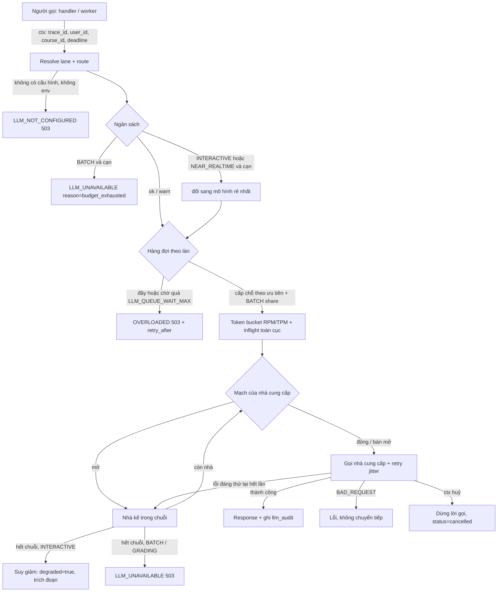
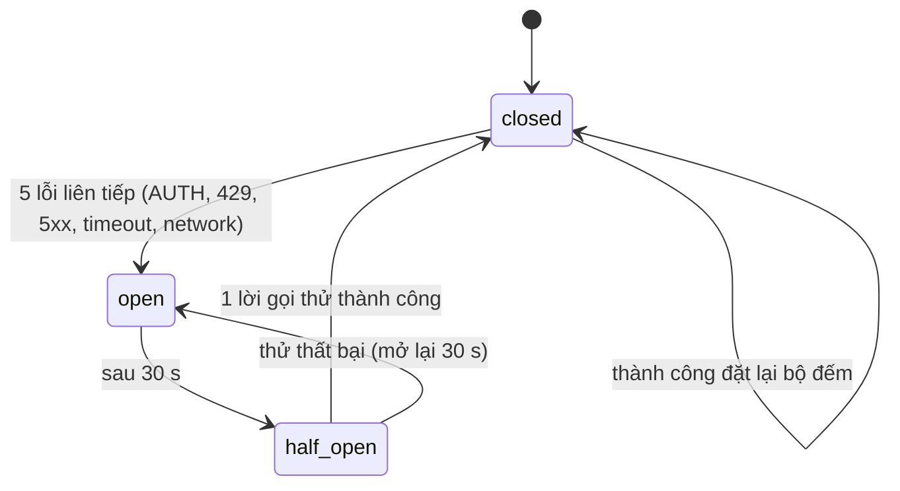
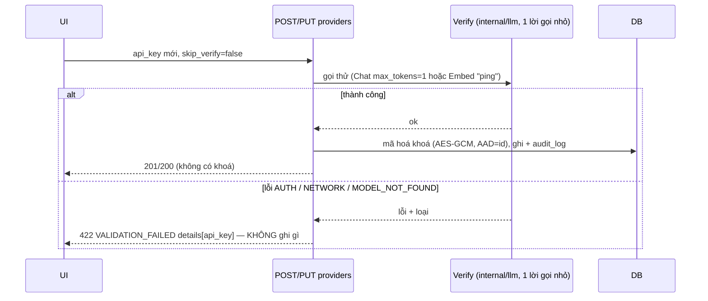

# SRS FEAT-llm-gateway Cổng LLM của Go (P1): lược đồ, `internal/llm`, Scheduler, API cấu hình, `/settings/llm`
Phiên bản 1.5 · 2026-10-02 · Trạng thái: **APPROVED** (PM 2026-10-03; Q1–Q14 theo mặc định của BA; Q11 key thật = việc chủ dự án, AC ghi âm BLOCKED tới khi có; PM đã cập nhật `ARCHITECTURE.md` §4, §5 theo Q1, Q2; v1.1: bỏ nhắc "gọi LLM từ Python" / `llm_audit` phía Python ở Ngoài phạm vi (trái D46 — không còn service Python))

**v1.5 (2026-10-03)** — QC `docs/sprints/3/qc/report-US-P1-03.md` TC-14 và `tc-US-P1-03.md` (Q-QC-P103-1/2/3 đã trả lời ở v1.2, giữ nguyên). Trích TC-14: "AC5 định nghĩa \"hàng có 200 *đang chờ* → yêu cầu thứ 201 bị từ chối\", nhưng lệnh kiểm \"201 yêu cầu song song ⇒ đúng 1 `503`\". Với `LLM_MAX_CONCURRENCY=1`, 1 yêu cầu chạy + 200 chờ ⇒ cả 201 được nhận, 0 bị từ chối; yêu cầu **202** bị từ chối. Hành vi khớp định nghĩa, lệch lệnh kiểm." Không đổi số AC (72) và không đổi hành vi: `LLM_QUEUE_MAX` đếm **chỉ yêu cầu đang chờ** (không đếm yêu cầu đang chạy). Đổi: US-P1-03 AC5 (câu điều kiện + lệnh kiểm 201 → 202), `SRS.md` 4.3 (định nghĩa `LLM_QUEUE_MAX`).

**v1.4 (2026-10-03)** — góp ý #6, #7, #8, #9 `docs/sprints/3/proposals.md` (PM `ACCEPTED`; nguồn: dev, US-P1-03 / US-P1-04). Trích #6: "luật 11 — BATCH không bao giờ được làm chat treo. BATCH **luôn** ≤ `ceil(MAX × share)` chỗ (bỏ ngoại lệ \"dùng hết công suất khi không có INTERACTIVE\"); bỏ `--prime`"; #7: "dung lượng bucket = burst (10 %); yêu cầu lớn hơn dung lượng chỉ đòi `min(cost, dung lượng)` rồi trừ trọn `cost` (bucket âm = nợ…); đối soát hoàn / trừ phần chênh kẹp ở dung lượng" (research `2026-10-03-scheduler-redis.md`); #8: "gói thật là `internal/platform/config`"; #9: "`active = true` khi DB không có tuyến nào dùng được (Registry đang chạy hoàn toàn bằng env)… có nhà cung cấp trong DB nhưng chưa gán tuyến → vẫn `true`". Không đổi số AC (72). Đổi: `SRS.md` 4.3 (bảng env `LLM_BATCH_SHARE`, "Mục tiêu đo được", "Cấp chỗ", "Token bucket"), 5.5 (bỏ khoá `ep:llm:lastint`, sửa `ep:llm:wait`), 6.3 (`env_fallback`), 8.2, 9; US-P1-03 AC2 (nêu làn), AC3 (luật bucket), AC4 (viết lại, bỏ `--prime`), AC15 (lệnh kiểm). Các góp ý #10–#12 không đổi spec này (QC / FEAT-ui-foundation).

**v1.3 (2026-10-03)** — góp ý #1 `docs/sprints/3/proposals.md` (PM `ACCEPTED`; nguồn: dev, US-P1-02; trích: "Làm theo research: `github.com/openai/openai-go/v3` v3.71.1 + `WithMaxRetries(0)`; `Structured` chọn CỐ ĐỊNH theo `type` (openai/gemini `json_schema`, anthropic tool bắt buộc, openai_compatible `json_object` + schema trong lời nhắc), không thử rồi lùi (D47: một lời gọi); `MODEL_NOT_FOUND` = 404; `max_completion_tokens` cho openai/anthropic, `max_tokens` cho gemini/compat; kẹp temperature ≤ 1 cho anthropic/gemini; Gemini chuẩn hoá L2 khi nhúng; mặc định dự phòng `claude-haiku-4-5-20251001`, `gemini-3.6-flash`. Tên test theo AC giữ nguyên (`TestStructuredDowngrade` kiểm hành vi theo loại)"; lý do: "PoC trong research: SDK tự thử lại 2 lần làm mất status 429; Anthropic bỏ qua `response_format`" — `docs/research/2026-10-03-openai-go-compat.md`). Không đổi số AC (72). Đổi: `SRS.md` 4.2 (mô-đun `openai-go/v3`, bảng loại nhà cung cấp, `Structured` theo `type`, ánh xạ lỗi, thử lại, tham số gửi đi, embedding, stream, mô hình mặc định), 8.6, FR-7, FR-12; US-P1-02 AC10 (viết lại), và các chỗ hệ quả: AC1 (đường dẫn mô-đun), AC5 (`MODEL_NOT_FOUND` = 404), AC6 (SDK không tự thử lại), AC11 (Gemini), phụ thuộc US-P1-02. **Không đổi** hợp đồng API, schema, mã lỗi hay số AC.

**v1.2 (2026-10-03)** — trả lời câu hỏi QC (`docs/sprints/3/qc/tc-US-P1-0*.md`, `tc-GATE-P1.md`; mỗi chỗ sửa ghi "Q-QC-…"). Đổi: định dạng `APP_ENCRYPTION_KEY` (Q-QC-P101-2); quy tắc `base_url`, không chặn địa chỉ nội bộ (Q-QC-P102-1, Q-QC-P104-1; thêm US-P1-04 AC13 và câu hỏi Q15 **[CHỦ DỰ ÁN]**); bộ đếm của route thử `stats` (Q-QC-P102-2); `fake` độ trễ cố định (Q-QC-P103-1); QC viết `scenario-P1.md` (Q-QC-P104-3); định nghĩa cột "Chạy rút gọn" (Q-QC-P105-3); CORS cho cổng và không có CLI ở US-P1-01 (Q-QC-P105-1, Q-QC-P101-1). Các câu còn lại chỉ trả lời ở tệp TC.

Nguồn: `docs/phases/P1.md` (nguồn chính), `docs/sprints/3/plan.md`, PRD M12 + §3, FLOWS F15, `ARCHITECTURE.md` §4 (schema), §5 (API), §8 (env), `SYSTEM_DESIGN.md` §1.2, §3.1, §5, `DECISIONS.md` D22, D46, D47, D51–D53; spec nền `docs/specs/FEAT-pg-foundation/` v1.3 (mã lỗi 6.1, cursor 6.4, header 6.5, Idempotency 6.6, SSE 6.8, env 8.1, `testroutes`); `docs/specs/FEAT-ui-foundation/`; `design/DESIGN.md` §14.23. Story: `US.md` (US-P1-01…05). Truy vết: mục 11.

## 1. Mục đích và phạm vi

Đưa **mọi** lời gọi LLM / embedding của Go qua một cổng duy nhất `backend-go/internal/llm` có: nhà cung cấp cấu hình được trong DB (khoá mã hoá), định tuyến theo tác vụ + chuỗi dự phòng, Scheduler chia làn ưu tiên (INTERACTIVE > NEAR_REALTIME > BATCH) với hạn mức, đồng thời, mạch ngắt, ngân sách, suy giảm có kiểm soát, nhật ký `llm_audit`; API cấu hình cho Admin; màn `/settings/llm` thật. Luật 3 và 11 của `AGENTS.md` trở thành kiểm được bằng máy (grep SDK, test hai tiến trình).

**Trong phạm vi:** migration `00002_llm`; `platform/crypto`; `internal/llmconfig` (service + repo + handler); `internal/llm` (+ `fake`, `scheduler`, `budget`, `cost`); `cmd/llmload` (công cụ đo, không vào image); route thử `testroutes`; `openapi.yaml` + golden; màn `/settings/llm`; cấu hình env.

**Ngoài phạm vi:** agent / RAG / tool / che PII (P3); bảng `courses` và ràng buộc "TEACHER chỉ lớp của mình" (P2); thông báo giao diện khi ngân sách 80 % (P4 — sprint này chỉ ghi outbox); việc lập chỉ mục lại khi đổi mô hình nhúng (P8); xoay vòng khoá mã hoá và dọn `llm_audit` (Nợ PR); `make eval` (hoãn — plan sprint 3); ghi phản hồi thật từ nhà cung cấp (cần khoá — chủ dự án).

**Giả định vận hành:** gateway **không trạng thái** (luật 10) và có thể chạy nhiều bản sao: trạng thái dùng chung của Scheduler (đồng thời, RPM / TPM, mạch, ngân sách, thông báo nạp lại) nằm ở **Redis**; hàng đợi chờ nằm trong bộ nhớ từng tiến trình (ghi `ponytail:` — công bằng giữa tiến trình chỉ gần đúng).

## 2. Người dùng và quyền

| Thao tác | Admin | Giảng viên | TA | Sinh viên | Ghi chú |
| --- | --- | --- | --- | --- | --- |
| Xem nhà cung cấp, tuyến, mức dùng, ngân sách hệ thống | ✓ | ✓ (chỉ đọc) | ✗ 403 | ✗ 403 | PRD §3: GV "Xem", TA "–" |
| Tạo / sửa / xoá nhà cung cấp, đổi khoá, `…/test`, `PUT routes`, `PUT budget` | ✓ | ✗ 403 | ✗ 403 | ✗ 403 | |
| Xem / sửa ngân sách theo lớp `/courses/{id}/llm-budget` | ✓ | ✗ 403 (sprint này) | ✗ | ✗ | GV xem ngân sách lớp mình: P2 |
| Xem mức dùng lọc theo `course_id` | ✓ | ✗ 403 (sprint này) | ✗ | ✗ | như trên |
| Thấy khoá API (rõ hoặc đuôi) | **không ai** | không | không | không | chỉ `has_key`, `key_status` |
| Route thử `_test/llm/*` | ✓ (build `testroutes`) | ✗ 403 | ✗ 403 | ✗ 403 | binary mặc định: 404 |

Quy tắc: danh tính và vai trò từ JWT (`RequireRole`); `user_id`, `course_id` ghi vào `llm_audit` từ **ctx** (không từ thân yêu cầu hay tham số của người gọi). ADMIN không đọc nội dung lớp mặc định — `llm_audit` **không** chứa nội dung prompt / câu trả lời nên Admin xem được mức dùng mà không lộ nội dung. Sinh viên không bao giờ thấy từ kỹ thuật: chuỗi suy giảm của chat không chứa `provider`, `fallback`, `trace`, `RAG`, `PII`.

## 3. Luồng chính và các nhánh lỗi

### 3.1 Một lời gọi LLM



### 3.2 Mạch ngắt (mỗi nhà cung cấp, dùng chung qua Redis)



### 3.3 Lưu nhà cung cấp (khoá sai không lưu)



### 3.4 Nhánh lỗi

| Tình huống | Hệ thống phản ứng | Người dùng thấy |
| --- | --- | --- |
| Khoá sai khi Test | 200 `{ok:false,error_kind:"AUTH"}`, không lưu | InlineNotice dưới hàng: "Khoá API không được nhà cung cấp chấp nhận…" |
| Khoá sai khi Lưu | 422 `PROVIDER_AUTH_FAILED`, không ghi | Lỗi dưới ô khoá, "Chưa lưu gì" |
| Máy chủ nội bộ không với tới | 422 `PROVIDER_UNREACHABLE`; `skip_verify` cho Admin | "Lưu mà không kiểm tra" |
| Hàng INTERACTIVE đầy | 503 `OVERLOADED` ngay + `retry_after` | "Hệ thống đang rất đông. Thử lại sau N giây." |
| Mọi nhà cung cấp chết (chat) | 200 `degraded=true`, trích đoạn | "AI tạm thời không khả dụng. Dưới đây là các đoạn tài liệu…" |
| Mọi nhà cung cấp chết (BATCH) | 503 `LLM_UNAVAILABLE` → consumer thử lại 3 lần → dead-letter | (việc nền) hiện ở "Hôm nay" khi P4+ |
| Ngân sách ≥ 100 % | BATCH dừng; chat đổi sang mô hình rẻ nhất | Admin: thông báo ở `/settings/llm`; sinh viên: không thấy gì |
| Client huỷ giữa stream | huỷ lời gọi ≤ 1 s, `status=cancelled` | — |
| Redis mất | giới hạn cục bộ, log `error` mỗi 30 s, vẫn gọi | — |
| Cấu hình nạp lại hỏng | giữ cấu hình cũ, log `error` | — |
| `APP_ENCRYPTION_KEY` hỏng | gateway không khởi động | (vận hành) lỗi rõ ở log |
| Khoá một nhà không giải mã được | nhà đó `key_status=unreadable`, bị bỏ qua | Hàng "Lỗi khoá — nhập lại khoá" |
| Embedding sai số chiều | `MODEL_DIMS_MISMATCH`, không trả vectơ | "Mô hình này không dùng được cho tìm kiếm tài liệu" |
| Hai Admin cùng sửa | 409 `VERSION_CONFLICT` | "Cài đặt này vừa được người khác đổi…" |

## 4. Yêu cầu chức năng

### 4.1 Hợp đồng `internal/llm`

```go
type Lane int // LaneInteractive=0 < LaneNearRealtime=1 < LaneBatch=2 (số nhỏ = ưu tiên cao)
type Task string // CHAT CLASSIFY UTILITY GRADING QUESTION_GEN INSIGHT EMBEDDING

type Request struct {
    Task Task; Lane *Lane            // nil = mặc định theo bảng 4.3
    Messages []Message; Params Params
    Shareable bool                   // chỉ true cho việc không chứa dữ liệu cá nhân
    PIIMaskedCount int
    Passages []Passage               // dùng cho đường suy giảm (INTERACTIVE)
}                                    // KHÔNG có UserID/CourseID: lấy từ ctx
type Response struct {
    Text string; TokensIn, TokensOut int
    Provider, Model string; FallbackIndex int
    Degraded bool; QueueWait time.Duration; CostEst decimal.Decimal
}
type Client interface {
    Chat(ctx context.Context, r Request) (Response, error)
    Stream(ctx context.Context, r Request) (<-chan Chunk, error)
    Structured(ctx context.Context, r Request, schema json.RawMessage) (json.RawMessage, error)
    Embed(ctx context.Context, r EmbedRequest) ([][]float32, error)
}
```

Lỗi gói trả: `ErrNotConfigured`, `ErrOverloaded{RetryAfter}`, `ErrUnavailable{Reason}`, `ErrDeadline`, `ErrBadRequest`, `ErrAllProvidersFailed`, `ErrDimsMismatch`, `ErrBadLane`; handler ánh xạ sang mã HTTP ở 6.1. Gói **không** import `net/http` của handler; SDK chỉ ở `internal/llm/provider/`.

### 4.2 Nhà cung cấp, ánh xạ lỗi, thử lại

**Mô-đun và khởi tạo (D46, góp ý #1):** mọi loại đi qua **`github.com/openai/openai-go/v3`** (v3.71.1; mô-đun gốc dừng ở v1.12.0 và `/v2` ở v2.7.1) với `base_url` + khoá; mỗi client dựng bằng `openai.NewClient(option.WithBaseURL(u), option.WithAPIKey(k), option.WithMaxRetries(0))` — **`WithMaxRetries(0)` bắt buộc**: mặc định SDK tự thử lại 2 lần (408/409/429/5xx, tôn trọng `Retry-After` tới 2 phút), chồng lên thử lại của Scheduler và làm mất status 429 khi `ctx` hết hạn (xếp nhầm thành `TIMEOUT`). **Thử lại chỉ do `internal/llm` làm** (mục "Thử lại" dưới). Lỗi của SDK lấy bằng `errors.As(err, &*openai.Error)` → `StatusCode`, `Response.Header`.

**Loại và địa chỉ gốc:**

| `type` | `base_url` | Ghi chú |
| --- | --- | --- |
| `openai` | `https://api.openai.com/v1` | |
| `anthropic` | `https://api.anthropic.com/v1/` | lớp tương thích OpenAI; **bỏ qua `response_format`** (kể cả `json_object`) nên `Structured` = tool bắt buộc (bên dưới); không có endpoint nhúng |
| `gemini` | `https://generativelanguage.googleapis.com/v1beta/openai/` | lớp tương thích OpenAI (beta) |
| `openai_compatible` | bắt buộc ở bản ghi (vLLM, LM Studio, máy chủ trường) | khoá có thể rỗng |
| `fake` | — | provider giả (8.3); có thể tạo ở DB cho dev / test |

**`Structured` — chọn CỐ ĐỊNH theo `type`, một lời gọi (D47; không thử `json_schema` rồi lùi):**

| `type` | Cách gọi | Lấy kết quả |
| --- | --- | --- |
| `openai` | `response_format: json_schema` với `strict: true` (schema phải có `additionalProperties:false` và mọi thuộc tính `required`) | `choices[0].message.content` |
| `gemini` | `response_format: json_schema` | `choices[0].message.content` |
| `anthropic` | `tools` = **một** hàm có `parameters` = schema, `tool_choice` ép đúng hàm đó | `choices[0].message.tool_calls[0].function.arguments` |
| `openai_compatible` | `response_format: json_object` + schema nhúng trong lời nhắc hệ thống | `choices[0].message.content` |
| `fake` | sinh theo schema (8.3) | — |

**Mọi** nhánh đều kiểm kết quả bằng schema phía Go (bộ kiểm **tự viết, tối giản** cho tập con JSON Schema mà schema của dự án dùng: `type`, `properties`, `required`, `enum`, `items`, `additionalProperties`, `minimum` / `maximum`, `minLength` / `maxLength`; **không thêm thư viện** — bảng `ARCHITECTURE.md` §3 không có thư viện JSON Schema và `kin-openapi` chỉ cho test, D52; cần đầy đủ hơn thì xin PM duyệt thư viện: `QUESTIONS.md` Q16); kết quả không phải JSON hoặc sai schema → coi là lỗi nhà cung cấp (`BAD_RESPONSE`, tính vào mạch, chuyển fallback theo chuỗi); **không bao giờ** thử lại cùng nhà bằng cách đổi `response_format`. Tên test `TestStructuredDowngrade` nay kiểm **hành vi theo loại** (mỗi `type` đúng một lời gọi, đúng dạng yêu cầu).

**Ánh xạ lỗi (`error_kind`):**

| Loại | Điều kiện | Thử lại cùng nhà | Chuyển nhà tiếp | Tính vào mạch |
| --- | --- | --- | --- | --- |
| `AUTH` | HTTP 401, 403 | không | có | có |
| `MODEL_NOT_FOUND` | **HTTP 404** (không dựa vào mã `model_not_found`: Anthropic / Gemini để `code` rỗng) | không | có | không |
| `RATE_LIMIT` | 429 | có (tôn trọng `Retry-After` ≤ 5 s) | có | có |
| `SERVER` | 500, 502, 503, 504; **lỗi giữa stream** (`*ssestream.StreamError`, không có status) | có (stream: chỉ khi **chưa phát token nào** cho client) | có (như vậy) | có |
| `TIMEOUT` | quá hạn, `DeadlineExceeded` của lời gọi (không phải huỷ của client) | có | có | có |
| `NETWORK` | đứt kết nối, DNS, từ chối | có | có | có |
| `BAD_REQUEST` | 400, 422, nội dung bị lọc | không | **không** | không |
| `DIMS_MISMATCH` | vectơ ≠ 1536 | không | không (không có dự phòng cho embedding) | không |
| `CANCELLED` | `ctx` huỷ bởi client | không | không | không |

**Quy tắc `base_url` (Q-QC-P102-1, Q-QC-P104-1):** scheme `http` | `https`; có host; không userinfo; không fragment; ≤ 300 ký tự; sai → 422 `INVALID_BASE_URL`. **Không** chặn loopback / link-local / mạng nội bộ / tên dịch vụ compose (máy chủ trong trường là trường hợp dùng thật; chỉ ADMIN đặt; Q15 **[CHỦ DỰ ÁN]**). Giảm thiểu: client không theo chuyển hướng; hạn Test 10 s; thân phản hồi nhà cung cấp không bao giờ trả ra (Test chỉ trả câu theo `error_kind`); `audit_log` ghi host.

**Thử lại (chỉ Scheduler / `internal/llm`; SDK đã tắt thử lại):** `Retry-After` đọc từ `ae.Response.Header`, ưu tiên `Retry-After-Ms` rồi `Retry-After` (giây hoặc ngày giờ HTTP). Test hợp đồng: máy chủ giả trả 429 → **đúng một** lần gọi tới nhà cung cấp ở tầng SDK. INTERACTIVE tối đa 1 lần, làn khác 2 lần (`params.retries` của tuyến, 0–5, chỉ **thu hẹp** mặc định theo làn); trễ cơ sở 500 ms × 2^(n−1), jitter đầy đủ (đều trong `[0, trễ]`), trần 4 s; không thử khi còn < 1 s tới hạn.

**Tham số gửi đi theo `type` (góp ý #1):** giới hạn token: `max_completion_tokens` cho `openai` và `anthropic`; `max_tokens` cho `gemini` và `openai_compatible`. `temperature`: kẹp **0–1** cho `anthropic` và `gemini` (cấu hình cho phép 0–2, SRS 5.4); `openai` và `openai_compatible` giữ 0–2. `Stream`: luôn bật `stream_options.include_usage`; **bỏ qua chunk có `len(choices)==0`** (chỉ lấy `usage`, không đọc `Choices[0]` — sẽ panic); nhà cung cấp không trả usage → `tokens_out` là **ước tính** (`llm_audit` ghi cờ ước tính). `gemini` ở làn INTERACTIVE gửi `reasoning_effort: "low"` (Gemini 3.x mặc định bật suy nghĩ, tốn thời gian và token); làn khác không gửi.

**Embedding theo `type`:** mặc định chỉ `openai` (`text-embedding-3-small`, `dimensions: 1536`); Anthropic không có endpoint nhúng (không cho chọn). `gemini` (nếu Admin cấu hình): gửi `dimensions: 1536`, kiểm độ dài (`DIMS_MISMATCH`), và **chuẩn hoá L2** vectơ khi mô hình là `gemini-embedding-001` (bản `-2` tự chuẩn hoá nhưng vẫn kiểm).

**"Test kết nối" với `gemini`:** HTTP 400 có thông điệp về khoá API (khoá sai ở lớp tương thích Gemini có thể ra 400 thay vì 401) → ánh xạ `AUTH` **chỉ ở Test** (lời gọi thường vẫn `BAD_REQUEST`).

**Cấu hình mặc định khi chưa có dòng DB (env dự phòng):** `LLM_PROVIDER=fake` → mọi tác vụ dùng `fake-chat` / `fake-embed`; nếu có `OPENAI_API_KEY` → `CHAT`, `CLASSIFY`, `UTILITY`, `QUESTION_GEN`, `INSIGHT`, `GRADING` = `gpt-4o-mini`, `EMBEDDING` = `text-embedding-3-small` (1536 chiều); `ANTHROPIC_API_KEY` / `GEMINI_API_KEY` thêm vào làm dự phòng theo thứ tự OpenAI → Anthropic (`claude-haiku-4-5-20251001`) → Gemini (`gemini-3.6-flash`) cho các tác vụ chat (embedding: chỉ OpenAI). Tên mô hình mặc định nằm ở hằng số trong `internal/llm/defaults.go` (đổi bằng DB, không cần sửa spec). Hai mô hình cũ (`claude-3-5-haiku-*`, `gemini-2.0-flash`) đã bị nhà cung cấp gỡ; `claude-haiku-4-5-20251001` có thể bị gỡ sớm nhất từ 2026-10-15 — theo dõi ở Nợ P10.

### 4.3 Scheduler

**Tác vụ → làn mặc định:**

| Tác vụ | Làn mặc định | Người gọi có thể | Ghi chú |
| --- | --- | --- | --- |
| `CHAT` | INTERACTIVE | hạ xuống NEAR_REALTIME | trả lời chat riêng, Threads |
| `CLASSIFY` | NEAR_REALTIME | hạ xuống BATCH | phân loại câu hỏi / leo thang |
| `UTILITY` | NEAR_REALTIME | hạ xuống BATCH | tóm tắt, đặt tên, việc nhỏ |
| `GRADING` | BATCH | — (không nâng) | chấm bài hàng loạt |
| `QUESTION_GEN` | BATCH | — | sinh câu hỏi |
| `INSIGHT` | BATCH | — | tóm tắt lớp học |
| `EMBEDDING` | BATCH | **nâng lên INTERACTIVE** cho vectơ hoá câu hỏi lúc chat | nạp tài liệu: BATCH |

Nâng làn của `GRADING`, `QUESTION_GEN`, `INSIGHT` lên INTERACTIVE → `ErrBadLane`.

**Hằng số (biến môi trường — mặc định trong ngoặc):**

| Biến | Mặc định | Ý nghĩa |
| --- | --- | --- |
| `LLM_MAX_CONCURRENCY` | 10 | số lời gọi nhà cung cấp chạy cùng lúc **mỗi nhà cung cấp, toàn cục** (ZSET Redis) |
| `LLM_BATCH_SHARE` | 0.5 | trần chỗ của BATCH = `ceil(MAX × share)` **luôn luôn** (không ngoại lệ, không phụ thuộc có INTERACTIVE hay không; góp ý #6); số chỗ còn lại dành cho INTERACTIVE / NEAR_REALTIME |
| `LLM_QUEUE_MAX` | 200 | số yêu cầu **đang chờ** (chưa có chỗ) tối đa **mỗi làn mỗi tiến trình**; yêu cầu **đang chạy không được đếm** — nên một làn nhận tối đa `LLM_MAX_CONCURRENCY + LLM_QUEUE_MAX` yêu cầu cùng lúc (ví dụ MAX=1: 1 chạy + 200 chờ = 201 được nhận, yêu cầu thứ **202** nhận `OVERLOADED`); vượt → `OVERLOADED` (Q-QC TC-P103-14) |
| `LLM_QUEUE_WAIT_MAX` | 10s | chờ hàng tối đa của INTERACTIVE |
| `LLM_REQUEST_TIMEOUT` | 30s | hạn mặc định (INTERACTIVE, NEAR_REALTIME) khi `ctx` không có hạn; BATCH 120 s |
| `LLM_BREAKER_FAILS` | 5 | số lỗi liên tiếp để mở mạch |
| `LLM_BREAKER_OPEN` | 30s | thời gian mở trước khi bán mở |
| `LLM_DEFAULT_RPM` | 60 | khi `llm_providers.rpm_limit` null |
| `LLM_DEFAULT_TPM` | 100000 | khi `tpm_limit` null |
| `LLM_EMBED_DIMS` | 1536 | khoá cố định; giá trị khác → không khởi động |
| `LLM_PROVIDER` | (trống) | `fake` → dự phòng env |

**Công thức `retry_after` của `OVERLOADED`:** `clamp(ceil(độ_dài_hàng ÷ LLM_MAX_CONCURRENCY × trễ_trung_bình_s), 1, 30)`, trễ trung bình = trung bình trượt 100 lời gọi gần nhất của nhà chính (mặc định 5 s khi chưa có số liệu).

**Mục tiêu đo được (ghi vào AC):** với 200 việc BATCH đang chờ, INTERACTIVE tới ≤ 50 % công suất: chờ hàng p95 **≤ 500 ms**, BATCH tối đa **5** chỗ trong 10, TTFT không chậm hơn **+20 %** (SYSTEM_DESIGN §5); suy ra từ trần BATCH share **áp vĩnh viễn** nên ≥ 5 chỗ luôn trống cho INTERACTIVE / NEAR_REALTIME — kể cả yêu cầu INTERACTIVE **đầu tiên** khi BATCH đã bơm đầy (luật 11: BATCH không bao giờ làm chat treo; góp ý #6). Đánh đổi chấp nhận: thông lượng BATCH tối đa `ceil(MAX × share)` chỗ cả khi hệ thống rảnh (chấm 1.000 bài ≤ 3 giờ ở T1 vẫn đạt với 5 chỗ — kiểm ở P10); muốn BATCH nhanh hơn thì chỉnh `LLM_BATCH_SHARE`.

**Cấp chỗ:** (1) làn INTERACTIVE trước; (2) NEAR_REALTIME; (3) BATCH **chỉ khi** `batch_inflight < ceil(MAX × share)` (luôn áp, không ngoại lệ — góp ý #6); FIFO trong làn. Chỗ = một phần tử trong `ZSET ep:llm:inflight:<provider_id>` (điểm = hạn thuê, ms); lease `deadline + 10 s`; dọn phần tử hết thuê trước mỗi lần cấp.

**Token bucket (góp ý #7; research `docs/research/2026-10-03-scheduler-redis.md`):** hai bucket mỗi nhà cung cấp (RPM, TPM), mỗi quyết định là **một script Lua nguyên tử**; thời gian lấy bằng `redis.call('TIME')` **trong script** — client chỉ gửi khoảng thời gian và số lượng (không gửi mốc tuyệt đối: đồng hồ client lệch 3 s làm bucket cấp hàng trăm nghìn lượt trong PoC). Luật:
- **Dung lượng** mỗi bucket = `burst = max(1, ceil(10 % hạn mức))` (không phải cả hạn mức); nạp lại liên tục `hạn_mức / 60` mỗi giây, kẹp ở dung lượng.
- **Yêu cầu có chi phí `cost` lớn hơn dung lượng** (ví dụ `GRADING` `max_tokens` tới 32.768 so với dung lượng TPM 10.000) chỉ đòi `min(cost, dung lượng)` để được cấp, rồi trừ **trọn** `cost` — bucket có thể **âm (nợ)** và được trả dần theo tốc độ nạp lại; nhờ vậy yêu cầu lớn không bao giờ bị chờ vô hạn nhưng tốc độ trung bình vẫn đúng hạn mức.
- **Chi phí ước tính TPM** trước khi gọi = `ceil(len(prompt_bytes) / 4) + max_tokens`; chi phí RPM = 1.
- **Đối soát** sau lời gọi: cộng / trừ phần chênh `ước tính − thật` (`tokens_in + tokens_out`) vào bucket TPM, kẹp ở dung lượng.
- Thiếu token → script trả `wait_ms`; người gọi chờ trong hàng (không lỗi) `min(wait_ms, thời gian còn lại của ctx)` + jitter tới khi đủ hoặc quá hạn.
- Mọi script chạy bằng `Script.Run` (chịu được `SCRIPT FLUSH`), không đặt trong pipeline; inflight dùng ZSET + Lua cùng kiểu (hạn thuê tính trong script từ `TIME`).

**Suy giảm (INTERACTIVE, chuỗi chết):** `Response.Degraded=true`; câu trả lời = đúng câu mở đầu + ≤ 3 `Passages` có điểm cao nhất, mỗi đoạn "«trích nguyên văn» — tên tài liệu, tr. N" (cắt ≤ 600 ký tự mỗi đoạn, không sinh); không có đoạn: câu "AI tạm thời không khả dụng. Câu hỏi của bạn đã được ghi lại, giảng viên sẽ xem." Chuỗi cố định: `degraded.opening` = "AI tạm thời không khả dụng. Dưới đây là các đoạn tài liệu liên quan nhất:". Làn NEAR_REALTIME khi chuỗi chết → `LLM_UNAVAILABLE` (người gọi quyết định; leo thang không phụ thuộc LLM ở P4). BATCH → `LLM_UNAVAILABLE`.

**Single-flight:** khoá `sha256(task ‖ model ‖ canonical(messages) ‖ canonical(params))`; chỉ `Shareable=true` và làn ≠ INTERACTIVE và task ≠ GRADING; trong tiến trình (map + mutex, không thêm thư viện); `ponytail:` hợp nhất giữa tiến trình cần khoá Redis + pub/sub — chỉ làm khi đo thấy trùng lặp đáng kể.

**Ngân sách:** chi phí lời gọi = `tokens_in × price_in ÷ 1.000.000 + tokens_out × price_out ÷ 1.000.000` (VND, `decimal`); bộ đếm Redis cộng theo **số nguyên 1/10.000 đ** (`INCRBY`) hai phạm vi (hệ thống, lớp) × hai kỳ (ngày, tháng theo `Asia/Ho_Chi_Minh`); trạng thái theo `max(pct_day, pct_month)` của phạm vi tệ nhất: `< 80 %` ok, `80–<100 %` warn, `≥ 100 %` exhausted; vào `warn` lần đầu mỗi kỳ → một dòng outbox (`topic=llm.budget.warn`, `payload={scope,course_id?,period,pct}` không chứa nội dung); `exhausted`: 5.2/4.3 quy tắc BATCH dừng, INTERACTIVE + NEAR_REALTIME đổi sang **mô hình chat rẻ nhất đang bật** (`price_in + price_out` nhỏ nhất, hoà thì theo `created_at`); **không bao giờ** từ chối INTERACTIVE vì ngân sách. Đối soát khi Redis về: tính lại từ `llm_audit` của kỳ hiện tại.

### 4.4 Danh sách FR

| FR | Hệ thống phải… | AC |
| --- | --- | --- |
| FR-1 | Migration `00002_llm`: 5 bảng đủ cột, ràng buộc, chỉ mục; không đổi `00001` | 01-AC1, AC2, AC3 |
| FR-2 | `sqlc` sinh sạch; SQL chỉ ở `store/queries` | 01-AC4 |
| FR-3 | `platform/crypto` AES-256-GCM (nonce ngẫu nhiên, AAD = id bản ghi); từ chối khởi động khi khoá hỏng | 01-AC5, AC6 |
| FR-4 | Khoá chỉ ghi: DB mã hoá, mọi đầu ra / log / audit redact; một đường giải mã duy nhất | 01-AC7, AC8, 04-AC4, 02-AC16 |
| FR-5 | Dịch vụ cấu hình: version, giữ / thay khoá, xoá có kiểm tra dùng, audit_log, hạn mức | 01-AC9, AC11, AC12 |
| FR-6 | Quy tắc tuyến bất biến (chain, kind, dims, nhà tắt, params) và cờ `reindex_required` | 01-AC10, 04-AC6 |
| FR-7 | Cổng chặn SDK ngoài `internal/llm`; chỉ thêm `openai-go/v3` (`WithMaxRetries(0)`) | 02-AC1, AC6 |
| FR-8 | `Chat/Stream/Structured/Embed`; danh tính từ ctx; D47 một lần sinh văn bản | 02-AC2, AC3 |
| FR-9 | Registry theo loại nhà cung cấp; ánh xạ lỗi 7 loại; thử lại jitter | 02-AC4, AC5, AC6 |
| FR-10 | Fallback theo `fallback_order`; không chuyển khi `BAD_REQUEST` | 02-AC7 |
| FR-11 | `llm_audit` một dòng mỗi lời gọi, bất đồng bộ, không nội dung; `trace_id` xuyên suốt | 02-AC8, AC9 |
| FR-12 | `Structured` chọn cố định theo `type` (một lời gọi) + kiểm schema Go; embedding khoá 1536 (Gemini chuẩn hoá L2) | 02-AC10, AC11 |
| FR-13 | Provider `fake` + phát lại; `TestProviderContract` | 02-AC12, AC13 |
| FR-14 | Nạp lại nóng nguyên tử qua Redis pub/sub + thăm dò 60 s; dự phòng env; `LLM_NOT_CONFIGURED` | 02-AC14, AC15, 04-AC9 |
| FR-15 | Ba làn + FIFO + bảng tác vụ → làn | 03-AC1 |
| FR-16 | Đồng thời toàn cục và token bucket RPM / TPM dùng chung (hai tiến trình) | 03-AC2, AC3 |
| FR-17 | BATCH ≤ share khi có INTERACTIVE; số đo chờ hàng p95 ≤ 500 ms | 03-AC4 |
| FR-18 | `OVERLOADED` + `retry_after`; chờ tối đa; mọi từ chối đều có mã | 03-AC5, AC12 |
| FR-19 | Mạch ngắt 5 lỗi / 30 s dùng chung tiến trình | 03-AC6 |
| FR-20 | Hạn chót từ ctx gồm chờ hàng; client huỷ thì huỷ nhà cung cấp | 03-AC7, AC8 |
| FR-21 | Suy giảm trích đoạn cho INTERACTIVE; BATCH báo `LLM_UNAVAILABLE` | 03-AC9 |
| FR-22 | Single-flight cho việc dùng chung | 03-AC10 |
| FR-23 | Ngân sách 80 % cảnh báo, 100 % dừng BATCH + mô hình rẻ cho chat | 03-AC11 |
| FR-24 | Redis mất → giới hạn cục bộ; vào lại thì đối soát | 03-AC13 |
| FR-25 | Cấu hình env có kiểm tra | 03-AC15 |
| FR-26 | Ma trận quyền API: ADMIN tất cả; GV chỉ đọc; TA / SV 403 | 04-AC1, 05-AC10 |
| FR-27 | `…/test` (không lưu) và verify-before-save; `skip_verify` | 04-AC2, AC3, 05-AC4 |
| FR-28 | CRUD nhà cung cấp, định tuyến, mức dùng, ngân sách; quy tắc chung PG, `base_url` hợp lệ | 04-AC5…AC8, AC11, AC13 |
| FR-29 | `openapi.yaml` + golden + contract test; không sửa golden của PG | 04-AC10 |
| FR-30 | Màn `/settings/llm` 4 phần; khoá chỉ ghi; Test phụ; nâng cao mở dần; mức dùng | 05-AC1…AC8 |
| FR-31 | Màn xử lý lỗi, vai, mobile, bàn phím, thay mock | 05-AC9…AC14 |
| FR-32 | Kịch bản "Bạn tự kiểm" (API và giao diện) | 04-AC12, 05-AC15 |

## 5. Dữ liệu

### 5.1 Quy ước chung (theo PG)
`id uuid primary key default uuidv7()`; `created_at timestamptz not null default now()`, `updated_at timestamptz not null default now()` (trigger cập nhật như `00001`); bảng có thể sửa đồng thời có `version int not null default 1`; tên `snake_case` tiếng Anh; **không FK** tới `users` / `courses` (đối tượng `courses` ra đời ở P2; `users` giữ tham chiếu mềm để `llm_audit` sống lâu hơn tài khoản); tiền là `numeric` (VND); thời gian lưu UTC.

### 5.2 Bảng (DDL ý định — dev viết SQL theo đúng tên / kiểu / ràng buộc này)

```sql
-- 00002_llm.sql
create table llm_providers (
  id uuid primary key default uuidv7(),
  type text not null check (type in ('openai','anthropic','gemini','openai_compatible','fake')),
  name text not null check (char_length(name) between 1 and 60),
  base_url text,                       -- null = địa chỉ gốc mặc định theo type
  api_key_enc bytea,                   -- 0x01 ‖ nonce(12) ‖ ct ‖ tag; null = chưa có khoá
  enabled boolean not null default true,
  rpm_limit integer check (rpm_limit is null or rpm_limit > 0),
  tpm_limit integer check (tpm_limit is null or tpm_limit > 0),
  last_test_ok boolean,                -- null = chưa kiểm tra / lưu bằng skip_verify
  last_test_at timestamptz,
  last_test_error text,                -- chỉ error_kind, không thân lỗi
  version integer not null default 1,
  created_at timestamptz not null default now(),
  updated_at timestamptz not null default now(),
  constraint llm_providers_name_uq unique (name),
  constraint llm_providers_base_url_chk check (type <> 'openai_compatible' or base_url is not null)
);

create table llm_models (
  id uuid primary key default uuidv7(),
  provider_id uuid not null references llm_providers(id) on delete cascade,
  model text not null check (char_length(model) between 1 and 120),
  kind text not null check (kind in ('chat','embedding')),
  dims integer check (dims is null or dims > 0),
  price_in numeric(14,4) not null default 0 check (price_in >= 0),   -- đ / 1 triệu token
  price_out numeric(14,4) not null default 0 check (price_out >= 0),
  enabled boolean not null default true,
  created_at timestamptz not null default now(),
  updated_at timestamptz not null default now(),
  constraint llm_models_uq unique (provider_id, model),
  constraint llm_models_dims_chk check (kind <> 'embedding' or dims is not null)
);

create table llm_task_routes (
  id uuid primary key default uuidv7(),
  task text not null check (task in ('CHAT','CLASSIFY','UTILITY','GRADING','QUESTION_GEN','INSIGHT','EMBEDDING')),
  model_id uuid not null references llm_models(id),               -- không cascade: xoá mô hình đang dùng bị chặn
  fallback_order integer not null check (fallback_order >= 0),    -- 0 = chính, 1.. = dự phòng
  params jsonb not null default '{}'::jsonb,                      -- temperature, max_tokens, timeout_s, retries
  version integer not null default 1,
  created_at timestamptz not null default now(),
  updated_at timestamptz not null default now(),
  constraint llm_task_routes_uq unique (task, fallback_order)
);

create table llm_audit (
  id uuid primary key default uuidv7(),
  task text not null,
  lane text not null check (lane in ('INTERACTIVE','NEAR_REALTIME','BATCH')),
  provider text,                       -- tên nhà cung cấp lúc gọi (không FK: sống lâu hơn cấu hình)
  model text,
  tokens_in integer not null default 0,
  tokens_out integer not null default 0,
  latency_ms integer not null default 0,
  queue_wait_ms integer not null default 0,
  attempts integer not null default 1,
  fallback_index integer not null default 0,
  cost_est numeric(14,4) not null default 0,
  status text not null check (status in ('ok','error','timeout','rate_limited','overloaded','degraded','cancelled','circuit_open','budget_blocked','not_configured')),
  error_kind text,
  degraded boolean not null default false,
  pii_masked_count integer not null default 0,
  user_id uuid,                        -- null cho việc hệ thống
  course_id uuid,                      -- null cho việc ngoài lớp
  trace_id text not null,
  created_at timestamptz not null default now()
);

create table llm_budgets (
  id uuid primary key default uuidv7(),
  scope text not null check (scope in ('system','course')),
  course_id uuid,
  daily_limit numeric(14,2) check (daily_limit is null or daily_limit >= 0),
  monthly_limit numeric(14,2) check (monthly_limit is null or monthly_limit >= 0),
  version integer not null default 1,
  created_at timestamptz not null default now(),
  updated_at timestamptz not null default now(),
  constraint llm_budgets_scope_chk check ((scope = 'system' and course_id is null) or (scope = 'course' and course_id is not null)),
  constraint llm_budgets_order_chk check (daily_limit is null or monthly_limit is null or daily_limit <= monthly_limit)
);
```

Ghi chú: bảng `llm_audit` ghi thêm **các cột** so với `ARCHITECTURE.md` §4 (`lane`, `queue_wait_ms`, `attempts`, `fallback_index`, `cost_est`, `error_kind`, `degraded`) vì "không ALTER cột đã biết" — đây là hình dạng cuối cùng; `llm_providers` thêm `rpm_limit`, `tpm_limit`, `last_test_*`, `version`; `llm_task_routes` / `llm_budgets` thêm `version`. Cần PM xác nhận phần bổ sung so với ARCHITECTURE (Q1 trong `QUESTIONS.md`). **Phân vùng theo tháng cho `llm_audit`** và dọn dữ liệu cũ: Nợ PR (ghi `ponytail:` trong migration — ở T1 ≈ 1.000 SV × vài chục lượt/ngày vẫn chấp nhận được 12 tháng; chỉ mục theo thời gian đủ cho `usage`).

### 5.3 Chỉ mục

| Bảng | Chỉ mục | Phục vụ |
| --- | --- | --- |
| `llm_providers` | `unique(name)` | trùng tên → 409 |
| `llm_models` | `unique(provider_id, model)`; `(provider_id)` | danh sách theo nhà |
| `llm_task_routes` | `unique(task, fallback_order)`; `(model_id)` | giải chuỗi; kiểm "đang dùng" khi xoá |
| `llm_audit` | `(course_id, created_at desc) where course_id is not null`; `(created_at desc)`; `(task, created_at desc)`; `(trace_id)` | usage theo lớp; usage hệ thống; theo tác vụ; truy vết |
| `llm_budgets` | `unique(scope) where scope='system'`; `unique(course_id) where scope='course'` | một dòng mỗi phạm vi |

### 5.4 Giá trị cố định

| Tập | Giá trị |
| --- | --- |
| `task` | `CHAT`, `CLASSIFY`, `UTILITY`, `GRADING`, `QUESTION_GEN`, `INSIGHT`, `EMBEDDING` |
| `lane` | `INTERACTIVE`, `NEAR_REALTIME`, `BATCH` |
| `type` | `openai`, `anthropic`, `gemini`, `openai_compatible`, `fake` |
| `status` (audit) | `ok`, `error`, `timeout`, `rate_limited`, `overloaded`, `degraded`, `cancelled`, `circuit_open`, `budget_blocked`, `not_configured` |
| `params` cho phép | `temperature` 0–2; `max_tokens` 1–32768; `timeout_s` 1–300; `retries` 0–5 |
| Hạn mức | ≤ 20 nhà cung cấp; ≤ 100 mô hình / nhà; chuỗi ≤ 4 mô hình / tác vụ; `EMBEDDING` đúng 1 |

### 5.5 Khoá Redis của Scheduler (tiền tố `ep:` theo PG)

| Khoá | Kiểu | TTL | Nội dung |
| --- | --- | --- | --- |
| `ep:llm:inflight:{provider_id}` | ZSET | 300 s (làm mới mỗi lần cấp) | phần tử `{req_id}`, điểm = hạn thuê (ms) |
| `ep:llm:wait:{lane}` | STRING (đếm) | 60 s (làm mới khi có người chờ) | số người đang chờ toàn cục theo làn (chỉ số và `retry_after`; không còn dùng để quyết định cấp chỗ cho BATCH) |
| `ep:llm:rl:rpm:{provider_id}` | HASH `{tokens, ts}` | 120 s | bucket RPM |
| `ep:llm:rl:tpm:{provider_id}` | HASH `{tokens, ts}` | 120 s | bucket TPM |
| `ep:llm:cb:{provider_id}` | HASH `{state, fails, opened_at}` | 600 s | mạch |
| `ep:llm:budget:system:d:{yyyymmdd}` | STRING (int, 1/10.000 đ) | 40 h | chi phí ngày hệ thống |
| `ep:llm:budget:system:m:{yyyymm}` | STRING | 40 ngày | chi phí tháng hệ thống |
| `ep:llm:budget:course:{course_id}:d:{yyyymmdd}` / `:m:{yyyymm}` | STRING | 40 h / 40 ngày | chi phí lớp |
| `ep:llm:budgetwarn:{scope}:{id|-}:{period}` | STRING (`SET NX`) | 40 ngày | đã phát cảnh báo 80 % chưa |
| `ep:llm:test:{user_id}` | STRING (đếm) | 60 s | giới hạn 10 lần Test / phút |
| kênh `ep:llm:reload` | pub/sub | — | thông báo nạp lại cấu hình |

Mọi khoá chỉ chứa định danh và số; **không** chứa prompt, câu trả lời, khoá API.

### 5.6 Thành phần mã hoá

`platform/crypto`: AES-256-GCM; khoá `APP_ENCRYPTION_KEY` (32 byte; **base64 chuẩn có đệm** RFC 4648 §4, cắt khoảng trắng hai đầu; base64url / không đệm / khoảng trắng giữa → từ chối lúc khởi động); định dạng bản mã `0x01 ‖ nonce(12) ‖ ciphertext ‖ tag(16)` (byte đầu = phiên bản, chừa chỗ xoay vòng khoá — Nợ PR); AAD = `"llm_providers:" + id` (id sinh ở Go trước khi chèn); lỗi giải mã không bao giờ in bản mã / khoá.

## 6. API

Tiền tố `/api/v1`; JSON; tiếng Việt cho `message`; định dạng lỗi PG `{code,message,trace_id,details?,retry_after?}`; vai trò: bảng mục 2.

### 6.1 Mã lỗi mới (6 mã, bổ sung vào bảng mã của PG 6.1)

| Status | `code` | Khi nào | `details` |
| --- | --- | --- | --- |
| 503 | `OVERLOADED` | hàng chờ đầy hoặc chờ quá `LLM_QUEUE_WAIT_MAX` (kèm `Retry-After`, `retry_after`) | — |
| 503 | `LLM_NOT_CONFIGURED` | không có cấu hình và không có env dự phòng | — |
| 503 | `LLM_UNAVAILABLE` | mọi nhà cung cấp lỗi (BATCH / NEAR_REALTIME) hoặc ngân sách cạn với BATCH | `{"reason":"all_providers_failed"|"budget_exhausted"}` |
| 409 | `PROVIDER_IN_USE` | xoá nhà cung cấp đang được tuyến dùng | `{"tasks":["CHAT",…]}` |
| 422 | `MODEL_DIMS_MISMATCH` | mô hình nhúng ≠ 1536 chiều | `{"expected":1536,"actual":n}` |
| 422 | `ROUTE_INVALID` | vi phạm quy tắc tuyến | `{"rule":"chain_empty"|"chain_too_long"|"kind_mismatch"|"embedding_single"|"provider_disabled"|"duplicate_model"|"params_out_of_range","field":…}` |

Ngoài ra dùng lại mã PG: `VALIDATION_FAILED` (với `details[].code` ∈ `PROVIDER_AUTH_FAILED`, `PROVIDER_UNREACHABLE`, `MODEL_NOT_FOUND`, `INVALID_BASE_URL`, `DUPLICATE_NAME`…), `VERSION_CONFLICT`, `CONFLICT` (trùng tên), `FORBIDDEN`, `RATE_LIMITED` (Test), `IDEMPOTENCY_KEY_REQUIRED`, `DEADLINE_EXCEEDED`. Tổng mã của hai spec = 22 + 6 = 28.

### 6.2 Bảng thao tác (8 đường dẫn, 13 thao tác)

| # | Thao tác | Vai | Ghi chú |
| --- | --- | --- | --- |
| 1 | `GET /admin/llm/providers` | ADMIN, TEACHER | không phân trang (trần 20 nhà) |
| 2 | `POST /admin/llm/providers` | ADMIN | `Idempotency-Key` bắt buộc; verify-before-save |
| 3 | `PUT /admin/llm/providers/{id}` | ADMIN | `version` bắt buộc; verify nếu đổi `api_key` / `base_url` |
| 4 | `DELETE /admin/llm/providers/{id}` | ADMIN | 204; 409 `PROVIDER_IN_USE` |
| 5 | `POST /admin/llm/providers/{id}/test` | ADMIN | thử bản ghi đã lưu; thân tuỳ chọn `{api_key?, base_url?, model?}` ghi đè **không lưu** |
| 6 | `POST /admin/llm/providers/test` | ADMIN | thử khoá ứng viên chưa lưu (**mở rộng so với ARCHITECTURE §5**, Q2) |
| 7 | `GET /admin/llm/routes` | ADMIN, TEACHER | 7 tác vụ + khối embedding |
| 8 | `PUT /admin/llm/routes` | ADMIN | một tác vụ mỗi lần: `{task, chain[], params?, version}` |
| 9 | `GET /admin/llm/usage` | ADMIN, TEACHER | `from`, `to`, `group=task|day`, `course_id?` (chỉ ADMIN) |
| 10 | `GET /admin/llm/budget` | ADMIN, TEACHER | ngân sách hệ thống |
| 11 | `PUT /admin/llm/budget` | ADMIN | `{daily_limit, monthly_limit, version}` |
| 12 | `GET /courses/{id}/llm-budget` | ADMIN | ngân sách lớp |
| 13 | `PUT /courses/{id}/llm-budget` | ADMIN | như 11 |

Router: đường tĩnh `/admin/llm/providers/test` đặt **trước** `/{id}`.

### 6.3 Thân phản hồi

**Nhà cung cấp** (GET, POST, PUT):
```json
{ "id":"…", "type":"openai", "name":"OpenAI", "base_url":null, "enabled":true,
  "has_key":true, "key_status":"ok", "rpm_limit":null, "tpm_limit":null,
  "last_test":{"ok":true,"at":"2026-10-02T02:12:00Z","error_kind":null},
  "circuit":"closed",
  "models":[{"id":"…","model":"gpt-4o-mini","kind":"chat","dims":null,"price_in":"4000.0000","price_out":"16000.0000","enabled":true}],
  "version":3 }
```
`GET providers` → `{"items":[…],"env_fallback":{"active":false,"providers":[]}}`. **`env_fallback` (góp ý #9):** `active = true` khi **DB không có tuyến nào dùng được** — tức `Registry` đang chạy hoàn toàn bằng cấu hình env dự phòng (4.2); `providers` = các loại nhà cung cấp mà env đang chạy (`"fake"`, `"openai"`, `"anthropic"`, `"gemini"`). DB có nhà cung cấp nhưng **chưa gán tuyến nào** (hoặc mọi tuyến trỏ tới nhà tắt / khoá không đọc được) → vẫn `active = true`. Có ít nhất một tuyến dùng được → `false` và `providers = []`. Màn `/settings/llm` dùng cờ này để hiện "Đang dùng cấu hình mặc định của máy chủ. Thêm nhà cung cấp để thay đổi." (`Registry.EnvActive()`). `key_status` ∈ `ok`, `missing`, `unreadable`. **Không có trường khoá, đuôi khoá, hay `api_key`** trong bất kỳ phản hồi nào. Tiền là chuỗi thập phân.

**`POST/PUT` yêu cầu:** `{type, name, base_url?, api_key?, enabled?, rpm_limit?, tpm_limit?, models:[{model, kind, dims?, price_in, price_out, enabled?}], skip_verify?, version?}` — `PUT` không gửi `api_key` = giữ khoá; gửi chuỗi rỗng → 422; `models` thay thế toàn bộ danh sách (mô hình đang được tuyến dùng không được bỏ → 409 `PROVIDER_IN_USE`).

**Test:** `{"ok":true,"latency_ms":420}` hoặc `{"ok":false,"error_kind":"AUTH","message":"Khoá API không được nhà cung cấp chấp nhận. Kiểm tra lại khoá.","latency_ms":180}`; `message` theo `error_kind`: `AUTH` "Khoá API không được nhà cung cấp chấp nhận. Kiểm tra lại khoá."; `NETWORK` "Không kết nối được tới nhà cung cấp. Kiểm tra địa chỉ và mạng."; `TIMEOUT` "Nhà cung cấp phản hồi quá chậm."; `RATE_LIMIT` "Nhà cung cấp đang giới hạn tốc độ. Thử lại sau."; `MODEL_NOT_FOUND` "Nhà cung cấp không có mô hình này."; `BAD_RESPONSE` "Nhà cung cấp trả về dữ liệu không đúng định dạng."; `DIMS_MISMATCH` "Mô hình nhúng không trả về 1536 chiều." Test dùng **một** lời gọi nhỏ trực tiếp qua `internal/llm` (bỏ qua hàng đợi và fallback, `max_tokens=1`, hoặc `Embed("ping")` cho mô hình nhúng), hạn 10 s, ghi `audit_log` (`llm.provider.test`, kết quả, không khoá).

**Routes** (GET): `{"items":[{"task":"CHAT","lane":"INTERACTIVE","chain":[{"model_id":"…","provider_id":"…","provider_name":"OpenAI","model":"gpt-4o-mini"}],"params":{},"version":2}, …],"embedding":{"model_id":"…","provider_name":"OpenAI","model":"text-embedding-3-small","dims":1536,"reindex_required":false,"indexed_chunks":null}}`. `PUT` thành công trả cùng dạng một phần tử + `reindex_required` khi đổi mô hình nhúng; `ETag: W/"v<n>"`.

**Usage:** `{"from":"…","to":"…","group":"task","items":[{"key":"CHAT","calls":120,"tokens_in":120000,"tokens_out":40000,"cost_est":"184000.0000","latency_p50_ms":900,"latency_p95_ms":2100,"errors":3,"degraded":1}]}`; mặc định 7 ngày, tối đa 92 ngày; truy vấn dùng `percentile_cont` trên `llm_audit` theo `created_at` / `task` (chỉ mục 5.3). `degraded` = số dòng `llm_audit` có `degraded=true` trong khoảng (cột "Chạy rút gọn" của giao diện; Q-QC-P105-3).

**Budget:** `{"scope":"system","daily_limit":"100000.00","monthly_limit":"2000000.00","spent_today":"42000.0000","spent_month":"1240000.0000","pct_today":42.0,"pct_month":62.0,"state":"ok","version":1}` (`pct_*` là số phần trăm, `null` khi không có hạn mức; **số tiền là chuỗi** — `pct` chỉ để hiển thị, không dùng để tính tiền).

### 6.4 Route thử (chỉ build `testroutes`; binary mặc định → 404; vai ADMIN)

| Route | Việc |
| --- | --- |
| `POST /api/v1/_test/llm/chat` | `{task, prompt, lane?, stream?, passages?[]}` → `{text, degraded, provider, model, fallback_index, queue_wait_ms}` hoặc SSE khi `stream` |
| `GET /api/v1/_test/llm/stats` | `{queue_depth:{INTERACTIVE:n,…}, inflight:{<provider>:n}, provider_inflight:n, circuit:{<provider>:"closed"}, fake_calls:{<provider>:n}, audit:{buffer_len:n, flushed:n, dropped:n}}` — **chỉ số đếm**, không nội dung (Q-QC-P102-2) |
| `POST /api/v1/_test/llm/fake` | đặt tham số `fake` lúc chạy (độ trễ, tỉ lệ lỗi, `FAKE_LLM_VALID_KEY`) |

### 6.5 Hợp đồng sự kiện / outbox

`llm.budget.warn` (outbox): `{scope, course_id?, period:"day|month", pct}`; chưa có consumer ở sprint này (P4 làm thông báo).

## 7. Giao diện — `/settings/llm`

### 7.1 Bố cục (đúng `DESIGN.md` §14.23; một cột `reading`/`wide`, các phần ngăn bằng khoảng trắng + đường kẻ 1 px)

1. **Kết nối nhà cung cấp** — hàng mỗi nhà: tên · loại · trạng thái (chữ + chấm) · công tắc · `Test kết nối` (secondary, cục bộ) · `OverflowMenu` (Sửa, Đổi khoá, Xoá); dưới danh sách: `Thêm nhà cung cấp` (text button); form xổ tại chỗ khi thêm / sửa; `Cài đặt nâng cao` (base URL, RPM / TPM, giá mô hình).
2. **Mô hình theo tác vụ** — `LLMRouteTable` 6 hàng chat; chọn mô hình chính; nhãn làn; `Cài đặt nâng cao` mỗi hàng (nhiệt độ, số token tối đa, thời gian chờ, số lần thử).
3. **Chuỗi dự phòng** — theo tác vụ: danh sách 0–3 mô hình; thêm / bớt; `Lên` / `Xuống`; cảnh báo khi không có dự phòng.
4. **Mô hình tìm kiếm tài liệu** — một mô hình + "1536 chiều" cố định; đổi → `ConfirmIrreversible`.
5. (dưới cùng, không đánh số) **Mức dùng và ngân sách** — dòng chữ ngân sách; `DataTable` theo tác vụ; chọn khoảng 7 / 30 ngày.

(Plan nêu "usage table" thuộc màn này; `DESIGN.md` liệt kê 4 phần cấu hình — mức dùng là phần đọc phụ, không đánh số, Q4.)

### 7.2 Trạng thái nhà cung cấp → chữ

| Điều kiện | Chữ | Chấm |
| --- | --- | --- |
| `enabled=false` | "Đã tắt" | xám |
| `key_status=unreadable` | "Lỗi khoá — nhập lại khoá" | đỏ (cần hành động) |
| `circuit=open` | "Tạm dừng do lỗi liên tiếp" | hổ phách |
| `last_test.ok=false` | "Lỗi xác thực" / theo `error_kind` | đỏ |
| `last_test.ok=true` | "Đã kết nối · kiểm tra lúc HH:mm" | xanh |
| `last_test.ok=null` | "Chưa kiểm tra" | xám |

### 7.3 Nhãn tác vụ và làn (đọc được, không từ kỹ thuật)

| `task` | Nhãn | Làn → nhãn |
| --- | --- | --- |
| `CHAT` | Trả lời chat riêng | Trả lời ngay |
| `CLASSIFY` | Phân loại câu hỏi | Gần thời gian thực |
| `UTILITY` | Việc nhỏ (tóm tắt, đặt tên) | Gần thời gian thực |
| `GRADING` | Chấm bài | Chạy nền |
| `QUESTION_GEN` | Sinh câu hỏi | Chạy nền |
| `INSIGHT` | Tóm tắt lớp học | Chạy nền |
| `EMBEDDING` (phần 4) | Mô hình tìm kiếm tài liệu | — |

### 7.4 Khác biệt giữa mock 1.5 và bản thật (D51: spec thật thắng)

| # | Hạng mục | Mock 1.5 (`LlmSettings.tsx`) | Bản thật (spec này) |
| --- | --- | --- | --- |
| 1 | Nguồn dữ liệu | `useDemoSlice` + cookie / localStorage | TanStack Query + `apiClient` + JWT (Admin dev) |
| 2 | Nhà cung cấp | 3 cố định (OpenAI, Gemini, "Máy chủ trong trường") | CRUD động, 5 loại (`openai`, `anthropic`, `gemini`, `openai_compatible`, `fake`) |
| 3 | Hiển thị khoá | "••••3f9a · đã kết nối" (4 ký tự cuối) | chuỗi tĩnh "•••••••• · đã kết nối"; **máy chủ không bao giờ trả ký tự nào của khoá** (Q3) |
| 4 | Test kết nối | mô phỏng, luôn thành công / lỗi theo kịch bản | gọi nhà cung cấp thật qua `internal/llm`; sai khoá → báo rõ, không lưu |
| 5 | Lưu khoá sai | lưu được | bị từ chối 422 (trừ `skip_verify`) |
| 6 | Tác vụ | 5 nhãn mock ("Trả lời chat", "Chấm bài tập", "Trích quy chế", "Sinh câu hỏi", "Tóm tắt tài liệu") + embedding | 6 tác vụ chat theo PRD (`CHAT`, `CLASSIFY`, `UTILITY`, `GRADING`, `QUESTION_GEN`, `INSIGHT`) + phần embedding riêng; "Trích quy chế" được gộp vào `GRADING`/`UTILITY` (Q5) |
| 7 | Chuỗi dự phòng | danh sách tên nhà cung cấp tĩnh dùng chung | theo **từng tác vụ** (`fallback_order`), thứ tự sửa được bằng nút |
| 8 | Embedding | có `3-large`, `bge-m3` | chỉ mô hình `dims=1536`; đổi cần xác nhận + "cần lập chỉ mục lại" |
| 9 | Ngân sách | khối cố định "42.000 đ / 80.000 đ", "1.240.000 đ / 2.000.000 đ" | từ `GET budget` (Redis); trạng thái `ok/warn/exhausted`; Admin sửa hạn mức |
| 10 | Mức dùng | không có bảng | `DataTable` tokens, chi phí ước tính, độ trễ p95, lỗi theo tác vụ |
| 11 | Cài đặt nâng cao | nhiệt độ 0,2; max tokens 1.024; timeout 30 s; retries 2 (cố định) | lưu thật vào `params` / cột nhà cung cấp, kiểm khoảng |
| 12 | Giảng viên | xem như Admin, không sửa | chỉ đọc (giữ), nhưng **TA bị chặn** (PRD §3); sinh viên bị chặn |
| 13 | Đổi mô hình | đổi ngay, không hoàn tác | lạc quan + `UndoLine` 5 s + `version` chống ghi đè |
| 14 | Lỗi / mất mạng | không có | `PageState`, `OfflineBanner`, `Gửi lại` cùng `Idempotency-Key` |
| 15 | Hook QC 1.5 | `provider-status`, `provider-action`, `settings-section` | giữ nguyên tên `data-part`; khoảng cách đều giữa các phần (AC11 1.5) |
| 16 | Mã mock | `mock/system.ts` (LLM) | xoá phần LLM; không giữ hai bản |

### 7.5 Cổng truy cập vào màn

`canOpen(role, "/settings/llm")` = GV, Admin (TA, SV chặn — ma trận `nav.ts` của `FEAT-ui-foundation` 7.5); Admin cần JWT (cổng dán token dev ở `NEXT_PUBLIC_DEV_AUTH=1`; build thường → "Cần đăng nhập").

## 8. Phi chức năng

### 8.1 Biến môi trường (bổ sung vào PG 8.1; mặc định đã kiểm tra khi khởi động)

`LLM_MAX_CONCURRENCY=10`, `LLM_BATCH_SHARE=0.5`, `LLM_QUEUE_MAX=200`, `LLM_QUEUE_WAIT_MAX=10s`, `LLM_REQUEST_TIMEOUT=30s`, `LLM_BREAKER_FAILS=5`, `LLM_BREAKER_OPEN=30s`, `LLM_DEFAULT_RPM=60`, `LLM_DEFAULT_TPM=100000`, `LLM_EMBED_DIMS=1536`, `LLM_PROVIDER=` (trống), `APP_ENCRYPTION_KEY` (bắt buộc; 32 byte; base64 chuẩn có đệm — xem 5.6), `OPENAI_API_KEY`, `ANTHROPIC_API_KEY`, `GEMINI_API_KEY` (tuỳ chọn, dự phòng), `FAKE_LLM_LATENCY` (`0-0`), `FAKE_LLM_ERROR_RATE` (`0`), `FAKE_LLM_VALID_KEY` (trống), `LLM_REPLAY_DIR` (`internal/llm/testdata/replay`). `.env.example` thêm các biến này (không có giá trị thật). Khoá thật chỉ ở `.env.local` (không commit; `git check-ignore .env.local` → in tên tệp).

### 8.2 Hiệu năng và SLO (`SYSTEM_DESIGN.md` §5; áp cho phần P1 kiểm được)

| Chỉ số | Mục tiêu | Cách đo |
| --- | --- | --- |
| Cấp chỗ INTERACTIVE khi có 200 BATCH chờ | chờ hàng p95 ≤ **500 ms** | `TestBatchDoesNotStarveInteractive`, `cmd/llmload` (không cờ `--prime`) |
| BATCH (luôn, kể cả khi không có INTERACTIVE) | ≤ **5** / 10 chỗ (`ceil(MAX × share)`) | như trên |
| TTFT chat khi có BATCH | không chậm hơn **+20 %** | như trên (so với không BATCH) |
| Từ chối `OVERLOADED` | ≤ **50 ms** | `TestQueueFullOverloaded` |
| Huỷ → dừng nhà cung cấp | ≤ **1 s** | `TestClientCancelStopsProvider` |
| Nạp lại nóng | ≤ **1 s** | `TestRoutesHotReload` |
| Mạch mở → bỏ qua nhà | thêm < **5 ms** | `TestBreakerOpensAfter5` |
| `GET` cấu hình | p95 ≤ 300 ms (SLO đọc); ghi p95 ≤ 500 ms (kể cả verify ≤ 10 s thì **không** tính vào SLO ghi: ghi có verify được ghi nhận là ngoại lệ vì phụ thuộc nhà cung cấp, hạn tuyệt đối 10 s) | k6 nhẹ ở handoff |
| Chi phí của Scheduler / lời gọi | thêm ≤ 2 ms (Redis round-trip, không tính chờ) khi không có hàng đợi | benchmark `BenchmarkSchedulerAcquire` ghi số |
| Thông lượng cấu hình T1 | LLM đồng thời ≈ 10 (đỉnh 50) | `LLM_MAX_CONCURRENCY` điều chỉnh được; ghi nhận ở P10 |

Không đo được ở sprint này (nêu rõ để không giấu): TTFT chat thật và SLO đầu cuối (cần RAG — P3 / P10); đo trên nhà cung cấp thật (cần khoá).

### 8.3 Provider `fake` và phát lại

| Tham số | Hành vi |
| --- | --- |
| `FAKE_LLM_LATENCY=min-max` ms | ngủ ngẫu nhiên đều trong khoảng (test: `0-0`; tải: `5000-15000`); **`min` = `max` → độ trễ cố định** (ví dụ `300-300`), dùng làm mốc đo so sánh như TTFT +20 % (Q-QC-P103-1); đặt lúc chạy bằng `POST /api/v1/_test/llm/fake` |
| `FAKE_LLM_ERROR_RATE` (0–1) + `fake` API đặt `error_kind` | tỉ lệ trả lỗi theo loại (`SERVER` mặc định) |
| `FAKE_LLM_VALID_KEY` | khác rỗng → khoá không khớp trả `AUTH`; rỗng → mọi khoá đều hợp lệ |
| Chat | `"[fake] " + 40 ký tự đầu của tin nhắn cuối`, token đếm theo từ |
| Stream | từng từ, cách 20 ms (`FAKE_LLM_TOKEN_GAP`), tôn trọng `ctx` |
| Embed | 1536 `float32` xác định theo `sha256(input)`, chuẩn hoá L2 |
| Structured | JSON theo schema: `string`→`"fake"`, `integer/number`→`0`, `boolean`→`false`, `array`→`[]`, `enum`→phần tử đầu, `object`→thuộc tính bắt buộc |
| Phát lại (`LLM_REPLAY_DIR`) | tệp `<sha256>.json` = `{request, response}`; thiếu → `REPLAY_MISS` (lỗi `BAD_REQUEST`) |
| Ghi (`LLM_RECORD=1` + khoá thật) | ghi phản hồi thật vào thư mục phát lại (chỉ dùng tay) |

### 8.4 Bảo mật

Khoá API: chỉ ghi, AES-256-GCM, không bao giờ vào phản hồi / log / audit / outbox / Redis; kiểu giữ khoá triển khai `fmt.Stringer`, `GoStringer`, `slog.LogValuer`, `json.Marshaler` trả `[REDACTED]`; thân lỗi nhà cung cấp cắt ≤ 200 ký tự, bôi `sk-…` / `Bearer …` trước khi log; `slog` có bộ lọc thuộc tính tên chứa `key|token|secret|authorization` ở gói này. Danh tính từ ctx; không prompt trong `llm_audit` (Admin xem được audit mà không lộ nội dung). `skip_verify` chỉ ADMIN và ghi `audit_log`. Route thử chỉ ở `testroutes`.

### 8.5 Vận hành

Gateway không trạng thái (luật 10); trạng thái toàn cục ở Redis; `llm_audit` ghi bất đồng bộ (đệm 1.000 / 1 s / 100 dòng; đệm đầy bỏ dòng cũ nhất + bộ đếm); tắt gateway đẩy đệm trước khi thoát; Redis mất → giới hạn cục bộ (3.4); nạp lại cấu hình mỗi 60 s như lưới an toàn.

### 8.6 Thư viện

Thêm: `github.com/openai/openai-go/v3` (v3.71.1; `ARCHITECTURE.md` §3 ghi `openai-go` — PM cập nhật đường dẫn mô-đun; kiểm lại ngưỡng image < 40 MB khi thêm vì `go.mod` của SDK có require Azure / AWS cho gói con không import). Dùng sẵn: `pgx`, `sqlc`, `chi`, `shopspring/decimal`, `go-redis`. Không thêm `golang.org/x/sync` (single-flight tự viết nhỏ), không SDK Anthropic / Gemini (đi qua lớp tương thích OpenAI — D46).

## 9. Kiểm thử

| Tầng | Công cụ | Nội dung |
| --- | --- | --- |
| Đơn vị | `go test -race ./internal/llm/... ./internal/platform/crypto/... ./internal/llmconfig/...` | ánh xạ lỗi, retry (đồng hồ giả), fallback, structured, embed, fake, mã hoá, quy tắc tuyến, RBAC dịch vụ |
| Tích hợp (Postgres + Redis thật, `-tags integration`) | `go test -tags integration ./internal/llm/scheduler/... ./internal/llmconfig/...` | **hai tiến trình thật** (binary test tự `exec`, `SCHED_WORKER=1`): đồng thời toàn cục, RPM, mạch, nạp lại; Redis mất / về; schema, ràng buộc, chỉ mục, truy vấn usage |
| Contract | `go test ./internal/contract/...` | golden 13 thao tác, OpenAPI |
| Hợp đồng provider | `go test ./internal/llm -run TestProviderContract -v` | `fake` + phát lại; nhà cung cấp thật: **BLOCKED** tới khi có khoá |
| Gate quét | lệnh grep của P1 + `scripts/canary-scan.sh` | SDK ngoài `internal/llm`; khoá không rò |
| Giao diện | Playwright `frontend/e2e/settings-llm.spec.ts` (máy chủ giả theo hợp đồng thật ở CI; `@real` cho gateway thật) | US-P1-05 |
| Tải nhẹ | `go run ./cmd/llmload --batch 200 --chat 25` | 200 BATCH + 25 chat; **không có chat "mồi"** — chat đầu tiên cũng phải chờ hàng ≤ 500 ms; in các số của 8.2 |
| Tay (QC) | `docs/sprints/3/qc/scenario-P1.md` | kịch bản "Bạn tự kiểm" |
| `make eval` | **hoãn** (P3 / P10) | — |

Test hai tiến trình **không** chỉ dùng goroutine: tiến trình con thật + Redis thật là yêu cầu của AC (US-P1-03 AC2, AC3, AC6; US-P1-02 AC14; US-P1-04 AC9).

## 10. Câu hỏi mở và quyết định đã chốt

**Đã chốt (nguồn):** D46 (mọi loại qua OpenAI-compatible + `base_url` + khoá); D47 (một lần sinh văn bản mỗi câu hỏi; Structured không gọi kép); D52, D53; plan sprint 3 (không đăng nhập thật; `make eval` hoãn; thư viện `openai-go`); P1.md (nạp lại trong tiến trình; env dự phòng; `fake` khi bảng trống); luật 3, 10, 11, 12, 13, 14.

**Quyết định của BA (mặc định an toàn, PM duyệt) và câu hỏi mở:** `QUESTIONS.md` Q1–Q14 — gồm cột thêm vào schema, endpoint `providers/test`, khoá không trả đuôi, nhãn tác vụ, nạp lại nóng hai cơ chế, làn của EMBEDDING, các hằng số Scheduler, tiền VND, `skip_verify`, ghi `llm_audit` bất đồng bộ, khoá thật = việc chủ dự án.

## 11. Truy vết PRD → FLOWS → phase → US → FR → test

| PRD | FLOWS | Phase / lát | US | FR | Test |
| --- | --- | --- | --- | --- | --- |
| M12 (lưu bền, mã hoá khoá) | F15 | P1 L3 | US-P1-01 | FR-1…FR-6 | `store`, `crypto`, `llmconfig` |
| M12 (nhà cung cấp, tác vụ, fallback, embedding 1536) | F15 | P1 L1, L2 | US-P1-02 | FR-7…FR-14 | `internal/llm/...`, `TestProviderContract` |
| M12 (ngân sách, hạn mức) + SYSTEM_DESIGN §3.1, §5; luật 11 | F15, F1 (chat không bị treo) | P1 L1b | US-P1-03 | FR-15…FR-25 | `scheduler/...` (2 tiến trình), `llmload` |
| M12 + §3 (quyền), D52 | F15 | P1 L3 | US-P1-04 | FR-26…FR-29, FR-32 | `llmconfig` RBAC, contract |
| M12 + DESIGN §14.23, §13 | F15 | P1 L4 | US-P1-05 | FR-30…FR-32 | `settings-llm.spec.ts`, QC tay |

**Yêu cầu của `P1.md` → AC:** L1 hợp đồng bốn hàm → 02-AC2; registry / base URL → 02-AC4; ánh xạ lỗi → 02-AC5; retry → 02-AC6; fallback `fallback_order` → 02-AC7; `llm_audit` + `trace_id` → 02-AC8, AC9; provider `fake` + phát lại + `TestProviderContract` → 02-AC12, AC13; `Structured` json_schema → json_object → 02-AC10; L1b ba làn → 03-AC1; token bucket Redis → 03-AC3; semaphore + `LLM_MAX_CONCURRENCY` → 03-AC2; BATCH share → 03-AC4; `LLM_QUEUE_MAX` → `OVERLOADED` + 503 + `retry_after` → 03-AC5; mạch → 03-AC6; deadline + huỷ → 03-AC7, AC8; suy giảm → 03-AC9; single-flight → 03-AC10; ngân sách 80 / 100 % → 03-AC11; "không bao giờ tắt chat im lặng" → 03-AC11, AC12; L2 grep SDK → 02-AC1; embed 1536 → 02-AC11; L3 migration → 01-AC1…AC3; `platform/crypto` → 01-AC5…AC6; `llmconfig` CRUD / khoá chỉ ghi → 01-AC7…AC9, 04-AC4, AC5; `POST …/test` → 04-AC2; nạp lại registry → 02-AC14, 04-AC9; `openapi.yaml` + contract → 04-AC10; L4 màn thật → 05-AC1…AC15. Lệnh gate của P1 (`go test -race ./internal/llm/...`, `…/scheduler/...`, `TestProviderContract`, `go test -race ./internal/llmconfig/... ./internal/platform/...`, grep SDK) nằm trong Kiểm của AC tương ứng; `make eval` hoãn. "Bạn tự kiểm" của P1 (thêm 2 nhà thật + chuyển CHAT; khoá sai; tắt nhà chính → fallback; 200 BATCH rồi chat; tắt hết → trích đoạn) → 04-AC12, 05-AC15, 03-AC4, 03-AC9 (dùng `fake` thay "nhà thật" khi chưa có khoá — Q11).
