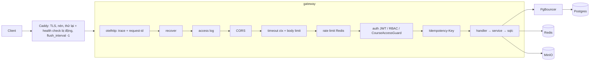
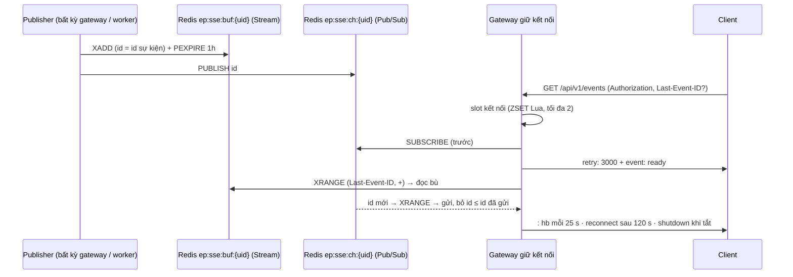

# SRS FEAT-pg-foundation Nền Go: gateway không trạng thái cho mọi phase sau
Phiên bản 1.7 · 2026-10-03 · Trạng thái: **APPROVED** (PM 2026-10-01; Q1–Q3, Q5–Q17 theo mặc định của BA; **Q4 theo góp ý #1 `docs/sprints/2/proposals.md`: route thử khoá bằng build tag `testroutes`, không bằng `APP_ENV`**; v1.2 trả lời câu hỏi QC; v1.3 theo góp ý #3(b): Caddy chỉ có health check bị động; v1.4 theo góp ý #4: literal khoá 31 byte ở US-PG-01 AC2 sửa đúng 31 byte, luật "≥ 32 byte" ở 8.1 giữ nguyên; v1.5 theo góp ý #12: `float64` chỉ cấm cho điểm / tiền, `security` toàn cục + `security: []` hợp lệ, checklist rà mã 9.5; v1.6 theo góp ý #13: `resync` khi `Last-Event-ID` mới hơn id mới nhất hoặc bộ đệm hết hạn; v1.7 theo góp ý #5: image gateway < 80 MB, worker < 40 MB)

Lịch sử phiên bản: v1 (2026-10-02, BA viết). **v1.1 (2026-10-02)** — góp ý #1 `docs/sprints/2/proposals.md` (PM chốt, `ACCEPTED` 01/10): "Khoá bằng **build tag `testroutes`**: file đăng ký route thử có `//go:build testroutes`; Dockerfile có target riêng `gateway-test` (`go build -tags testroutes`); compose dùng target đó qua override `docker-compose.test.yml` cho QC. Binary/image mặc định không chứa route thử. AC18 của US-PG-03 đổi thành: image mặc định → mọi `/api/v1/_test/*` 404; `go tool nm` của binary mặc định không có symbol của gói route thử." Mục đổi: 1 (phạm vi), 2 (ma trận quyền), 4 (FR-35, FR-64, thêm FR-69), 6.3, 8.1 (`APP_ENV`), 8.4–8.5, 9.1, 9.4, 10, 11 (truy vết, rủi ro 11). Hệ quả BA bổ sung (PM xem lại nếu không đồng ý): thêm target `worker-test` vì job `test.progress` / `test.fail` do worker xử lý; binary có tag từ chối khởi động khi `APP_ENV=production`.

**v1.2 (2026-10-02)** — trả lời 43 câu hỏi QC (`docs/sprints/2/qc/questions.md`, cột trả lời; trích "QC questions #n" ở từng chỗ sửa). Không đổi số AC (105) và số FR (69). **CORS (PM chốt):** `Access-Control-Allow-Credentials: true` kèm danh sách origin từ env **`CORS_ORIGINS`** (đổi tên từ `APP_CORS_ALLOWED_ORIGINS`), không bao giờ `*` — mục 4.3 FR-27, 6.7, 8.1 (QC questions #Q-QC-03-1). Mục khác: 3.1 và 3.4 (thứ tự middleware; tên phụ thuộc — #Q-QC-01-6, #Q-QC-01-7, #Q-QC-04-3), 4.1 FR-2 (cấu hình theo vai — #Q-QC-01-1), 6.1 (message 401 cố định, `retry_after` của `SSE_LIMIT_REACHED` — #Q-QC-04-6, #Q-QC-05-5), 6.3 (hành vi route thử: `owner_id`, 201, `steps`/`kind`, lỗi `events` — #Q-QC-03-2…4, #Q-QC-05-1…3), 6.5 (ETag danh sách — #Q-QC-03-6), 6.8 (`resync` hai `reason`, `Last-Event-ID` rỗng — #Q-QC-05-4), 8.1 (`BLOB_*` chỉ gateway, `BLOB_PUBLIC_ENDPOINT` dev, `BCRYPT_COST` — #Q-QC-01-1, #Q-QC-02-5, #Q-QC-04-4), 8.4 (`migrate` có `entrypoint` — #Q-QC-02-1, #Q-QC-07-1), 9.4 (Makefile `lint-depguard-negative` — #Q-QC-06-3). Hệ quả cho dev: `.env.example`, `ARCHITECTURE.md` mục env (dòng `APP_CORS_ALLOWED_ORIGINS`) phải đổi sang `CORS_ORIGINS` (PM / dev đồng bộ; BA không sửa `ARCHITECTURE.md`). Bốn câu để PM chốt, giữ cách hiện hành: #Q-QC-07-2, #Q-QC-07-3, #Q-QC-GATE-1, #Q-QC-GATE-2.

**v1.3 (2026-10-02)** — góp ý #3 mục (b) `docs/sprints/2/proposals.md` (dòng nguồn "research", PM `ACCEPTED` 02/10): "giữ `dynamic a` ở sprint 2, BA sửa chữ spec thành 'health check bị động', ghi Nợ P10/PR: upstream tĩnh + `health_uri /api/v1/healthz`". Lý do (PoC của research): Caddy `dynamic a` không hỗ trợ health check chủ động — gateway treo mà vẫn nhận TCP không bị loại. Đổi: 3.1 (sơ đồ), 4.7 FR-60, 8.2 (đoạn sau Caddyfile), 11.2 rủi ro 4, thêm 11.4 "Nợ"; `US.md` 07-AC6 và "Ngoài phạm vi" của US-PG-07; `QUESTIONS.md` Q11. Không đổi số AC (105), số FR (69) và các phép thử (AC6 chỉ kiểm tắt hẳn một bản). Các mục (a), (c), (d) của #3 là việc của dev (contract test `format: uuid`, ghim `caddy:2.11`, README `~/.testcontainers.properties`), không phải thay đổi spec này.

**v1.5 (2026-10-03)** — góp ý #12 `docs/sprints/2/proposals.md` (PM `ACCEPTED` 03/10; nguồn: QC, `qc/report-GATE-PG.md`; trích phần BA: "**PM chốt**: BUG-PG-5 — luật cấm `float64` áp cho **điểm / tiền**, không áp khoảng cách vector trong `_test.go` → BA sửa AC8; BUG-PG-6 phần `bearerAuth` — khai `security` toàn cục + `security: []` cho endpoint công khai là hợp lệ → BA sửa AC7; `time.Sleep` cho cửa sổ drain tắt êm là ngoại lệ hợp lệ → BA thêm vào checklist"). Không đổi số AC (105). Đổi: US-PG-02 AC8 (cấm `float64` chỉ cho điểm / tiền; `_test.go` tính khoảng cách vector được miễn), US-PG-06 AC7 (`security` toàn cục + `security: []` cho endpoint công khai là hợp lệ), `SRS.md` mục 9.5 (checklist rà mã: `time.Sleep` cho cửa sổ drain khi tắt êm là ngoại lệ), `SRS.md` 8.6 dòng "Dữ liệu" của bảng phi chức năng.

**v1.6 (2026-10-03)** — góp ý #13 `docs/sprints/2/proposals.md` (PM `ACCEPTED` 03/10; nguồn: dev, vòng sửa 1; trích phần (a): "TC-PG05-41 đòi `Last-Event-ID` mới hơn mọi id → **0** `resync`, nhưng góp ý #12 của PM chốt \"gửi `resync` rồi nhận live\" … Dev làm theo #12: `resync` `reason=buffer_exceeded` rồi nhận live (cũng áp cho bộ đệm trống mà client có id — TTL 1 giờ đã hết); QC/BA sửa TC-PG05-41 (kỳ vọng 1 `resync`) và US-PG-05 AC9 thêm \"mới hơn id mới nhất\"" — lý do: "`Last-Event-ID` lớn hơn mọi id là bộ đệm đã bị xoá hoặc id lạ: client cần tải lại, nên `resync` đúng nghĩa hơn bỏ qua"). Không đổi số AC (105). Đổi: US-PG-05 AC9 (thêm hai trường hợp `resync` `reason=buffer_exceeded`: `Last-Event-ID` mới hơn id mới nhất, và bộ đệm đã hết hạn / trống mà client có id; sau `resync` nhận sự kiện live), `SRS.md` 6.8 (thuật toán nối lại), FR-50, bảng nhánh lỗi 3.4. **Không đổi** phần (b) của #13 (Caddy / `X-EP-Draining`): đề nghị PM giao riêng nếu muốn cập nhật `SRS.md` 8.2.

**v1.7 (2026-10-03)** — góp ý #5 `docs/sprints/3/proposals.md` (PM `ACCEPTED (a)`; nguồn: dev, US-P1-02; trích: "Kích thước image: `openai-go/v3` kéo binary gateway từ 26,9 MB lên 47,5 MB (darwin/arm64, `-trimpath -s -w`); image `edupilot-gateway` 66,9 MB, `edupilot-gateway-test` 67,9 MB (worker 39,4 MB — không import cổng LLM)… **ACCEPTED (a)**: ngưỡng image gateway ≤ 80 MB, worker giữ < 40 MB. openai-go nằm trong bảng thư viện (D46); tự viết client = thêm ~400 dòng phải bảo trì để tiết kiệm ~27 MB"). Không đổi số AC (105). Đổi: US-PG-07 AC10 (gateway và `gateway-test` < 80.000.000 byte; worker và `worker-test` < 40.000.000), `SRS.md` FR-62, 8.4 (Dockerfile), 9.3, bảng rủi ro dòng 8, `QUESTIONS.md` Q13. **Lưu ý cho PM:** worker hiện chưa import `internal/llm`; khi P7 (chấm bài) và P8 (ingest) cho worker gọi LLM thì binary worker cũng kéo SDK và sẽ vượt 40 MB — ngưỡng worker cần xem lại ở các phase đó (ghi `proposals.md` khi xảy ra, không nới trước).

Nguồn: `docs/phases/PG.md` (nguồn chính), `docs/sprints/2/plan.md`, `ARCHITECTURE.md` §2 §3 §4 §5 §8, `SYSTEM_DESIGN.md` §2 §3.2 §3.3 §3.4 §5, `DECISIONS.md` D22 D45–D48 D52, luật 10–15 `AGENTS.md`; mã hiện có: `backend-go/` (sprint 1), `docker-compose.local.yml`, `.github/workflows/ci.yml`. Truy vết đầy đủ: mục 11. Story: `US.md` (US-PG-01…07, 105 AC).

## 1. Mục đích và phạm vi

Dựng nền Go viết mới cho **gateway không trạng thái** (D22, D45): khung dịch vụ, tầng dữ liệu, chuẩn HTTP, auth nền, hạ tầng SSE, hợp đồng OpenAPI và hạ tầng chạy; để mọi phase sau chỉ cắm module nghiệp vụ. Phase này **không có tính năng nghiệp vụ**.

**Trong phạm vi:** `cmd/gateway` (+ lệnh con `migrate`, `token`), `cmd/worker`, `internal/platform/{config,log,otel,redis,db,blob,outbox,clock}`, `internal/httpapi` (+ `sse`), `internal/auth`, `internal/jobs`, `internal/store` (sqlc), `internal/contract`, migration `00001`, Caddy, PgBouncer, hai bản gateway, Dockerfile < 40 MB, CI (`sqlc diff`), k6 smoke.

**Ngoài phạm vi:** mọi endpoint nghiệp vụ; vòng đời tài khoản (đăng ký, xác minh, mời, quên mật khẩu, khoá khi dò, refresh, phiên — P2, D36); `llm_*`, gọi LLM (P1); mã hoá AES-GCM (P1); mọi bảng nghiệp vụ (D45); giao diện (PU); `docling-serve`, `mock-graph`; sao lưu, giám sát, vai trò DB riêng (PR); sinh mã từ OpenAPI (`oapi-codegen`).

**Endpoint được phép** (mục 6): `/healthz`, `/api/v1/healthz`, `/api/v1/readyz`, `/api/v1/jobs/{id}`, `/api/v1/events`, và 15 thao tác thử (13 đường dẫn) dưới `/api/v1/_test/` **chỉ có trong binary / image dựng bằng build tag `testroutes`** (`gateway-test`, `worker-test`); binary và image mặc định không chứa chúng.

## 2. Người dùng và quyền

"Người dùng" của spec này là **lập trình viên** (dev, QC) của các phase sau; ở runtime có bốn vai trò JWT (`ADMIN`, `TEACHER`, `TA`, `STUDENT`, `ARCHITECTURE.md` §4).

| Endpoint | Ẩn danh | STUDENT | TA | TEACHER | ADMIN | Ghi chú |
| --- | --- | --- | --- | --- | --- | --- |
| `/healthz`, `/api/v1/healthz`, `/api/v1/readyz` | ✓ | ✓ | ✓ | ✓ | ✓ | Miễn rate limit |
| `GET /api/v1/jobs/{id}` | 401 | chủ job | chủ job | chủ job | mọi job | Người khác → 404 (không lộ tồn tại) |
| `GET /api/v1/events` | 401 | ✓ stream của chính mình | ✓ | ✓ | ✓ | Tối đa 2 kết nối / người |
| `/api/v1/_test/*` | 404 ở binary / image mặc định (route không tồn tại) | — | — | — | — | Chỉ ở `gateway-test`: `whoami`, `items*`, `jobs`, `events`: mọi vai đã đăng nhập; `rbac/admin`: ADMIN; `rbac/staff`: TEACHER, TA; `courses/{id}/ping`: qua `CourseAccessGuard` |
| `gateway migrate`, `gateway token` | lệnh CLI, không phải HTTP | | | | | `token` bị chặn khi `APP_ENV=production` |

Nguyên tắc (D47 mục 6, luật 2): danh tính và vai trò **chỉ lấy từ claim JWT**, không truy DB mỗi request. Hệ quả: đổi vai trò có hiệu lực khi token hết hạn (≤ 15 phút); thu hồi sớm do P2 làm bằng `jti`.

## 3. Luồng chính và các nhánh lỗi

### 3.1 Đường đi một request



Thứ tự middleware cố định (như hình): giới hạn thân (413) chạy **trước** kiểm `Idempotency-Key` (422) và xác thực chạy **trước** RBAC và `CourseAccessGuard` — nên ẩn danh vào route có guard nhận 401, không phải 403. `/healthz` và `/api/v1/healthz` đi qua `recover`, `access log`, nhưng bỏ `rate limit`; chúng không gọi DB/Redis.

### 3.2 Outbox → worker

```mermaid
sequenceDiagram
  participant S as Service (gateway)
  participant DB as Postgres
  participant R as Relay (worker)
  participant ST as Redis Stream outbox.dispatch
  participant K as Consumer (worker)
  S->>DB: BEGIN; ghi dữ liệu + INSERT outbox; COMMIT
  loop mỗi OUTBOX_POLL_INTERVAL
    R->>DB: SELECT … FOR UPDATE SKIP LOCKED (chưa enqueue, đến hạn)
    R->>ST: XADD {outbox_id, topic}
    R->>DB: UPDATE enqueued_at = now(); COMMIT
  end
  K->>ST: XREADGROUP (nhóm "outbox")
  K->>DB: nạp dòng; nếu đã dispatched → XACK + XDEL
  K->>K: handler[topic](payload)
  alt thành công
    K->>DB: dispatched_at = now()
    K->>ST: XACK + XDEL
  else lỗi / panic / topic lạ
    K->>DB: attempts++, next_attempt_at = now()+backoff, enqueued_at = NULL, last_error
    K->>ST: XACK + XDEL
    Note over K,DB: attempts = 4 → dead_at = now(); XADD outbox.dispatch.dead
  end
```

At-least-once: sập giữa lúc handler chạy xong và đánh dấu `dispatched_at` có thể gọi handler hai lần — **handler phải idempotent** (quy ước cho phase sau). Dòng "đã xếp hàng" quá `OUTBOX_STALE_AFTER` mà chưa xong được đặt lại `enqueued_at = NULL`; tin nằm trong PEL quá `OUTBOX_CLAIM_IDLE` được consumer khác `XAUTOCLAIM`.

### 3.3 SSE



### 3.4 Nhánh lỗi

| Tình huống | Hệ thống phản ứng | Dev / client thấy |
| --- | --- | --- |
| Thiếu biến bắt buộc | Thoát mã 1 trước khi mở cổng; log `missing:[…]` (chỉ tên) | Tên biến thiếu |
| Giá trị biến sai | Thoát mã 1; log tên + lý do, không in giá trị | `JWT_SECRET_KEY: cần ≥ 32 byte` |
| DB/Redis chưa lên lúc khởi động | Thử lại mỗi 1 s tới `STARTUP_TIMEOUT` rồi thoát mã 1 nêu tên phụ thuộc (trường log `dependency` = `db` \| `redis`) | Log `warn` `dependency not ready` từng giây |
| DB/Redis mất khi đang chạy | Không thoát; `readyz` 503 `NOT_READY`; rate limit fail-open; endpoint cần Idempotency-Key 503 | `details:{redis:"down"}` |
| Request quá `REQUEST_TIMEOUT` hoặc client ngắt | Huỷ ctx → huỷ truy vấn DB / lệnh Redis | 504 `DEADLINE_EXCEEDED` |
| Thân quá `MAX_BODY_BYTES` | Cắt đọc, đóng kết nối sau trả lời | 413 `PAYLOAD_TOO_LARGE` |
| Token hết hạn / sai | Không truy DB | 401 `TOKEN_EXPIRED` / `TOKEN_INVALID` / `UNAUTHENTICATED` |
| Sai vai trò hoặc ngoài lớp | — | 403 `FORBIDDEN` |
| Quá giới hạn rate | Đếm trên Redis dùng chung | 429 `RATE_LIMITED` + `Retry-After` |
| Gửi đôi `Idempotency-Key` | Trả lại đúng phản hồi cũ | Cùng thân + `Idempotent-Replayed: true` |
| Ghi sai `version` | Không ghi | 409 `VERSION_CONFLICT` + giá trị hiện tại |
| Mở stream thứ 3 | Không mở stream | 429 `SSE_LIMIT_REACHED` |
| Nối lại với `Last-Event-ID` | Đọc bù từ bộ đệm Redis; quá cũ, mới hơn id mới nhất, hoặc bộ đệm hết hạn → một `resync` rồi nhận live | Không mất, không trùng |
| SIGTERM | Ngừng nhận mới, báo `shutdown` cho SSE, chờ request đang chạy | Thoát mã 0 |
| Handler panic | Log stack, trả lỗi chung | 500 `INTERNAL` |
| Outbox handler lỗi | Retry 3 lần (backoff) rồi dead-letter | `attempts=4`, `dead_at`, tin ở `outbox.dispatch.dead` |

## 4. Yêu cầu chức năng

Cột AC trỏ `<story>-AC<n>` trong `US.md`.

### 4.1 Khung dịch vụ (US-PG-01)

| FR | Hệ thống phải… | AC |
| --- | --- | --- |
| FR-1 | Có `backend-go` theo `ARCHITECTURE.md` §2, Go 1.27 (D48): `cmd/gateway` (lệnh con `serve` mặc định, `migrate`, `token`, cờ `-healthcheck`), `cmd/worker` (cờ `-healthcheck`) | 01-AC1, 01-AC12 |
| FR-2 | Đọc cấu hình từ env qua một hàm duy nhất theo vai (`gateway` \| `worker`: tập biến bắt buộc khác nhau, mục 8.1), mặc định dev cho biến không bắt buộc, kiểm lúc khởi động: thiếu biến bắt buộc hoặc giá trị sai (kể cả `BCRYPT_COST` ngoài 4–14, `CORS_ORIGINS` chứa `*`) → thoát mã 1 **trước khi mở cổng**, nêu **tên** biến và lý do, không in giá trị; liệt kê đủ mọi biến thiếu cùng lúc | 01-AC1, 01-AC2 |
| FR-3 | Ghi đúng một dòng `config loaded` (giá trị hiệu lực của biến không bí mật, `db_via`, `"secrets":"[redacted]"`) và dòng `gateway ready` có `startup_ms` | 01-AC3, 07-AC8, 07-AC15 |
| FR-4 | Log `slog` JSON ra stdout; mọi dòng có `time, level, msg, service, instance, trace_id`; `trace_id` 32 hex khác 0 (mọi tiến trình có span gốc: khởi động, dừng, mỗi nhịp worker, mỗi tin consumer); không PII, không thân request, không token | 01-AC4 |
| FR-5 | Dùng OpenTelemetry: tôn trọng `traceparent` đến; tạo span HTTP và span cho mỗi truy vấn DB; xuất OTLP/HTTP khi có `OTEL_EXPORTER_OTLP_ENDPOINT`, không thì chỉ sinh id; `trace_id` có trong mọi thân lỗi và header `X-Request-Id` | 01-AC4, 01-AC5, 03-AC1 |
| FR-6 | Có client Redis dùng chung; dựng khoá bằng một hàm với tiền tố `ep:`; mọi khoá ngoài Stream có TTL (mục 5.6) | 01-AC6 |
| FR-7 | Tắt êm khi SIGTERM/SIGINT: `readyz` 503 ngay → gửi `event: shutdown` cho SSE rồi đóng → `http.Server.Shutdown` chờ request đang chạy tới `SHUTDOWN_TIMEOUT` → đóng pool DB và Redis → thoát 0; quá hạn → cắt, log `warn`, thoát 1 | 01-AC7 |
| FR-8 | Đặt giới hạn: `ReadHeaderTimeout` 5 s, `ReadTimeout` 15 s, `WriteTimeout` 30 s (SSE tự gia hạn từng lần ghi), `IdleTimeout` 60 s, `MaxHeaderBytes` 64 KiB, thân tối đa `MAX_BODY_BYTES`, deadline mỗi request `REQUEST_TIMEOUT` gắn vào `context.Context` của request | 01-AC8 |
| FR-9 | Truyền `context.Context` của request xuống mọi lời gọi ra ngoài (DB, Redis, HTTP, blob); lint `noctx` và `contextcheck` bật | 01-AC9, 07-AC11 |
| FR-10 | Pool pgx có `DB_MAX_CONNS`, `application_name` = `edupilot-<service>`, `MaxConnLifetime` 30 phút, `MaxConnIdleTime` 5 phút, `HealthCheckPeriod` 30 s; lấy kết nối tuân deadline; AfterConnect đăng ký kiểu `vector`/`halfvec` | 01-AC10, 02-AC10 |
| FR-11 | Có tracer pgx: log `warn` `slow query` khi ≥ `DB_SLOW_QUERY_MS` (200) kèm tên truy vấn, `duration_ms`, `trace_id`, **không** giá trị tham số | 01-AC11 |
| FR-12 | Worker: vòng lặp relay + consumer, `/healthz` ở `WORKER_HEALTH_ADDR`, tắt êm trong ≤ 10 s | 01-AC12 |
| FR-13 | Có Makefile `run`, `test`, `lint`, `sqlc`, `migrate` (mục 9.4) | 01-AC13 |
| FR-14 | Chờ DB và Redis tới `STARTUP_TIMEOUT` lúc khởi động; khi đang chạy mà phụ thuộc chết thì không thoát, `readyz` phản ánh và tự hồi phục | 01-AC14 |
| FR-15 | Không để bí mật vào log, `.env.example` hay compose | 01-AC3, 01-AC15 |

### 4.2 Dữ liệu (US-PG-02)

| FR | Hệ thống phải… | AC |
| --- | --- | --- |
| FR-16 | Có migration goose `backend-go/db/migrations/00001_pg_platform.sql` tạo extension `vector`, 3 enum, 5 bảng (mục 5), hàm + trigger; embed vào binary (`backend-go/db/embed.go`); chạy bằng `gateway migrate up|down|status` qua `DATABASE_URL` trực tiếp | 02-AC1, 02-AC6, 02-AC7 |
| FR-17 | `users` ở dạng cuối, 16 cột (mục 5.1) gồm 6 cột P2/P5/P8; ràng buộc từ chối dữ liệu sai bằng đúng SQLSTATE | 02-AC2, 02-AC3 |
| FR-18 | `audit_log` chỉ-thêm (trigger chặn UPDATE/DELETE/TRUNCATE) | 02-AC5 |
| FR-19 | Khoá chính `uuid` mặc định `uuidv7()`; đúng 17 index theo tên (mục 5) | 02-AC4 |
| FR-20 | `down` rồi `up` cho lược đồ giống hệt; `up` lặp lại là no-op; compose có service `migrate` chạy một lần | 02-AC6, 02-AC7 |
| FR-21 | `sqlc.yaml` + `sqlc generate` ra `internal/store`; `sqlc diff` thoát 0; enum thành kiểu Go; không `OFFSET` | 02-AC8, 02-AC9 |
| FR-22 | Ghi sẵn quy ước vector (HNSW, `halfvec`) trong khối chú thích của `00001` và có test chạy thật | 02-AC10 |
| FR-23 | `platform/blob` (minio-go): `Put/Get/Stat/PresignGet/PresignPut/Delete`, TTL tải xuống 5 phút, tải lên 10 phút, `ErrNotFound`, `ErrInvalidKey`; URL ký bằng `BLOB_PUBLIC_ENDPOINT` + `BLOB_REGION` không cần mạng; không bao giờ ghi đĩa cục bộ | 02-AC11, 02-AC12, 07-AC11 |
| FR-24 | `platform/outbox`: ghi dòng outbox trong cùng transaction với nghiệp vụ; relay + consumer `outbox.dispatch` ở worker; khử trùng theo `outbox.id`; 1 lần đầu + 3 lần thử lại (backoff `OUTBOX_RETRY_BACKOFF`) rồi dead-letter `outbox.dispatch.dead`; panic và topic lạ là lỗi; reclaim tin kẹt | 02-AC13…02-AC16 |

### 4.3 Chuẩn HTTP (US-PG-03)

| FR | Hệ thống phải… | AC |
| --- | --- | --- |
| FR-25 | Router `chi` v5 dưới `/api/v1`; middleware theo thứ tự mục 3.1; `X-Request-Id`, `X-Instance-Id` trên mọi response | 03-AC1 |
| FR-26 | `recover`: panic → 500 `INTERNAL` chung, log stack; không nuốt `http.ErrAbortHandler` | 03-AC2 |
| FR-27 | CORS theo `CORS_ORIGINS` (mục 6.7): origin nằm trong danh sách → `Allow-Origin` = origin đó **và** `Allow-Credentials: true`; origin lạ → không có cả hai; không bao giờ `*`; `Vary: Origin` | 03-AC3 |
| FR-28 | Lỗi thống nhất `{code, message, details?, retry_after?, trace_id}` + bảng mã → status (mục 6.1); 404/405 JSON; `message` tiếng Việt, không lộ nội bộ | 03-AC4 |
| FR-29 | Validation (`go-playground/validator`) → 422 `VALIDATION_FAILED` liệt kê mọi lỗi dạng `{field, code, message}`; JSON hỏng 400; trường lạ 422; `Content-Type` sai 415 | 03-AC5 |
| FR-30 | Rate limit trên Redis (mục 5.6): theo IP và theo người dùng, cửa sổ phút, dùng chung giữa các bản; miễn health; fail-open khi Redis chết | 03-AC6, 03-AC7 |
| FR-31 | Helper phân trang con trỏ: mặc định 30, tối đa 100 (vượt → 422), `{items, next_cursor}`, `(created_at DESC, id DESC)`, cursor định dạng mục 6.4, truy vấn khoá-so-sánh-hàng (cấm OFFSET) | 03-AC8…03-AC10 |
| FR-32 | Middleware `Idempotency-Key` (mục 6.6): khoá + thân khớp → phát lại đúng phản hồi; đua → 1 bản ghi; thân khác → 422; thiếu khi bắt buộc → 422; TTL 24 h; dự phòng bảng `idempotency_keys` khi Redis mất; Redis chết → 503 cho endpoint bắt buộc | 03-AC11…03-AC13 |
| FR-33 | Helper khoá lạc quan `version`: `UPDATE … WHERE id AND version RETURNING`; 0 dòng → 409 `VERSION_CONFLICT` kèm `current_version`, `current`, `ETag` | 03-AC14 |
| FR-34 | Helper `ETag` + `If-None-Match`: GET → `W/"v<version>"` (tài nguyên có `version`) hoặc băm thân (danh sách); khớp → 304; `Cache-Control: private, no-cache`; `Vary: Authorization` | 03-AC15 |
| FR-35 | Việc dài: `jobs` + outbox `job.enqueue` cùng transaction → 202 `{job_id}` + `Location`; worker (`worker-test`, dựng bằng tag `testroutes`) chạy `test.progress` / `test.fail`; `GET /api/v1/jobs/{id}`; tiến độ qua SSE `job.progress` | 03-AC16, 03-AC17, 05-AC12 |
| FR-36 | Chỉ chủ job hoặc ADMIN đọc được job; người khác 404 | 03-AC18 |

### 4.4 Auth nền (US-PG-04)

| FR | Hệ thống phải… | AC |
| --- | --- | --- |
| FR-37 | Ký / kiểm JWT HS256 (`golang-jwt/jwt` v5): claims `sub, role, email, jti, iat, nbf, exp, iss="edupilot", aud="edupilot-api"`, hạn `JWT_EXPIRATION`; chỉ chấp nhận HS256 | 04-AC1 |
| FR-38 | Phân loại 401: `TOKEN_EXPIRED`, `TOKEN_INVALID`, `UNAUTHENTICATED` + `WWW-Authenticate`; leeway 5 s theo `platform/clock` | 04-AC2, 04-AC3 |
| FR-39 | Danh tính từ claim, không truy DB mỗi request; `Principal` chỉ qua `context.Context` | 04-AC4, 04-AC12 |
| FR-40 | `auth.RequireRole(roles…)`; role lấy từ claim (claim thắng DB) | 04-AC5, 04-AC6 |
| FR-41 | Khung `CourseAccessGuard(resolver)`: mặc định từ chối tất cả (kể cả ADMIN), id không phải uuid → 404, resolver lỗi → 503, không cache; P2 nối `enrollments` | 04-AC7 |
| FR-42 | `bcrypt` cost 12 (`BCRYPT_COST` 4–14), mật khẩu > 72 byte bị từ chối, so sánh hằng thời gian | 04-AC8, 04-AC9 |
| FR-43 | Không có route `/auth/*`, `/me/*`, `/admin/*` ở PG | 04-AC10 |
| FR-44 | Lệnh `gateway token --role R [--sub UUID] [--ttl D]` in một JWT dev; chặn khi `APP_ENV=production` | 04-AC11 |

### 4.5 SSE (US-PG-05)

| FR | Hệ thống phải… | AC |
| --- | --- | --- |
| FR-45 | `GET /api/v1/events` (header `Authorization`): `text/event-stream`, `retry: 3000`, `event: ready` ≤ 300 ms, không `id` cho `ready` | 05-AC1, 05-AC11 |
| FR-46 | Khung sự kiện `id/event/data`; `id` = id Redis Stream, tăng nghiêm ngặt; `Publisher.Publish` kiểm type và kích thước ≤ 64 KiB | 05-AC2 |
| FR-47 | Heartbeat `: hb` mỗi `SSE_HEARTBEAT` (25 s); đóng sạch khi client ngắt (không rò goroutine, slot, subscription) | 05-AC3, 05-AC4 |
| FR-48 | Tối đa `SSE_MAX_PER_USER` (2) kết nối, đếm chung trên Redis; vượt → 429 `SSE_LIMIT_REACHED` trước khi mở stream; chỗ của gateway chết tự hết sau `SSE_CONN_TTL` | 05-AC5 |
| FR-49 | Stream tối đa `SSE_MAX_DURATION` (120 s) hoặc tới `exp` của token rồi gửi `event: reconnect` và đóng | 05-AC6 |
| FR-50 | Fan-out Redis (Stream bộ đệm + Pub/Sub); `Last-Event-ID` đọc bù không mất, không trùng (subscribe trước, đọc bù sau, loại trùng theo id); id quá cũ / mới hơn id mới nhất / bộ đệm hết hạn / sai định dạng → đúng một `event: resync` rồi nhận live | 05-AC7…05-AC10 |
| FR-51 | Cô lập theo người dùng; không cách nào chọn stream của người khác | 05-AC11 |
| FR-52 | Báo trước khi tắt (`event: shutdown`); Redis chết giữa stream → `event: reconnect` rồi đóng, kết nối mới 503 | 05-AC13, 05-AC15 |
| FR-53 | Đi qua Caddy không bị đệm và không bị nén | 05-AC14 |

### 4.6 Hợp đồng API (US-PG-06)

| FR | Hệ thống phải… | AC |
| --- | --- | --- |
| FR-54 | `backend-go/api/openapi.yaml` là nguồn sự thật của 5 đường dẫn sản xuất; `openapi.test.yaml` mô tả route thử | 06-AC1, 06-AC2 |
| FR-55 | `internal/contract` dựng gateway thật bằng `httptest` và kiểm response khớp spec: status, trường bắt buộc, hình dạng lỗi, hình dạng phân trang, header | 06-AC3 |
| FR-56 | Route thiếu ở spec hoặc spec thừa so với router → test đỏ nêu `METHOD đường-dẫn`; `OPENAPI_PATH` cho phép QC thử bản spec sửa | 06-AC4 |
| FR-57 | Mọi status khai báo đều được gọi thật; có test đối chứng âm; `security` khai đúng | 06-AC5…06-AC7 |
| FR-58 | `getkin/kin-openapi` (D52) chỉ ở test; `depguard` chặn | 06-AC8 |

### 4.7 Hạ tầng chạy (US-PG-07)

| FR | Hệ thống phải… | AC |
| --- | --- | --- |
| FR-59 | Compose có 10 service (mục 8.4); gateway chạy `--scale gateway=2` không tranh cổng | 07-AC1, 07-AC2, 07-AC17 |
| FR-60 | Caddy 2: TLS nội bộ, nén có chọn lọc, `/api` → gateway (cân bằng tải, **health check bị động** — `fail_duration` / `max_fails` + thử lại sang bản khác, không có health check chủ động với upstream `dynamic a`; `flush_interval -1`), `/` → frontend (mục 8.2) | 07-AC3, 07-AC4, 07-AC5, 07-AC6 |
| FR-61 | PgBouncer transaction mode (mục 8.3); runtime qua PgBouncer, migrate trực tiếp; pgx tắt prepared statement ngầm; có test qua PgBouncer thật | 07-AC7…07-AC9 |
| FR-62 | Dockerfile nhiều tầng; image gateway < 80 MB, worker < 40 MB (góp ý #5); non-root, không shell | 07-AC10 |
| FR-63 | Không trạng thái: `read_only` rootfs, không ghi đĩa cục bộ, không biến toàn cục (`gochecknoglobals`) | 07-AC11 |
| FR-64 | CI: `go vet` và `golangci-lint` ở cả hai cấu hình (không tag, `testroutes`), `go test -race -tags testroutes`, `sqlc diff`; nhánh lệch sqlc → đỏ | 07-AC12, 07-AC13 |
| FR-65 | `benchmarks/load/smoke.js` và `benchmarks/reports/pg-baseline.md` | 07-AC14, 07-AC15 |
| FR-66 | Thiếu env trong compose → gateway thoát 1, restart tối đa 3 lần | 07-AC16 |
| FR-67 | Redis AOF + `noeviction`; volume tên cố định | 07-AC18 |
| FR-68 | Cổng nghiệm thu PG chạy trọn trên nhánh `sprint/2-pg` và kết quả dán vào handoff | 07-AC19 |
| FR-69 | Route thử và handler job thử nằm trong gói `internal/testroutes`, chỉ biên dịch khi có tag `testroutes` (`//go:build testroutes`; phía mặc định `//go:build !testroutes` là hàm đăng ký rỗng); Dockerfile có target `gateway-test`, `worker-test`; `docker-compose.test.yml` là override đổi target + image; binary có tag thoát mã 1 khi `APP_ENV=production`; binary / image mặc định không chứa gói (`go tool nm`, chuỗi `/api/v1/_test/`) và trả 404 cho mọi đường dẫn thử | 03-AC18, 06-AC3, 06-AC4, 07-AC20 |

Ghi chú: 02-AC17 (phân quyền của story dữ liệu) là "không áp dụng" — chưa có API nghiệp vụ; ràng buộc an toàn thay thế do 02-AC5, 04-AC8, 03-AC12 đảm nhiệm.

## 5. Dữ liệu

Migration **`backend-go/db/migrations/00001_pg_platform.sql`** (goose; luật 6 của `AGENTS.md`: file mới từ `00001` cho Go — không sửa file đã merge). Một file, `-- +goose Up` / `-- +goose Down`, tạo theo thứ tự: extension `vector` → 3 enum → hàm `set_updated_at()` và `audit_log_block_mutation()` → 5 bảng → index → trigger. `Down` xoá các bảng, trigger, hàm và enum **nhưng giữ extension `vector`** (có thể đã được phần khác dùng). Quy ước chung: khoá chính `uuid NOT NULL DEFAULT uuidv7()` (hàm native PostgreSQL 18, D48; `QUESTIONS.md` Q2); mọi thời điểm là `timestamptz`; tên bảng, cột, enum là snake_case tiếng Anh; **không** dùng `float` cho điểm (chưa có cột điểm ở PG); không có bảng nghiệp vụ (D45).

### 5.0 Enum

| Enum | Giá trị |
| --- | --- |
| `user_role` | `ADMIN`, `TEACHER`, `TA`, `STUDENT` |
| `user_status` | `PENDING_VERIFICATION`, `INVITED`, `ACTIVE`, `DISABLED` (`QUESTIONS.md` Q8) |
| `job_status` | `QUEUED`, `RUNNING`, `SUCCEEDED`, `FAILED` |

### 5.1 `users` — dạng cuối, 16 cột

Các cột dành cho P2 (`email_verified_at`, `failed_logins`, `locked_until`, `status`), P5 (`ics_token`), P8 (`tracking_notice_ack_at`) có sẵn để các phase đó **không phải sửa schema `users`** (ARCHITECTURE §4). PG không có endpoint nào ghi vào bảng này; chỉ test và `gateway token` (không ghi DB) dùng.

| # | Cột | Kiểu | Null | Mặc định | Ghi chú |
| --- | --- | --- | --- | --- | --- |
| 1 | `id` | `uuid` | NOT NULL | `uuidv7()` | PK `users_pkey` |
| 2 | `email` | `text` | NOT NULL | — | Luôn chữ thường: `users_email_lower_chk CHECK (email = lower(email))`; duy nhất `users_email_key` |
| 3 | `password_hash` | `text` | NULL | — | bcrypt; NULL khi tài khoản chưa đặt mật khẩu |
| 4 | `full_name` | `text` | NOT NULL | — | |
| 5 | `role` | `user_role` | NOT NULL | — | |
| 6 | `student_code` | `text` | NULL | — | Chỉ cho `STUDENT`: `users_student_code_role_chk CHECK (student_code IS NULL OR role = 'STUDENT')`. **Không** dùng để nối tài khoản (AGENTS.md "Cấm tuyệt đối") |
| 7 | `email_verified_at` | `timestamptz` | NULL | — | P2 |
| 8 | `failed_logins` | `integer` | NOT NULL | `0` | `users_failed_logins_chk CHECK (failed_logins >= 0)`; P2 |
| 9 | `locked_until` | `timestamptz` | NULL | — | P2 |
| 10 | `status` | `user_status` | NOT NULL | `'INVITED'` | `users_active_password_chk CHECK (status <> 'ACTIVE' OR (password_hash IS NOT NULL AND password_hash <> ''))` |
| 11 | `ics_token` | `text` | NULL | — | Lưu **băm** (AGENTS.md: không lưu token ở dạng rõ); duy nhất khi có giá trị; P5 |
| 12 | `tracking_notice_ack_at` | `timestamptz` | NULL | — | P8 |
| 13 | `last_login_at` | `timestamptz` | NULL | — | P2 |
| 14 | `version` | `integer` | NOT NULL | `1` | Khoá lạc quan (luật 14); `CHECK (version >= 1)` |
| 15 | `created_at` | `timestamptz` | NOT NULL | `now()` | |
| 16 | `updated_at` | `timestamptz` | NOT NULL | `now()` | Trigger `users_set_updated_at` (BEFORE UPDATE → `set_updated_at()`) |

Index (4): `users_pkey` (id) · `users_email_key` UNIQUE (email) · `users_ics_token_key` UNIQUE (ics_token) WHERE ics_token IS NOT NULL · `users_student_code_idx` (student_code) WHERE student_code IS NOT NULL (không UNIQUE: mã SV chỉ duy nhất trong phạm vi lớp / học kỳ, P2 quyết).

### 5.2 `audit_log` — chỉ thêm

| Cột | Kiểu | Null | Mặc định | Ghi chú |
| --- | --- | --- | --- | --- |
| `id` | `uuid` | NOT NULL | `uuidv7()` | PK `audit_log_pkey` |
| `course_id` | `uuid` | NULL | — | NULL cho sự kiện toàn hệ thống; không FK (bảng `courses` do P2 tạo) |
| `actor_id` | `uuid` | NULL | — | NULL = hệ thống; không FK (giữ nguyên khi tài khoản bị xoá) |
| `entity` | `text` | NOT NULL | — | Ví dụ `grade`, `user` |
| `entity_id` | `text` | NOT NULL | — | `text` để chứa cả khoá không phải uuid |
| `action` | `text` | NOT NULL | — | |
| `before` | `jsonb` | NULL | — | |
| `after` | `jsonb` | NULL | — | |
| `trace_id` | `text` | NULL | — | 32 hex, nối với log |
| `created_at` | `timestamptz` | NOT NULL | `now()` | **Không có `updated_at`** (bảng chỉ-thêm; ngoại lệ so với ARCHITECTURE §4 vì dòng không bao giờ đổi) |

Trigger `audit_log_no_update` (BEFORE UPDATE OR DELETE, FOR EACH ROW) và `audit_log_no_truncate` (BEFORE TRUNCATE, FOR EACH STATEMENT) gọi `audit_log_block_mutation()`: `RAISE EXCEPTION 'audit_log is append-only' USING ERRCODE = '42501'`. Ghi chú: `PR` thay bằng quyền DB (`REVOKE`) khi có vai trò riêng (Q9).
Index (4): `audit_log_pkey` · `audit_log_actor_created_idx` (actor_id, created_at DESC, id DESC) WHERE actor_id IS NOT NULL · `audit_log_course_created_idx` (course_id, created_at DESC, id DESC) WHERE course_id IS NOT NULL (luật 13: bắt đầu bằng `course_id`) · `audit_log_entity_idx` (entity, entity_id, created_at DESC).

### 5.3 `outbox`

| Cột | Kiểu | Null | Mặc định | Ghi chú |
| --- | --- | --- | --- | --- |
| `id` | `uuid` | NOT NULL | `uuidv7()` | PK `outbox_pkey`; khoá khử trùng của consumer |
| `topic` | `text` | NOT NULL | — | `^[a-z][a-z0-9_.]{0,63}$` (`outbox_topic_chk`) |
| `payload` | `jsonb` | NOT NULL | `'{}'` | |
| `created_at` | `timestamptz` | NOT NULL | `now()` | |
| `next_attempt_at` | `timestamptz` | NOT NULL | `now()` | Hạn xử lý kế tiếp (backoff) |
| `enqueued_at` | `timestamptz` | NULL | — | Đã `XADD` vào Stream; NULL = chưa xếp hàng (hoặc đã được đặt lại để thử lại) |
| `dispatched_at` | `timestamptz` | NULL | — | Xử lý thành công |
| `attempts` | `integer` | NOT NULL | `0` | Số lần handler đã chạy; chết khi = 4 |
| `last_error` | `text` | NULL | — | Cắt ≤ 1.000 ký tự; không chứa PII |
| `dead_at` | `timestamptz` | NULL | — | Đã dead-letter |
| `updated_at` | `timestamptz` | NOT NULL | `now()` | Trigger `set_updated_at` |

`CHECK (attempts BETWEEN 0 AND 4)`; `CHECK (NOT (dispatched_at IS NOT NULL AND dead_at IS NOT NULL))`.
Index (3): `outbox_pkey` · `outbox_pending_idx` (next_attempt_at, id) WHERE dispatched_at IS NULL AND dead_at IS NULL AND enqueued_at IS NULL · `outbox_stale_idx` (enqueued_at) WHERE dispatched_at IS NULL AND dead_at IS NULL AND enqueued_at IS NOT NULL. (Không có `course_id` đầu index vì outbox là bảng nền tảng không thuộc lớp; ngoại lệ có chủ ý của luật 13.)

### 5.4 `jobs`

| Cột | Kiểu | Null | Mặc định | Ghi chú |
| --- | --- | --- | --- | --- |
| `id` | `uuid` | NOT NULL | `uuidv7()` | PK `jobs_pkey` |
| `kind` | `text` | NOT NULL | — | `test.progress`, `test.fail` ở PG; phase sau thêm (`extract`, `grade`…) |
| `status` | `job_status` | NOT NULL | `'QUEUED'` | |
| `progress` | `smallint` | NOT NULL | `0` | `CHECK (progress BETWEEN 0 AND 100)` |
| `result` | `jsonb` | NULL | — | |
| `error` | `jsonb` | NULL | — | `{code, message}`, không PII |
| `owner_id` | `uuid` | NOT NULL | — | Người tạo (lấy từ JWT). **Không FK** tới `users`: danh tính chỉ là claim; P2 có thể thêm FK |
| `created_at` | `timestamptz` | NOT NULL | `now()` | |
| `updated_at` | `timestamptz` | NOT NULL | `now()` | Trigger `set_updated_at` |
| `finished_at` | `timestamptz` | NULL | — | Có khi `SUCCEEDED` / `FAILED` |

`CHECK ((status IN ('SUCCEEDED','FAILED')) = (finished_at IS NOT NULL))`.
Index (3): `jobs_pkey` · `jobs_owner_created_idx` (owner_id, created_at DESC, id DESC) · `jobs_active_idx` (status, created_at) WHERE status IN ('QUEUED','RUNNING').

### 5.5 `idempotency_keys` (dự phòng bền cho Redis)

| Cột | Kiểu | Null | Mặc định | Ghi chú |
| --- | --- | --- | --- | --- |
| `id` | `uuid` | NOT NULL | `uuidv7()` | PK `idempotency_keys_pkey` |
| `user_id` | `uuid` | NOT NULL | — | |
| `endpoint` | `text` | NOT NULL | — | `METHOD /đường-dẫn-mẫu`, ví dụ `POST /api/v1/_test/items` |
| `key` | `text` | NOT NULL | — | Giá trị header (8–128 ký tự) |
| `request_hash` | `text` | NOT NULL | — | sha256 hex của thân + query chuẩn hoá |
| `status_code` | `smallint` | NOT NULL | — | |
| `response` | `jsonb` | NOT NULL | — | Thân phản hồi (API chỉ trả JSON). Bản Redis giữ **nguyên byte**; bản DB khôi phục tương đương JSON |
| `created_at` | `timestamptz` | NOT NULL | `now()` | |

Ràng buộc: `UNIQUE (user_id, endpoint, key)` tên `idempotency_keys_user_endpoint_key_key`. Index (3): `idempotency_keys_pkey` · `idempotency_keys_user_endpoint_key_key` · `idempotency_keys_created_idx` (created_at) (cho cron dọn > 24 h — phase sau). Không `updated_at` (dòng chỉ ghi một lần).

### 5.6 Khoá Redis

Hằng số trong `internal/platform/redis`; một hàm dựng khoá duy nhất `Key(parts…) string` tiền tố `ep:`. Mọi khoá ngoài Stream có TTL; không khoá nào `-1`.

| Khoá | Kiểu | TTL | Dùng cho |
| --- | --- | --- | --- |
| `ep:idem:{user_id}:{sha256(endpoint)[:16]}:{key}` | String (JSON `{request_hash,status,content_type,body}`) | **24 h** (86.400 s) | Phản hồi đã lưu |
| `ep:idem:{…}:lock` | String `SET NX` | **30 s** | Khoá "đang chạy" |
| `ep:rl:ip:{ip}:{phút-unix}` | String (INCR) | **120 s** | Rate limit theo IP |
| `ep:rl:user:{user_id}:{phút-unix}` | String (INCR) | **120 s** | Rate limit theo người dùng |
| `ep:sse:conn:{user_id}` | ZSET (member = connection_id, score = hạn ms) | **150 s** (`SSE_CONN_TTL`, làm mới mỗi heartbeat) | Đếm kết nối SSE (Lua nguyên tử: xoá member hết hạn → đếm → thêm) |
| `ep:sse:buf:{user_id}` | Stream (`MAXLEN ~ 1000`) | **1 h** (`SSE_BUFFER_TTL`, `PEXPIRE` mỗi `XADD`) | Bộ đệm đọc bù |
| `ep:sse:ch:{user_id}` | Pub/Sub channel | — (không lưu) | Báo "có sự kiện mới" |
| `ep:cache:{…}` | String | **5 phút** mặc định | Quy ước cho cache (PG chưa có người dùng; luật 15: vô hiệu theo sự kiện, TTL chỉ là lưới an toàn; **không** cache điểm / điểm danh) |
| `outbox.dispatch` | Stream, nhóm `outbox` | — (xoá bằng `XDEL` sau `XACK`) | Hàng đợi outbox |
| `outbox.dispatch.dead` | Stream (`MAXLEN ~ 10000`) | — | Dead-letter |
| `jobs.*` | Stream | — | Dành riêng cho việc nặng phase sau |

Quy ước ngoại lệ tên: các Stream ở trên **không** mang tiền tố `ep:` (theo `SYSTEM_DESIGN.md` §3.3). `ep:rl:*` là bộ đếm cửa sổ cố định: biên cửa sổ cho phép tối đa ≈ 2× giới hạn trong khoảnh khắc (đã chấp nhận, nâng lên cửa sổ trượt khi cần).

## 6. API

Mọi đường dẫn nghiệp vụ nằm dưới `/api/v1`; JSON `application/json; charset=utf-8`, UTF-8; thời điểm ISO-8601 UTC (`2026-10-02T08:00:00Z`).

### 6.1 Bảng mã lỗi

Định dạng: `{"code":"…","message":"<tiếng Việt>","trace_id":"<32 hex>","details":…?,"retry_after":<giây>?}`; không trường nào khác. `message` không lộ chi tiết nội bộ (SQL, đường dẫn tệp, tên bảng).

| Status | `code` | Khi nào | `details` |
| --- | --- | --- | --- |
| 400 | `BAD_REQUEST` | JSON hỏng, tham số không đọc được | — |
| 401 | `UNAUTHENTICATED` | Thiếu / sai kiểu header `Authorization` (tên scheme `Bearer` không phân biệt hoa thường). `message` cố định: "Bạn cần đăng nhập để tiếp tục." | — |
| 401 | `TOKEN_EXPIRED` | JWT hết hạn (quá leeway). `message` cố định: "Phiên đăng nhập đã hết hạn. Vui lòng đăng nhập lại." | — |
| 401 | `TOKEN_INVALID` | Chữ ký, thuật toán, `iss`, `aud`, `nbf`, claim sai. `message` cố định: "Phiên đăng nhập không hợp lệ." | — |
| 403 | `FORBIDDEN` | Sai vai trò / ngoài lớp | `{"reason":"role"}` hoặc `{"reason":"course"}` |
| 404 | `NOT_FOUND` | Không có route / tài nguyên / không có quyền biết | — |
| 405 | `METHOD_NOT_ALLOWED` | Sai method (kèm `Allow`) | — |
| 409 | `CONFLICT` | Xung đột chung | — |
| 409 | `VERSION_CONFLICT` | Sai `version` | `{"current_version":n,"current":{…}}` |
| 409 | `IDEMPOTENCY_IN_PROGRESS` | Cùng khoá đang chạy dở (kèm `Retry-After`) | — |
| 413 | `PAYLOAD_TOO_LARGE` | Thân > `MAX_BODY_BYTES` | `{"max_bytes":n}` |
| 415 | `UNSUPPORTED_MEDIA_TYPE` | `Content-Type` ≠ `application/json` | — |
| 422 | `VALIDATION_FAILED` | Lỗi dữ liệu | `[{"field","code","message"}]` |
| 422 | `INVALID_CURSOR` | Cursor sai | — |
| 422 | `IDEMPOTENCY_KEY_REUSED` | Cùng khoá, thân khác | — |
| 422 | `IDEMPOTENCY_KEY_REQUIRED` | Thiếu header ở endpoint bắt buộc | — |
| 429 | `RATE_LIMITED` | Quá hạn mức (kèm `Retry-After`, `retry_after`) | — |
| 429 | `SSE_LIMIT_REACHED` | Quá `SSE_MAX_PER_USER` (kèm `Retry-After: 5`, `retry_after: 5`) | — |
| 500 | `INTERNAL` | Lỗi không lường / panic | — |
| 503 | `SERVICE_UNAVAILABLE` | Phụ thuộc hỏng khi bắt buộc (Redis cho Idempotency, guard resolver, SSE) | — |
| 503 | `NOT_READY` | `readyz` khi DB/Redis hỏng hoặc đang tắt | `{"db":"up|down","redis":"up|down","draining":bool}` |
| 504 | `DEADLINE_EXCEEDED` | Quá `REQUEST_TIMEOUT` hoặc client huỷ giữa chừng | — |

`GET /api/v1/_test/error/{status}` trả mã mặc định của status theo bảng: 400 `BAD_REQUEST`, 401 `UNAUTHENTICATED`, 403 `FORBIDDEN`, 404 `NOT_FOUND`, 405 `METHOD_NOT_ALLOWED`, 409 `CONFLICT`, 413 `PAYLOAD_TOO_LARGE`, 415 `UNSUPPORTED_MEDIA_TYPE`, 422 `VALIDATION_FAILED`, 429 `RATE_LIMITED` (+ `retry_after: 7`), 500 `INTERNAL`, 503 `SERVICE_UNAVAILABLE` (+ `retry_after: 7`), 504 `DEADLINE_EXCEEDED`. Ngoại lệ: 431 do `net/http` trả trước tầng ứng dụng (không có thân JSON; ghi rõ trong `openapi`).

### 6.2 Endpoint sản xuất (5 đường dẫn — bằng với `openapi.yaml`)

| Method + đường dẫn | Quyền | Phản hồi | Lỗi |
| --- | --- | --- | --- |
| `GET /healthz` | Ẩn danh | 200 `{"status":"ok"}` (không gọi DB/Redis; giữ từ FEAT-scaffold) | — |
| `GET /api/v1/healthz` | Ẩn danh | 200 `{"status":"ok"}` | — |
| `GET /api/v1/readyz` | Ẩn danh | 200 `{"status":"ready","db":"up","redis":"up"}`; 503 `NOT_READY` (kể cả khi đang tắt) | 503 |
| `GET /api/v1/jobs/{id}` | Đăng nhập; chủ job hoặc ADMIN | 200 `{id, kind, status, progress, result?, error?, created_at, updated_at, finished_at?}` | 401, 404 |
| `GET /api/v1/events` | Đăng nhập | 200 `text/event-stream` (mục 6.8) | 401, 429, 503 |

Lệnh CLI (không phải HTTP): `gateway serve` (mặc định), `gateway migrate up|down|status`, `gateway token --role R [--sub UUID] [--email E] [--ttl D]`, `gateway -healthcheck` (đã có), `worker`, `worker -healthcheck`.

### 6.3 Endpoint thử — chỉ có trong binary dựng bằng build tag `testroutes`; binary / image mặc định trả **404** (route không tồn tại)

Mô tả trong `backend-go/api/openapi.test.yaml`. Mã nằm trong gói `internal/testroutes`: mọi file có dòng `//go:build testroutes`; `internal/httpapi` chỉ gọi một hàm `registerTestRoutes(r, deps)` có hai bản — bản `//go:build testroutes` đăng ký route, bản `//go:build !testroutes` rỗng — nên binary mặc định **không liên kết** gói (`go tool nm` không có symbol `internal/testroutes`; chuỗi `/api/v1/_test/` không có trong file thực thi). `APP_ENV` **không** mở hay đóng route; ở binary có tag, `APP_ENV=production` bị từ chối lúc khởi động (thoát 1). Build: `go build -tags testroutes ./cmd/gateway ./cmd/worker`; Docker: target `gateway-test`, `worker-test`; chạy bằng `docker compose -f docker-compose.local.yml -f docker-compose.test.yml …` (QC / test; `docker-compose.local.yml` không biết các target này). Lý do (góp ý #1): cấu hình nhầm một biến env ở production không được mở endpoint ghi dữ liệu. Khi khởi động, gói này chạy `CREATE TABLE IF NOT EXISTS _test_items (id uuid PK DEFAULT uuidv7(), name text NOT NULL, version integer NOT NULL DEFAULT 1, owner_id uuid NOT NULL, created_at timestamptz NOT NULL DEFAULT now(), updated_at timestamptz NOT NULL DEFAULT now())` + index `(created_at, id)`; handler job `test.progress` / `test.fail` của worker cũng chỉ có ở `worker-test` (cùng gói `internal/testroutes`).

| # | Method + đường dẫn | Quyền | Dùng để kiểm |
| --- | --- | --- | --- |
| 1 | `GET /api/v1/_test/items?cursor&limit` | đăng nhập; chỉ trả bản ghi có `owner_id` = `sub` của người gọi | Phân trang (6.4), ETag danh sách |
| 2 | `POST /api/v1/_test/items` (`Idempotency-Key` **bắt buộc**) → **201** + `Location: /api/v1/_test/items/<id>` | đăng nhập; `owner_id` = `sub` | Idempotency, validation, 413/415 |
| 3 | `GET /api/v1/_test/items/{id}` | đăng nhập; bản ghi của người khác → 404 | ETag / 304 |
| 4 | `PUT /api/v1/_test/items/{id}` (`version` trong thân hoặc `If-Match`; thiếu → 422 `VALIDATION_FAILED`, `field="version"`) | đăng nhập; bản ghi của người khác → 404 | Khoá lạc quan / `If-Match` |
| 5 | `GET /api/v1/_test/slow?ms=` | ẩn danh | Tắt êm (request chậm) |
| 6 | `GET /api/v1/_test/db-sleep?seconds=` | ẩn danh | Deadline xuống DB |
| 7 | `GET /api/v1/_test/redis-block?seconds=` | ẩn danh | Deadline xuống Redis |
| 8 | `GET /api/v1/_test/panic` | ẩn danh | recover |
| 9 | `GET /api/v1/_test/error/{status}` | ẩn danh | Định dạng lỗi |
| 10 | `GET /api/v1/_test/whoami` | đăng nhập | Danh tính từ claim, không DB |
| 11 | `GET /api/v1/_test/rbac/admin` | ADMIN | RBAC |
| 12 | `GET /api/v1/_test/rbac/staff` | TEACHER, TA | RBAC |
| 13 | `GET /api/v1/_test/courses/{courseId}/ping` | qua `CourseAccessGuard` | Guard |
| 14 | `POST /api/v1/_test/jobs` `{"steps":n,"kind":"test.progress"\|"test.fail"}` — `steps` nguyên 1..100 (mặc định 4), `kind` mặc định `test.progress`; sai → 422 `VALIDATION_FAILED` (`field="steps"` / `"kind"`) | đăng nhập | Việc dài 202 |
| 15 | `POST /api/v1/_test/events` `{"type","data","user_id"?}` — `type` sai định dạng hoặc `data` > 64 KiB (byte) → 422 `VALIDATION_FAILED` (`field="type"` / `"data"`) | đăng nhập; phát cho **chính mình**; `user_id` khác mình: ADMIN được, người khác → 403 `FORBIDDEN` (`details.reason="role"`) | Phát SSE |

### 6.4 Cursor

`?cursor=<c>&limit=<n>`; `limit` mặc định **30**, tối đa **100**, ngoài `1..100` hoặc không phải số → 422 `VALIDATION_FAILED` (`details[0].field="limit"`). Sắp xếp **`(created_at DESC, id DESC)`**. `cursor` = base64url **không đệm** của JSON một dòng `{"v":1,"t":<created_at của dòng cuối, micro-giây kể từ epoch UTC, số nguyên>,"i":"<uuid dòng cuối>"}`, dài ≤ 120 ký tự; coi là mờ với client. Truy vấn: `WHERE (created_at, id) < (to_timestamp($t/1e6), $i) ORDER BY created_at DESC, id DESC LIMIT $limit + 1`; có dòng thứ `limit+1` → `next_cursor` = cursor của dòng thứ `limit`, ngược lại `null`. Sai base64, JSON hỏng, `v` ≠ 1, `t` không phải số, `i` không phải uuid → 422 `INVALID_CURSOR`. Cấm `OFFSET`.

### 6.5 Header chung

| Header | Hướng | Ý nghĩa |
| --- | --- | --- |
| `X-Request-Id` | vào / ra | Giữ nếu hợp lệ (`[A-Za-z0-9._-]{1,64}`), không thì sinh = `trace_id` |
| `traceparent` | vào | W3C trace context |
| `X-Instance-Id` | ra | Tên container (`INSTANCE_ID`, mặc định hostname) |
| `Retry-After` | ra | 429 / 503 / 409 `IDEMPOTENCY_IN_PROGRESS` (giây) |
| `X-RateLimit-Limit`, `X-RateLimit-Remaining` | ra | Trên mọi response bị giới hạn |
| `ETag`, `If-None-Match`, `If-Match` | cả hai | `W/"v<version>"` cho tài nguyên có `version`; cho danh sách: `W/"<base64url 16 ký tự đầu của sha256 toàn bộ byte thân JSON trả về>"` (gồm `items` và `next_cursor`) — đổi khi và chỉ khi thân đổi |
| `Idempotency-Key` | vào | 8–128 ký tự `[A-Za-z0-9._:-]` |
| `Idempotent-Replayed` | ra | `true` khi phát lại |
| `Location` | ra | 202 việc dài: `/api/v1/jobs/<id>` |
| `WWW-Authenticate` | ra | `Bearer realm="edupilot"` (+ `error="invalid_token"` với `TOKEN_*`) |
| `Last-Event-ID` | vào | SSE nối lại |

Rate limit mặc định (Q7): IP **300**/phút, người dùng **600**/phút. IP lấy từ `X-Forwarded-For` **chỉ khi** kết nối đến từ `TRUSTED_PROXY_CIDRS`; ngược lại dùng địa chỉ kết nối. Health được miễn.

### 6.6 Idempotency

Chỉ áp cho handler khai báo `RequireIdempotencyKey()` (ở PG: `POST /api/v1/_test/items`). Khoá logic = `(user_id, endpoint, key)`. Quy trình: (1) tính `request_hash`; (2) `GET ep:idem:…` — có và hash khớp → phát lại (status, `Content-Type`, thân y hệt, `Idempotent-Replayed: true`); hash khác → 422 `IDEMPOTENCY_KEY_REUSED`; (3) không có → `SET …:lock NX EX 30`; thất bại → 409 `IDEMPOTENCY_IN_PROGRESS` + `Retry-After: 1`; (4) kiểm bảng `idempotency_keys` (Redis có thể đã mất) — có → khôi phục vào Redis rồi phát lại; (5) chạy handler; (6) phản hồi `< 500` và ≠ 429 → ghi **Redis + bảng** (`INSERT … ON CONFLICT DO NOTHING`) rồi nhả khoá; 5xx / 429 → chỉ nhả khoá. Redis không phản hồi → 503 `SERVICE_UNAVAILABLE` (fail-closed; quyết định Q6): không bao giờ xử lý mà không có khoá, kẻo ghi đôi.

### 6.7 CORS và ETag

CORS: `Access-Control-Allow-Origin` = đúng origin nếu nằm trong `CORS_ORIGINS` (phẩy ngăn cách; không bao giờ `*`; giá trị `*` trong env bị từ chối lúc khởi động); `Access-Control-Allow-Credentials: true` **chỉ khi** origin nằm trong danh sách (PM chốt; chuẩn bị cho cookie phiên của P2 — token ở PG vẫn đi bằng header `Authorization`); `Vary: Origin`; `Allow-Methods: GET, POST, PUT, PATCH, DELETE, OPTIONS`; `Allow-Headers: Authorization, Content-Type, Idempotency-Key, If-Match, If-None-Match, Last-Event-ID, X-Request-Id`; `Expose-Headers: ETag, X-Request-Id, Retry-After, Idempotent-Replayed`; `Max-Age: 600`. Origin lạ: không có `Allow-Origin` và không có `Allow-Credentials`. Preflight → 204.
ETag trên GET: `Cache-Control: private, no-cache`, `Vary: Authorization`; `If-None-Match` khớp (một giá trị, danh sách, `*`) → 304 thân rỗng + `ETag`.

### 6.8 Giao thức SSE (`GET /api/v1/events`)

Header phản hồi: `Content-Type: text/event-stream`, `Cache-Control: no-cache, no-transform`, `Connection: keep-alive` (HTTP/1.1), `X-Accel-Buffering: no`. Thứ tự byte: `retry: 3000\n\n` → `event: ready\ndata: {"connection_id","server_time"}\n\n` (không `id`) → đọc bù nếu có `Last-Event-ID` → sự kiện trực tiếp. Khung sự kiện: `id: <id Redis Stream>\nevent: <type>\ndata: <JSON một dòng>\n\n`; heartbeat `: hb\n\n`. Sự kiện điều khiển (không `id`): `ready`, `reconnect` (`reason`: `max_duration` | `token_expired` | `upstream_unavailable`), `shutdown` (`reason: server_shutdown`), `resync` (`reason`: `buffer_exceeded` khi `Last-Event-ID` hợp lệ nhưng cũ hơn id đầu của bộ đệm | `invalid_last_event_id` khi sai định dạng). Sự kiện dữ liệu ở PG: `job.progress` (`{job_id,status,progress,result?}`) và `test.*` (chỉ phát được từ `gateway-test`, qua `POST /api/v1/_test/events`). `type` khớp `^[a-z][a-z0-9_.]{0,63}$`; `data` ≤ 64 KiB. Thuật toán nối lại: subscribe `ep:sse:ch:{uid}` **trước**; đọc `XRANGE ep:sse:buf:{uid} (<Last-Event-ID> +`; gửi; mỗi tin Pub/Sub kích hoạt `XRANGE (<id đã gửi cuối> +`; id ≤ id đã gửi bị bỏ. `Last-Event-ID` rỗng hoặc chỉ khoảng trắng = không có (stream bình thường); không khớp `^\d+-\d+$` → `resync` `invalid_last_event_id`; cũ hơn id đầu của bộ đệm khi bộ đệm đã bị cắt (`XINFO STREAM … first-entry`), **hoặc mới hơn id cuối của bộ đệm (`last-generated-id`), hoặc bộ đệm không còn (khoá hết hạn / chưa có) trong khi client có `Last-Event-ID`** → `resync` `buffer_exceeded`; sau mọi `resync` luồng chuyển sang sự kiện live (`XRANGE` kế tiếp bắt đầu từ id cuối bộ đệm hiện tại, hoặc từ `$` khi bộ đệm trống). Token qua query string **không** được hỗ trợ (tránh lọt vào log); `EventSource` gốc không gửi được header nên frontend dùng `fetch` + `ReadableStream` (việc của PU).

## 7. Giao diện

**Không áp dụng — phase hạ tầng, không có màn hình.** Ràng buộc để PU dùng sau: SSE dùng `fetch` + `ReadableStream` với header `Authorization` (6.8); mọi lỗi theo định dạng 6.1 (cột `code` là khoá để PU dịch sang lời văn `DESIGN.md` §13, sinh viên không thấy `code`, `trace_id` chỉ hiện ở "Chi tiết kỹ thuật" của giảng viên / ADMIN). Việc `frontend` gọi gateway qua `https://localhost` thay vì `localhost:8080` là cấu hình (`NEXT_PUBLIC_API_URL`), kiểm ở mục 11 rủi ro 6.

## 8. Phi chức năng, cấu hình và hạ tầng

### 8.1 Biến môi trường

Một nguồn duy nhất: `platform.LoadConfig(getenv)` (mở rộng từ FEAT-scaffold: rỗng sau `TrimSpace` = thiếu; một dòng log liệt kê **mọi** biến thiếu; thoát 1). `.env.example` liệt kê đủ cột "Bắt buộc" và các biến dev đặt sẵn; **không** đặt bí mật thật.

| Biến | Bắt buộc | Mặc định dev (khi trống) | Ý nghĩa / ràng buộc | Dùng bởi |
| --- | --- | --- | --- | --- |
| `DATABASE_URL` | **có** | — | URL Postgres **trực tiếp** (migrate, và là dự phòng của runtime) | gateway, worker, migrate |
| `REDIS_URL` | **có** | — | `redis://host:port/db` | gateway, worker |
| `JWT_SECRET_KEY` | **có** | — | ≥ **32 byte** (HS256); không được là giá trị mẫu của `.env.example` khi `APP_ENV=production` | gateway |
| `BLOB_ENDPOINT` | **có** (gateway); worker: không ở PG | — | `host:port` MinIO nhìn từ container (ví dụ `minio:9000`) | gateway (worker khi phase sau dùng blob) |
| `BLOB_BUCKET` | **có** (gateway); worker: không ở PG | — | Tên bucket (tạo nếu chưa có khi khởi động `APP_ENV` ≠ production) | gateway (worker như trên) |
| `BLOB_ACCESS_KEY` | **có** (gateway); worker: không ở PG | — | | gateway (worker như trên) |
| `BLOB_SECRET_KEY` | **có** (gateway); worker: không ở PG | — | | gateway (worker như trên) |
| `PGBOUNCER_URL` | không | rỗng → dùng `DATABASE_URL` | URL runtime qua PgBouncer; có giá trị thì log `db_via=pgbouncer` | gateway, worker |
| `APP_ENV` | không | `dev` | `dev` \| `test` \| `production` (giá trị khác → thoát 1); chỉ để phân biệt môi trường (log, kiểm bí mật mẫu, chặn `gateway token`), **không** mở / đóng route thử | tất cả |
| `HTTP_ADDR` | không | `:8080` | | gateway |
| `INSTANCE_ID` | không | hostname | `X-Instance-Id`, log `instance` | tất cả |
| `LOG_LEVEL` | không | `info` | `debug` \| `info` \| `warn` \| `error` | tất cả |
| `OTEL_EXPORTER_OTLP_ENDPOINT` | không | rỗng | Rỗng = không xuất, vẫn sinh `trace_id` | tất cả |
| `DB_MAX_CONNS` | không | `10` | 1–100 | gateway, worker |
| `DB_SLOW_QUERY_MS` | không | `200` | | gateway, worker |
| `REQUEST_TIMEOUT` | không | `30s` | Deadline mỗi request | gateway |
| `SHUTDOWN_TIMEOUT` | không | `25s` | | gateway; worker 10 s cố định |
| `STARTUP_TIMEOUT` | không | `30s` | Chờ DB + Redis lúc khởi động | tất cả |
| `MAX_BODY_BYTES` | không | `1048576` (1 MiB) | | gateway |
| `WORKER_HEALTH_ADDR` | không | `:8081` | | worker |
| `CORS_ORIGINS` | không | `http://localhost:3000,https://localhost` | Danh sách origin được phép, phẩy ngăn cách; cấm `*` (thoát 1); kèm `Access-Control-Allow-Credentials: true` (6.7). Thay `APP_CORS_ALLOWED_ORIGINS` | gateway |
| `JWT_EXPIRATION` | không | `15m` | | gateway |
| `BCRYPT_COST` | không | `12` | Nguyên 4–14 (ngoài khoảng / không phải số → thoát 1, không kẹp); production ≥ 10 | gateway |
| `RATE_LIMIT_IP_PER_MIN` | không | `300` | | gateway |
| `RATE_LIMIT_USER_PER_MIN` | không | `600` | | gateway |
| `TRUSTED_PROXY_CIDRS` | không | `127.0.0.0/8,10.0.0.0/8,172.16.0.0/12,192.168.0.0/16` | Chỉ tin `X-Forwarded-For` từ các dải này | gateway |
| `SSE_HEARTBEAT` | không | `25s` | | gateway |
| `SSE_MAX_DURATION` | không | `120s` | | gateway |
| `SSE_MAX_PER_USER` | không | `2` | | gateway |
| `SSE_CONN_TTL` | không | `150s` | | gateway |
| `SSE_BUFFER_MAXLEN` | không | `1000` | | gateway |
| `SSE_BUFFER_TTL` | không | `1h` | | gateway |
| `OUTBOX_POLL_INTERVAL` | không | `500ms` | | worker |
| `OUTBOX_BATCH` | không | `100` | | worker |
| `OUTBOX_RETRY_BACKOFF` | không | `1s,5s,30s` | 3 giá trị = 3 lần thử lại | worker |
| `OUTBOX_CLAIM_IDLE` | không | `60s` | Tin trong PEL quá hạn thì `XAUTOCLAIM` | worker |
| `OUTBOX_STALE_AFTER` | không | `120s` | Phải **>** `OUTBOX_CLAIM_IDLE`; dòng đã xếp hàng quá hạn bị đặt lại | worker |
| `BLOB_USE_SSL` | không | `false` | | gateway, worker |
| `BLOB_PUBLIC_ENDPOINT` | không | = `BLOB_ENDPOINT` khi **không đặt**; `.env.example` và compose đặt sẵn `localhost:9000` cho dev | Host trình duyệt dùng được (`localhost:9000`) | gateway, worker |
| `BLOB_REGION` | không | `us-east-1` | Ký URL không cần gọi mạng | gateway, worker |

Biến chỉ của hạ tầng / kiểm thử (không do `LoadConfig` đọc): `POSTGRES_USER|PASSWORD|DB`, `PGBOUNCER_STATS_USER|PASSWORD`, `TESTCONTAINERS_RYUK_DISABLED`, `DOCKER_HOST`, `OPENAPI_PATH` (test contract), `TEST_ROUTES` (k6), `NEXT_PUBLIC_API_URL`. `APP_ENCRYPTION_KEY` **chưa dùng ở PG** (P1). Hằng cố định: `iss="edupilot"`, `aud="edupilot-api"`, leeway JWT 5 s, `ReadHeaderTimeout` 5 s, `ReadTimeout` 15 s, `WriteTimeout` 30 s, `IdleTimeout` 60 s, `MaxHeaderBytes` 64 KiB.

### 8.2 Caddy (`deploy/caddy/Caddyfile`, mount chỉ-đọc)

```caddyfile
{
	local_certs
	admin off
}

localhost {
	header {
		Strict-Transport-Security "max-age=31536000"
		X-Content-Type-Options nosniff
		-Server
	}

	@api path /healthz /api/*
	handle @api {
		# không có `encode` ở nhánh này: JSON nhỏ và text/event-stream không bị nén / đệm
		reverse_proxy {
			dynamic a gateway 8080 {
				refresh 2s
			}
			lb_policy round_robin
			lb_try_duration 5s
			lb_try_interval 250ms
			fail_duration 10s
			max_fails 1
			flush_interval -1
			transport http {
				dial_timeout 2s
				response_header_timeout 35s
			}
		}
	}

	handle {
		encode zstd gzip
		reverse_proxy frontend:3000
	}
}
```

HTTP `:80` tự chuyển hướng sang HTTPS (hành vi mặc định của Caddy với tên máy chủ). Chứng chỉ do `Caddy Local Authority` cấp; dữ liệu CA nằm ở volume tên cố định `caddy_data` (tránh đổi CA mỗi lần dựng). Client dev dùng `curl -k`. `dynamic a` cho cả hai bản `--scale gateway=2` (Docker DNS trả nhiều A record) và loại container đã dừng sau ≤ 2 s; `lb_try_*` + `fail_duration` bù cho khoảng trễ đó (AC6 là phép thử quyết định; `QUESTIONS.md` Q11 cho phép dev đổi cơ chế khám phá upstream miễn AC đạt). **Giới hạn đã biết (góp ý #3b):** với upstream `dynamic a` Caddy chỉ có **health check bị động** (đếm lỗi kết nối / thất bại thật của request); **không có health check chủ động** (`health_uri`), nên một gateway còn nhận TCP nhưng treo (ví dụ `docker pause`) **không** bị loại khỏi vòng cân bằng — PoC của research đo 101/200 lỗi. Chấp nhận ở PG vì AC6 chỉ đòi tắt hẳn một bản; khắc phục ở Nợ 11.4.

### 8.3 PgBouncer

Image và cách nạp xác thực do dev chọn (`QUESTIONS.md` Q12), cấu hình hiệu lực bắt buộc:

| Khoá | Giá trị | Lý do |
| --- | --- | --- |
| `pool_mode` | `transaction` | Nhiều kết nối ngắn từ 2 gateway + worker dùng chung ít kết nối Postgres (SYSTEM_DESIGN §3.2) |
| `listen_port` | `6432`, chỉ trong mạng compose | 07-AC7 |
| `max_client_conn` | `200` | 3 tiến trình × `DB_MAX_CONNS` 10 = 30, dư địa cho scale |
| `default_pool_size` | `20` | Postgres `max_connections` mặc định 100 |
| `reserve_pool_size` | `5`, `reserve_pool_timeout` 3 s | |
| `query_wait_timeout` | `30` | Bằng `REQUEST_TIMEOUT` |
| `server_lifetime` / `server_idle_timeout` | `1800` / `600` | |
| `auth_type` | `scram-sha-256` | |
| `max_prepared_statements` | `0` | Không dùng prepared statement phía server |
| `ignore_startup_parameters` | `extra_float_digits` | pgx gửi tham số này |
| `stats_users` | `$PGBOUNCER_STATS_USER` | Kiểm bằng `SHOW CONFIG` (07-AC7) |

Phía pgx: `pgx.QueryExecModeExec` hoặc `QueryExecModeSimpleProtocol` cho **mọi** pool qua PgBouncer; cấm `QueryExecModeCacheStatement` / `CacheDescribe`. Kết nối `migrate` đi thẳng `DATABASE_URL` (goose dùng khoá tư vấn session, không an toàn qua transaction pooling). `sqlc` sinh mã `pgx/v5` không phụ thuộc prepared statement.

### 8.4 Compose (`docker-compose.local.yml`) — thay đổi so với sprint 1

| Service | Nội dung | Cổng công bố | Ghi chú |
| --- | --- | --- | --- |
| `postgres` | giữ (`pgvector/pgvector:pg18`) | `5433` | Giữ cho `psql` của dev; AC17 chỉ áp cho gateway/worker/pgbouncer/migrate |
| `redis` | `redis:8` + `--appendonly yes --appendfsync everysec --maxmemory-policy noeviction` | `6380` | volume `redis_data` |
| `minio`, `mailpit` | giữ | giữ | |
| `pgbouncer` | mục 8.3 | **không** | healthcheck `SHOW VERSION` qua stats user |
| `migrate` | image gateway, `entrypoint: ["/gateway","migrate"]`, `command: ["up"]` (nên `docker compose run --rm migrate down` chạy `/gateway migrate down`), `DATABASE_URL` trực tiếp, `restart: "no"` | không | `depends_on: postgres healthy` |
| `gateway` | `build: backend-go --target gateway`, `image: edupilot-gateway`, `read_only: true`, `tmpfs: /tmp`, `restart: on-failure:3`, healthcheck `["/gateway","-healthcheck"]` | **bỏ `8080:8080`** | `depends_on: migrate completed_successfully, pgbouncer healthy, redis healthy, minio healthy`; không `container_name` (để `--scale`) |
| `worker` | `--target worker`, `image: edupilot-worker`, như gateway, healthcheck `["/worker","-healthcheck"]` | không | |
| `caddy` | `caddy:2`, mount Caddyfile `:ro`, volume `caddy_data`, `caddy_config` | **`80:80`, `443:443`** | `depends_on: gateway healthy`, healthcheck `caddy validate` hoặc `wget` đến `localhost` nội bộ |
| `frontend` | giữ (`3000`) | giữ | `NEXT_PUBLIC_API_URL=https://localhost` |

Bí mật: mọi giá trị nhạy cảm trong compose là `${BIEN}` lấy từ `.env.local` (tạo từ `.env.example` bởi `pnpm dev`, như FEAT-scaffold). Không có `python`/`docling` trong compose ở PG.

### 8.5 Dockerfile, CI, k6

`docker-compose.test.yml` (override, không thêm service): với `gateway` đặt `build.target: gateway-test`, `image: edupilot-gateway-test`, `APP_ENV: test`; với `worker` đặt `build.target: worker-test`, `image: edupilot-worker-test`, `APP_ENV: test`; mọi thứ khác (mạng, healthcheck, `depends_on`, `read_only`) kế thừa từ `docker-compose.local.yml`. Dùng: `docker compose --env-file .env.local -f docker-compose.local.yml -f docker-compose.test.yml -p edupilot up -d --build --scale gateway=2 --wait`. Tên image khác nhau để chuyển qua lại giữa chế độ thường và chế độ thử không ghi đè nhau.

Dockerfile `backend-go/Dockerfile`, tầng build `golang:1.27` (`CGO_ENABLED=0`, `-trimpath -ldflags "-s -w"`), tầng chạy `gcr.io/distroless/static-debian12:nonroot` với **bốn** target: `gateway` (copy `/gateway`, `ENTRYPOINT ["/gateway"]`), `worker` (copy `/worker`, `ENTRYPOINT ["/worker"]`) — hai target này dựng **không** tag; `gateway-test` và `worker-test` — cùng tầng chạy nhưng binary dựng bằng `go build -tags testroutes`. Ngưỡng kích thước (góp ý #5): image `gateway` và `gateway-test` < 80.000.000 byte; image `worker` và `worker-test` < 40.000.000 byte (`QUESTIONS.md` Q13).
CI (`.github/workflows/ci.yml`, sửa từ FEAT-ci): job **Go** = `go vet ./...` + `go vet -tags testroutes ./...` → `golangci-lint` (v2.14.0 đã ghim) ở cả hai cấu hình (`--build-tags testroutes` cho lượt hai) → `sqlc diff` (cài `sqlc-dev/setup-sqlc`, phiên bản ghim) → `go test -race -tags testroutes ./...` (runner `ubuntu-latest` có Docker cho testcontainers; gồm `internal/contract` và `TestDefaultBinary_NoTestRoutes` tự dựng bản không tag). Job **Frontend** giữ nguyên. Không secret, không đọc `legacy/`.
k6 `benchmarks/load/smoke.js`:

| Kịch bản | Tải | Ngưỡng (`options.thresholds`) |
| --- | --- | --- |
| `healthz`: `GET /api/v1/healthz` | 20 req/s × 30 s | `http_req_duration{scenario:healthz}: p(95)<300` |
| `readyz`: `GET /api/v1/readyz` | 10 req/s × 30 s | `p(95)<300` |
| `jobs404`: `GET /api/v1/jobs/<uuid lạ>` có `Authorization` | 10 req/s × 30 s | `p(95)<300` (có truy vấn DB qua PgBouncer) |
| `write` (chỉ khi `-e TEST_ROUTES=1`): `POST /api/v1/_test/items` + `Idempotency-Key` duy nhất | 5 req/s × 30 s | `p(95)<500` |
| toàn cục | — | `http_req_failed: rate<0.005`; `checks: rate>0.99` |

Giá trị lấy từ `SYSTEM_DESIGN.md` §5 (đọc p95 ≤ 300 ms, ghi p95 ≤ 500 ms, 5xx < 0,5 %); SSE first-event ≤ 300 ms đo bằng test Go / `curl` (US-PG-05 AC1) vì k6 không có SSE sẵn. Không nới ngưỡng; máy không đạt thì ghi số đo thực vào `benchmarks/reports/pg-baseline.md` cùng lý do (plan sprint 2).

### 8.6 Phi chức năng áp dụng

| Nhóm | Yêu cầu | Kiểm bằng |
| --- | --- | --- |
| Không trạng thái (luật 10) | Gateway/worker chạy `read_only`; không biến toàn cục; phiên = JWT; rate limit, idempotency, ánh xạ, hạn mức = Redis; file = blob + URL ký sẵn | 07-AC11, 07-AC5 |
| Hiệu năng | k6 smoke (8.5); khởi động tới `readyz` 200 ghi số đo; RAM nghỉ ghi số đo | 07-AC14, 07-AC15 |
| Khả dụng | Tắt một trong hai gateway: 0 lỗi sau 6 s, không mất phiên; SSE nối lại không mất sự kiện | 07-AC6, 05-AC13 |
| Phân trang (luật 13) | Cursor `(created_at,id)`, ≤ 100, cấm OFFSET, không N+1 | 03-AC8…10 |
| Idempotency / ghi (luật 14) | `Idempotency-Key`, outbox cùng transaction, `version` → 409 | 03-AC11…14, 02-AC13 |
| Cache (luật 15) | Chỉ quy ước `ep:cache:*` + TTL 5 phút; điểm / điểm danh không cache | 01-AC6 |
| Bảo mật | JWT HS256 cố định thuật toán; không bí mật trong log / compose / repo; bcrypt; token CLI chặn ở production; CORS không `*`; `ics_token` băm | 04-AC1…11, 01-AC3, 07-AC17 |
| Riêng tư | Log không PII (tên, MSSV, email, token, thân request); `last_error` không PII | 01-AC4 |
| Quan sát | `trace_id` trong mọi dòng log, thân lỗi, `X-Request-Id`; truy vấn chậm > 200 ms | 01-AC4, 01-AC5, 01-AC11 |
| Dữ liệu | Migration goose hai chiều giống hệt; `sqlc diff` sạch; không `float64` cho điểm / tiền (khoảng cách vector trong `_test.go` được miễn) | 02-AC6, 02-AC8 |

## 9. Kiểm thử

### 9.1 Chiến lược

- Test Go dùng **container thật** qua `testcontainers-go`: Postgres 18 + pgvector, Redis 8, MinIO, PgBouncer (trước Postgres, transaction mode). Không mock DB/Redis/blob. Không Docker thì test **fail**, trừ `go test -short` (bỏ qua test cần container; `make test` không dùng `-short`).
- Môi trường dev colima: `make -C backend-go test` tự đặt `TESTCONTAINERS_RYUK_DISABLED=true` và `DOCKER_HOST=unix://$HOME/.colima/default/docker.sock` nếu chưa đặt (rủi ro đã ghi ở plan sprint 2).
- Container dùng chung trong một gói test (`TestMain`); mỗi test tự tạo dữ liệu với uuid ngẫu nhiên hoặc schema riêng, chạy song song được, `-race -count=1 -tags testroutes` (test route thử, SSE chéo bản, auth, jobs, contract cần route thử; riêng `internal/contract` và `cmd/gateway` có test chạy **cả không tag** — `TestDefaultBinary_NoTestRoutes`, contract không tag). Đồng hồ và nguồn ngẫu nhiên đi qua `platform/clock` để test hết hạn / TTL không `sleep` thật quá 3 s.
- Không seed dữ liệu nghiệp vụ; người dùng mẫu `U1`, `U2` chỉ là uuid trong JWT (không cần dòng `users`; test về ràng buộc `users` tự `INSERT`).
- E2E Playwright: **không áp dụng** (không có UI). "E2E" của PG là các lệnh `curl`/`k6`/`docker` ghi ở `US.md`, QC gom vào `docs/sprints/2/qc/scripts/`.

### 9.2 Gói test theo story

| Story | Gói / tệp test | Nội dung |
| --- | --- | --- |
| 01 | `internal/platform/{config,log,otel,redis,db}`, `cmd/gateway`, `cmd/worker`, `internal/httpapi` | env, log, trace, TTL khoá, tắt êm, giới hạn, deadline, pool, slow query, worker, readyz |
| 02 | `db` (migration), `internal/store`, `internal/platform/{blob,outbox}` | round-trip goose, ràng buộc `users`, append-only, vector, blob, outbox (đồng thời, retry, dead-letter, reclaim) |
| 03 | `internal/httpapi` (+ `internal/jobs`) | request-id, recover, CORS, định dạng lỗi, validation, rate limit, cursor, idempotency, version, ETag, jobs |
| 04 | `internal/auth` | claims, 401, RBAC, guard, bcrypt, `-race -count=20` |
| 05 | `internal/httpapi/sse`, `internal/jobs` | khung, heartbeat, rò rỉ, giới hạn, `Last-Event-ID`, đua, chéo bản, tắt máy |
| 06 | `internal/contract` | nạp spec, parity route⇄spec, response, security, đối chứng âm |
| 07 | `internal/platform/db` (PgBouncer), lệnh `docker`/`curl`/`k6`/`gh` | transaction mode, hạ tầng chạy, tắt một bản |

### 9.3 Test hạ tầng không viết bằng Go

Bằng lệnh trong `US.md` mục 07: số service, hai bản gateway, Caddy, image gateway < 80 MB và worker < 40 MB, `read_only`, CI (`gh run`), nhánh `ci/sqlc-drift`, k6, thiếu env trong compose.

### 9.4 Makefile (`backend-go/Makefile`)

`run` (gateway), `run-worker`, `build` (`go build ./...`, không tag), `test` (`go test -race -count=1 -tags testroutes ./...` với biến môi trường colima), `lint` (`go vet` + `golangci-lint run`, mỗi lệnh chạy hai lần: không tag và `-tags testroutes`), `lint-depguard-negative` (ca âm: gói tạm `internal/zz_depguard_probe/` import `kin-openapi`, `golangci-lint` phải báo `depguard`, xoá gói tạm, thoát 0 khi lint chặn đúng — US-PG-06 AC8), `sqlc` (`sqlc generate`), `sqlc-check` (`sqlc diff`), `migrate` (`go run ./cmd/gateway migrate up`), `tidy`.

### 9.5 Checklist rà mã sản xuất (QC đọc diff; áp cho mã không phải `_test.go`)

| # | Quy tắc | Ngoại lệ hợp lệ |
| --- | --- | --- |
| 1 | Không ghi đĩa cục bộ (`os.Create`, `os.WriteFile`, `os.OpenFile`, `os.Mkdir*`, `ioutil.WriteFile`) — luật 10, 07-AC11 | không |
| 2 | Không `fmt.Print*` / `println` (dùng `slog`) | không |
| 3 | Không `float64` / `float32` cho **điểm hoặc tiền** (`AGENTS.md` nguyên tắc 5) | `_test.go` tính khoảng cách / độ tương đồng vector; chưa có cột điểm hay tiền ở PG |
| 4 | Không `time.Sleep` — chờ điều kiện bằng `select` với `ctx.Done()` / timer / kênh | **Một** lệnh `time.Sleep(drain)` trong đường **tắt êm**: cửa sổ drain giữa lúc `readyz` báo `draining` và lúc đóng listener (01-AC7, hiện `server.go`); độ dài cấu hình được, có chú thích giải thích tại chỗ. Mọi `time.Sleep` khác là lỗi |
| 5 | Không `context.Background()` trong handler; mọi truy vấn có `ctx`; lỗi bọc `%w` | khởi động / tắt máy ở `cmd/*` |
| 6 | Không log token, mật khẩu, hash, thân request, `Idempotency-Key` | không |

Danh sách này **bổ sung** cho checklist của QC (`docs/sprints/2/qc/tc-GATE-PG.md`, `scripts/diff-review.sh`); QC cập nhật ngoại lệ mục 4 ở đó. Thêm ngoại lệ mới = đề xuất thay đổi spec qua `proposals.md`.

## 10. Câu hỏi mở và quyết định đã chốt

Câu hỏi mở: xem `QUESTIONS.md` (Q1–Q18; **mọi câu đã có phương án mặc định**, dev thi công theo mặc định cho đến khi chủ dự án trả lời; không câu nào chặn việc bắt đầu). Câu hỏi của QC và trả lời: `docs/sprints/2/qc/questions.md`.

Quyết định đã chốt (từ tài liệu nguồn, không hỏi lại): D22 gateway không trạng thái; D45 Go sở hữu nghiệp vụ, PG không tạo bảng nghiệp vụ, hợp đồng API bất biến khi port; D46–D48 phiên bản (Go 1.27, PostgreSQL 18 + pgvector, Redis 8, Caddy 2, MinIO, Mailpit); D47 mục 4 (SSE, max 2 kết nối), mục 6 (JWT claim-only); D51 (CourseAccessGuard); D52 (`getkin/kin-openapi` chỉ cho test); luật 6 (goose), 9–15 `AGENTS.md`; `SYSTEM_DESIGN.md` §5 (SLO); **Q4 = build tag `testroutes` (góp ý #1, PM)**.

## 11. Truy vết, rủi ro, giả định

### 11.1 PRD → FLOWS → phase → US → FR → test

| Nguồn | Nội dung | PG | US | FR | Test chính |
| --- | --- | --- | --- | --- | --- |
| `PG.md` L1 | Khung, config, log, redis, tắt êm, giới hạn, pool, Makefile | L1 (8 mục) | US-PG-01 | FR-1…15 | `cmd/gateway`, `internal/platform/*` |
| `PG.md` L2 | Schema `00001`, ownership, vector, sqlc, migration sạch, blob, outbox | L2 (8 mục) | US-PG-02 | FR-16…24 | `db`, `internal/store`, `platform/{blob,outbox}` |
| `PG.md` L3 | chi, lỗi, rate limit, cursor, idempotency, version/ETag, jobs | L3 (7 mục) | US-PG-03 | FR-25…36 | `internal/httpapi`, `internal/jobs` |
| `PG.md` L4 | JWT, bcrypt, RBAC, guard | L4 (5 mục) | US-PG-04 | FR-37…44 | `internal/auth` |
| `PG.md` L5 | SSE, fan-out, giới hạn, test | L5 (4 mục) | US-PG-05 | FR-45…53 | `internal/httpapi/sse` |
| `PG.md` L6 | OpenAPI + contract | L6 (3 mục) | US-PG-06 | FR-54…58 | `internal/contract` |
| `PG.md` L7 + cổng | Caddy, PgBouncer, audit không trạng thái, image, CI, k6, hai gateway | L7 (4 mục) + cổng | US-PG-07 | FR-59…69 | lệnh trong `US.md` |
| `AGENTS.md` luật 10–15 | Mở rộng cho T1 | — | 01, 03, 05, 07 | FR-6, 24, 30…36, 48, 63 | như trên |
| `PRD.md` §3 | ADMIN không thấy nội dung lớp | — | US-PG-04 AC7 | FR-41 | `internal/auth` |
| `FLOWS.md` F1–F18 | Chưa luồng nào đi trọn ở PG (D45) — PG là điều kiện của mọi luồng; "xong" của PG là cổng nghiệm thu `PG.md` | — | 07-AC19 | — | cổng PG |
| "Bạn tự kiểm" ở `PG.md` | xoá volume + `pnpm dev`; thiếu env; SSE nối lại 10 s; gửi đôi trên hai tab; tắt một trong hai gateway | — | 02-AC7; 01-AC1, 07-AC16; 05-AC7; 03-AC11; 07-AC6, 05-AC13 | — | lệnh trong `US.md` |

### 11.2 Rủi ro

| # | Rủi ro | Hậu quả | Giảm thiểu trong spec |
| --- | --- | --- | --- |
| 1 | PgBouncer transaction mode + pgx tự chuẩn bị statement | Lỗi `prepared statement … already exists` ngẫu nhiên | 07-AC9 chạy qua PgBouncer thật; 8.3 cấm cache statement |
| 2 | Caddy đệm SSE hoặc nén | Sự kiện đến trễ / dồn cục | `flush_interval -1`, không `encode` ở `/api`; 05-AC14 |
| 3 | testcontainers trên colima (Ryuk, socket) | Test Go đỏ vì môi trường | `make test` đặt biến; 9.1 |
| 4 | `dynamic a` của Caddy chỉ có health check bị động: không loại bản chết kịp (≤ 2 s) và **không loại bản treo còn nhận TCP** | Lỗi 5xx khi tắt hẳn một bản; nhiều lỗi khi một bản treo (chưa chết) | `lb_try_*`, `fail_duration`; 07-AC6 (tắt hẳn một bản) là phép thử quyết định; bản treo là Nợ 11.4; Q11 |
| 5 | Ngưỡng k6 không đạt trên máy dev | Cổng đỏ không do code | Ghi số đo thực + lý do; không nới (plan) |
| 6 | Bỏ `8080:8080` làm frontend / lệnh cũ không gọi được gateway | Hỏng tay dev | `NEXT_PUBLIC_API_URL=https://localhost`; mock-ui của sprint 1.5 không gọi gateway; dev kiểm `pnpm -C frontend build` (07-AC19) |
| 7 | `kin-openapi` chưa hỗ trợ đầy đủ OpenAPI 3.1 | Contract test không nạp được spec | 06-AC1 + Q5 (hạ 3.0.3 nếu cần) |
| 8 | Image vượt ngưỡng (gateway 80 MB, worker 40 MB) do OTel + minio-go + pgx + `openai-go/v3` | Cổng L7 đỏ | `-s -w`, distroless static; Q13; worker sẽ vượt 40 MB khi import `internal/llm` (P7 / P8) — xem lại ngưỡng ở phase đó |
| 9 | Bộ đệm SSE Redis 1.000 sự kiện / 1 h chưa đủ cho chat | Client phải `resync` | `resync` là hành vi định nghĩa sẵn (05-AC9); phase P3 chỉnh `SSE_BUFFER_MAXLEN` |
| 10 | Idempotency fail-closed làm endpoint ghi chết khi Redis chết | Ghi không được trong lúc Redis hỏng | Chấp nhận để không ghi đôi (Q6); `readyz` báo `redis:"down"` |
| 11 | Image `-test` (có route thử ghi dữ liệu) bị triển khai nhầm lên production | Endpoint ghi dữ liệu mở ở production | Image mặc định không chứa route (03-AC18, kiểm bằng `go tool nm` + chuỗi); tên image `-test` khác; `docker-compose.local.yml` không tham chiếu target `-test` (07-AC20); binary có tag thoát 1 khi `APP_ENV=production` |

### 11.3 Giả định

- Máy dev chạy colima với ≥ 4 CPU, 8 GB RAM; Docker Compose v2.
- Frontend sprint 1.5 (mock-ui) không phụ thuộc cổng 8080 của gateway.
- `pgvector/pgvector:pg18` có `uuidv7()` native và extension `vector` ≥ 0.8 (có `halfvec`, HNSW); nếu `uuidv7()` không có, dùng hàm SQL tự viết cùng tên trong `00001` (Q2) — 02-AC4 vẫn kiểm `column_default='uuidv7()'`.
- `docs/phases/PG.md` là nguồn chính; mâu thuẫn giữa `PG.md` và spec này → hỏi PM, không tự sửa.

### 11.4 Nợ (ghi vào mục Nợ của `docs/PROGRESS.md` khi dev / PM cập nhật; BA không sửa file đó)

| # | Nợ | Phase | Cách trả |
| --- | --- | --- | --- |
| 1 | Caddy chưa có health check **chủ động** cho gateway; bản treo mà vẫn nhận TCP không bị loại (góp ý #3b) | P10 / PR | Chuyển upstream sang **tĩnh** (`edupilot-gateway-1`, `edupilot-gateway-2`, hoặc danh sách theo số bản) + `health_uri /api/v1/healthz` (`health_interval`, `health_timeout`, `health_status 2xx`); thêm phép thử `docker pause` một bản (≤ 2 % lỗi, 0 lỗi sau cửa sổ loại) vào k6 / script cổng; cân nhắc `readyz` thay `healthz` khi cần loại bản mất DB / Redis |
