# SRS FEAT-prototype-ui Prototype giao diện toàn bộ tính năng
Phiên bản 2 · 2026-10-01 · Trạng thái: DRAFT · v2: mốc thời gian tuần 10, "bây giờ" = 29/10/2026 (proposals #12)

Nguồn: `docs/sprints/1/prototype/plan.md`, `docs/design/DESIGN.md` (§1–§2, §10, §12–§15, §21–§22), `docs/design/INTEGRATION.md` mục 2, `docs/PRD.md` §3–§4, `docs/FLOWS.md`, `docs/DEMO_SCRIPT.md`. Mục 5, 6, 8, 10 rút gọn theo prompt.

## 1. Mục đích và phạm vi
Prototype bấm được trong app Next.js thật (`pnpm dev` → `http://localhost:3000`), phủ mọi route dự định, dữ liệu mô phỏng, đổi được 4 vai, tương tác giả lập bằng trạng thái phía trình duyệt, đi trọn `docs/DEMO_SCRIPT.md` trong **một trình duyệt** bằng cách đổi vai. Phục vụ buổi thuyết trình với thầy hướng dẫn cuối tuần.

Ngoài phạm vi: backend, gọi API, LLM thật, mail thật (bước Mailpit 05:55 của kịch bản thay bằng dòng xác nhận trong app — FR-X7), PWA, chế độ tối, đăng nhập thật, i18n ngoài tiếng Việt, màn tài khoản F1 (`/verify-email`, `/forgot-password`…), màn phase PR (`/settings/privacy`, `/help`, `/admin/audit`, `/admin/health`), `/class/settings`.

Hợp đồng bố cục mỗi route nằm ở `DESIGN.md` §14.x (hoặc `INTEGRATION.md` mục 2 cho route ngoài §14). SRS này **không chép lại** hợp đồng; chỉ ghi dữ liệu mô phỏng, tương tác giả lập, trạng thái phải xem được, và chỗ §14 chưa nói.

## 2. Người dùng và quyền — ma trận vai × route

✓ = mở được · R = mở được, chỉ đọc (không có hành động ghi) · – = màn chặn quyền (FR-X4). Nguồn: PRD §3; chỗ `frontend/src/shared/shell/nav.ts` hiện lệch PRD được ghi ở cột Ghi chú và **phải sửa theo bảng này**.

| Route | SV | TA | GV | Admin | Ghi chú |
| --- | --- | --- | --- | --- | --- |
| `/login` | ✓ | ✓ | ✓ | ✓ | Không cần phiên |
| `/` Hôm nay | ✓ | ✓ | ✓ | ✓ | Nội dung theo vai (§14.1; Admin theo FLOWS F14) |
| `/chat` | ✓ | – | – | – | |
| `/threads`, `/threads/[id]` | ✓ | ✓ | ✓ | – | Xác nhận / Chỉnh sửa / Loại chỉ TA, GV |
| `/practice`, `/practice/[attemptId]`, `/practice/history` | ✓ | – | – | – | |
| `/library` | ✓ | – | – | – | |
| `/calendar` | ✓ | ✓ | ✓ | – | |
| `/me` | ✓ | – | – | – | |
| `/assignments/[id]` | ✓ | – | – | – | |
| `/join`, `/join/[code]` | ✓ | – | – | – | |
| `/inbox` | – | ✓ | ✓ | – | |
| `/students`, `/students/[id]` | – | ✓ | ✓ | – | |
| `/attendance` | – | ✓ | ✓ | – | |
| `/class/members` | – | ✓ | ✓ | – | TA: xem + duyệt yêu cầu; không tạo lại mã, không mời ra (PRD §3). **nav.ts hiện chặn TA → sửa** |
| `/gradebook` | – | R | ✓ | – | TA xem cả lớp (PRD §3), không sửa ô, không `Chốt điểm` |
| `/gradebook/scheme` | – | R | ✓ | – | Chỉ GV `Xác nhận công thức` |
| `/grading`, `/grading/[submissionId]` | – | ✓ | ✓ | – | TA `Duyệt bài`; chỉ GV `Công bố` |
| `/questions` | – | ✓ | ✓ | – | |
| `/documents` | – | ✓ | ✓ | – | |
| `/insights` | – | ✓ | ✓ | – | |
| `/analytics` | – | ✓ | ✓ | – | Mục chi phí: GV thấy, TA không (Q2) |
| `/observability` | – | – | R | ✓ | GV: chỉ số tổng hợp của lớp mình, không mở được nội dung yêu cầu; Admin mở Drawer có nội dung đã che + bắt nhập lý do (PRD M13) |
| `/settings/llm`, `/settings/integrations` | – | – | R | ✓ | GV "Xem" (PRD §3) |
| `/admin/courses`, `/admin/users` | – | – | – | ✓ | |

## 3. Luồng chính và nhánh lỗi

Đường đi kịch bản demo trên prototype (một trình duyệt, đổi vai bằng menu hồ sơ — FR-X2):

```mermaid
flowchart LR
  L[/login/] --> A1[Admin /admin/courses]
  A1 --> T1[GV / + chuông]
  T1 --> D1[SV D /join/BX4P9TW] --> T2[GV /class/members duyệt] --> D2[SV D /]
  D2 --> B1[SV B /chat D1, D2, D3]
  B1 --> T3[GV /inbox Nhận → Gửi trả lời] --> B2[SV B /chat thấy trả lời]
  B2 --> T4[GV /attendance buổi 10] --> B3[SV B /me]
  B3 --> B4[SV B /assignments/bt03 đang chấm] --> T5[GV /grading → Duyệt bài → Công bố] --> B5[SV B /assignments/bt03 có điểm]
  B5 --> T6[GV /gradebook lớp 2 → /gradebook/scheme xác nhận → lớp 1 giải trình] --> T7[GV /insights lớp 1, lớp 2]
```

| Tình huống | Prototype phản ứng | Người dùng thấy |
| --- | --- | --- |
| Mở route sai vai (gõ URL, đổi vai khi đang ở trang không được phép) | Không render nội dung trang | Màn chặn quyền FR-X4 |
| Chưa chọn vai (không có cookie) | Chuyển về `/login` | Màn chọn vai |
| `?state=loading` / `empty` / `error` trên route bất kỳ | Thay vùng nội dung bằng trạng thái tương ứng (FR-X5) | Skeleton đúng hình / rỗng dạy bước kế / lỗi có cách khắc phục |
| Mã tham gia sai (`/join`) | Không tiết lộ lý do | "Mã không hợp lệ hoặc đã hết hạn. Kiểm tra lại với giảng viên." (cùng câu cho mọi trường hợp) |
| Threads: gửi bài có MSSV / tên / điểm cá nhân | Không đăng | Dialog đúng hai lối (FR-S4) |
| Hai người cùng `Nhận` ticket | Nút `Nhận` của ticket mẫu "đã có người nhận" | Dòng "Phạm Quốc Bảo đã nhận lúc 09:12" thay cho nút (409 giả lập) |
| Điểm danh khi mất mạng | Công tắc "Giả lập mất mạng" | "Đang chờ mạng · 2 thay đổi"; bật lại → "Đã lưu 09:24" |
| Duyệt bài lệch > 1 điểm | Thông báo vàng tại tiêu chí | Không chặn `Duyệt bài` |
| Công thức điểm còn mục chưa rõ | `Xác nhận công thức` bị khoá | Lý do hiện khi rê / focus |
| Sửa ô sổ điểm trùng người khác | Ô mẫu có xung đột phiên bản | Dòng "Lê Thu Hà vừa sửa ô này thành 8,0 · Giữ của tôi / Dùng bản mới" (409 giả lập) |

## 4. Yêu cầu chức năng

### 4.1 Bộ dữ liệu mô phỏng chung (khớp `DEMO_SCRIPT.md`)

Mọi dữ liệu nằm ở `frontend/src/mock/*.ts`. Khi `mock/core.ts` (nháp PM) lệch bảng này, **bảng này thắng** vì kịch bản demo là kim chỉ nam (P0 L0).

| Mục | Giá trị |
| --- | --- |
| Bây giờ | Thứ Năm 29/10/2026 09:20 (+07:00), tuần 10, `HK1 2026–2027` (proposals #12, khớp `DEMO_SCRIPT.md`) |
| Học phần | An ninh mạng (giữ mã học phần trong mock; tên hiển thị "An ninh mạng") |
| Lớp 1 | Mã lớp `761987`, mã tham gia `AN7K2MQ`, không bật duyệt, 30 SV, P.302–G2, **Thứ Năm 09:00–11:30**: 15 buổi, buổi n rơi vào 27/08 + 7·(n−1) ngày; buổi 1–9 đã diễn ra, **buổi 10 (29/10) đang diễn ra lúc 09:20**; công thức điểm **đã xác nhận** |
| Lớp 2 | Mã lớp `761988`, mã tham gia `BX4P9TW`, **bật duyệt**, 30 chỗ: 24 đã vào + 3 chờ duyệt + 3 chỗ trống, Thứ Ba 07:00–08:30, "mới nhận": thông báo phân công chưa đọc, việc "Thiết lập lớp mới", công thức **chưa xác nhận** |
| Quy chế lớp 1 | QT 40% / CK 60%; QT = trung bình bài tập đã công bố + điểm cộng; +0,25 mỗi lần phát biểu, trần +1,0; −0,5 mỗi buổi vắng không phép từ buổi thứ 3; làm tròn 0,1 |
| Quy chế lớp 2 (bản nháp trích từ `quy-che-lop2.pdf`) | QT 30% / CK 70%; +0,2 mỗi lần phát biểu, trần +0,6; −0,5 mỗi buổi vắng từ buổi thứ 3; **chưa rõ: quy tắc làm tròn** (một mục duy nhất chặn xác nhận, khớp D5) |
| Giảng viên | TS. Lê Thu Hà — phụ trách cả hai lớp; 1 thông báo chưa đọc "Bạn được phân công lớp An ninh mạng – 761988" kèm `BX4P9TW` |
| TA | Phạm Quốc Bảo — lớp 1 |
| Admin | Đỗ Hoàng Nam |
| Sinh viên A | Nguyễn Minh Trung, `20229001` — **lớp 1 + lớp 2**; chuyên cần 90%, 4 lần phát biểu; sai 4/7 câu "Mật mã đối xứng" gần nhất |
| Sinh viên B | Trần Thu Uyên, `20229002` — lớp 1; vắng buổi 3 (10/09) và buổi 7 (08/10); 3 lần phát biểu (+0,75); BT01 = 7,0, BT02 = 8,0; BT03 nộp muộn 1 ngày, đang chấm |
| Sinh viên C | Lê Quang Huy, `20229003` — lớp 1; vắng 5/9 buổi (bị trừ 1,5), thiếu BT02, nhãn "Cần chú ý" (chỉ GV/TA thấy) |
| Sinh viên D | Phạm Ngọc Linh, `20229004` — **chưa vào lớp nào** |
| 53 SV còn lại | Sinh tất định như `mock/core.ts`; 3 SV (gồm A) học cả hai lớp |
| Bài tập lớp 1 | BT01 "Mô hình đe doạ" (ESSAY, hạn 17/09, đã công bố); BT02 "Tấn công mạng phổ biến" (ESSAY, hạn 01/10, đã công bố); **BT03 "Phân tích một vụ tấn công thực tế"** (ESSAY, hạn 22/10 23:59, cho nộp muộn −0,5/ngày tối đa 2 ngày, rubric 4 tiêu chí × 2,5, chấm nháp xong, chưa công bố); QUIZ01 "Mật mã đối xứng" (tính điểm, đóng 30/10 03:20 — còn 18 giờ). Giữa kỳ tuần 11 (05/11), cuối kỳ tuần 16 |
| Bài BT03 của SV B | AI lượt 1: 2,0 / 1,0 / 2,0 / 2,0 = 7,0; lượt 2 tiêu chí 2 "Phân tích tấn công" = 2,5 → 8,5; **lệch 1,5** → "Cần xem kỹ"; trừ nộp muộn −0,5 |
| Tài liệu | 6 bài giảng (Chương 1–5 + "Modern Network Security Threats"), 1 quy chế trường (`Quyche.pdf`), 1 quy chế môn học lớp 1, 2 đề cũ (`EXAM_PAPER`), 2 đáp án (`ANSWER_KEY` — không bao giờ hiện cho SV); lấy tên từ `seed/documents/` |
| Ngân hàng câu hỏi | 80 đã duyệt + 20 chờ duyệt |
| Threads lớp 1 | 12 thread, 2 ghim; thread "CBC khác ECB ở điểm nào?" có câu trả lời AI `Chờ xác nhận`; 1 thread đã xác nhận |
| Ticket (Hộp thư) | 5 mở sẵn (tuổi 26 phút, 3 giờ, 1 ngày, 2 ngày, 3 ngày 4 giờ — ticket cuối nổi đầu "Hôm nay" vì > 72 giờ) + 1 "đã có người nhận"; ticket D3 sinh mới khi SV B hỏi |
| Insights | Lớp 1: chủ đề A "Mật mã đối xứng (AES, CBC)", B "Hàm băm và chữ ký số" đứng đầu; lớp 2: chủ đề C "Tường lửa và phân đoạn mạng" đứng đầu |

Câu nhập nguyên văn D1–D5 lấy đúng `DEMO_SCRIPT.md` mục 3 với `{HO_TEN_B}` = Trần Thu Uyên, `{MSSV_B}` = 20229002, `{HO_TEN_C}` = Lê Quang Huy.

Điểm tính trong prototype: cộng / nhân bằng số nguyên phần trăm (hai chữ số thập phân), làm tròn nửa lên ở bước cuối, hiển thị dấu phẩy. Giá trị phải ra đúng:
- QT SV B lúc 09:20 (BT01, BT02 + 0,75): **8,3**.
- Sau bước điểm danh (+0,25 → trần 1,0): **8,5**.
- Sau công bố BT03 = 8,5 (9,0 − 0,5): TB(7,0; 8,0; 8,5) = 7,83 + 1,0 → **8,8**.
- What-if `/me`: CK = 8,0 → 0,4 × 8,8 + 0,6 × 8,0 = **8,3**.

### 4.2 Yêu cầu chung (mọi US)

| FR | Prototype phải… | AC |
| --- | --- | --- |
| FR-X1 | `/login`: chọn một trong 4 vai; vai Sinh viên chọn tiếp A / B / C / D (tên + mô tả một dòng). Lưu vai vào cookie `ep_demo_role`, người vào `ep_demo_person`, lớp vào `ep_demo_course` | 00-AC1 |
| FR-X2 | Menu hồ sơ ở thanh trên có `Đổi vai` (mở lại lựa chọn của `/login` ngay tại chỗ) và `Đặt lại dữ liệu demo` | 00-AC2 |
| FR-X3 | Trạng thái giả lập (ticket mới, điểm danh, bài đã duyệt / công bố, công thức đã xác nhận, D đã vào lớp…) lưu ở `localStorage` dưới một khoá duy nhất `ep_demo_state`, nên đổi vai vẫn thấy hệ quả của vai trước. `Đặt lại dữ liệu demo` xoá khoá đó. Không lưu gì giống token | 00-AC2 |
| FR-X4 | Route sai vai: màn chặn quyền trong khung app, tiêu đề "Bạn không có quyền mở trang này", một câu lý do theo vai ("Trang này dành cho giảng viên và trợ giảng."), nút `Về Hôm nay`. Điều hướng của vai không hiện route bị chặn | mọi US-AC phân quyền |
| FR-X5 | Mọi route nhận `?state=loading|empty|error` để minh hoạ: loading = skeleton đúng hình (§10.13), empty = câu dạy bước kế + một hành động, error = vấn đề + cách khắc phục (§15) + `Thử lại` (bỏ tham số) | mọi US-AC nhánh lỗi |
| FR-X6 | Dải "Bản mô phỏng · dữ liệu giả" cố định, kín đáo (chữ phụ, không đỏ) ở chân sidebar / đầu trang trên điện thoại | 00-AC1 |
| FR-X7 | Không gọi mạng ra ngoài trừ font; không `fetch`; mail thay bằng dòng xác nhận tại chỗ "Đã gửi thư thông báo tới email của sinh viên (mô phỏng)" | 00-AC3 |
| FR-X8 | Bộ chọn lớp: GV thấy lớp 1, lớp 2, "Tất cả lớp của tôi" + "Quản lý lớp này"; SV A thấy 2 lớp; SV B, C 1 lớp; SV D không có lớp → "Hôm nay" là ô nhập mã. Đổi lớp làm mọi màn đổi dữ liệu theo lớp | 00-AC4 |
| FR-X9 | Chữ "chảy" (stream) dùng `useStreamedText`, tôn trọng `prefers-reduced-motion` (hiện ngay toàn văn) | 01-AC2 |
| FR-X10 | Chỉ token `--ep-*` + primitive `frontend/src/shared/ui`; không thư viện mới ngoài `lucide-react`; CSS Modules | 00-AC3 |

### 4.3 US-PROTO-01 — Sinh viên

| Route | Hợp đồng | Dữ liệu mô phỏng | Tương tác giả lập | Trạng thái phải xem được |
| --- | --- | --- | --- | --- |
| `/` (SV) | §14.1 Student | A: "Ôn lại Mật mã đối xứng — bạn sai 4/7 câu gần nhất · 15 phút"; B: "QUIZ01 đóng sau 18 giờ — bạn chưa làm · 20 phút"; dòng thời gian hôm nay: buổi 10 lớp 1 09:00–11:30 P.302 (đang diễn ra), hạn QUIZ01; học dở: thread / chat gần nhất. D: ô nhập mã thay khuyến nghị | Bấm khuyến nghị → đúng màn (`/practice/[attemptId]` hoặc QUIZ01); D nhập mã → `/join/[code]` | Rỗng: "Hôm nay bạn không có việc gấp" + `Luyện đề`; lỗi chuẩn |
| `/chat` | §14.2 | Lịch sử 4 phiên (ẩn ở 375 px); phiên mới trống | **D1** → dòng "Đã ẩn 2 thông tin cá nhân trước khi gửi cho AI · `Tìm hiểu`" (mở giải thích ngắn tại chỗ) → trả lời chảy ~3 s: "Bạn đã vắng 2 buổi (10/09, 08/10) và được cộng 0,75 điểm cho 3 lần phát biểu. Vắng thêm 1 buổi không phép sẽ bị trừ 0,5 điểm." + khối gọn (bảng 2 dòng: Vắng 2 / Phát biểu 3 · +0,75) + `Nguồn tham khảo (2)` mở ngay dưới (Quy chế môn học tr. 2; Sổ điểm danh lớp 761987) + `Hữu ích` / `Không hữu ích` / `Nhờ giảng viên hỗ trợ`. Không hiện chuỗi `[[SV_1]]`. **D2** → "Mình chỉ trả lời được thông tin của chính bạn. Nếu cần trao đổi về bạn khác, hãy hỏi giảng viên." **D3** → "AI chưa đủ chắc chắn về câu này" + tự chuyển giảng viên, chỗ nút thay bằng "Đang chờ giảng viên · vừa gửi" (Q1); ticket xuất hiện ở `/inbox` của GV. Sau khi GV trả lời: tin trả lời có nhãn "Giảng viên Lê Thu Hà" + `Đã rõ` → "Câu hỏi đã đóng". Câu khác D1–D3 → câu trả lời trung tính "Bản mô phỏng chỉ có câu trả lời cho các câu trong kịch bản demo." Đang gõ có MSSV/tên → dòng `PIIProtectionNotice` phía trên composer (INTEGRATION #3) | Lỗi gửi: tin giữ nguyên trong composer + `Gửi lại` (không mất chữ) |
| `/threads` | §14.3 | 12 thread lớp 1 (tuần, chủ đề, trạng thái trả lời, hoạt động gần nhất), 2 ghim | Soạn bài có MSSV / "điểm của em" → **Dialog đúng hai lối** `Chuyển sang chat riêng` (mở `/chat` mang bản nháp) / `Ẩn thông tin rồi đăng` (đăng bản đã thay "[đã ẩn]"); bài sạch → đăng ngay, AI trả lời `Chờ xác nhận` sau ~2 s | Rỗng: "Chưa có câu hỏi nào trong tuần này" + `Đặt câu hỏi` |
| `/threads/[id]` | §14.4 | Thread "CBC khác ECB ở điểm nào?": nội dung, câu AI `Chờ xác nhận` có nguồn; một thread khác có câu "Đã được giảng viên xác nhận" | SV: `Báo cáo` (chọn lý do) → "Đã gửi báo cáo"; sửa / xoá bài của mình | Thread không tồn tại → rỗng + `Về Threads` |
| `/practice` | §14.18 | Khối khuyến nghị theo lỗi gần đây; `Theo chủ đề` / `Thi thử`; lượt dở | Chọn chủ đề → tạo lượt → `/practice/[attemptId]` | Rỗng (chưa luyện lần nào) |
| `/practice/[attemptId]` | §14.19 | 10 câu chủ đề Mật mã đối xứng (trắc nghiệm + 1 trả lời ngắn); QUIZ01 dạng tính điểm | Theo chủ đề: chọn đáp án → phản hồi ngay + giải thích có nguồn. QUIZ01: không phản hồi, có giờ, ghi chú "Trong lúc làm bài, Chat riêng chỉ trả lời câu hỏi thủ tục"; `Nộp bài` qua xác nhận | Hết giờ → tự nộp, báo tại chỗ |
| `/practice/history` | §14.20 | 6 lượt theo thời gian + tóm tắt chủ đề yếu | Bấm lượt → xem lại | Rỗng |
| `/library` | §14.15 | Chỉ tài liệu `visible_to_students`: 6 bài giảng, quy chế trường, 2 đề cũ; **không có ANSWER_KEY** | Tìm kiếm lọc tại chỗ; `Xem` mở chi tiết; `Hỏi AI về tài liệu` → `/chat` có ngữ cảnh tài liệu; đề cũ có `Luyện đề này` | Không có kết quả tìm |
| `/calendar` | §14.16 | Buổi học, hạn BT/QUIZ01, giữa kỳ (tuần 11, 05/11), cuối kỳ (tuần 16) | Tuần / Tháng / Danh sách (SegmentedControl); 375 px mặc định Danh sách; `Thêm vào lịch` → "Đã sao chép link lịch (mô phỏng)" | Rỗng tuần không có sự kiện |
| `/me` | §14.9 | B: câu nhận định "Điểm quá trình hiện tại 8,3 (tạm tính)"; giải trình tuyến tính TB bài tập 7,5 + cộng 0,75 = 8,25 → 8,3; chuyên cần 2 vắng / 9 buổi; bài sắp tới QUIZ01, giữa kỳ 05/11; thời gian học tuần — xu hướng nhỏ ở cuối. Dòng "Điểm chính thức nằm ở hệ thống quản lý đào tạo của trường". **Không** nhãn rủi ro, ghi chú, điểm nháp | What-if tại chỗ "Nếu cuối kỳ được [ 8,0 ], điểm học phần sẽ là 8,3" cập nhật khi gõ; số ngoài 0–10 → báo lỗi tại ô. SV A chọn lớp 2 → "Lớp này chưa có công thức điểm chính thức" thay phần giải trình | Lỗi chuẩn |
| `/assignments/[id]` | INTEGRATION mục 2 | BT03 của B: đã nộp 23/10 08:10, nhãn "Nộp muộn 1 ngày", file `bt03-tran-thu-uyen.pdf` | Trước công bố: "Đang chấm" (không số). Sau khi GV công bố: điểm 8,5, nhận xét theo 4 tiêu chí, mỗi tiêu chí trích một đoạn bài của B; `Yêu cầu xem lại` (trong 7 ngày) mở form chọn tiêu chí + lý do → "Đã gửi yêu cầu". QUIZ01 → nút làm bài | Bài không tồn tại / không thuộc lớp → rỗng |
| `/join`, `/join/[code]` | INTEGRATION mục 2 | Mã `BX4P9TW` → xem trước: An ninh mạng · 761988 · TS. Lê Thu Hà · HK1 2026–2027 | `Tham gia lớp` → "Đã gửi yêu cầu, chờ giảng viên duyệt"; sau khi GV duyệt, D thấy lớp trong bộ chọn và "Hôm nay" bình thường. `AN7K2MQ` → vào ngay. Mã sai → câu chung (mục 3) | Nhập sai 5 lần → "Thử lại sau 10 phút" |

### 4.4 US-PROTO-02 — Giảng viên: vận hành lớp

| Route | Hợp đồng | Dữ liệu mô phỏng | Tương tác giả lập | Trạng thái phải xem được |
| --- | --- | --- | --- | --- |
| `/` (GV/TA) | §14.1 Teacher | "6 việc cần xử lý hôm nay" xếp theo FLOWS F14: ticket chờ 3 ngày 4 giờ (đầu), điểm danh buổi 10 lớp 761987 đang diễn ra, BT03 có 4 bài "Cần xem kỹ", 1 câu AI chờ xác nhận, "Thiết lập lớp mới — 761988" (chia sẻ mã → tải quy chế → tạo lịch buổi học → tải tài liệu), 3 yêu cầu vào lớp chờ duyệt; mỗi việc ghi tên lớp; "Lớp cần chú ý" hẹp (C + 2 SV khác); dải lịch sắp tới | Bấm việc → đúng màn; việc đã xử lý biến khỏi danh sách | Rỗng: "Không còn việc cần bạn quyết định" |
| `/inbox` | §14.5 | 5 ticket mở + 1 đã có người nhận + ticket D3 (khi có); hàng: tên SV, câu ngắn, tuổi, trạng thái, lý do ("Độ tin cậy 0,42 < 0,80") | `Nhận` → Claimed tên mình; soạn D4 → `Gửi trả lời` → Answered + dòng FR-X7; tuỳ chọn `Lưu thành tri thức`; ticket "đã có người nhận" → dòng 409 (mục 3). 375 px: danh sách → chi tiết | Lọc Open rỗng: "Không còn câu hỏi đang chờ" |
| `/students` | §14.6 | 30 SV lớp 1 (hoặc theo lớp chọn); chip `Cần chú ý` (C + 2), `Vắng nhiều`, `Điểm giảm`, `Ít hoạt động` | Tìm theo tên / MSSV; chip lọc; bấm hàng → `/students/[id]` (giữ vị trí khi quay lại) | Không khớp tìm kiếm |
| `/students/[id]` | §14.7 | C: câu rủi ro "Vắng 5/9 buổi, đã bị trừ 1,5 điểm; thiếu BT02"; tab Tổng quan / Chuyên cần / Điểm / Hoạt động học / Ghi chú; ghi chú "Chỉ giảng viên/TA thấy" | `Thêm ghi chú` → thêm tại chỗ + Hoàn tác; `Nhắn riêng` mở ticket chiều ngược (dòng xác nhận) | SV không thuộc lớp → rỗng |
| `/attendance` | §14.8 + INTEGRATION #1 | Buổi 10 lớp 1 hôm nay 29/10 09:00–11:30, 30 SV mặc định Có mặt; bộ chọn buổi 1–15 (1–9 đã điểm danh) | Bàn phím: ↑/↓ chọn hàng, `1` Có mặt, `2` Muộn, `3` Vắng phép, `4` Vắng, `P` +phát biểu (+0,25); chạm trên điện thoại (vùng ≥ 44 px, hàng có kẻ, không card); mỗi thay đổi hiện "Đã đánh vắng · Hoàn tác" 5 s và trạng thái lưu "Đã lưu 09:21"; công tắc "Giả lập mất mạng" → "Đang chờ mạng · n thay đổi" rồi tự đồng bộ; `Lưu điểm danh` → "Đã hoàn tất buổi 10 · 27 có mặt, 1 muộn, 2 vắng"; phát biểu của B làm `/me` của B lên 8,5 | Buổi tương lai: "Buổi này chưa diễn ra" |
| `/class/members` | INTEGRATION mục 2 | Lớp 2: 24 thành viên, 3 chờ duyệt (+ D nếu đã gửi); mã `BX4P9TW`, bật duyệt | `Duyệt` / `Từ chối` tại hàng + Hoàn tác; GV: `Tạo lại mã` (qua xác nhận: "mã cũ vô hiệu ngay") → mã mới, `Sao chép link`; TA không có tạo lại mã / mời ra | Không có yêu cầu chờ |

### 4.5 US-PROTO-03 — Đánh giá

| Route | Hợp đồng | Dữ liệu mô phỏng | Tương tác giả lập | Trạng thái phải xem được |
| --- | --- | --- | --- | --- |
| `/gradebook` | §14.10 | Lớp 1: 30 hàng; cột BT01, BT02, BT03 (trống tới khi công bố), cộng / trừ, QT tạm tính, CK (trống), trạng thái; dòng "điểm chính thức nằm ở hệ thống quản lý đào tạo của trường". Lớp 2: banner công thức chưa xác nhận, `Chốt điểm` khoá kèm lý do | Sửa ô tại chỗ (Enter xuống, Tab sang) + ô mẫu xung đột 409; mở giải trình hàng B (khớp 4.1); `Xuất XLSX` trong menu → "Đã tạo file sổ điểm (mô phỏng)"; `Chốt điểm` lớp 1 mở `ConfirmIrreversible` nêu hậu quả bằng số ("Chốt 30 sinh viên; 30 chưa có điểm cuối kỳ") và **không cho chốt khi thiếu CK** | Lớp chưa có điểm |
| `/gradebook/scheme` | §14.11 | Lớp 2: bản nháp 4.1, mỗi mục cạnh trích dẫn có số trang; mục "chưa rõ: làm tròn" | Điền "Làm tròn đến 0,1" → mục hết chặn → `Xác nhận công thức` (sticky) mở xác nhận nêu hậu quả → CONFIRMED → `/gradebook` lớp 2 hết banner, `Chốt điểm` mở. TA: xem, không có nút xác nhận | Chưa tải quy chế: rỗng + `Tải quy chế` (tải giả lập có tiến độ → bản nháp) |
| `/grading` | §14.12 + tab Bài tập (INTEGRATION mục 2) | Hàng chờ chấm: 28 bài BT03, lọc mặc định `Cần xem kỹ` + `Chưa duyệt` (4 bài, B đầu tiên); tab Bài tập: BT01–BT03, QUIZ01, `Tạo bài tập` (form tại chỗ, lưu nháp) | Chọn bài đã duyệt → `Công bố` (chỉ GV, qua xác nhận) → bài đã công bố, sổ điểm có BT03; TA thấy "Chỉ giảng viên công bố điểm" | Lọc rỗng |
| `/grading/[submissionId]` | §14.13 | Bài B (văn bản 2 trang) bên trái; bên phải 4 tiêu chí với điểm AI, đoạn trích, nhận xét | Thông báo vàng ở tiêu chí 2 "Hai lượt chấm lệch 1,5 điểm"; sửa điểm (bước 0,25) → tổng tính lại ngay; sửa nhận xét; dòng trừ nộp muộn −0,5; `Duyệt bài` → đã duyệt, quay về hàng chờ giữ vị trí | Bài không tồn tại |
| `/questions` | §14.17 | 100 câu (80 duyệt, 20 chờ); lọc trạng thái, chủ đề, độ khó, loại, nguồn | Mở Drawer câu → `Duyệt` / `Chỉnh sửa` / `Loại` (overflow) + Hoàn tác; `Tạo câu hỏi` mở luồng riêng (giả lập "đang tạo" rồi thêm 5 câu chờ duyệt) | Lọc rỗng |
| `/documents` | §14.14 | 12 tài liệu (4.1) với loại, tuần, dùng cho AI, hiện cho SV, trạng thái, ngày | Dropzone tại chỗ: tải → tiến độ → READY; file mẫu "scan-khong-co-chu.pdf" → FAILED "File không có lớp chữ, không đọc được"; `ANSWER_KEY` ghi rõ "Không hiển thị cho sinh viên · Không dùng cho AI của sinh viên"; bật / tắt cờ tại chỗ + Hoàn tác | Rỗng: "Chưa có tài liệu" + dropzone |

### 4.6 US-PROTO-04 — Hiểu lớp + hệ thống

| Route | Hợp đồng | Dữ liệu mô phỏng | Tương tác giả lập | Trạng thái phải xem được |
| --- | --- | --- | --- | --- |
| `/insights` | §14.21 | Lớp 1: báo cáo 22/10; chủ đề A, B đầu (lý do, 5 tín hiệu, 3–5 câu mẫu đã ẩn danh); một chủ đề "dưới 3 sinh viên hỏi — không hiện câu mẫu"; mục "Tài liệu chưa đề cập". Lớp 2: chủ đề C đầu | `Tạo báo cáo mới` → tiến độ ~3 s → báo cáo 29/10; `Tạo thread ghim` → thread ghim mới trong `/threads` lớp 1; `Tạo buổi ôn tập` → sự kiện trong `/calendar` | Chưa có báo cáo: rỗng + `Tạo báo cáo mới` |
| `/analytics` | §14.25 | Hoạt động học, hỗ trợ (ticket, thời gian trả lời), bảo vệ thông tin cá nhân, chất lượng chấm (tỷ lệ GV sửa điểm AI), chi phí (Q2) | Đổi khoảng 7 / 30 ngày | Rỗng |
| `/observability` | §14.22 | Dải trạng thái: 1.284 yêu cầu hôm nay, p95 3,1 s, lỗi 0,6%, model dự phòng 1,2%, chi phí 42.000 đ; bảng 50 yêu cầu (tác vụ, model, độ trễ, độ tin cậy, sự kiện bảo vệ thông tin) | Admin: mở Drawer → bắt nhập lý do → hiện nội dung đã che (chỉ `[[SV_1]]`, không tên thật), tool, độ tin cậy, link "Chi tiết yêu cầu" (giả); ghi "Đã ghi nhật ký kiểm toán". GV: chỉ dải + số tổng hợp lớp mình, hàng không mở được | Lỗi chuẩn |
| `/settings/llm` | §14.23 | 3 provider (OpenAI, Gemini, "Máy chủ trong trường" kiểu OpenAI-compatible), bảng tác vụ → model, chuỗi dự phòng, embedding tách riêng, ngân sách ngày / tháng (đã dùng 62%) | Admin: `Test kết nối` theo hàng → "Kết nối được · 412 ms" / một provider báo lỗi rõ; đổi model tác vụ CHAT tại chỗ + Hoàn tác; khoá API chỉ ghi (hiện "••••3f9a · đã kết nối"); đổi embedding → cảnh báo phải đánh chỉ mục lại. GV: chỉ xem | Lỗi chuẩn |
| `/settings/integrations` | §14.24 | Mail (đã kết nối, kiểm 08:55), IMAP (chưa cấu hình), Teams (cần quản trị viên trường đồng ý — giải thích bằng lời) | `Gửi thư thử` / `Kiểm tra` → kết quả tại chỗ | – |
| `/` (Admin) | FLOWS F14 (Admin) | Việc: Gemini lỗi 3 lần trong 15 phút; sắp chạm 80% ngân sách tháng; 2 việc trong hàng dead-letter; lớp 761988 chưa có giảng viên hoạt động (vừa phân công) | Bấm việc → đúng màn | Rỗng: "Hệ thống đang vận hành bình thường" |
| `/admin/courses` | INTEGRATION mục 2 | 2 lớp An ninh mạng 761987, 761988 (giảng viên, sĩ số, trạng thái) | `Mở lớp` (form tại chỗ) → lớp mới + chọn giảng viên → dòng "Đã gửi thông báo phân công"; `Lưu trữ` qua xác nhận | Rỗng |
| `/admin/users` | INTEGRATION mục 2 | GV, TA, Admin + 57 SV (lọc theo vai) | `Mời giảng viên` (email) → "Đã gửi link mời, hạn 72 giờ"; khoá / mở khoá tài khoản + Hoàn tác. Không có "tạo sinh viên" | Lọc rỗng |

## 5. Dữ liệu
Không áp dụng — không có backend; dữ liệu ở 4.1.

## 6. API
Không áp dụng — không gọi API.

## 7. Giao diện
- Hợp đồng route: cột "Hợp đồng" ở 4.3–4.6. Primitive: `frontend/src/shared/ui` (Button, Field, Page/PageHeader/Section/Toolbar/Split, ActionList, DataTable, Tabs/SegmentedControl/FilterChips, InlineNotice/StatusText/EmptyState/Skeleton/UndoLine, Dialog/Drawer, Popover/OverflowMenu, Composer, TrendChart/BarList, CommandPalette). Thiếu primitive nào → thêm vào `shared/ui`, không dựng riêng trong route.
- Một hành động chính mỗi vùng làm việc; tối đa 2 phụ hiện ra; còn lại vào menu (§12).
- Dialog chỉ cho: hai lối Threads, `Xác nhận công thức`, `Công bố`, `Chốt điểm`, `Tạo lại mã`, `Lưu trữ` lớp, `Nộp bài` QUIZ (danh sách trắng `INTEGRATION.md` mục 5 + `ui-antipatterns.sh`).
- 375 px dùng tốt: mọi route SV + `/attendance` + `/inbox`; các route khác chỉ cần không vỡ ở 390 px.
- Lời văn: §13; sinh viên không thấy RAG, PII, fallback, trace, provider, confidence, "độ tin cậy" dạng số.

## 8. Phi chức năng
Không áp dụng (rút gọn) — riêng: không gọi mạng ngoài font; `prefers-reduced-motion`; focus luôn thấy.

## 9. Kiểm thử
| Kiểm | Cách |
| --- | --- |
| Tĩnh | `pnpm -C frontend lint && pnpm -C frontend build`; `bash scripts/ui-antipatterns.sh` |
| Quyền theo route | Ma trận mục 2 bằng `curl` với cookie (lệnh trong `US.md`) |
| Từ cấm phía SV | lệnh grep trong `US.md` 01-AC5 |
| Kịch bản demo | QC đi trọn `DEMO_SCRIPT.md` trên prototype, một trình duyệt, đổi vai; bỏ bước Mailpit (thay FR-X7) |
| Khung nhìn | 1440 px và 390 px / 375 px chụp ảnh mỗi route (plan US-PROTO-05) |
| Trạng thái | `?state=loading|empty|error` trên mỗi route |

Không viết Playwright cố định cho prototype (QC tự quyết TC, plan US-PROTO-05). Không seed.

## 10. Câu hỏi mở và quyết định
Không áp dụng (rút gọn). Câu hỏi: `QUESTIONS.md`.

## 11. Truy vết
| PRD | FLOWS | DESIGN / INTEGRATION | US | FR | Kiểm |
| --- | --- | --- | --- | --- | --- |
| §3 vai trò | – | §1–§2 | US-PROTO-00 | FR-X1–X10 | 00-AC1…AC6 |
| M1, M2, M4, M5, M7, M8, M10, M11, M14 | F2, F3, F4, F5, F9, F11, F12 | §14.1–14.4, 14.9, 14.15, 14.16, 14.18–14.20; INTEGRATION 2 | US-PROTO-01 | 4.3 | 01-AC1…AC7 |
| M0, M3, M5, M6, M14 | F2, F5, F7, F8, F14 | §14.1, 14.5–14.8; INTEGRATION 1, 2 | US-PROTO-02 | 4.4 | 02-AC1…AC6 |
| M4, M7, M8, M9 | F6, F9, F10, F12 | §14.10–14.14, 14.17 | US-PROTO-03 | 4.5 | 03-AC1…AC6 |
| M0, M12, M13, M14 | F14, F15, F16, F17 | §14.21–14.25; INTEGRATION 2 | US-PROTO-04 | 4.6 | 04-AC1…AC6 |
| – | DEMO_SCRIPT bước 1–7 | – | 00–04 | 4.1 | QC đi trọn kịch bản |
