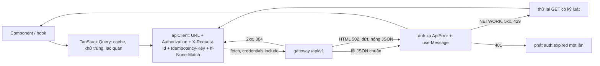
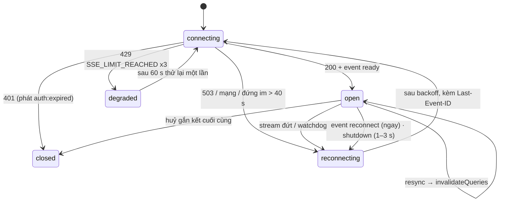
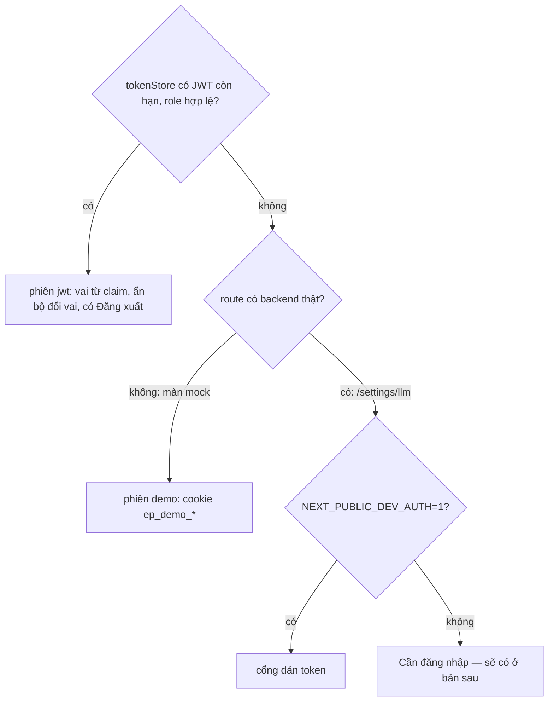

# SRS FEAT-ui-foundation Nền giao diện thật (PU): token, primitive, lớp dữ liệu, shell, cổng tự động
Phiên bản 1.5 · 2026-10-02 · Trạng thái: **APPROVED** (PM 2026-10-03; Q1–Q10 theo mặc định của BA; PM đã sửa `PU.md` L1 theo D53)

**v1.5 (2026-10-08)** — góp ý #14 `docs/sprints/5/proposals.md` (PM `ACCEPTED`: "(b') như đề xuất; ngưỡng 2,5 s `error` cho 6 route người dùng ở lượt devtools. `/dev/ui` LCP `warn` … `font-display: block` được chấp nhận với điều kiện: phông tự host qua `next/font`, có preload, subset latin + vietnamese, ≤ 3 độ đậm; QC kiểm chữ hiện ≤ 1 s ở lượt devtools"). Không đổi số AC (90). Đổi: US-PU-06 AC4 (LCP assert ở lượt `lhci` `throttlingMethod: devtools`, sáu route `error`, `/dev/ui` `warn`; lượt mô phỏng mặc định chỉ ghi số LCP; điều kiện FCP ≤ 1 s), **AC5** (TBT ở lượt mô phỏng), **AC6** (hai lượt, khác biệt duy nhất là `throttlingMethod`, không đổi CPU 4×), AC13 (handoff); bảng URL; **US-PU-01 AC5** (font: `display: block`, preload, `latin` + `vietnamese`, tối đa ba độ đậm — hiện 400 / 600 / 700 theo #26 sprint 3; trước đó AC ghi bốn độ đậm và `swap`); `SRS.md` FR-5, FR-45, 8.2, 8.5, mục 9.

**v1.4 (2026-10-08)** — góp ý #2 (f) `docs/sprints/5/proposals.md` (PM `ACCEPTED`: "viết US-PU-06 thành story đủ AC trong `FEAT-ui-foundation` v1.4, QC đối chiếu lại `tc-US-PU-06.md`") và quyết định PM ở Q-QC-PU06-1, -2, -4, Q-QC-PE09-2 (`FEAT-weekly-exam/QUESTIONS.md`). **Thêm US-PU-06** (13 AC; tổng 77 → **90**): khung trang có chữ vẽ từ máy chủ, bớt client component ở layout, LCP ≤ 2,5 s `error` ở cả 7 URL, TBT ≤ 200 ms `error` ở 6 route người dùng (`/dev/ui` giữ `warn` — #34 sprint 3), TBT trung vị 12× ≤ 170 ms từng route, quy tắc đổi ảnh mốc, không nới cách đo. Đổi `SRS.md`: 1, 4.4 (FR-43…FR-47), 8.2, 8.5, 9, 11. Không đổi AC của US-PU-01…05.

**v1.3 (2026-10-03)** — góp ý #1 `docs/sprints/5/proposals.md` (PM `ACCEPTED`; nguồn: ba, Q25 của `FEAT-weekly-exam`; trích: "Sinh viên cần mục nav \"Bài thi\" để tìm bài đã lỡ trên \"Hôm nay\"; `FEAT-ui-foundation` 7.5 (APPROVED) chốt số mục nav 7 / 12 / 15 → Thêm mục \"Bài thi\" (`/exams`): nav 7 / 12 / 15 → 8 / 13 / 16; mobile nằm dưới \"Thêm\"… **ACCEPTED** — áp dụng cùng US-PE-04 trên `sprint/5-pe`, không sửa sprint 3 / 4"). Không đổi số AC (77). Đổi: `SRS.md` 7.5 (thêm `/exams` "Bài thi" vào nhóm không nhóm của Sinh viên và nhóm "Đánh giá" của TA / GV; tổng 8 / 13 / 16 / 6; `ACCESS`); US-PU-04 AC3 (số mục). Dev đổi `nav.ts` và test `shell.spec.ts -g 'nav per role'` cùng commit của US-PE-04; QC sửa `tc-US-PU-04` (AC3) ở sprint 5.

**v1.2 (2026-10-03)** — góp ý #22 `docs/sprints/3/proposals.md` (PM `ACCEPTED`; nguồn: dev, US-PU-04; trích: "AC5 yêu cầu thanh trên điện thoại có \"tên trang (h1)\" và \"đúng một hành động ngữ cảnh\", nhưng AC13 giữ nguyên khung 1.5 (logo mark, bộ chọn lớp, tìm, chuông, hồ sơ) và AC6 cấm lặp tiêu đề route ở thanh trên… Giữ thanh trên 1.5: không thêm tên trang (h1 nằm ngay trong trang, `LEFT=16`) và không thêm hành động ngữ cảnh. Kiểm AC5 theo phần đo được: ≤ 5 đích dưới, `Thêm` đủ mục, ≥ 44 px, không tràn ngang"; **ACCEPTED** — BA sửa AC5 theo cách đo của dev) và QC `docs/sprints/3/qc/report-US-PU-02.md` ("TC-11, TC-12 chờ BA định nghĩa"), `report-US-PU-03.md` ("lệnh Kiểm AC24 `\bfetch\(`"). Không đổi số AC (77). Đổi: US-PU-04 AC5; US-PU-02 AC3 (trỏ tới bảng mới); US-PU-03 AC24 (lệnh grep); `SRS.md` thêm **7.3a** (hợp đồng ô `empty` / `error` theo từng khối, trả lời TC-PU02-11/12), FR-33 (thanh trên điện thoại). Q-QC-PU03-2/-3, Q-QC-PU04-1/-2/-3 đã trả lời từ v1.1 (không đổi).

**v1.1 (2026-10-03)** — trả lời câu hỏi QC (`docs/sprints/3/qc/tc-US-PU-0*.md`, `tc-GATE-PU.md`; mỗi chỗ sửa ghi "Q-QC-…"). Không đổi số AC (77). Đổi: US-PU-01 AC9 (Q-QC-PU01-2), US-PU-02 AC2 (Q-QC-PU02-1), US-PU-03 AC5 (Q-QC-PU03-2), US-PU-04 AC3 (Q-QC-PU04-1) và AC9 (Q-QC-PU04-3), mục "Quy ước kiểm chung" (CORS cho cổng, Q-QC-P105-1 của `FEAT-llm-gateway`), `SRS.md` 6.3 và 8.7. Các câu còn lại chỉ trả lời ở tệp TC.

Nguồn: `docs/phases/PU.md` (nguồn chính; L4 thu hẹp theo plan sprint 3), `docs/sprints/3/plan.md` (D53, token Admin dev, `make eval` hoãn), `design/DESIGN.md` §1–§2, §10, §13–§17, §19, §21–§22, `design/INTEGRATION.md`, `UX.md` mục 2–4 và 6, `ARCHITECTURE.md` §3 (thư viện được phép), §7 (cấu trúc frontend); spec nền `docs/specs/FEAT-pg-foundation/` (v1.3: mã lỗi, cursor, `Idempotency-Key`, SSE, CORS, JWT); mã hiện có: `frontend/src/shared/`, `scripts/ui-antipatterns.sh`, `docs/sprints/1.5/qc/scripts/{audit,sweep}.mjs`. Truy vết đầy đủ: mục 11. Story: `US.md` (US-PU-01…05, 77 AC).

## 1. Mục đích và phạm vi

Nâng `frontend/src/shared/` của prototype 1.5 (D51) thành **nền thật** dùng một lần cho mọi phase: token + lint chặn giá trị viết cứng, 22 primitive + 2 thành phần miền đủ trạng thái và xem được ở `/dev/ui`, lớp dữ liệu nói chuyện với gateway Go (`apiClient`, TanStack Query, `useSSE`, nháp, hoàn tác, xác nhận, báo mất mạng), shell điều hướng theo vai, và cổng tự động (Playwright, axe, Lighthouse CI, `ui-antipatterns`). **Luật của phase:** không đổi hành vi sản phẩm, không đổi hợp đồng API, không thêm tính năng; chỉ lớp trình bày và lớp dữ liệu phía client.

**Trong phạm vi:** `frontend/src/shared/{styles,ui,domain,data,i18n,shell,session,lib}`, `frontend/eslint.config.mjs`, `scripts/{ui-antipatterns,lint-selftest}.sh`, `frontend/e2e/**`, `frontend/lighthouserc.json`, `frontend/playwright.config.ts`, trang `/dev/ui` và `/dev/data`, job **Frontend** của `.github/workflows/ci.yml`; (v1.4, US-PU-06) khung trang có chữ vẽ từ máy chủ ở `frontend/src/app/layout.tsx` và `frontend/src/app/(app)/layout.tsx`, và ngưỡng `error` của LCP / TBT.

**Ngoài phạm vi:** màn nghiệp vụ dựng lại (PU L4 thu hẹp: `/login /register /profile` → P2; `/chat /threads` → P3; `/documents /analytics` → P8 / P10 — ghi `PROGRESS.md` mục Nợ); đăng nhập thật và cookie phiên (P2); dữ liệu thật cho chuông (P4); hàng đợi ghi cục bộ cho điểm danh (P5); Red Thread Transition, hoạt ảnh, Visual QA hai lượt (P10 L4); chế độ tối; Tailwind (D53); mọi thay đổi `backend-go/` (AC9 của US-PU-05 chặn).

**Màn thật duy nhất của sprint 3** là `/settings/llm` (`FEAT-llm-gateway` US-P1-05), dựng **trên** nền này; 30 màn còn lại của prototype giữ dữ liệu mock và chạy trên primitive đã nâng chuẩn.

## 2. Người dùng và quyền

"Người dùng" của story 01, 02, 03, 05 là **lập trình viên và QC**; story 04 phục vụ bốn vai trò JWT (`ADMIN`, `TEACHER`, `TA`, `STUDENT`). Quyền ở frontend chỉ là **phòng thủ nhiều lớp** — gateway (`RequireRole`, `CourseAccessGuard`) mới là nơi chặn thật.

| Đối tượng | Sinh viên | TA | Giảng viên | Admin | Ghi chú |
| --- | --- | --- | --- | --- | --- |
| Điều hướng và route | theo 7.5 | theo 7.5 | theo 7.5 | theo 7.5 | Vai không được phép → màn chặn, **không gọi API** (US-PU-04 AC10) |
| `/settings/llm` | chặn | chặn | **chỉ xem** | sửa được | Khớp PRD §3 (TA "–", GV "Xem", Admin "Có") |
| `/dev/ui`, `/dev/data` | 404 ở build thường | 404 | 404 | 404 | Chỉ có ở `NEXT_PUBLIC_DEV_TOOLS=1` hoặc `next dev` |
| Cổng dán token dev | không | không | không | chỉ build `NEXT_PUBLIC_DEV_AUTH=1` | Token ở bộ nhớ, mất khi tải lại |
| Thấy `trace_id` / chi tiết kỹ thuật của lỗi | **không** | có | có | có | US-PU-03 AC4 |
| Thấy nút duyệt của `VerificationState` | không | có | có | có | Quy tắc 7 `UX.md`; kiểm ở `/dev/ui?as=…` |

Nguyên tắc (D47 mục 6, luật 2): vai trò, `sub`, `email` của phiên `jwt` đọc từ **claim** (frontend chỉ giải mã, không xác minh chữ ký); phiên `demo` (cookie `ep_demo_*`) chỉ cho màn mock và không bao giờ gửi tới gateway.

## 3. Luồng chính và các nhánh lỗi

### 3.1 Một lời gọi API



### 3.2 `useSSE`



### 3.3 Hai nguồn phiên



### 3.4 Nhánh lỗi

| Tình huống | Hệ thống phản ứng | Người dùng thấy |
| --- | --- | --- |
| Mạng đứt khi gõ / gửi | Giữ nguyên chữ; `OfflineBanner`; POST không tự gửi lại không khoá; có khoá thì thử lại cùng khoá | Dải "Mất kết nối mạng…", nút `Gửi lại` |
| 401 `TOKEN_EXPIRED` | Một sự kiện `auth:expired` / 10 s; không thử lại; xoá token | Cổng dán token (dev) / "Phiên đã hết hạn" |
| 403 `FORBIDDEN` | Không thử lại | Màn chặn quyền, `Về Hôm nay` |
| 409 `VERSION_CONFLICT` | `error.conflict` có giá trị hiện tại | Màn hỏi giữ bên nào (phase sở hữu) |
| 422 `VALIDATION_FAILED` | `fieldErrors` | Lỗi dưới từng ô, nội dung giữ nguyên |
| 429 / 503 có `retry_after` | Không tự thử nếu > 5 s | "Thử lại sau N giây", nút khoá tới hết giờ |
| 502 HTML / đứt giữa chừng | `ApiError` `BAD_GATEWAY` / `NETWORK` | "Không kết nối được… dữ liệu của bạn vẫn an toàn" |
| SSE đứt | Nối lại backoff + `Last-Event-ID`; loại trùng theo id | Không thấy gì (hoặc dải mất mạng) |
| SSE 429 `SSE_LIMIT_REACHED` | Chờ `retry_after`, ≤ 3 lần, rồi `degraded` | "Bạn đang mở nhiều cửa sổ; cập nhật tự động tạm dừng" |
| Token hết hạn giữa stream (`reconnect token_expired`) | `auth:expired`, không nối tới khi có token | Như 401 |
| `resync` | Vô hiệu hoá query đã đăng ký | Dữ liệu tự làm mới |
| `localStorage` đầy / bị chặn | `status="error"` của nháp, chữ vẫn trong ô | Dòng nhỏ "Chưa lưu được bản nháp" |
| Route chưa có backend (`MOCK_SCREENS=0`) | `EmptyState` theo phase | "Tính năng này đang được xây ở giai đoạn P3…" |
| Vai không được mở route | Màn chặn; không gọi API | "Bạn không có quyền xem màn này" |
| Lint / ảnh mốc / axe đỏ | CI đỏ, artifact báo cáo | (dev) tên phép / ảnh lệch / nút vi phạm |

## 4. Yêu cầu chức năng

### 4.1 Bảy lớp giá trị viết cứng (US-PU-01 AC2)

Phạm vi quét: `frontend/src/**/*.{css,ts,tsx}`; ngoại lệ đường dẫn ghi ở cột 3; mọi phép chấp nhận `ui-allow: <lý do>` cùng dòng.

| # | Lớp | Mẫu bị cấm (regex rút gọn) | Ngoại lệ đường dẫn / giá trị |
| --- | --- | --- | --- |
| 1 | Màu viết cứng | `#[0-9a-fA-F]{3,8}\b`, `\b(rgba?|hsla?|oklch)\(` | `shared/styles/` |
| 2 | Bo góc số cứng | `border-radius\s*:\s*[^;]*[0-9]` | giá trị `0`, `50%`, `inherit`, `var(--ep-radius-*)`; `shared/styles/` |
| 3 | Bóng | `box-shadow\s*:`, `drop-shadow\(`, `\bshadow-(sm|md|lg|xl|2xl)\b` | `shared/ui/{Popover,Dialog,Menu,Drawer,Composer}` và giá trị `var(--ep-shadow-*)`, `var(--ep-focus)`, `none` |
| 4 | Cỡ chữ số cứng | `font-size\s*:\s*[0-9.]+(px|rem|em)`, `text-\[[0-9.]+(px|rem)\]` | `inherit`, `100%`, `1em`; `shared/styles/` |
| 5 | `z-index` số | `z-index\s*:\s*-?[0-9]{2,}` | `-1`, `0`, `1`, `auto`, `var(--ep-z-*)` |
| 6 | Lớp Tailwind rời | `\b(bg|text|border|ring|divide)-(gray|slate|zinc|neutral|stone)-[0-9]`, `rounded-(2xl|3xl)`, `rounded-\[(1[6-9]|2[0-9])px\]` | không |
| 7 | `style={{ … }}` | trong `.tsx`, đối tượng `style` chứa lớp 1–5 | không |

### 4.2 Bảy luật ESLint (US-PU-01 AC4)

| # | Tên luật (trong `eslint.config.mjs`) | Chặn | Ngoại lệ |
| --- | --- | --- | --- |
| E1 | `ep/no-raw-fetch` | `fetch(`, `window.fetch`, `XMLHttpRequest`, import `axios` | `frontend/src/shared/data/**` |
| E2 | `ep/no-native-dialogs` | `confirm(`, `window.confirm`, `alert(`, `prompt(` | không |
| E3 | `ep/no-custom-spinner` | định danh / JSX `Spinner`, `FullPageSpinner`, `LoadingSpinner` | `shared/ui/**` |
| E4 | `ep/no-raw-table` | JSX `<table>` | `shared/ui/DataTable.tsx` |
| E5 | `ep/no-token-in-storage` | `localStorage|sessionStorage.setItem(k, …)` và gán `document.cookie` với `k` khớp `/token|jwt|access|refresh|secret|password/i` | không |
| E6 | `ep/no-tailwind` | import `tailwindcss`, `@tailwindcss/*` | không |
| E7 | `ep/no-literal-color-in-style` | chuỗi màu (`#hex`, `rgb(`, `oklch(`) trong thuộc tính `style` JSX | `shared/styles/` |

Cài bằng `no-restricted-syntax` / `no-restricted-imports` / `no-restricted-globals` của ESLint 9 (không thêm thư viện); `scripts/lint-selftest.sh` chứng minh bắt được từng luật.

### 4.3 Mười chín phép của `scripts/ui-antipatterns.sh` (US-PU-05 AC6)

Mỗi phép in một dòng `✓ <tên>` hoặc `✗ <tên>` + tối đa 20 vi phạm; thoát 1 nếu có `✗`. `--selftest`: sao `frontend/src` sang thư mục tạm (`UI_SRC`), gieo từng vi phạm, mong `✗`, in `N / 19 phép bắt được`.

| # | Phép (tên dòng kết quả) | Gốc |
| --- | --- | --- |
| 1 | Màu viết cứng ngoài shared/styles | 4.1 lớp 1 |
| 2 | Màu viết cứng trong style của .tsx | 4.1 lớp 7 |
| 3 | Xám chung chung của Tailwind | 4.1 lớp 6 |
| 4 | Bo góc kiểu SaaS / số cứng | 4.1 lớp 2 |
| 5 | Bóng ngoài Popover/Dialog/Menu/Drawer/Composer | 4.1 lớp 3 |
| 6 | Cỡ chữ tuỳ ý ngoài thang vai trò | 4.1 lớp 4 |
| 7 | z-index số cứng | 4.1 lớp 5 |
| 8 | fetch / XMLHttpRequest / axios ngoài shared/data | E1 |
| 9 | confirm / alert | E2 |
| 10 | Spinner riêng hoặc toàn trang | E3, `INTEGRATION.md` §5 |
| 11 | `<table>` thô ngoài DataTable | E4 |
| 12 | Hiệu ứng bị cấm (glass, chữ gradient, nảy) | `DESIGN.md` §21 |
| 13 | Gamification (`streak`, `leaderboard`, `confetti`) | `DESIGN.md` §21 |
| 14 | Khung vỏ dùng nền đặc | `DESIGN.md` §21, 1.5 FR-X15 |
| 15 | Từ kỹ thuật trong màn sinh viên | `INTEGRATION.md` §5 (`RAG`, `PII`, `fallback`, `trace`, `provider`, `redaction`, `confidence`; thêm `embedding`, `prompt`, `LLM` ở `shared/ui`, `shared/domain`) |
| 16 | Dialog ngoài danh sách việc cần bảo vệ | `DESIGN.md` §10.11 |
| 17 | Emoji làm icon chức năng | `INTEGRATION.md` §5 (khoảng Unicode `\x{1F300}-\x{1FAFF}`, `\x{2600}-\x{27BF}` trong `.tsx` ngoài chuỗi lời văn có `ui-allow`) |
| 18 | Token / bí mật ghi vào storage | E5 |
| 19 | Tailwind / `@theme` | E6, D53 |

(Phép "hơn một nút `variant="primary"` trong một vùng" của `INTEGRATION.md` §5 kiểm lúc chạy ở Playwright, US-PU-02 AC14.)

### 4.4 Danh sách FR

| FR | Hệ thống phải… | AC |
| --- | --- | --- |
| FR-1 | `tokens.css` chứa nguyên văn mọi `--ep-*` của `DESIGN_TOKENS.css`; chỉ thêm token ở 5.2; là nơi duy nhất khai báo giá trị `--ep-*` | 01-AC1 |
| FR-2 | Chặn 7 lớp giá trị viết cứng (4.1) bằng ESLint + `ui-antipatterns.sh`; danh sách trắng `ui-allow` có kiểm soát | 01-AC2 |
| FR-3 | Có `scripts/lint-selftest.sh` chứng minh 7 luật ESLint và 19 phép bắt được | 01-AC3, 05-AC6 |
| FR-4 | Chặn `fetch` trần, confirm / alert, spinner riêng, `<table>` thô, token trong storage, Tailwind (4.2) | 01-AC4 |
| FR-5 | Be Vietnam Pro qua `next/font/google` (tối đa ba độ đậm — hiện 400 / 600 / 700, `display: block` theo góp ý #14, preload, `latin` + `vietnamese`), tự lưu cùng máy chủ | 01-AC5 |
| FR-6 | `tabular-nums` ở bảng; sáu vai chữ; dấu tiếng Việt không bị cắt | 01-AC6 |
| FR-7 | Vòng focus `--ep-focus`, `::selection`, thanh cuộn, `prefers-reduced-motion`, `color-scheme: light` | 01-AC7 |
| FR-8 | Logo / mark / favicon từ `public/brand/`, không trong ô bo góc | 01-AC8 |
| FR-9 | Không phá màn mock: `audit.mjs` `FAIL 0` sau mỗi story PU | 01-AC9, 02-AC12, 03-AC24, 04-AC13, 05-AC10 |
| FR-10 | `/dev/ui` có 24 khối primitive và 117 ô trạng thái (75 ô N/A có lý do, 7.2) | 02-AC1 |
| FR-11 | Mỗi trạng thái tương tác đúng quy ước 7.3 (hover, focus, selected, disabled, loading, empty, error) | 02-AC2, 02-AC3 |
| FR-12 | Chữ Việt dài không vỡ ở 375 / 900 / 1280 / 1440 và 640 (zoom 200 %); `AUDIT` sạch; `TOUCH` ở 375 sạch | 02-AC4 |
| FR-13 | `DataTable`: ảo hoá (`@tanstack/react-virtual`), tiêu đề dính, 44–52 px, bàn phím, giữ cuộn, phân trang con trỏ | 02-AC5, 02-AC6 |
| FR-14 | `Dialog` / `Drawer` bẫy focus, `Esc`, trả focus; `Drawer` 420–520 px (toàn màn < 720); `Popover` / `Menu` bàn phím | 02-AC7 |
| FR-15 | `Composer` ≤ 820 px, một nút chính, giữ chữ khi lỗi / loading, tới được khi bàn phím ảo | 02-AC8, 02-AC13 |
| FR-16 | Khung xương khớp hình nội dung (CLS ≤ 0,05) | 02-AC9 |
| FR-17 | `CitationList`, `VerificationState` đúng lời và hình thức; nút duyệt chỉ cho TA / GV / Admin | 02-AC10 |
| FR-18 | Không từ kỹ thuật trong chuỗi `shared/ui`, `shared/domain`; bảng dịch ở `shared/i18n/vi.ts` | 02-AC11 |
| FR-19 | Một hành động chính mỗi vùng làm việc (quét lúc chạy) | 02-AC14 |
| FR-20 | `/dev/*` chỉ có ở build bật `NEXT_PUBLIC_DEV_TOOLS=1` | 02-AC16 |
| FR-21 | `apiClient`: URL, header, token chỉ trong bộ nhớ, không gửi sang origin lạ | 03-AC1 |
| FR-22 | Ánh xạ 28 mã lỗi PG + P1 và 4 mã phía client sang `ApiError` + `userMessage` | 03-AC2, 03-AC3 |
| FR-23 | Không lộ mã trần / `trace_id` cho Sinh viên | 03-AC4 |
| FR-24 | Thử lại GET có kỷ luật; POST không tự thử lại thiếu khoá | 03-AC5 |
| FR-25 | `Idempotency-Key` tự sinh, ổn định theo ý định (`useIdempotentMutation`) | 03-AC6 |
| FR-26 | Xử lý 401 một lần; ETag / 304; 409 `conflict`; 422 `fieldErrors`; 429 / 503 đếm ngược | 03-AC7…AC10 |
| FR-27 | TanStack Query mặc định + `useCursorList` | 03-AC11 |
| FR-28 | `useSSE`: giao thức PG, nối lại, `Last-Event-ID`, loại trùng, sự kiện điều khiển, lỗi nối, singleton | 03-AC12…AC16 |
| FR-29 | `useJob`: tải trạng thái trước, nghe SSE, thăm dò khi `degraded` | 03-AC17 |
| FR-30 | `useAutosaveDraft`, `useUndoableAction`, `ConfirmIrreversible` (kiểu), `OfflineBanner`, `PageState` gắn truy vấn | 03-AC18…AC22 |
| FR-31 | An toàn token (bộ nhớ, không URL / storage / console); mã cổng token không vào build thường | 03-AC23 |
| FR-32 | Shell: kích thước theo bề rộng, vạch đỏ 2 px, nền đặc, điều hướng đúng vai, huy hiệu chỉ khi cần | 04-AC1…AC4 |
| FR-33 | Thanh dưới ≤ 5 đích + `Thêm`; thanh trên chỉ tiện ích toàn cục (điện thoại: giữ khung 1.5, không `h1`, không hành động ngữ cảnh — góp ý #22) | 04-AC5, 04-AC6 |
| FR-34 | `CommandPalette` và `NotificationPopover` (khung) | 04-AC7, 04-AC8 |
| FR-35 | Hai nguồn phiên `jwt` / `demo`; cổng dán token dev | 04-AC9 |
| FR-36 | Chặn route theo vai ở khung (không gọi API); `EmptyState` route chưa có backend | 04-AC10, 04-AC11 |
| FR-37 | Trợ năng khung (skip link, landmark, `Esc`); vùng chạm 375 / 390 | 04-AC12, 04-AC14 |
| FR-38 | Playwright: `visual` (14 ảnh), `ui-foundation` (bàn phím, zoom 200 %), `a11y` (axe), các spec khác | 05-AC1, 05-AC3, 05-AC4 |
| FR-39 | Lighthouse CI mobile đúng ngân sách `UX.md` mục 3 | 05-AC5 |
| FR-40 | `ui-antipatterns.sh` 19 phép + `--selftest` | 05-AC6 |
| FR-41 | CI job Frontend chạy toàn bộ cổng; chứng minh đỏ khi vi phạm | 05-AC7, 05-AC8 |
| FR-42 | PU không sửa `backend-go/`; bằng chứng "trước / sau" và báo cáo | 05-AC2, 05-AC9, 05-AC11, 05-AC12 |
| FR-43 | Khung trang có `<h1>` + mô tả vẽ từ máy chủ, không dữ liệu người dùng, không bộ nhớ đệm chung | 06-AC1, 06-AC2 |
| FR-44 | Bớt client component ở hai layout; JS mỗi route ≤ 256.000 byte | 06-AC3 |
| FR-45 | Lighthouse hai lượt: LCP `error` ở 6 route người dùng (lượt `devtools`, `/dev/ui` `warn`); TBT `error` ở 6 route người dùng (`/dev/ui` `warn`); TBT 12× ≤ 170 ms từng route; không nới cách đo; CI xanh ổn định | 06-AC4, 06-AC5, 06-AC6, 06-AC7, 06-AC8 |
| FR-46 | Không hồi quy: ảnh mốc (quy tắc đổi ảnh), axe, phiên, thư viện, lint | 06-AC9, 06-AC10, 06-AC11 |
| FR-47 | Ma trận quyền không đổi; trả nợ và bàn giao | 06-AC12, 06-AC13 |

Ghi chú: 01-AC10, 02-AC15, 05-AC13 là AC "không áp dụng" hoặc kiểm tay (phân quyền: ràng buộc an toàn thay thế do 01-AC4 / 03-AC23 đảm nhiệm).

## 5. Dữ liệu

PU **không có bảng cơ sở dữ liệu và không đổi schema**. "Dữ liệu" ở đây là cấu trúc mã, token, khoá lưu trữ trình duyệt và kiểu dùng chung.

### 5.1 Cấu trúc thư mục đích (`ARCHITECTURE.md` §7, giữ và mở rộng cấu trúc hiện có)

| Thư mục | Nội dung | Trạng thái so với 1.5 |
| --- | --- | --- |
| `frontend/src/shared/styles/` | `tokens.css`, `base.css` | giữ, nâng chuẩn |
| `frontend/src/shared/ui/` | 22 primitive (7.2) | giữ, nâng chuẩn |
| `frontend/src/shared/domain/` | `CitationList`, `VerificationState` (`LLMRouteTable` thêm ở US-P1-05) | **mới** |
| `frontend/src/shared/data/` | `apiClient.ts`, `ApiError.ts`, `tokenStore.ts`, `queryClient.tsx`, `useCursorList.ts`, `useIdempotentMutation.ts`, `useJob.ts`, `useSSE.ts`, `useAutosaveDraft.ts`, `useUndoableAction.ts`, `OfflineBanner.tsx` | **mới** |
| `frontend/src/shared/i18n/vi.ts` | bảng dịch thuật ngữ AI → lời thường (`DESIGN.md` §13), `userMessage` theo mã lỗi | **mới** |
| `frontend/src/shared/shell/` | `AppShell`, `nav.ts`, `NotificationPopover`, `RoutePlaceholder` (EmptyState route chưa có backend) | giữ + thêm |
| `frontend/src/shared/session/` | `session.tsx` (hai nguồn `jwt` / `demo`), `cookies.ts`, `TokenGate.tsx` | giữ + thêm |
| `frontend/src/shared/lib/` | `useScrollRow`, `useStreamedText`, `useUndoLine` | giữ (`useUndoLine` dần thay bằng `useUndoableAction` khi màn được dựng lại) |
| `frontend/src/app/dev/{ui,data}/` | trang `/dev/ui`, `/dev/data` (404 ở build thường) | **mới** |
| `frontend/e2e/` | `playwright.config.ts` ở gốc `frontend/`; spec: `tokens`, `dev-ui`, `data-layer`, `shell`, `ui-foundation`, `visual`, `a11y`; `support/api-server.mjs` (máy chủ giả); `axe-allow.json`, `primary-allow.json`; `*-snapshots/` | **mới** |
| `scripts/` | `ui-antipatterns.sh` (mở rộng), `lint-selftest.sh` (mới) | |

### 5.2 Token và danh sách trắng

**Token thêm ngoài bộ gốc (4, đã có trong `tokens.css` 1.5):**

| Token | Giá trị | Dùng cho | Lý do không dùng token gốc |
| --- | --- | --- | --- |
| `--ep-mask-solid` | nền đặc đậm | `[[SV_001]]` đã che trong ô `PrivateMark` | vật thể che chữ, không phải nền trang |
| `--ep-mask-clear` | nền nhạt | giống trên, sau khi người dùng chọn hiện | |
| `--ep-scrim` | lớp phủ dialog | nền sau `Dialog` / `Drawer` | token gốc không có lớp phủ |
| `--ep-shadow-composer` | bóng rất nhẹ | `Composer` nổi trên nội dung | DESIGN §10: Composer là vật thể duy nhất nổi |

Thêm token mới = sửa spec (đề xuất qua `proposals.md`). Giá trị chính xác lấy từ `tokens.css` (nguồn thật), không sao chép vào SRS để tránh lệch.

**Danh sách trắng `ui-allow` hiện có (10 chỗ — đo ở commit `307bfd2`; QC đếm lại trước khi nghiệm thu):**

| Tệp | Mục đích |
| --- | --- |
| `features/chat/ChatScreen.module.css:33` | vạch chỉ mục "đang chọn" (`inset 2px` đỏ) |
| `features/gradebook/GradeScheme.module.css:63` | cùng lớp nổi với Popover |
| `features/gradebook/Gradebook.module.css:35`, `:58` | vòng focus; lớp nổi Popover |
| `shared/ui/ActionList.module.css:10` | vạch "đang chọn" |
| `shared/ui/CommandPalette.module.css:5` | tắt vòng focus toàn cục, khung ngoài đã có |
| `shared/ui/DataTable.module.css:33`, `:34` | vòng focus riêng của hàng |
| `shared/shell/AppShell.module.css:150` | `main` nhận focus bằng chương trình |
| `shared/styles/tokens.css:78` | định nghĩa vòng focus toàn cục |

Chỗ nào thay được bằng `--ep-focus` / `--ep-shadow-*` trong lúc nâng chuẩn thì **bỏ** `ui-allow`; trần 10.

### 5.3 Khoá lưu trữ phía trình duyệt (bảng đầy đủ; mọi khoá khác không được thêm)

| Khoá | Kho | Nội dung | Ghi chú |
| --- | --- | --- | --- |
| `ep:draft:<userId\|anon>:<key>` | localStorage | `{v:1,text,savedAt}` | nháp (US-PU-03 AC18), dọn sau 30 ngày |
| `ep:ui:sidebar` | localStorage | `"open"\|"collapsed"` | US-PU-04 AC1 |
| `ep_demo_state` | localStorage | trạng thái mock 1.5 | **chỉ màn mock**, giữ nguyên |
| `ep_demo_role`, `ep_demo_person`, `ep_demo_course` | cookie | phiên mô phỏng | **chỉ màn mock**; không gửi tới gateway |
| (token JWT) | **bộ nhớ** (`tokenStore`) | — | **không bao giờ** vào storage / cookie / URL |

### 5.4 Kiểu dùng chung (TypeScript; chữ ký ổn định để phase sau dựa vào)

```ts
type ApiErrorCode = ServerErrorCode | "BAD_GATEWAY" | "NETWORK" | "ABORTED" | "PARSE_ERROR" | "BAD_TARGET";
class ApiError extends Error {
  status: number; code: ApiErrorCode; userMessage: string; traceId?: string;
  details?: unknown; retryAfter?: number;                       // giây
  conflict?: { currentVersion: number; current: unknown };      // 409 VERSION_CONFLICT
}
type CursorPage<T> = { items: T[]; next_cursor: string | null };
type SSEStatus = "connecting" | "open" | "reconnecting" | "degraded" | "closed";
type DraftStatus = "idle" | "saving" | "saved" | "error";
type Session = { source: "jwt" | "demo"; role: "student"|"ta"|"teacher"|"admin"; sub?: string; email?: string };
```

## 6. API — hợp đồng của lớp dữ liệu phía client

PU **không thêm endpoint** nào. Nó là bên tiêu thụ hợp đồng của `FEAT-pg-foundation` (6.1 mã lỗi, 6.4 cursor, 6.5 header, 6.6 Idempotency, 6.7 CORS / ETag, 6.8 SSE).

### 6.1 `apiClient`

| Hạng mục | Quy định |
| --- | --- |
| Gốc URL | `${NEXT_PUBLIC_API_URL ?? ""}/api/v1` + path; đường dẫn tuyệt đối tới origin khác bị từ chối trước khi gửi (`BAD_TARGET`) |
| Header gửi | `Authorization: Bearer <token>` (nếu có), `X-Request-Id: <uuid>`, `Accept: application/json`, `Content-Type: application/json` (khi có thân), `Idempotency-Key` (POST tự sinh), `If-None-Match` (GET đã có ETag) |
| `credentials` | `include` (CORS `Allow-Credentials: true` của PG v1.2) |
| Thân | JSON; `PUT/PATCH` mang `version` hoặc `If-Match` do phase sở hữu |
| Kết quả | `{ data, status, etag?, replayed? }`; `304` → trả cache |
| Timeout | 15 s mỗi request (`AbortSignal.timeout`), `ABORTED` nếu người dùng huỷ, `NETWORK` nếu hết giờ |
| Giải mã lỗi | thân JSON chuẩn → `ApiError` theo 6.2; không phải JSON → 6.2 hàng "Không phải JSON" |
| Sự kiện | `auth:expired` (window `CustomEvent`), tối đa 1 / 10 s |

### 6.2 Ánh xạ mã lỗi → `userMessage` (28 mã máy chủ + 4 mã phía client; lời đầy đủ ở `shared/i18n/vi.ts`)

| Status | `code` | Thử lại tự động | `userMessage` (mẫu) |
| --- | --- | --- | --- |
| 400 | `BAD_REQUEST` | không | "Yêu cầu chưa đúng. Hãy tải lại trang và thử lại." |
| 401 | `UNAUTHENTICATED` | không | "Bạn cần đăng nhập để tiếp tục." |
| 401 | `TOKEN_EXPIRED` | không | "Phiên đăng nhập đã hết hạn. Vui lòng đăng nhập lại." |
| 401 | `TOKEN_INVALID` | không | "Phiên đăng nhập không hợp lệ." |
| 403 | `FORBIDDEN` | không | "Bạn không có quyền thực hiện việc này." |
| 404 | `NOT_FOUND` | không | "Không tìm thấy nội dung này." |
| 405 | `METHOD_NOT_ALLOWED` | không | "Thao tác này không được hỗ trợ." |
| 409 | `CONFLICT` | không | "Dữ liệu vừa thay đổi. Hãy tải lại và thử lại." |
| 409 | `VERSION_CONFLICT` | không | "Có người vừa sửa mục này. Chọn giữ bản nào." |
| 409 | `IDEMPOTENCY_IN_PROGRESS` | có (GET-like: chờ `Retry-After`, ≤ 2 lần) | "Thao tác trước đang xử lý. Chờ vài giây." |
| 413 | `PAYLOAD_TOO_LARGE` | không | "Nội dung quá lớn. Rút gọn rồi gửi lại." |
| 415 | `UNSUPPORTED_MEDIA_TYPE` | không | "Định dạng gửi lên chưa được hỗ trợ." |
| 422 | `VALIDATION_FAILED` | không | "Một số thông tin chưa hợp lệ. Kiểm tra các ô được đánh dấu." |
| 422 | `INVALID_CURSOR` | quay về trang đầu 1 lần | "Danh sách đã đổi. Đang tải lại từ đầu." |
| 422 | `IDEMPOTENCY_KEY_REUSED` | không | "Thao tác này đã gửi với nội dung khác. Hãy làm lại từ đầu." |
| 422 | `IDEMPOTENCY_KEY_REQUIRED` | không | (lỗi lập trình: log `console.error` ở dev, câu chung ở người dùng) |
| 429 | `RATE_LIMITED` | GET: theo `retry_after` ≤ 5 s | "Bạn thao tác hơi nhanh. Thử lại sau N giây." |
| 429 | `SSE_LIMIT_REACHED` | xem US-PU-03 AC15 | "Bạn đang mở nhiều cửa sổ; cập nhật tự động tạm dừng." |
| 500 | `INTERNAL` | không | "Có lỗi xảy ra. Dữ liệu của bạn vẫn an toàn. Thử lại sau ít phút." |
| 503 | `SERVICE_UNAVAILABLE` | GET: 2 lần | "Hệ thống đang bận. Thử lại sau ít phút." |
| 503 | `NOT_READY` | GET: 2 lần | "Hệ thống đang khởi động lại. Thử lại sau ít giây." |
| 504 | `DEADLINE_EXCEEDED` | GET: 2 lần | "Mất quá lâu để phản hồi. Thử lại sau." |
| 503 | `OVERLOADED` (P1) | GET: theo `retry_after` ≤ 5 s | "Hệ thống đang rất đông. Thử lại sau N giây." |
| 503 | `LLM_NOT_CONFIGURED` (P1) | không | "Trợ lý chưa được cấu hình. Báo quản trị viên." |
| 503 | `LLM_UNAVAILABLE` (P1) | GET: 2 lần | "Trợ lý tạm thời không khả dụng." |
| 409 | `PROVIDER_IN_USE` (P1) | không | "Nhà cung cấp này đang được dùng. Chuyển các tác vụ sang nhà khác trước." |
| 422 | `MODEL_DIMS_MISMATCH` (P1) | không | "Mô hình này không dùng được cho tìm kiếm tài liệu (sai số chiều)." |
| 422 | `ROUTE_INVALID` (P1) | không | "Cấu hình tác vụ chưa hợp lệ." |
| (HTML/khác) | `BAD_GATEWAY` | GET: 2 lần | "Máy chủ chưa phản hồi đúng. Dữ liệu của bạn vẫn an toàn." |
| — | `NETWORK` | GET: 2 lần; POST chỉ khi có khoá | "Không kết nối được tới máy chủ. Chữ bạn đã nhập vẫn được giữ." |
| — | `ABORTED` | không | (không hiện) |
| — | `PARSE_ERROR` | không | "Phản hồi từ máy chủ không đọc được. Thử lại sau." |
| — | `BAD_TARGET` | không | (lỗi lập trình) |

Mọi mã lạ → `userMessage` chung của `INTERNAL`. Lời "Sinh viên" không chứa từ kỹ thuật (`US-PU-02 AC11` quét `shared/i18n/vi.ts`). `Idempotent-Replayed: true` không có `userMessage` (im lặng).

### 6.3 Số liệu thử lại, thời gian, đếm ngược

| Tham số | Giá trị |
| --- | --- |
| GET tự thử lại | 2 lần; trễ 300 ms, 900 ms; jitter ±20 % |
| Ngưỡng tôn trọng `retry_after` | ≤ 5 s: lần thử lại chờ **đúng** `retry_after` (thay trễ cơ sở, không cộng, không jitter, sai số 0…+250 ms); lớn hơn: không tự thử, trả lỗi kèm `retryAfter` |
| Timeout request | 15 s |
| `staleTime` / `gcTime` | 30 s / 5 phút; `refetchOnWindowFocus: true`; `retry: false` |
| `useCursorList` | `limit` mặc định 30, kẹp ≤ 100 |
| Đếm ngược `retry_after` | cập nhật 1 lần / giây; nút khoá tới hết |
| `auth:expired` | ≤ 1 sự kiện / 10 s |
| Nháp tự lưu | debounce 2 s; + `visibilitychange` / `pagehide` / unmount; dọn > 30 ngày; > 100 KB từ chối |
| `UndoLine` | 5 s |
| `OfflineBanner` | hiện khi `onLine=false` hoặc 2 lỗi `NETWORK` liên tiếp; tắt sau 1 request thành công |

### 6.4 `useSSE` (giao thức khớp PG 6.8)

| Hạng mục | Quy định |
| --- | --- |
| Kết nối | `fetch` + `ReadableStream`, `Authorization: Bearer`, `Accept: text/event-stream`, `Last-Event-ID` khi nối lại; **không** `EventSource` |
| Đọc khung | `retry:` (ms, mặc định server 3000) chỉ ghi nhận, không dùng thay backoff client; `id:`, `event:`, `data:` (nhiều dòng nối `\n`); dòng bắt đầu `:` là heartbeat |
| `id` | `<ms>-<seq>`; so sánh số học theo `(ms, seq)`; chỉ sự kiện có `id` ghi đè `lastEventId` |
| Backoff | 1, 2, 4, 8 s, tối đa 15 s, jitter ±20 %; đặt lại 1 s sau khi giữ kết nối ≥ 30 s |
| Watchdog | không nhận byte nào trong 40 s → huỷ và nối lại |
| `429 SSE_LIMIT_REACHED` | chờ `retry_after` (≥ 5 s); tối đa 3 lần rồi `degraded`; ở `degraded`, thử lại một lần sau 60 s |
| `event: reconnect` | nối ngay (`token_expired` → `auth:expired` trước, chờ token mới) |
| `event: shutdown` | nối lại sau 1–3 s ngẫu nhiên |
| `event: resync` | `onResync()` rồi tiếp tục |
| Singleton | một kết nối mỗi tab; đăng ký theo loại sự kiện; huỷ gắn kết cuối cùng → `abort()` |
| Loại sự kiện đã biết ở sprint này | `ready`, `reconnect`, `shutdown`, `resync`, `job.progress` (+ loại do phase sau đăng ký) |

### 6.5 Hook hành vi

| Hook / component | Chữ ký | Điểm cần đúng |
| --- | --- | --- |
| `useAutosaveDraft(key)` | `{ value, setValue, status, clear }` | từ chối khoá chứa `secret|password|apikey|key`; `QuotaExceededError` → `status="error"` |
| `useUndoableAction({ do, undo, label })` | `{ run, pending }` + `<UndoLine>` tại chỗ | cập nhật lạc quan ≤ 100 ms; `undo` ghi ngay; lỗi ghi → hoàn UI + `InlineNotice` |
| `useIdempotentMutation(fn)` | `{ mutate, retry, result }` | một khoá cho một ý định |
| `useJob(jobId)` | `{ status, progress, result, error }` | `GET /jobs/{id}` trước, SSE sau, thăm dò 2 s khi `degraded` |
| `useCursorList(key, path, opts)` | `useInfiniteQuery` bọc | loại trùng theo `id`; `INVALID_CURSOR` → trang đầu 1 lần |
| `<ConfirmIrreversible>` | props bắt buộc `consequence`, `confirmLabel` | kiểu TS chặn thiếu |
| `<OfflineBanner>` | không props | `role="status"`, `aria-live="polite"` |
| `<PageState query isEmpty>` | bọc `useQuery` | `isPending` → Skeleton; `isError` → lỗi chuẩn + `refetch` |

## 7. Giao diện

### 7.1 Route thuộc PU

| Route | Có ở build | Nội dung |
| --- | --- | --- |
| `/dev/ui` | `NEXT_PUBLIC_DEV_TOOLS=1` hoặc `next dev` | 24 khối × 117 ô trạng thái; thanh chọn bề rộng 375 / 900 / 1280 / 1440; chuỗi Việt dài (7.4); `?as=student\|ta\|teacher\|admin` cho thành phần phụ thuộc vai |
| `/dev/data` | như trên | thao tác thử `apiClient`, `useSSE`, `useJob`, nháp, hoàn tác, xác nhận, mất mạng, thông báo chuông (props giả) |
| Mọi route khác | mọi build | shell + màn mock hoặc `/settings/llm` thật |

### 7.2 Ma trận 24 khối × 8 trạng thái — **117 ô áp dụng, 75 ô N/A** (ghi trong `shared/ui/registry.ts`; `data-na` + `data-reason`)

Ký hiệu: D = default, H = hover, F = focus bàn phím, S = selected, X = disabled, L = loading, E = empty, R = error. Đây là danh sách **chính thức**; thêm / bớt ô phải qua `proposals.md`.

| # | `data-name` | Ô áp dụng | N | Ô N/A và lý do (mã lý do) |
| --- | --- | --- | --- | --- |
| 1 | Button | D H F X L | 5 | S (không có trạng thái chọn — `A`), E (`B`), R (lỗi do nơi dùng báo — `C`) |
| 2 | Field (Input, Textarea, Select) | D H F X E R | 6 | S (`A`), L (ô không chờ — `D`) |
| 3 | Checkbox | D H F S X R | 6 | L (`D`), E (`B`) |
| 4 | Switch | D H F S X L | 6 | E (`B`), R (lỗi lưu báo bằng `InlineNotice` — `C`) |
| 5 | Tabs | D H F S X | 5 | L (`D`), E (`B`), R (`C`) |
| 6 | SegmentedControl | D H F S X | 5 | L, E, R (`D`, `B`, `C`) |
| 7 | FilterChips | D H F S X | 5 | L, E, R (`D`, `B`, `C`) |
| 8 | ActionList | D H F S X L E R | 8 | — |
| 9 | DataTable | D H F S X L E R | 8 | — |
| 10 | Popover | D F X L E | 5 | H (rê chuột thuộc nút mở — `E`), S (`A`), R (`C`) |
| 11 | Menu (MenuList, OverflowMenu) | D H F S X | 5 | L, E, R (`D`, `B`, `C`) |
| 12 | Dialog | D F L R | 4 | H, S, X, E (`E`, `A`, `F`, `B`) — `F`: nút bên trong tự có `X` |
| 13 | Drawer | D F L R | 4 | H, S, X, E (`E`, `A`, `F`, `B`) |
| 14 | ConfirmIrreversible | D F X L R | 5 | H (`E`), S (`A`), E (`B`) |
| 15 | Composer | D H F X L E R | 7 | S (`A`) |
| 16 | InlineNotice | D F R | 3 | H, S, X, L, E (`E`, `A`, `F`, `D`, `B`) |
| 17 | StatusText | D R | 2 | H, F, S, X, L, E (không tương tác — `G`) |
| 18 | EmptyState | D F | 2 | H, S, X, L, E, R (tự nó là trạng thái rỗng — `G`) |
| 19 | Skeleton | D L | 2 | H, F, S, X, E, R (không tương tác — `G`) |
| 20 | UndoLine | D H F R | 4 | S, X, L, E (`A`, `F`, `D`, `B`) |
| 21 | Layout (Page, PageHeader, Section, Toolbar, Split, DefinitionList) | D L R | 3 | H, F, S, X, E (`E`, `E`, `A`, `F`, `B`) |
| 22 | CommandPalette | D H F S L E | 6 | X (`F`), R (`C`) |
| 23 | CitationList | D H F S L E R | 7 | X (`F`) |
| 24 | VerificationState | D H F X | 4 | S, L, E, R (trạng thái xác nhận là biến thể của D — `H`; L/E/R do màn chủ — `C`) |
| | **Tổng** | | **117** | **192 − 117 = 75 ô N/A** |

Mã lý do N/A: `A` thành phần không có khái niệm "được chọn"; `B` thành phần không có khái niệm "rỗng" riêng (nơi dùng quyết định); `C` lỗi do nơi dùng báo qua `InlineNotice` / `Field`; `D` thành phần không có chờ tải riêng; `E` không rê chuột (không có vùng hover, hoặc hover thuộc phần tử con đã được kiểm); `F` khoá được ở mức phần tử con; `G` thành phần không tương tác; `H` biến thể ngữ nghĩa nằm trong trạng thái D (bốn lời ở 7.7). Chart, Kbd, PrivateMark, ButtonLink hiển thị ở phần "Phụ" của `/dev/ui` và **không** nằm trong 24 khối.

### 7.3 Quy ước chung cho từng trạng thái (đo được)

| Trạng thái | Quy ước | Cách đo ở Playwright |
| --- | --- | --- |
| hover | đổi ≥ 1 trong: nền, màu chữ, gạch chân, vạch trái, so với D | `getComputedStyle` trước / sau `hover()` |
| focus | `box-shadow` = `--ep-focus` đã tính; chỉ khi focus bàn phím (`:focus-visible`) | `press('Tab')` |
| selected | thuộc tính ARIA (`aria-selected` / `aria-pressed` / `aria-checked` / `aria-current` / `aria-expanded`) + dấu hiệu không chỉ là màu | đọc thuộc tính + so ảnh |
| disabled | `disabled` hoặc `aria-disabled="true"`; `cursor: not-allowed`; không gọi handler; lý do qua `aria-describedby` nếu có | đếm lần gọi handler = 0 |
| loading | khung xương đúng hình, `aria-busy="true"`; không spinner giữa trang | `[aria-busy=true]`, không `animate-spin` ngoài Button |
| empty | nói vì sao rỗng + đúng 1 hành động | đếm `button, a` trong ô = 1 |
| error | `role="alert"`; vấn đề + an toàn + cách khắc phục; có `Thử lại` | chuỗi không khớp `/^[A-Z_]{3,}$/` |

### 7.3a Hợp đồng ô `empty` và `error` theo từng khối (trả lời TC-PU02-11 / 12; v1.2)

Bảng 7.3 là quy ước **chung**; ô nào áp dụng ở 7.2 phải theo dòng của khối đó dưới đây. **Phạm vi đếm** là vùng của trạng thái (`[data-part=empty]` / `[data-part=error]` hoặc phần tử có `data-state="empty|error"`), **không** phải cả khung bao của khối (nút đóng, nút Gửi, mục của bảng lệnh… không tính).

**`empty`** — luôn có câu nói *vì sao rỗng*, ≥ 1 mệnh đề (không "Không có dữ liệu" trơ trọi). Số hành động `button, a` trong vùng:

| Khối | Hành động trong vùng `empty` | Ghi chú |
| --- | --- | --- |
| ActionList, DataTable | đúng **1** | khối làm việc: hành động kế tiếp (`DESIGN.md` §15) |
| Popover, Composer | đúng **1** | ví dụ Composer "Chọn một lớp để bắt đầu" |
| CommandPalette | **0** `button, a`; `[role=option]` không tính | câu "Không có lệnh nào khớp." + gợi ý đổi từ khoá |
| Field (Select không có mục), CitationList | **0** | chỉ câu; hành động thuộc nơi dùng (mã lý do `B`: không có "rỗng" riêng) |

**`error`** — không bao giờ khớp `/^[A-Z_]{3,}$|Something went wrong|undefined|\[object/`. Bốn loại:

| Loại | Khối | `role="alert"` | Ý bắt buộc | `Thử lại` |
| --- | --- | --- | --- | --- |
| Tải / thao tác lỗi | ActionList, DataTable, Layout, CitationList, Dialog, Drawer, Composer, ConfirmIrreversible, UndoLine | có | **ba**: vấn đề, dữ liệu có an toàn không, cách khắc phục | đúng **1** nút `Thử lại` (UndoLine: câu + một `Thử lại`, không lặp) |
| Lỗi nhập | Field, Checkbox | không bắt buộc | **hai**: vấn đề, cách sửa; `aria-invalid="true"` + `aria-describedby` trỏ câu lỗi | **không** có (không có gì để thử lại) |
| Thông báo | InlineNotice | có | hai: vấn đề, cách khắc phục | tuỳ nơi dùng (0–1) |
| Trạng thái chữ | StatusText | có | hai: vấn đề + an toàn ("Chưa lưu — nội dung vẫn ở đây") | **không** có |

Ví dụ câu đạt cho UndoLine: "Không hoàn tác được. Thay đổi vẫn được giữ nguyên. [Thử lại]". Mọi ô của bảng này đo bằng Playwright trên `/dev/ui` (đếm trong vùng, `getAttribute('role')`, regex cấm); phần "đủ ý" do QC đọc bằng mắt và ghi chuỗi thật vào báo cáo.

### 7.4 Chuỗi mẫu cho kiểm tràn chữ (cố định, dùng ở `/dev/ui` và `e2e/support/fixtures.ts`)

| Tên | Giá trị |
| --- | --- |
| `title120` | "Bài tập lớn thứ hai: xây dựng hệ thống quản lý thư viện số có phân quyền theo vai trò, hỗ trợ tìm kiếm toàn văn tiếng Việt" (≈ 120 ký tự) |
| `nameLong` | "Nguyễn Hoàng Thiên Phúc Đặng Trịnh Quỳnh Anh" |
| `diacritics` | "Ặ Ế Ộ Ử Ữ Ầ Ằ Ỡ Ỵ ặ ế ộ ử ữ ầ" |
| `urlLong` | "https://ptit.edu.vn/tai-lieu/hoc-phan/lap-trinh-huong-doi-tuong/chuong-04-ke-thua-va-da-hinh-cap-nhat-hoc-ky-1-2026.pdf" |
| `bigNumber` | "1.234.567,89 đ" |

### 7.5 Điều hướng theo vai và ma trận quyền mở route (khớp `nav.ts` và `ACCESS` ở commit `307bfd2`)

| Nhóm | Mục (href, nhãn) | Sinh viên | TA | Giảng viên | Admin |
| --- | --- | --- | --- | --- | --- |
| (không nhóm) SV | `/` Hôm nay · `/chat` Chat riêng · `/threads` Threads · `/practice` Luyện đề · `/exams` Bài thi · `/library` Thư viện · `/calendar` Lịch · `/me` Kết quả của tôi | 8 | — | — | — |
| Làm việc | `/` Hôm nay · `/inbox` Hộp thư hỗ trợ (huy hiệu `inbox`) · `/students` Sinh viên · `/attendance` Điểm danh | — | 4 | 4 | — |
| Đánh giá | `/gradebook` Sổ điểm · `/grading` Chấm bài (huy hiệu `grading`) · `/exams` Bài thi · `/questions` Ngân hàng câu hỏi | — | 4 | 4 | — |
| Nội dung | `/threads` Threads · `/documents` Tài liệu · `/calendar` Lịch | — | 3 | 3 | — |
| Hiểu lớp học | `/insights` Insights · `/analytics` Analytics | — | 2 | 2 | — |
| Hệ thống | `/observability` Quan sát AI · `/settings/llm` Cấu hình LLM · `/settings/integrations` Tích hợp | — | — | 3 | — |
| Vận hành (Admin) | `/` Hôm nay · `/observability` Quan sát AI | — | — | — | 2 |
| Quản trị | `/admin/courses` Lớp học · `/admin/users` Người dùng | — | — | — | 2 |
| Cấu hình | `/settings/llm` Cấu hình LLM · `/settings/integrations` Tích hợp | — | — | — | 2 |
| **Tổng** | | **8** (chưa vào lớp: 1) | **13** | **16** (13 + Hệ thống 3) | **6** |

Ma trận quyền mở route (tiền tố dài nhất thắng; giữ nguyên `ACCESS` của prototype): `/inbox /students /attendance /gradebook /grading /questions /documents /insights /analytics /class` → TA, GV; `/observability /settings` → GV, Admin; `/admin` → Admin; `/chat /practice /library /me /assignments /join` → Sinh viên; `/threads /calendar` → SV, TA, GV; `/exams` → SV, TA, GV (góp ý #1 sprint 5: phân vai **trong** màn — Sinh viên chỉ danh sách và `/exams/[id]/take`, `/exams/[id]` và `/exams/[id]/results` chỉ TA, GV; API thật trả 403 cho sai vai). Admin không mở route nội dung lớp (ADMIN không đọc nội dung lớp mặc định — `AGENTS.md`).

Điều chỉnh so với 1.5 cần lưu ý: **chỉ GV có nhóm "Hệ thống" và chỉ GV, Admin mở `/settings/llm`** (TA bị chặn — PRD §3 "Cấu hình LLM: TA –"); quyền **sửa** chỉ Admin, GV chỉ xem (US-P1-05).

### 7.6 Route → backend → phase (cho `EmptyState` ở build `MOCK_SCREENS=0`)

| Route | Backend | Phase thật | Câu hiển thị theo vai (mẫu) |
| --- | --- | --- | --- |
| `/settings/llm` | **thật** | P1 | — |
| `/`, `/admin/courses`, `/admin/users`, `/class/*`, `/join/*` | mock | P2 | "Tính năng này đang được xây ở giai đoạn P2 — Lớp học. Khi xong, bạn dùng ngay tại đây." |
| `/chat`, `/threads` | mock | P3 | "… giai đoạn P3 — Hỏi đáp." |
| `/inbox` | mock | P4 | "… giai đoạn P4 — Hộp thư hỗ trợ." |
| `/students`, `/attendance` | mock | P5 | "… giai đoạn P5 — Sinh viên và điểm danh." |
| `/gradebook`, `/me`, `/grading` | mock | P6 / P7 | "… giai đoạn P6 — Sổ điểm." / "P7 — Chấm bài." |
| `/assignments/*` | mock | P7 | "… giai đoạn P7 — Bài tập." |
| `/documents`, `/library`, `/calendar` | mock | P8 | "… giai đoạn P8 — Tài liệu, thư viện, lịch." |
| `/practice`, `/questions` | mock | P9 | "… giai đoạn P9 — Luyện đề." |
| `/insights`, `/analytics`, `/observability` | mock | P10 | "… giai đoạn P10 — Hiểu lớp học." |
| `/settings/integrations` | mock | P7 | "… giai đoạn P7 — Tích hợp." |

Phase gán theo `docs/phases/*.md` (tìm theo tên route) và plan sprint 3; PM chỉnh nếu lệch. Câu cho **Sinh viên** không nêu tên kỹ thuật ("giai đoạn Pn" là thông tin tiến độ, chấp nhận được; nếu PM muốn ẩn ở màn Sinh viên — Q5).

### 7.7 Bốn lời của `VerificationState` (nguồn `DESIGN.md` §13 và `UX.md` quy tắc 7)

| Trạng thái | Lời | Dấu hiệu |
| --- | --- | --- |
| chờ | "Chờ xác nhận" | chấm hổ phách + icon; nháp AI chữ trầm hơn |
| xác nhận | "Đã được giảng viên xác nhận · <tên>" | chấm xanh + đường kẻ xanh 1 px cạnh nội dung (không tô nền) |
| sửa & xác nhận | "Đã được giảng viên sửa & xác nhận" + liên kết "Xem câu trả lời AI gốc" | như trên |
| đang chờ GV | "Đang chờ giảng viên" | chấm hổ phách |

## 8. Phi chức năng

### 8.1 Cờ build và biến môi trường frontend

| Biến | Mặc định | Ý nghĩa |
| --- | --- | --- |
| `NEXT_PUBLIC_API_URL` | rỗng (cùng origin) | gốc gateway (dev: `https://localhost` qua Caddy) |
| `NEXT_PUBLIC_DEV_TOOLS` | không đặt | `1` → có `/dev/ui`, `/dev/data` |
| `NEXT_PUBLIC_DEV_AUTH` | không đặt | `1` → cổng dán token Admin dev |
| `NEXT_PUBLIC_MOCK_SCREENS` | `1` ở sprint 3 | `0` → route `backend=mock` hiện `EmptyState` (7.6); tắt `?state=` |

Build "như production" (`pbuild`) không đặt hai cờ đầu: bằng chứng ở US-PU-02 AC16 và US-PU-03 AC23. Tất cả đều là cờ **thời điểm build** (inline vào bundle), không phải biến chạy.

### 8.2 Hiệu năng (`UX.md` mục 3)

| Chỉ số | Ngân sách | Đo ở đâu | Ghi chú |
| --- | --- | --- | --- |
| LCP | ≤ 2,5 s | LHCI mobile, trung vị 3 lần | mức `error` ở sáu route người dùng, **lượt `devtools`** (US-PU-06, v1.5); `/dev/ui` `warn`; lượt mô phỏng mặc định chỉ ghi số; trước đó `warn` theo #26 sprint 3 |
| INP | ≤ 200 ms | **không đo được trong phòng lab** → thay bằng TBT ≤ 200 ms (LHCI); INP thật xác nhận ở nghiệm thu P10 với người dùng thật | khoảng cách ghi nhận, không giấu |
| CLS | ≤ 0,1 (trang), ≤ 0,05 (`/dev/ui` chuyển loading → tải), ≤ 0,02 (banner, tải thêm) | LHCI + `PerformanceObserver` | |
| JS mỗi route | ≤ 250 KB nén | LHCI `resource-summary:script:size` ≤ 256000 | TanStack Query nạp ở layout; `Chart` và `react-virtual` nạp lười |
| Tương tác nhẹ | ≤ 100 ms đổi giao diện sau click lạc quan | Playwright `expect.poll` | US-PU-03 AC19 |
| Cuộn bảng 1.000 dòng | p95 khung ≤ 25 ms (ghi, không chặn CI) | Playwright | US-PU-02 AC5 |

### 8.3 Ảnh mốc (US-PU-05 AC1)

| Tham số | Giá trị |
| --- | --- |
| Route (7) | `/` (SV B), `/chat` (SV B), `/threads` (SV B), `/inbox` (GV), `/gradebook` (GV), `/settings/llm` (Admin), `/dev/ui` |
| Bề rộng (2) | 1440 × 900, 390 × 844 → 14 ảnh |
| Đóng băng | `page.clock.setFixedTime` 2026-10-29 09:20 (giờ VN, `Asia/Ho_Chi_Minh`); animation tắt (`reducedMotion: 'reduce'`); chờ `document.fonts.ready` |
| Ngưỡng | `maxDiffPixelRatio: 0.005`, `threshold: 0.2` |
| Nơi lưu | `frontend/e2e/visual.spec.ts-snapshots/` (commit) |
| "Trước" | `docs/sprints/3/qc/shots/before/` — 12 ảnh (6 route mock × 2 bề rộng) từ `307bfd2` |
| Nền | `next start` trên bản `gbuild` với dữ liệu mock cố định (cookie `ep_demo_*` đặt bằng `storageState`) |

### 8.4 Trợ năng (US-PU-05 AC4)

Mức: **WCAG 2.2 AA** (UX.md mục 6). `axe` tag `wcag2a`, `wcag2aa`, `wcag21aa`, `wcag22aa`; chặn `critical` và `serious`; `moderate`/`minor` ghi báo cáo. Ngoại lệ ghi ở `axe-allow.json` (≤ 3). Vùng chạm ≥ 44 × 44 px ở < 720 px (`TOUCH_SRC`). Tương phản chữ ≥ 4,5 : 1; chữ lớn và thành phần giao diện ≥ 3 : 1 (axe kiểm). Mọi icon một mình có `aria-label`. Hỗ trợ `prefers-reduced-motion`.

### 8.5 Cấu hình Lighthouse CI

`lighthouserc.json`: `ci.collect.url` = 7 URL (mục 8.3, `localhost:3300`), `numberOfRuns: 3`, `settings.preset` mặc định mobile (4G chậm, CPU 4×), `puppeteerScript` đặt cookie phiên theo vai; `assert.assertMatrix` (v1.5, US-PU-06) ở lượt mặc định: sáu route người dùng — `cumulative-layout-shift ≤ 0.1`, `total-blocking-time ≤ 200`, `resource-summary:script:size ≤ 256000`, **tất cả `error`**; `/dev/ui` — CLS, JS `error`, **`total-blocking-time` `warn`** (góp ý #34 sprint 3); **LCP không assert ở lượt này** (Lantern giữ sàn tải ≈ 254 KB JS ở 1,6 Mbps ⇒ 3,4–4,0 s; chỉ ghi số). **Lượt thứ hai** (cấu hình riêng, dev đặt tên, bước CI riêng): `settings.throttlingMethod: "devtools"`, cùng 7 URL, `numberOfRuns ≥ 3`, `largest-contentful-paint ≤ 2500` `error` ở sáu route người dùng và `warn` ở `/dev/ui` (góp ý #14); `aggregationMethod: median`; `cpuSlowdownMultiplier` giữ mặc định 4× (không hiệu chỉnh theo runner — TL-1). Đo kiểm trên máy dev dùng 12× (TL-1) với ngưỡng nội bộ TBT trung vị ≤ 170 ms mỗi route người dùng. `upload.target = filesystem` (`.lighthouseci/`, không đẩy lên máy chủ ngoài).

### 8.6 CI (job Frontend, bổ sung vào `.github/workflows/ci.yml` của sprint 2)

Thứ tự bước và điều kiện: US-PU-05 AC7. Cache `pnpm` store và `~/.cache/ms-playwright`; Node 24 + pnpm cố định phiên bản qua `packageManager`; `timeout-minutes: 25`; Playwright `workers: 2`, `retries: 1` ở CI (**không** `retries` che lỗi ảnh mốc: spec `visual` đặt `retries: 0`). Không dùng `secrets.*`; không đọc `legacy/`.

### 8.7 Bảo mật phía client

Token chỉ ở bộ nhớ; không token trong URL, storage, console; CORS do gateway quyết định bằng `CORS_ORIGINS` (stack test gồm `http://localhost:3300` cho cổng PU); mọi chuỗi từ máy chủ hiển thị qua React (thoát ký tự), không dùng `dangerouslySetInnerHTML` (ESLint `react/no-danger` đã nằm trong cấu hình Next; không thêm luật `ep/*` thứ 8); không log PII; không `eval`.

### 8.8 Thư viện

Thêm: `@tanstack/react-query`, `@tanstack/react-virtual`, `@playwright/test`, `@axe-core/playwright`, `@lhci/cli` (đều thuộc bảng `ARCHITECTURE.md` §3). Không thêm: Tailwind (D53), stylelint (Q2), axios, zustand ở PU (zustand có trong bảng nhưng PU không cần; Q3). `lucide-react` giữ là thư viện icon duy nhất.

## 9. Kiểm thử

| Tệp | Nội dung | Chạy ở CI | Gắn nhãn |
| --- | --- | --- | --- |
| `scripts/ui-antipatterns.sh` (+ `--selftest`) | 19 phép | có | — |
| `scripts/lint-selftest.sh` | 7 luật ESLint + 19 phép | có | — |
| `e2e/tokens.spec.ts` | US-PU-01 AC5…AC8 | có | — |
| `e2e/dev-ui.spec.ts` | US-PU-02 (ma trận, trạng thái, tràn chữ, bảng, overlay, composer, miền) | có | — |
| `e2e/data-layer.spec.ts` | US-PU-03; máy chủ giả `support/api-server.mjs` cho ca không cần gateway | có (trừ `@real`) | `@real` cho ETag, 409, 422, cursor, SSE thật, `useJob`, 3 tab |
| `e2e/shell.spec.ts` | US-PU-04 | có | — |
| `e2e/ui-foundation.spec.ts` | bàn phím `/chat` + `/threads`, zoom 200 %, quét "một nút chính" | có | — |
| `e2e/visual.spec.ts` | 14 ảnh | có | — |
| `e2e/a11y.spec.ts` | axe mọi route × vai | có | — |
| Lighthouse CI | 7 URL, hai lượt: mặc định (TBT / CLS / JS) và `devtools` (LCP `error` 6 route người dùng, `/dev/ui` `warn`) | có | — |
| `e2e/server-shell.spec.ts` (tên đề xuất) | US-PU-06 AC1, AC2, AC8: HTML tĩnh không JS có `h1` + mô tả, không dữ liệu người dùng, LCP trước `refresh` | có | — |
| QC tay | AC "kiểm bằng mắt" (02-AC15, 05-AC11) | không | — |
| QC chạy `audit.mjs`, `sweep.mjs` | sau mỗi story (05-AC10) | không | — |

Ca `@real` cần gateway thật và **không chạy ở CI**; QC chạy tay bằng stack sprint 2 (`docker-compose.test.yml`, route thử `testroutes`). Máy chủ giả `support/api-server.mjs` dùng cho ca không cần gateway để CI đỏ/xanh ổn định; ca cần hành vi thật của gateway (ETag, version) dùng `@real` để tránh "kiểm giả".

## 10. Câu hỏi mở và quyết định đã chốt

**Đã chốt (nguồn):** D53 (CSS Modules + token, không Tailwind); PU L4 thu hẹp (plan sprint 3); không đăng nhập thật ở sprint 3 (token Admin dev); `make eval` hoãn; D51 (mã thật thắng mock); `lucide-react` duy nhất; token chỉ ở bộ nhớ (`AGENTS.md`).

**Quyết định của BA (mặc định an toàn, PM duyệt) và câu hỏi mở:** xem `QUESTIONS.md` (Q1–Q10), mỗi câu có mặc định không chặn thi công.

## 11. Truy vết PRD → FLOWS → phase → US → FR → test

| PRD | FLOWS | Phase / lát | US | FR | Test |
| --- | --- | --- | --- | --- | --- |
| §6 (phi chức năng: tương thích, trợ năng) | mọi luồng | PU L1 | US-PU-01 | FR-1…FR-9 | `tokens.spec`, `lint-selftest` |
| `UX.md` quy tắc 1–8, §4 | mọi luồng | PU L3 | US-PU-02 | FR-10…FR-20 | `dev-ui.spec` |
| `UX.md` §4 (mạng xấu, tự lưu, lạc quan, SSE) | F1, F3, F9 (nền) | PU L3 | US-PU-03 | FR-21…FR-31 | `data-layer.spec` |
| `DESIGN.md` §1–§2, §10.1; PRD M14 (khung "Hôm nay") | F14 (khung) | PU L2 | US-PU-04 | FR-32…FR-37 | `shell.spec` |
| `UX.md` §3, §6; `PU.md` cổng | mọi luồng | PU L5 | US-PU-05 | FR-38…FR-42 | `visual`, `a11y`, LHCI, CI |
| `UX.md` §3 (LCP, TBT), D47 mục 8 (dữ liệu đầu trang phía máy chủ); nợ #14 / #15 sprint 4 | mọi luồng | PU kỹ thuật (sprint 5) | US-PU-06 | FR-43…FR-47 | `server-shell.spec`, `visual`, `a11y`, LHCI + CI |
| PRD M12 (đứng trên nền này) | F15 | P1 L4 | `FEAT-llm-gateway` US-P1-05 | — | `FEAT-llm-gateway` SRS 9 |

**Yêu cầu bắt buộc của PU (`PU.md`) → AC:** L1 token → 01-AC1; font → 01-AC5; chuẩn hoá (focus, selection, scrollbar, reduced-motion) → 01-AC7; tabular-nums → 01-AC6; Tailwind `@theme` → thay bằng D53 (01-AC4 mục 6); lint chặn → 01-AC2…AC4. L2 shell → 04-AC1, AC5, AC3, AC10, AC11. L3 primitive + 8 trạng thái + `/dev/ui` + 4 bề rộng → 02-AC1…AC4; hành vi `UX.md` mục 4 → 03-AC1…AC22. L4 (thu hẹp) → `FEAT-llm-gateway` US-P1-05 + AC "không vỡ màn mock" ở 01-AC9, 02-AC12, 03-AC24, 04-AC13, 05-AC10. L5 → 05-AC1…AC8. "Bạn tự kiểm" → 02-AC15, 05-AC11 (kiểm mắt), 05-AC3 (bàn phím), 02-AC4 (zoom / 375).
