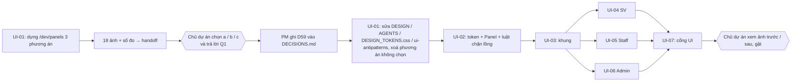

# SRS FEAT-ui-panels Panel nổi có kỷ luật: tách lớp giao diện (canvas → panel), token, primitive, đổi mọi màn
Phiên bản 1.1 · 2026-10-09 · Trạng thái: **APPROVED** (PM 2026-10-09: cả 11 TLR ACCEPTED; Q1–Q4, Q11 theo mặc định của BA vì chủ dự án vắng, đổi được qua `proposals.md`; **US-UI-01 chờ chọn phương án độ nổi — Q2**)

**v1.1 (2026-10-09)** — theo `TL-REVIEW.md` (PM `ACCEPTED` TLR-1…TLR-11; chi tiết ở `US.md` v1.1). Đổi ở SRS: 4.2 điều 2 và 8, 4.3 (ba phép mới, phép bóng cũ sửa, không ESLint — TLR-1, TLR-2), 4.4 FR-UI-3 / FR-UI-5, 5.1 (thêm `DESIGN_TOKENS.css` — TLR-7), 5.2 / 5.3 (chỉ chỉnh theo chiều tăng tương phản, thêm nền `--ep-surface-subtle` / `--ep-red-soft` — TLR-8), 5.4 (`Panel` không `margin`, không `PanelContext`), 7.1 (`Page` lề mobile 12 px — TLR-4), 7.4 (chỉ trạng thái có dữ liệu — TLR-11), 8.1 (đo JS — TLR-5), 8.2 (ảnh mốc ở từng story — TLR-3), 8.2 (quy tắc máy diện tích đỏ — TLR-9), 9, 10.


Nguồn: `docs/sprints/5.5/plan.md` (góp ý chủ dự án 2026-10-08, đề xuất D59, UI-01…07, cổng sprint 5.5), `design/DESIGN.md` §0, §3, §4, §7, §10, §14, §17–§19, §21–§22, `UX.md` mục 6, `AGENTS.md` "Luật giao diện", spec nền `docs/specs/FEAT-ui-foundation/`, `docs/sprints/5/handoff/dev-US-PU-06.md`, `frontend/src/shared/{styles,ui,shell}`, `frontend/src/app/`.

## 1. Mục đích và phạm vi

Chủ dự án muốn các khối **nổi bật hơn**: nền trang không cùng màu từ đầu đến cuối; mỗi nhóm nội dung nằm trên **một panel sáng hơn, bo góc rộng, tiêu đề nằm ngoài panel**, bên trong có ô nhấn cho 1–3 số liệu (tham chiếu Start Page của Safari). `DESIGN.md` hiện cấm đúng điều đó ("No floating-card aesthetic", "No decorative shadows on ordinary surfaces", "Panels: 8–12px only…"), nên đây là **đổi hướng thị giác có chủ đích (D59 "panel có kỷ luật")**: lấy cái chủ dự án muốn, giữ các luật vẫn đúng (không card lồng card, không tường thẻ KPI, đỏ chỉ là tín hiệu, một hành động chính mỗi vùng, 375 px cho màn Sinh viên).

**Trong phạm vi:** `frontend/src/shared/{styles,ui,shell}` (token, `Panel` / `PanelSection`, khung ứng dụng, `AuthShell`, `PreShell`), CSS của mọi màn trong `frontend/src/features/**` và `frontend/src/app/**` (chỉ phần bề mặt), `docs/design/DESIGN.md`, `AGENTS.md`, `scripts/ui-antipatterns.sh`, `docs/design/DESIGN_TOKENS.css`, `frontend/e2e/{panels,panels-variants,contrast}.spec.ts` (tên đề xuất) và ảnh mốc `visual.spec.ts`, trang dev tạm `/dev/panels`.

**Ngoài phạm vi:** chế độ tối (mặc định chưa làm — Q1; chỉ bảo đảm màu đi qua token); đổi chữ, hành vi, dữ liệu, quyền, API, luồng (`FLOWS.md`); dựng thật các màn mock của phase sau; thêm thư viện (không cần: CSS Modules + token như D53); đổi `lighthouserc` (cổng giữ nguyên, US-UI-07 AC5).

## 2. Người dùng và quyền

Người dùng bốn vai (`STUDENT`, `TA`, `TEACHER`, `ADMIN`) thấy cùng chức năng như trước; **không** endpoint hay quyền mới, `ACCESS` / `EXAM_DYNAMIC` của `nav.ts` không đổi (US-UI-03 AC7, US-UI-07 AC7). Người "dùng" của US-UI-01…02, 07 là **lập trình viên, QC, PM, chủ dự án** (chọn phương án, duyệt ảnh). Giữ nguyên: Admin không đọc nội dung lớp; TA / Giảng viên không đọc chat riêng chưa escalate; Sinh viên không thấy từ kỹ thuật AI, điểm nháp, ghi chú quan sát, nhãn rủi ro, đáp án khi bài còn mở.

## 3. Luồng chính



Điểm dừng duy nhất: **sau B** (US-UI-01 AC5). Dev không chạm `DESIGN.md`, `AGENTS.md`, `ui-antipatterns.sh`, `Panel.tsx`, `tokens.css`, CSS màn nào trước D59 (kiểm bằng quan hệ tổ tiên commit, TLR-10).

**Cấu trúc một trang sau đổi** (mọi route trong `(app)`): canvas → `PageHeader` (h1 + mô tả, ngoài panel) → lặp `Section` { tiêu đề vùng `h2.ep-section-title` ngoài panel → **một** `Panel` { `PanelSection`… ngăn bằng đường kẻ 1 px; ô nhấn `tone="strong"` ≤ 3 } }. `Tabs`, bộ lọc cấp trang, `Toolbar` cấp vùng nằm **ngoài** panel nếu chúng điều khiển nhiều vùng, **trong** panel nếu chỉ điều khiển bảng của panel đó. Lớp nổi (`Dialog`, `Drawer`, `Popover`, `Menu`, bảng "Thêm", `Composer` nổi) là **bề mặt riêng, không phải `Panel`** và không chứa `Panel`.

## 4. Yêu cầu chức năng

### 4.1 Bảng thay chữ ở ba nơi (US-UI-01 AC7) — đoạn **cũ nguyên văn** → đoạn mới

Đoạn mới ở cột "Mới" có chỗ `{PA}` phụ thuộc phương án: `(a)` = "viền 1 px `--ep-panel-border` và bóng tĩnh `--ep-elevation-1`"; `(b)` = "tách bằng chênh tông nền, không viền, không bóng"; `(c)` = "viền rõ `--ep-panel-border`, không bóng". **Không** sửa dòng nào khác của các tệp này. **Kiểm bằng so khớp nguyên dòng** (`grep -cxF`): cột "Cũ" là một dòng nguyên của tệp; sau khi sửa dòng cũ có `0`, dòng mới có `1`. Ngoại lệ: nếu chọn (b) / (c) thì hai dòng §7 "Shadow" `Default: none.` và `- Menus/popovers/dialogs only.` **giữ nguyên** (không thuộc "cũ → 0"); khi đó thêm dòng `Panels are never shadowed.` (kiểm `1`). Với phương án (a), dòng mới của hai hàng đó chứa dòng cũ làm tiền tố nên **không** dùng `grep -cF` chuỗi con (TLR-6).

| Tệp · vị trí | Cũ (nguyên văn) | Mới |
| --- | --- | --- |
| `DESIGN.md` §0 "What this direction refuses" | `- No decorative shadows on ordinary surfaces.` | `` - No decorative shadows. Panels may carry one static elevation (`--ep-elevation-1`, variant (a) only); floating layers keep `--ep-shadow-*`. `` — nếu chọn (b) hoặc (c): `` - No decorative shadows. Panels are separated by tone/border only; floating layers keep `--ep-shadow-*`. `` |
| `DESIGN.md` §3 "Surface character" | `- No floating-card aesthetic.` | `` - Disciplined panels: each working region is ONE Panel on `--ep-canvas` ({PA}); the region title sits outside the panel; no Panel inside Panel; no KPI wall. `` |
| `DESIGN.md` §3 "Surface character" | `- Use whitespace before containers.` | `- Inside a Panel, use whitespace and 1 px rules before any further container.` |
| `DESIGN.md` §4 bảng "Core palette" | hàng `--ep-paper` (cột Use: "Main canvas") — xem danh sách ngay dưới bảng | hàng `--ep-canvas` — xem danh sách dưới bảng |
| `DESIGN.md` §7 "Radius" | `- Panels: 8–12px only where a true contained surface is necessary.` | `` - Panels: `--ep-radius-panel` (14 px; 12–16 px allowed) — one Panel per working region. `` |
| `DESIGN.md` §7 "Radius" | `- Avoid 16–24px generic SaaS rounding.` | `- Outside Panels avoid 16–24px generic SaaS rounding.` |
| `DESIGN.md` §7 "Shadow" | `Default: none.` | `` Default: none. Exception: `--ep-elevation-1` on Panel when the chosen variant is (a). `` (nếu chọn (b) / (c): giữ `Default: none.` và thêm `Panels are never shadowed.`) |
| `DESIGN.md` §7 "Shadow" | `- Menus/popovers/dialogs only.` | `` - Menus/popovers/dialogs, and Panel via `--ep-elevation-1` (variant (a) only). `` (nếu (b)/(c): giữ nguyên dòng) |
| `DESIGN.md` §18 "Minimum token categories" | `color.background.*` | `color.background.*  (canvas, surface, surface-subtle, surface-strong)` và thêm `elevation.*` |
| `DESIGN.md` §21 | `- Every section wrapped in a bordered rounded rectangle.` | `- More than one Panel per working region, a Panel around decoration or a single KPI, a Panel inside a Panel, or 3+ same-size Panels in a row at page top.` |
| `DESIGN.md` §22 điều 9 | `9. There is no unnecessary card/container/badge.` | `9. There is no container beyond the one Panel per working region, and no unnecessary badge.` |
| `AGENTS.md` "Luật giao diện" dòng 2 | `- Không tường thẻ KPI, không card lồng card, không bọc mọi mục trong khung bo góc. Dùng khoảng trắng, độ gần, chữ và đường kẻ 1 px trước khi dùng khung chứa.` | `` - Không tường thẻ KPI, không card lồng card. Mỗi vùng làm việc nằm trên **đúng một** `Panel` (nền trang `--ep-canvas`, tiêu đề vùng nằm ngoài panel, không `Panel` lồng `Panel`); trong panel dùng khoảng trắng, độ gần, chữ và đường kẻ 1 px trước khi dùng khung chứa. `` |
| `AGENTS.md` "Luật giao diện" dòng 3 | `- Bo góc nhỏ (6–12 px), gần như không bóng (chỉ menu / popover / dialog). Một họ chữ: Be Vietnam Pro. Không chữ gradient, không glass, không neon AI.` | `` - Bo góc nhỏ (6–12 px; riêng `Panel` dùng `--ep-radius-panel`), không bóng ngoài menu / popover / dialog{PB}. Một họ chữ: Be Vietnam Pro. Không chữ gradient, không glass, không neon AI. `` với `{PB}` = `` và `Panel` (`--ep-elevation-1`)`` nếu chọn (a), rỗng nếu (b) / (c) |

Chi tiết ba hàng §4 (dòng bảng có ký tự `|` nên liệt kê riêng; **nguyên văn cũ → mới**, mỗi mục một dòng của bảng "Core palette"):
- Cũ: `` | `--ep-paper` | `oklch(99% 0.006 25)` | `#fffafa` | Main canvas | `` → Mới: `` | `--ep-canvas` | <oklch của phương án chọn, 5.2> | <hex> | Page background (darker than panels) | ``.
- Cũ: `` | `--ep-surface` | `oklch(100% 0 0)` | `#ffffff` | Inputs, elevated focus surfaces | `` → Mới: cột Use = `Panels, inputs, sidebar, top bar`.
- Cũ: `` | `--ep-surface-subtle` | `oklch(97% 0.008 25)` | `#f9f3f3` | Sidebar / grouped secondary region | `` → Mới: cột Use = `Row hover, table header, grouped secondary region inside a Panel`; **thêm** hai hàng `--ep-surface-strong` (`Emphasis cell inside a Panel: 1–3 key numbers/states`) và `--ep-panel-border` (`Panel edge`).

Thêm **`docs/design/DESIGN_TOKENS.css`** (TLR-7): 3 dòng `--ep-paper` — dòng 4 (khai báo → `--ep-canvas` với giá trị phương án chọn), dòng 19 (vòng trong của `--ep-focus` → `--ep-surface`), dòng 68 (nền `html` → `--ep-canvas`); thêm bốn token còn lại (`--ep-surface-strong`, `--ep-elevation-1`, `--ep-radius-panel`, `--ep-panel-border`) cùng giá trị với `tokens.css`.

Cũng thêm **§10.14 `Panel` / `PanelSection`** và dòng `ui/Panel.tsx` ở §19 (US-UI-02 AC11). Nếu `design/INTEGRATION.md` nhắc `--ep-paper` thì sửa theo `--ep-canvas` (hiện không có — dev kiểm bằng `grep`).

### 4.2 Luật Panel (đo được)

1. **Một vùng làm việc = một Panel.** Vùng = nhóm nội dung phục vụ một việc (danh sách bài thi đang mở, biểu mẫu hồ sơ, bảng thành viên). Tiêu đề vùng là `h2.ep-section-title` **ngoài** panel; `h1` ngoài panel (TITLE = 0).
2. **Không `Panel` lồng `Panel`** (NEST = 0): chặn ở **hai lớp kiểm được bằng máy** (TLR-2) — phép tĩnh 22 của `ui-antipatterns.sh` (lồng trong cùng tệp JSX) và quét DOM `[data-ep-panel] [data-ep-panel]` = 0 ở `panels.spec.ts` (mọi route × vai, và `/dev/ui` kể cả khi mở `Dialog` / `Drawer` / `Popover`). Không có `PanelContext` (e2e chạy trên bản build nên lớp "chỉ ở build dev" không chạy; và nó kéo `Panel` thành client). `Dialog` / `Drawer` / `Popover` không chứa `Panel`; trong chúng nhóm nội dung dùng `PanelSection`.
3. **Trong panel**: nhóm tách bằng `PanelSection` — khoảng trắng + đường kẻ 1 px `--ep-rule`, **không** viền / bóng / bo góc riêng. Hàng danh sách và bảng ngăn bằng đường kẻ, **không** thẻ cho từng hàng.
4. **Ô nhấn** (`PanelSection tone="strong"`, nền `--ep-surface-strong`, bán kính `--ep-radius-md`, không viền, không bóng): chỉ cho số liệu / trạng thái quan trọng; **≤ 3 mỗi panel** (STRONG); không chứa `Panel` / `PanelSection`; ≥ 4 ô nhấn ngang hàng = tường thẻ KPI.
5. **Không tường thẻ KPI** (WALL = 0): không có ≥ 3 `Panel` anh em cùng rộng cùng hàng trong 800 px đầu trang; số liệu là một dải gọn **trong** một panel.
6. **Đỏ chỉ là tín hiệu** (đang ở đâu / cần làm / đã xác nhận): không tô nền canvas, panel hay ô nhấn bằng đỏ; `--ep-red-soft` chỉ cho mục chọn / chú ý bên trong panel; diện tích đỏ < 8 % khung hình.
7. **Một hành động chính mỗi vùng** (nút đỏ đặc); tối đa 2 hành động phụ hiện, còn lại vào menu — không đổi so với `AGENTS.md`.
8. **Mobile (< 720 px)** — **một quy tắc lề duy nhất** (TLR-4): mép trái / phải của mọi `[data-ep-panel]` cách mép viewport **đúng `--ep-space-3` (12 px)**, cài bằng `.page { padding-inline: var(--ep-space-3) }` ở < 720 px (thay 16 px hiện có); `Panel` **không `margin`**, không cộng dồn với lề `Page`; padding trong panel ≥ `--ep-space-4` (16 px) ⇒ bề rộng chữ còn lại ở 375 px = 375 − 24 − 2 × 16 = **319 px**; **giữ bán kính**, một cột; vùng chạm ≥ 44 px (Sinh viên, `/attendance`, `/inbox`). Đo bằng `getBoundingClientRect().left === 12` và `innerWidth − right === 12` ở 375 / 390.
9. **Bóng tĩnh**: `box-shadow` chỉ ở `Panel.module.css` (`--ep-elevation-1`) và ở lớp nổi hiện có; **không** `filter`, `backdrop-filter`, `transition` trên bóng.

### 4.3 Máy kiểm — `scripts/ui-antipatterns.sh` 19 → 22 phép (không thêm luật ESLint)

| # | Phép mới | Bắt | Loại trừ | Hạt giống `--selftest` |
| --- | --- | --- | --- | --- |
| 20 | `Bóng elevation ngoài Panel` | (i) `--ep-elevation-1` trong `frontend/src` ngoài `shared/styles/` và `shared/ui/Panel.module.css`; (ii) trong `shared/ui/Panel.module.css` mọi `box-shadow` khác `var(--ep-elevation-1)` / `none` | `shared/styles/` | (i) `.e { box-shadow: var(--ep-elevation-1); }` ở `features/_selftest/f.module.css`; (ii) ghi **nối** `.h { box-shadow: 0 2px 4px #000; }` vào bản sao `shared/ui/Panel.module.css` |
| 21 | `Bo góc panel ngoài Panel` | `--ep-radius-panel` trong `frontend/src` | `shared/styles/`, `shared/ui/Panel.module.css` | `.g { border-radius: var(--ep-radius-panel); }` ở `features/_selftest/g.module.css` |
| 22 | `Panel lồng Panel (cùng tệp)` | tệp `.tsx` có JSX `<Panel …>` nằm giữa một `<Panel …>` và `</Panel>` tương ứng (đếm độ sâu theo từng thẻ mở / đóng; thẻ tự đóng `<Panel … />` không tăng độ sâu; hỗ trợ thẻ mở nhiều dòng) | `shared/ui/Panel.tsx` | `features/_selftest/nest.tsx`: `<Panel><Panel>x</Panel></Panel>` trải nhiều dòng |

**Trần của phép 22 (ghi rõ để không tưởng nó bắt hết):** chỉ thấy lồng **trong cùng tệp**; lồng qua ranh giới thành phần (một `Panel` ở thành phần A bọc thành phần B có `Panel`) do phép kiểm DOM `NEST = 0` ở `panels.spec.ts` bắt (US-UI-02 AC4).

**Phép hiện có sửa (TLR-1):** "Bóng ngoài Popover/Dialog/Menu/Drawer/Composer" bắt mọi `box-shadow:` ngoài năm tệp `shared/ui/(Popover|Dialog|Menu|Drawer|Composer)` trừ nội dung `var(--ep-shadow-*)`, `var(--ep-focus)`, `none`; dòng `box-shadow: var(--ep-elevation-1)` ở `Panel.module.css` (bắt buộc theo US-UI-02 AC2–AC3) làm phép này `✗`. Sửa: thêm **`shared/ui/Panel\.module\.css`** vào regex loại trừ đường dẫn của phép này (phép 20 (ii) lấp lại khoảng trống: trong chính tệp đó chỉ cho `var(--ep-elevation-1)` / `none`). Hạt giống "bóng lạ" của phép cũ (`features/_selftest/e.module.css`: `box-shadow: 0 2px 4px #000`) **vẫn phải bị bắt**, và hạt giống (i) của phép 20 phải bị bắt **bởi cả phép 20** (TLR-1).

Các phép khác **không đổi**: "Bo góc kiểu SaaS / số cứng" đã chấp nhận `var(--ep-radius-*)` nên `--ep-radius-panel` hợp lệ ở mọi tệp (phép 21 giới hạn nơi dùng); "Khung vỏ dùng nền đặc" giữ nguyên (sidebar / thanh trên không `backdrop-filter`, không màu trong suốt). `eslint.config.mjs` và `lint-selftest.sh` **không đổi** (7 luật).

### 4.4 Danh sách FR

| FR | Nội dung | Story · AC |
| --- | --- | --- |
| FR-UI-1 | Trang `/dev/panels` dựng 3 phương án × 2 vai trong khung thật; 18 ảnh; số đo tương phản / `ΔL` | 01-AC1…AC4 |
| FR-UI-2 | Điểm dừng chờ chủ dự án; D59 ghi `DECISIONS.md`; chỉ sau đó sửa `DESIGN` / `AGENTS` / script | 01-AC5…AC7 |
| FR-UI-3 | Xoá phương án không chọn; ba phép máy kiểm mới + sửa phép bóng cũ (19 → 22) | 01-AC8, 02-AC9 |
| FR-UI-4 | 5 token: `--ep-canvas`, `--ep-surface-strong`, `--ep-elevation-1`, `--ep-radius-panel`, `--ep-panel-border`; xoá `--ep-paper` | 02-AC1, AC2 |
| FR-UI-5 | `Panel` / `PanelSection` (Server Component thuần CSS), hợp đồng DOM; luật chặn lồng 2 lớp (phép tĩnh 22 + DOM); trần ô nhấn; không tường KPI | 02-AC3…AC5, AC7 |
| FR-UI-6 | Tương phản chữ ≥ 4,5 : 1 trên canvas, panel, ô nhấn, sidebar / thanh trên | 02-AC6, 07-AC3 |
| FR-UI-7 | Sẵn sàng chế độ tối (chỉ qua token), chưa làm | 02-AC8 |
| FR-UI-8 | Hiệu năng: ≤ +2 KB gzip mỗi route; `PreShell` không import `Panel` | 02-AC10, 03-AC6, 07-AC5 |
| FR-UI-9 | Khung: canvas / sidebar / thanh trên; trạng thái nav; mobile; `AuthShell`; `PreShell` | 03-AC1…AC8 |
| FR-UI-10 | Màn Sinh viên (16 route) | 04-AC1…AC8 |
| FR-UI-11 | Màn Staff (26 route) | 05-AC1…AC8 |
| FR-UI-12 | Màn Admin (7 route) | 06-AC1…AC6 |
| FR-UI-13 | Cổng UI: ảnh trước / sau (78), ảnh mốc, axe, panel mọi route, Lighthouse, luật máy kiểm, quyền không đổi, duyệt | 07-AC1…AC9 |

## 5. Dữ liệu — token và primitive (không có bảng CSDL)

### 5.1 Năm token mới, một token bị xoá

| Token | Vai trò | Ghi chú |
| --- | --- | --- |
| `--ep-canvas` | nền trang (thay `--ep-paper`) | tối hơn `--ep-surface` đúng `ΔL` của phương án |
| `--ep-surface-strong` | ô nhấn trong panel | `oklch(96% 0.012 25)` ≈ `#faefee` ở cả ba phương án |
| `--ep-elevation-1` | bóng tĩnh của `Panel` | `none` ở (b), (c) — token luôn tồn tại để API không đổi |
| `--ep-radius-panel` | bán kính `Panel` | mặc định 14 px; trong [12, 16] px (Q3) |
| `--ep-panel-border` | viền `Panel` | BA thêm (plan chỉ nêu 4 token) vì (b) / (c) cần viền khác nhau |
| ~~`--ep-paper`~~ | **xoá** | thay bằng `--ep-canvas` (nền) hoặc `--ep-surface` (vòng focus, nền ô nhập); `--ep-focus` dùng `--ep-surface` làm vòng trong |

Token chỉ ở `frontend/src/shared/styles/tokens.css` `:root` (`color-scheme: light`). Không bí danh `--ep-paper` (cắt hẳn, mọi nơi dùng đã chuyển — US-UI-02 AC1). Chỗ dùng `--ep-paper` hiện có (dev đổi hết): `shared/styles/{tokens,base}.css`, `shared/shell/{AppShell,AuthShell}.module.css`, `shared/ui/DataTable.module.css`, `features/{chat/ChatScreen,calendar/Calendar,grading/SubmissionReview,gradebook/GradeScheme}.module.css`, và **`docs/design/DESIGN_TOKENS.css`** (dòng 4, 19, 68 — TLR-7; tệp thiết kế, dev sửa cùng đợt `DESIGN.md`).

### 5.2 Giá trị ba phương án (giá trị khởi điểm; dev chỉ được chỉnh **theo chiều làm tương phản tăng** — canvas sáng hơn tối đa 1 điểm `L`, chữ đậm hơn — mọi cặp ≥ 4,5 : 1 sau chỉnh, bảng số trong handoff; TLR-8)

| Token | (a) xám ấm + bóng mềm | (b) chênh tông, không bóng | (c) viền rõ, không bóng |
| --- | --- | --- | --- |
| `--ep-canvas` | `oklch(95% 0.008 60)` ≈ `#f3ede9` | `oklch(93% 0.010 60)` ≈ `#ede6e1` | `oklch(97% 0.006 60)` ≈ `#f8f4f1` |
| `ΔL` so với panel trắng | 5 | 7 | 3 |
| `--ep-surface` (panel, sidebar, thanh trên) | `oklch(100% 0 0)` | như (a) | như (a) |
| `--ep-panel-border` | `var(--ep-rule)` (`oklch(89% 0.012 25)`) | `transparent` | `oklch(80% 0.012 25)` ≈ `#c5bbba` |
| `--ep-elevation-1` | `0 1px 2px rgb(71 32 37 / .05), 0 6px 18px rgb(71 32 37 / .07)` | `none` | `none` |
| `--ep-radius-panel` | 14 px | 14 px | 14 px |
| `--ep-ink-3` | `oklch(53% 0.014 25)` (giữ) | `oklch(51% 0.014 25)` ≈ `#6e6362` (hạ để đạt 4,5 trên canvas 93 %) | giữ |

Cả ba dùng sidebar và thanh trên nền `--ep-surface` + đường kẻ `--ep-rule` (US-UI-03 AC1). Giá trị bóng rgb(71 32 37) cùng họ với `--ep-shadow-popover`. Mọi giá trị trên nằm trong `shared/styles/panel-variants.css` (tạm, `[data-surface="a|b|c"]`) tới khi chọn; sau đó chỉ còn cột đã chọn trong `tokens.css`.

### 5.3 Ma trận tương phản chữ × nền (tính theo WCAG từ màu đã giải; **mọi ô ≥ 4,5**)

Số đo của BA (công thức WCAG 2.x, sRGB từ OKLCH) cho giá trị khởi điểm 5.2 — dev đo lại bằng `contrast.spec.ts` và dán vào handoff.

| Chữ \ Nền | canvas (a) | canvas (b) | canvas (c) | panel `--ep-surface` | ô nhấn `--ep-surface-strong` | `--ep-surface-subtle` (đầu bảng, hover) | `--ep-red-soft` (mục chọn) |
| --- | --- | --- | --- | --- | --- | --- | --- |
| `--ep-ink` | 16,01 | 15,07 | 16,99 | 18,55 | 16,45 | 16,96 | 16,26 |
| `--ep-ink-2` | 8,02 | 7,55 | 8,51 | 9,29 | 8,24 | 8,49 | 8,14 |
| `--ep-ink-3` (53 %) | 4,59 | **4,32 ✗** | 4,87 | 5,31 | 4,71 | 4,86 | 4,66 |
| `--ep-ink-3` (51 %) — dùng ở (b) | 4,99 | 4,70 | 5,30 | 5,79 | 5,13 | 5,29 | 5,07 |
| `--ep-red` | 4,90 | 4,61 | 5,20 | 5,67 | 5,03 | 5,19 | 4,97 |
| `--ep-green` | 5,11 | 4,81 | 5,42 | 5,92 | 5,25 | 5,41 | 5,19 |
| `--ep-blue` | 4,92 | 4,63 | 5,22 | 5,70 | 5,05 | 5,21 | 5,00 |

Hệ quả: nếu chọn (b) thì **bắt buộc** hạ `--ep-ink-3` xuống 51 % (53 % chỉ đạt 4,32 trên canvas (b)) và `DESIGN.md` §4 ghi giá trị mới; `--ep-red` / `--ep-blue` trên canvas (b) chỉ đạt 4,61 / 4,63 — sát ngưỡng, nên (b) là phương án rủi ro tương phản cao nhất (ghi vào `QUESTIONS.md` Q2). `--ep-amber` (3,58 trên panel) **không** là màu chữ: chỉ viền / chấm / biểu tượng **nằm trong panel** (≥ 3 : 1 trên `--ep-surface`); **không đặt amber trực tiếp trên canvas** (amber trên canvas: (a) 3,09, (b) **2,91 < 3**, (c) 3,28). Tính lại độc lập bởi Tech Lead (TL-REVIEW, TLR-8): khớp từng ô; biên mỏng nhất là `--ep-ink-3` trên canvas (a) = 4,59 — canvas (a) **không** được làm tối hơn.

### 5.4 Hợp đồng `Panel` / `PanelSection` (`frontend/src/shared/ui/Panel.tsx`, xuất ở `shared/ui/index.ts`)

```ts
type PanelProps = { as?: "div" | "section"; padding?: "md" | "lg" | "none"; "aria-label"?: string; children: ReactNode; className?: never };
type PanelSectionProps = { title?: ReactNode; action?: ReactNode; tone?: "default" | "strong"; children: ReactNode };
```

| Phần | DOM / CSS |
| --- | --- |
| `Panel` | `<div|section data-ep-panel>`; nền `--ep-surface`; `border: 1px solid var(--ep-panel-border)`; `border-radius: var(--ep-radius-panel)`; `box-shadow: var(--ep-elevation-1)`; padding `--ep-space-6` (`lg`: `--ep-space-8`; `none`: 0); mobile < 720 px: **không `margin`**, padding `--ep-space-4`; lề 12 px tới mép viewport do `.page { padding-inline: var(--ep-space-3) }` (TLR-4) |
| `PanelSection` (default) | `<div data-ep-panel-section>`; tiêu đề (nếu có) = **`h3`** (`ep-item-title`); `PanelSection` đứng sau `PanelSection`: `border-top: 1px solid var(--ep-rule)`, `padding-top`/`margin-top` `--ep-space-6`; không viền / bóng / bo góc riêng |
| `PanelSection tone="strong"` | thêm `data-tone="strong"`; nền `--ep-surface-strong`; `border-radius: var(--ep-radius-md)`; padding `--ep-space-4`; không viền, không bóng; số liệu dùng thang chữ `ep-section-title` (không cỡ chữ mới) |
| Luật | **Server Component thuần CSS, 0 byte JS** — không `"use client"`, không `createContext` / `PanelContext` (TLR-2); chặn lồng bằng phép tĩnh 22 + kiểm DOM; `className` **không** cho truyền (chặn "tự chế" khung) |

`Section` (`Layout.tsx`) **giữ nguyên**: tiêu đề + mô tả + hành động ở ngoài; `<Panel>` là con của `Section`. Primitive trong panel: `DataTable`, `ActionList`, `Tabs`, `DefinitionList` không có viền / bóng / bo góc ở phần tử gốc; đầu bảng nền `--ep-surface-subtle`; `Composer` trong panel ngăn bằng đường kẻ trên 1 px, không `--ep-shadow-composer`; `InlineNotice` giữ viền nhạt (cảnh báo, không phải khung vùng).

## 6. API

**Không có.** Không endpoint, mã lỗi, cache hay dữ liệu mới.

## 7. Giao diện

### 7.1 Khung ứng dụng (US-UI-03)

| Phần | Nền | Cạnh | Ghi chú |
| --- | --- | --- | --- |
| `<body>` / `main` | `--ep-canvas` | — | cuộn; `Page` giữ `reading` 960 / `wide` 1440 / `full`; **< 720 px `padding-inline: var(--ep-space-3)`** (12 px, một quy tắc lề — TLR-4) |
| Sidebar (cố định) | `--ep-surface` | `border-right: 1px solid var(--ep-rule)` | mục `hover` / đang chọn nền `--ep-surface-subtle`; vạch đỏ 2 px "đang ở đâu" giữ |
| Thanh trên (cố định, 56 px) | `--ep-surface` | `border-bottom: 1px solid var(--ep-rule)` | đặc, không `backdrop-filter` |
| Thanh dưới mobile | `--ep-surface` | `border-top: 1px solid var(--ep-rule)` | 4 đích + "Thêm" |
| Bảng "Thêm" | `--ep-surface`, `--ep-shadow-popover`, `--ep-radius-lg` | — | lớp nổi, không `Panel` |
| `AuthShell` | canvas + **một** `Panel` ≤ 440 px giữa trang; `h1` ngoài panel | — | `/login`, `/register`, `/forgot-password`, `/reset-password`, `/verify-email`, `/invite/[token]` |
| `PreShell` | cùng lớp CSS / token với `AppShell`; **không** import `Panel` | — | LCP = `h1` máy chủ (US-PU-06) |

### 7.2 Bảng màn hình → vùng → panel (US-UI-04…06)

Quy ước cột: **Vùng → Panel** = mỗi vùng một `Panel`; "ngoài panel" = tiêu đề vùng, `Tabs` cấp trang, bộ lọc cấp trang. "375" = đạt thêm AC7 của US-UI-04 (Sinh viên). `Dr` = `Drawer` (lớp nổi, không `Panel`).

**Sinh viên (US-UI-04)**

| Route | Khung nhìn đầu (theo `DESIGN.md`) | Vùng → Panel | Ghi chú |
| --- | --- | --- | --- |
| `/` | §14.1 Student: lời chào + ngày, **một** hành động nên làm, dòng thời gian | "Việc nên làm tiếp" (1 hành động chính + lý do + thời gian ước lượng) · "Hôm nay" (timeline) · "Tiếp tục học" | ≤ 1 ô nhấn; chưa vào lớp: một panel + `EmptyState` + `Vào lớp bằng mã`; 375 |
| `/exams` | nhóm `Đang mở` / `Sắp tới` / `Đã có điểm` | mỗi nhóm có dữ liệu một panel, hàng ngăn đường kẻ, mỗi hàng 1 hành động | 375; rỗng = một panel + `EmptyState` |
| `/exams/[id]/take` | trước giờ / đang làm (trắc nghiệm, code) / đã nộp / đã công bố | trước giờ: 1 panel · trắc nghiệm: panel câu hiện tại (+ danh sách câu: cột ≥ 1100 px hoặc bảng trượt) · code ≥ 1024 px: 2 panel (đề + test mẫu \| soạn mã + kết quả) · đã công bố: 1 panel (≤ 3 ô nhấn: điểm, số đúng, trạng thái) | thanh trên cố định (`Câu i/n`, đồng hồ, lưu) là **thanh nền `--ep-surface`**, không `Panel`; 375 |
| `/join`, `/join/[code]` | nhập mã / xác nhận | 1 panel, 1 nút chính | 375 |
| `/settings` | Tài khoản và bảo mật | mỗi mục (Hồ sơ, Mật khẩu, Phiên…) một panel, trường nhiều tách bằng `PanelSection` | `Dialog` bảo vệ giữ; 375 |
| `/chat` | §14.2 | 1 panel cuộc trò chuyện; `Composer` dính đáy **trong** panel, ngăn đường kẻ | mock; 375 |
| `/threads`, `/threads/[id]` | §14.3–§14.4 | danh sách = 1 panel (lọc ngoài); chi tiết = 1 panel bài + 1 panel trả lời | mock; 375 |
| `/practice`, `/practice/[attemptId]`, `/practice/history` | §14.18–§14.20 | chọn đề = 1 panel; câu hỏi = 1 panel; lịch sử = 1 panel | mock; 375 |
| `/library`, `/calendar` | §14.15–§14.16 | danh sách / lịch = 1 panel (không thẻ chợ) | mock; 375 |
| `/me` | §14.9 | "Điểm hiện tại" = 1 panel, ≤ 3 ô nhấn (không 6 thẻ); "Điều ảnh hưởng" = 1 panel | mock; 375 |
| `/assignments/[id]` | bài tập | 1 panel đề + 1 panel nộp | mock; 375 |

**Giảng viên / TA (US-UI-05)** — `GV` = chỉ Giảng viên

| Route | Khung nhìn đầu | Vùng → Panel | Ghi chú |
| --- | --- | --- | --- |
| `/` | §14.1 Teacher / TA | "{N} việc cần xử lý hôm nay" (`ActionList`, 1 nút chính) · "Lớp cần chú ý" · "Sắp tới" | không hero metrics; ≤ 1 ô nhấn |
| `/class/members` | bảng thành viên | `Tabs` ngoài panel; mỗi tab 1 panel; tab "Nạp danh sách" = 1 panel với `PanelSection` (chọn tệp → xem trước → kết quả), ≤ 3 ô nhấn (thêm / bỏ qua / lỗi) | TA: quyền như cũ |
| `/class/settings` | cài đặt lớp | mỗi mục 1 panel | |
| `/exams` | nhóm `Đang mở` / `Sắp tới` / `Đã đóng` / `Nháp` | mỗi nhóm 1 panel; nút chính `Tạo bài thi` | |
| `/exams/[id]` | soạn | `Tabs` ngoài; `Thông tin` 1 panel (`PanelSection`: Thời gian, Chấm điểm, Hiển thị, Xáo trộn); `Câu hỏi` 1 panel (tổng điểm = 1 ô nhấn); `Xem trước` 1 panel | `InlineNotice` lỗi lên lịch trong panel; `Dr` "Chọn câu từ ngân hàng" |
| `/exams/[id]/results` | bảng kết quả | thanh tiến độ + bảng trong 1 panel; `Tabs` ngoài (tab "Nghi giống nhau" là liên kết, GV); mỗi tab thống kê 1 panel, ≤ 3 ô nhấn | `Dr` chi tiết lượt; cuộn 1.000 dòng p95 ≤ 25 ms |
| `/exams/[id]/similarity` (GV) | bảng cặp | bảng cặp 1 panel; mở cặp: hai khối mã cạnh nhau (≥ 1024 px) = 2 ô `tone="strong"` trong cùng panel | dòng "Độ giống chỉ là gợi ý…" giữ |
| `/questions` | §14.17 | toolbar + bảng trong 1 panel | `Dr` `QuestionReview` |
| `/inbox` | §14.5 | danh sách phiếu 1 panel (+ chi tiết = `Dr` hoặc cột cùng panel, không lồng) | 375 |
| `/students`, `/students/[id]` | §14.6–§14.7 | danh sách = 1 panel; hồ sơ: mỗi nhóm (tóm tắt, học tập, ghi chú) 1 panel — **không 6 thẻ** | |
| `/attendance` | §14.8 | phiên + danh sách điểm danh = 1 panel | 375 |
| `/gradebook`, `/gradebook/scheme` | §14.10–§14.11 | sổ điểm = 1 panel (không thẻ); công thức: mỗi bước 1 `PanelSection` | |
| `/grading`, `/grading/[submissionId]` | §14.12–§14.13 | hàng chờ 1 panel; duyệt: bài + rubric = 2 panel cạnh nhau (không lồng) | |
| `/documents`, `/insights`, `/analytics` | §14.14, §14.21, §14.25 | mỗi vùng 1 panel; biểu đồ trong panel; **không ba thẻ lớn** | |
| `/observability` (GV), `/settings/llm` (GV), `/settings/integrations` (GV) | §14.22–§14.24 | dải trạng thái gọn trong 1 panel; cấu hình theo hàng, không thẻ | |
| `/threads`, `/threads/[id]`, `/calendar`, `/settings` | như bảng Sinh viên | như trên | |

**Admin (US-UI-06)**

| Route | Khung nhìn đầu | Vùng → Panel | Ghi chú |
| --- | --- | --- | --- |
| `/` | Hôm nay — Admin | vùng vận hành = 1 panel | |
| `/admin/users` | danh sách người dùng | toolbar + bảng trong 1 panel; nút chính `Mời người dùng`; `Dialog` giữ | |
| `/admin/courses` | danh sách lớp | 1 panel (mã, tên, giảng viên, trạng thái, số thành viên; **không** nội dung lớp); nút chính `Tạo lớp` | |
| `/settings/llm` | §14.23 | "Nhà cung cấp" 1 panel (mỗi nhà một **hàng**, không ba thẻ) · "Gán theo tác vụ" 1 panel (`LLMRouteTable`) | khoá che |
| `/observability` | §14.22 | dải trạng thái gọn trong 1 panel | prompt chỉ ADMIN + `audit_log` |
| `/settings/integrations`, `/settings` | §14.24 | mỗi mục 1 panel | |

### 7.3 Trang dev tạm `/dev/panels` (US-UI-01)

`/dev/panels?surface=<a|b|c>&role=<teacher|student>` (mặc định `a` / `teacher`); chỉ ở build có `NEXT_PUBLIC_DEV_TOOLS=1` (404 ở build như production); dựng **trang "Hôm nay" mẫu** trong `AppShell` thật, thuộc tính `data-surface` đặt trên `<html>` bởi trang; mọi thành phần dùng token, **không** màu cứng; dữ liệu giả cố định từ `mock/`, **không** dữ liệu người thật. Mẫu Giảng viên: "Việc cần xử lý hôm nay" (≥ 4 hàng, 1 nút chính) · "Lớp cần chú ý" · "Sắp tới". Mẫu Sinh viên: "Việc nên làm tiếp" (1 hành động + lý do + "≈ 15 phút") · "Hôm nay" (≥ 3 mốc). Mỗi mẫu có ≥ 1 ô nhấn (≤ 3). Trang **bị xoá** ở US-UI-01 AC8.

### 7.4 Ma trận route × vai cho `panels.spec.ts` / `a11y.spec.ts` (US-UI-04…07)

- **Sinh viên:** 16 route của bảng Sinh viên (với `/exams/[id]/take` ở 4 trạng thái).
- **TA:** 22 route của bảng Staff trừ các route chỉ GV (`/exams/[id]/similarity`, `/observability`, `/settings/llm`, `/settings/integrations`).
- **Giảng viên:** 26 route của bảng Staff.
- **Admin:** 7 route của bảng Admin.
- **Không vai (khung đăng nhập):** `/login`, `/register`, `/forgot-password`, `/reset-password`, `/verify-email`, `/invite/[token]`.
- **Miễn "≥ 1 panel":** route stub `[...slug]` và `/dev/*` (vẫn phải đạt NEST = 0, TITLE = 0).
- **Chỉ trạng thái "có dữ liệu"** cho ma trận route × vai (TLR-11). Trạng thái tải / rỗng / lỗi kiểm **một lần cho mỗi khối** bằng `PageState` trong `Panel` ở `/dev/ui#panel` (US-UI-02 AC7). Trần thời gian `panels.spec.ts` ≤ 3 phút ở CI.

## 8. Phi chức năng

### 8.1 Hiệu năng (`UX.md` mục 3)

Cổng của US-PU-06 **giữ nguyên và vẫn `error`**: sáu route người dùng LCP (lượt `devtools`) ≤ 2.500 ms, TBT ≤ 200 ms (mô phỏng 4×) / ≤ 170 ms (12× máy dev), CLS ≤ 0,1, `resource-summary:script:size` ≤ 256.000 byte. **"Không kém hơn cuối sprint 5"** được đo so với `docs/sprints/5/handoff/dev-US-PU-06.md`: LCP `devtools` tăng ≤ 150 ms, TBT 12× tăng ≤ 30 ms (dao động CI ≈ 30 ms theo TL-1), **JS truyền (gzip) mỗi route tăng ≤ 2 KB**, đo **như PU-06**: tổng `transferSize` của request `resourceType = Script` trong `audits["network-requests"]` (hoặc `audits["resource-summary"]` → `script`) của LHR, trung vị các lượt, sáu route người dùng + `/dev/ui` — **không** dùng bảng `First Load JS` của `next build` (Next 16 / Turbopack không in cột này; TLR-5); bóng chỉ `box-shadow` tĩnh (không `filter`, `backdrop-filter`, `transition`); `Panel` là Server Component 0 byte JS nên ngưỡng +2 KB chủ yếu là lưới an toàn cho CSS / mã màn.

### 8.2 Ảnh trước / sau và ảnh mốc

**13 màn chính** (US-UI-07 AC1; tên ảnh `<màn>-<1440|1024|375>.png`): `home-student` (`/`, Sinh viên), `exams-student` (`/exams`, Sinh viên), `take-pre` (`/exams/[id]/take` trước giờ), `take-run` (đang làm), `home-teacher` (`/`, Giảng viên), `members` (`/class/members`), `questions` (`/questions`), `exam-editor` (`/exams/[id]`), `exam-results` (`/exams/[id]/results`), `admin-users` (`/admin/users`), `admin-courses` (`/admin/courses`), `settings-llm` (`/settings/llm`), `login` (`/login`). 13 × 3 × 2 = **78 ảnh** ở `docs/sprints/5.5/handoff/ui-07/{before,after}/`. Ảnh ở US-UI-01 (`ui-01/`, 18 ảnh) và US-UI-03 (`ui-03/`, 12 ảnh) là bằng chứng của story đó.

**Ảnh mốc `visual.spec.ts`** (14 ảnh = 7 route × 1440 / 390): đổi gần như hết; **sinh lại ở từng story làm đổi điểm ảnh** (US-UI-02 — `--ep-paper` → `--ep-canvas` đổi nền mọi trang —, UI-03, UI-04…06) theo quy tắc Q-QC-PU06-4 (handoff của story liệt kê từng ảnh + lý do + trước / sau; sinh trong đúng image `mcr.microsoft.com/playwright:v1.63.0-noble`, khớp `@playwright/test@1.63.0` trong `pnpm-lock.yaml`; QC đối chiếu "đổi có chủ đích"); **CI phải xanh sau mỗi story** (CI chạy `visual.spec.ts` với `retries: 0` nên không thể dồn sinh lại tới cuối). US-UI-07 AC2 là phép **đối chiếu cuối** (tập ảnh đổi từ `BASE55` ≡ hợp các handoff).

**Diện tích đỏ (US-UI-07 AC8; quy tắc máy — TLR-9):** điểm ảnh có ΔE2000 ≤ 10 so với `--ep-red` (sRGB đã giải) là "đỏ"; **không** tính `--ep-red-soft`; mẫu số = toàn ảnh `after` ở 1440 px; < 8 % ở 13 màn chính; đếm bằng `panels.spec.ts` hoặc script Node dùng `pngjs` đã có trong cây phụ thuộc của Playwright (không thêm vào `package.json`). Không thêm bề rộng 1024 vào `visual.spec.ts` (giữ 14 ảnh); 1024 chỉ chụp bằng `playwright-cli` để so trước / sau.

### 8.3 Trợ năng

axe 0 `critical` / `serious` ở mọi route × vai của 7.4; `color-contrast` 0 vi phạm; `axe-allow.json` không tăng; vòng focus nhìn rõ trên canvas, panel, sidebar (tương phản vòng ≥ 3 : 1); `Panel` không có vai trò ARIA riêng (là nhóm bố cục; `as="section"` + `aria-label` khi vùng cần được điều hướng bằng trình đọc màn hình); `forced-colors` — viền panel không biến mất (`transparent` của (b) phải có `border-color: CanvasText` trong `@media (forced-colors: active)` nếu chọn (b)).

### 8.4 Thư viện

Không thêm thư viện (CSS Modules + token, D53) và không thêm luật ESLint (chặn lồng `Panel` bằng phép 22 của `ui-antipatterns.sh` + kiểm DOM — TLR-2).

## 9. Kiểm thử

| Bộ | Tệp (tên đề xuất) | Phủ | Chạy ở CI |
| --- | --- | --- | --- |
| Biến thể | `e2e/panels-variants.spec.ts` | US-UI-01 AC2, AC3 (6 URL × 2 dự án) | không (trang dev bị xoá sau AC8) |
| Token / DOM / luật | `e2e/panels.spec.ts` | US-UI-02 AC1…AC5, AC7, AC8; US-UI-03 AC1, AC2, AC5, AC6; US-UI-04…06 (route × vai, **chỉ trạng thái có dữ liệu**); NEST, TITLE, STRONG, WALL, diện tích đỏ; **trần 3 phút ở CI** | có |
| Tương phản | `e2e/contrast.spec.ts` | US-UI-02 AC6; US-UI-06 AC5; US-UI-07 AC3 | có |
| Hiện có (không đổi số pass / skip) | `exam`, `today`, `account`, `class-join`, `shell`, `lcp`, `tokens`, `a11y`, `settings-llm`, `dev-ui`, `ui-foundation`, `data-layer` | không hồi quy | có |
| Ảnh mốc | `visual.spec.ts` | US-UI-07 AC2 | có (image Playwright) |
| Lighthouse | `lighthouserc.json`, `lighthouserc.devtools.json` | US-UI-07 AC5 | có |
| Máy kiểm tĩnh | `ui-antipatterns.sh` (22 phép + `--selftest`), `lint-selftest.sh` (7 luật, không đổi) | US-UI-01 AC8, US-UI-02 AC4, AC9 | có |

## 10. Câu hỏi mở và tác động sang spec khác

Câu hỏi: `QUESTIONS.md` (Q1 chế độ tối **[CHỦ DỰ ÁN]**, Q2 phương án độ nổi **[CHỦ DỰ ÁN]**, …).

**Tác động sang spec đã `APPROVED` (BA không tự sửa — PM ghi proposal khi duyệt spec này):**
- `FEAT-ui-foundation` US-PU-01 AC1 (danh sách token) + `SRS` 5.2: thêm / bỏ token (`--ep-paper` → `--ep-canvas`, 5 token mới kể cả `--ep-panel-border`); US-PU-02 AC (ma trận khối × trạng thái ở `SRS` 7.2): thêm khối `Panel`; US-PU-05 AC1 / US-PU-06 AC9 (14 ảnh mốc): ảnh đổi ở sprint 5.5 theo quy tắc handoff; `ui-antipatterns.sh` 19 → 22 phép (US-PU-05 AC6, PU-06 AC11 ghi "19 `✓`"); `lint-selftest.sh` **không đổi** (7 luật, US-PU-01 AC4).
- `DESIGN.md` / `AGENTS.md` / `DECISIONS.md` (D59): sửa theo 4.1 sau khi chủ dự án chọn.
- `FEAT-weekly-exam` 7.1: bố cục `/exams*` theo 7.2 (chỉ bề mặt, hành vi không đổi).

## 11. Truy vết

| Plan / nguồn | Story | FR | Test |
| --- | --- | --- | --- |
| UI-01 (3 phương án → chọn → D59 → sửa tài liệu) | US-UI-01 | FR-UI-1…3 | `panels-variants.spec`, `git log`, `grep` DECISIONS |
| UI-02 (token, `Panel`, luật lồng) | US-UI-02 | FR-UI-4…8 | `panels.spec`, `contrast.spec`, lint, antipatterns |
| UI-03 (khung, "Thêm" mobile) | US-UI-03 | FR-UI-9 | `shell.spec`, `panels.spec`, `lcp.spec` |
| UI-04 (Sinh viên, 375 px) | US-UI-04 | FR-UI-10 | `panels.spec`, `exam.spec`, `today.spec`, AUDIT / TOUCH |
| UI-05 (Giảng viên / TA) | US-UI-05 | FR-UI-11 | `panels.spec`, `exam.spec`, `class-join.spec` |
| UI-06 (Admin) | US-UI-06 | FR-UI-12 | `panels.spec`, `settings-llm.spec`, `a11y.spec` |
| UI-07 (cổng UI) + "Cổng nghiệm thu sprint 5.5" | US-UI-07 | FR-UI-13 | `visual.spec`, `a11y.spec`, Lighthouse, handoff |
