# SRS FEAT-prototype-ui Prototype giao diện toàn bộ tính năng
Phiên bản 5 · 2026-10-01 · Trạng thái: **APPROVED** (PM duyệt v5 2026-10-01; Q3, Q4 chốt theo mặc định của BA)

Lịch sử: v1 bản đầu · v2 mốc thời gian tuần 10, "bây giờ" = 29/10/2026 09:20 (#12) · v3 điểm BT03 của B = 8,0, QT = 8,7 (#13) · v4 chi tiết luồng Threads (#15) + phân định panel (#16) — APPROVED · **v5 UI polish (#17: FR-X12, mục 4.7) + Threads như thật (#18: mục 4.3.1)**. v5 không đổi số liệu, quyền hay luồng đã duyệt ở v4 ngoài phần Threads.

Nguồn: `docs/sprints/1.5/plan.md`, `docs/design/DESIGN.md` (§1–§2, §10, §12–§15, §21–§22), `docs/design/INTEGRATION.md` mục 2, `docs/PRD.md` §3–§4, `docs/FLOWS.md`, `docs/DEMO_SCRIPT.md`. Mục 5, 6, 8, 10 rút gọn theo prompt.

## 1. Mục đích và phạm vi
Prototype bấm được trong app Next.js thật (`pnpm dev` → `http://localhost:3000`), phủ mọi route dự định, dữ liệu mô phỏng, đổi được 4 vai, tương tác giả lập bằng trạng thái phía trình duyệt, đi trọn `docs/DEMO_SCRIPT.md` trong **một trình duyệt** bằng cách đổi vai. Phục vụ buổi thuyết trình với thầy hướng dẫn cuối tuần.

Ngoài phạm vi: backend, gọi API, LLM thật, mail thật (bước Mailpit 05:55 của kịch bản thay bằng dòng xác nhận trong app — FR-X7), PWA, chế độ tối, đăng nhập thật, i18n ngoài tiếng Việt, màn tài khoản F1 (`/verify-email`, `/forgot-password`…), màn phase PR (`/settings/privacy`, `/help`, `/admin/audit`, `/admin/health`), `/class/settings`.

Hợp đồng bố cục mỗi route nằm ở `DESIGN.md` §14.x (hoặc `INTEGRATION.md` mục 2 cho route ngoài §14). SRS này **không chép lại** hợp đồng; chỉ ghi dữ liệu mô phỏng, tương tác giả lập, trạng thái phải xem được, và chỗ §14 chưa nói.

## 2. Người dùng và quyền — ma trận vai × route

✓ = mở được · R = mở được, chỉ đọc (không có hành động ghi) · – = màn chặn quyền (FR-X4). Nguồn: PRD §3; chỗ `frontend/src/shared/shell/nav.ts` hiện lệch PRD được ghi ở cột Ghi chú và **phải sửa theo bảng này**.

| Route | SV | TA | GV | Admin | Ghi chú |
| --- | --- | --- | --- | --- | --- |
| `/login` | ✓ | ✓ | ✓ | ✓ | Không cần phiên |
| `/` Hôm nay | ✓ | ✓ | ✓ | ✓ | Nội dung theo vai (§14.1; Admin theo FLOWS F14) |
| `/chat` | ✓ | – | – | – | |
| `/threads`, `/threads/[id]` | ✓ | ✓ | ✓ | – | Xác nhận / Chỉnh sửa / Loại chỉ TA, GV |
| `/practice`, `/practice/[attemptId]`, `/practice/history` | ✓ | – | – | – | |
| `/library` | ✓ | – | – | – | |
| `/calendar` | ✓ | ✓ | ✓ | – | |
| `/me` | ✓ | – | – | – | |
| `/assignments/[id]` | ✓ | – | – | – | |
| `/join`, `/join/[code]` | ✓ | – | – | – | |
| `/inbox` | – | ✓ | ✓ | – | |
| `/students`, `/students/[id]` | – | ✓ | ✓ | – | |
| `/attendance` | – | ✓ | ✓ | – | |
| `/class/members` | – | ✓ | ✓ | – | TA: xem + duyệt yêu cầu; không tạo lại mã, không mời ra (PRD §3). **nav.ts hiện chặn TA → sửa** |
| `/gradebook` | – | R | ✓ | – | TA xem cả lớp (PRD §3), không sửa ô, không `Chốt điểm` |
| `/gradebook/scheme` | – | R | ✓ | – | Chỉ GV `Xác nhận công thức` |
| `/grading`, `/grading/[submissionId]` | – | ✓ | ✓ | – | TA `Duyệt bài`; chỉ GV `Công bố` |
| `/questions` | – | ✓ | ✓ | – | |
| `/documents` | – | ✓ | ✓ | – | |
| `/insights` | – | ✓ | ✓ | – | |
| `/analytics` | – | ✓ | ✓ | – | Mục chi phí: GV thấy, TA không (Q2) |
| `/observability` | – | – | R | ✓ | GV: chỉ số tổng hợp của lớp mình, không mở được nội dung yêu cầu; Admin mở Drawer có nội dung đã che + bắt nhập lý do (PRD M13) |
| `/settings/llm`, `/settings/integrations` | – | – | R | ✓ | GV "Xem" (PRD §3) |
| `/admin/courses`, `/admin/users` | – | – | – | ✓ | |

## 3. Luồng chính và nhánh lỗi

Đường đi kịch bản demo trên prototype (một trình duyệt, đổi vai bằng menu hồ sơ — FR-X2):

```mermaid
flowchart LR
  L[/login/] --> A1[Admin /admin/courses]
  A1 --> T1[GV / + chuông]
  T1 --> D1[SV D /join/BX4P9TW] --> T2[GV /class/members duyệt] --> D2[SV D /]
  D2 --> B1[SV B /chat D1, D2, D3]
  B1 --> T3[GV /inbox Nhận → Gửi trả lời] --> B2[SV B /chat thấy trả lời]
  B2 --> T4[GV /attendance buổi 10] --> B3[SV B /me]
  B3 --> B4[SV B /assignments/bt03 đang chấm] --> T5[GV /grading → Duyệt bài → Công bố] --> B5[SV B /assignments/bt03 có điểm]
  B5 --> T6[GV /gradebook lớp 2 → /gradebook/scheme xác nhận → lớp 1 giải trình] --> T7[GV /insights lớp 1, lớp 2]
```

| Tình huống | Prototype phản ứng | Người dùng thấy |
| --- | --- | --- |
| Mở route sai vai (gõ URL, đổi vai khi đang ở trang không được phép) | Không render nội dung trang | Màn chặn quyền FR-X4 |
| Chưa chọn vai (không có cookie) | Chuyển về `/login` | Màn chọn vai |
| `?state=loading` / `empty` / `error` trên route bất kỳ | Thay vùng nội dung bằng trạng thái tương ứng (FR-X5) | Skeleton đúng hình / rỗng dạy bước kế / lỗi có cách khắc phục |
| Mã tham gia sai (`/join`) | Không tiết lộ lý do | "Mã không hợp lệ hoặc đã hết hạn. Kiểm tra lại với giảng viên." (cùng câu cho mọi trường hợp) |
| Threads: gửi bài có MSSV / tên / điểm cá nhân | Không đăng | Dialog đúng hai lối (FR-S4) |
| Hai người cùng `Nhận` ticket | Nút `Nhận` của ticket mẫu "đã có người nhận" | Dòng "Phạm Quốc Bảo đã nhận lúc 09:12" thay cho nút (409 giả lập) |
| Điểm danh khi mất mạng | Công tắc "Giả lập mất mạng" | "Đang chờ mạng · 2 thay đổi"; bật lại → "Đã lưu 09:24" |
| Duyệt bài lệch > 1 điểm | Thông báo vàng tại tiêu chí | Không chặn `Duyệt bài` |
| Công thức điểm còn mục chưa rõ | `Xác nhận công thức` bị khoá | Lý do hiện khi rê / focus |
| Sửa ô sổ điểm trùng người khác | Ô mẫu có xung đột phiên bản | Dòng "Lê Thu Hà vừa sửa ô này thành 8,0 · Giữ của tôi / Dùng bản mới" (409 giả lập) |

## 4. Yêu cầu chức năng

### 4.1 Bộ dữ liệu mô phỏng chung (khớp `DEMO_SCRIPT.md`)

Mọi dữ liệu nằm ở `frontend/src/mock/*.ts`. Khi `mock/core.ts` (nháp PM) lệch bảng này, **bảng này thắng** vì kịch bản demo là kim chỉ nam (P0 L0).

| Mục | Giá trị |
| --- | --- |
| Bây giờ | Thứ Năm 29/10/2026 09:20 (+07:00), tuần 10, `HK1 2026–2027` (proposals #12, khớp `DEMO_SCRIPT.md`) |
| Học phần | An ninh mạng (giữ mã học phần trong mock; tên hiển thị "An ninh mạng") |
| Lớp 1 | Mã lớp `761987`, mã tham gia `AN7K2MQ`, không bật duyệt, 30 SV, P.302–G2, **Thứ Năm 09:00–11:30**: 15 buổi, buổi n rơi vào 27/08 + 7·(n−1) ngày; buổi 1–9 đã diễn ra, **buổi 10 (29/10) đang diễn ra lúc 09:20**; công thức điểm **đã xác nhận** |
| Lớp 2 | Mã lớp `761988`, mã tham gia `BX4P9TW`, **bật duyệt**, 30 chỗ: 24 đã vào + 3 chờ duyệt + 3 chỗ trống, Thứ Ba 07:00–08:30, "mới nhận": thông báo phân công chưa đọc, việc "Thiết lập lớp mới", công thức **chưa xác nhận** |
| Quy chế lớp 1 | QT 40% / CK 60%; QT = trung bình bài tập đã công bố + điểm cộng; +0,25 mỗi lần phát biểu, trần +1,0; −0,5 mỗi buổi vắng không phép từ buổi thứ 3; làm tròn 0,1 |
| Quy chế lớp 2 (bản nháp trích từ `quy-che-lop2.pdf`) | QT 30% / CK 70%; +0,2 mỗi lần phát biểu, trần +0,6; −0,5 mỗi buổi vắng từ buổi thứ 3; **chưa rõ: quy tắc làm tròn** (một mục duy nhất chặn xác nhận, khớp D5) |
| Giảng viên | TS. Lê Thu Hà — phụ trách cả hai lớp; 1 thông báo chưa đọc "Bạn được phân công lớp An ninh mạng – 761988" kèm `BX4P9TW` |
| TA | Phạm Quốc Bảo — lớp 1 |
| Admin | Đỗ Hoàng Nam |
| Sinh viên A | Nguyễn Minh Trung, `20229001` — **lớp 1 + lớp 2**; chuyên cần 90%, 4 lần phát biểu; sai 4/7 câu "Mật mã đối xứng" gần nhất |
| Sinh viên B | Trần Thu Uyên, `20229002` — lớp 1; vắng buổi 3 (10/09) và buổi 7 (08/10); 3 lần phát biểu (+0,75); BT01 = 7,0, BT02 = 8,0; BT03 nộp muộn 1 ngày, đang chấm |
| Sinh viên C | Lê Quang Huy, `20229003` — lớp 1; vắng 5/9 buổi (bị trừ 1,5), thiếu BT02, nhãn "Cần chú ý" (chỉ GV/TA thấy) |
| Sinh viên D | Phạm Ngọc Linh, `20229004` — **chưa vào lớp nào** |
| 53 SV còn lại | Sinh tất định như `mock/core.ts`; 3 SV (gồm A) học cả hai lớp |
| Bài tập lớp 1 | BT01 "Mô hình đe doạ" (ESSAY, hạn 17/09, đã công bố); BT02 "Tấn công mạng phổ biến" (ESSAY, hạn 01/10, đã công bố); **BT03 "Phân tích một vụ tấn công thực tế"** (ESSAY, hạn 22/10 23:59, cho nộp muộn −0,5/ngày tối đa 2 ngày, rubric 4 tiêu chí × 2,5, chấm nháp xong, chưa công bố); QUIZ01 "Mật mã đối xứng" (tính điểm, đóng 30/10 03:20 — còn 18 giờ). Giữa kỳ tuần 11 (05/11), cuối kỳ tuần 16 |
| Bài BT03 của SV B | AI lượt 1: 2,0 / 1,0 / 2,0 / 2,0 = 7,0; lượt 2 tiêu chí 2 "Phân tích tấn công" = 2,5 → 8,5; **lệch 1,5** → "Cần xem kỹ". GV sửa tiêu chí 2 = 2,5 → 2,0 + 2,5 + 2,0 + 2,0 = 8,5; trừ nộp muộn −0,5 → **công bố 8,0** |
| Tài liệu | 6 bài giảng (Chương 1–5 + "Modern Network Security Threats"), 1 quy chế trường (`Quyche.pdf`), 1 quy chế môn học lớp 1, 2 đề cũ (`EXAM_PAPER`), 2 đáp án (`ANSWER_KEY` — không bao giờ hiện cho SV); lấy tên từ `seed/documents/` |
| Ngân hàng câu hỏi | 80 đã duyệt + 20 chờ duyệt |
| Threads lớp 1 | 12 thread, 2 ghim; thread "CBC khác ECB ở điểm nào?" có câu trả lời AI `Chờ xác nhận`; 1 thread đã xác nhận |
| Ticket (Hộp thư) | 5 mở sẵn (tuổi 26 phút, 3 giờ, 1 ngày, 2 ngày, 3 ngày 4 giờ — ticket cuối nổi đầu "Hôm nay" vì > 72 giờ) + 1 "đã có người nhận"; ticket D3 sinh mới khi SV B hỏi |
| Insights | Lớp 1: chủ đề A "Mật mã đối xứng (AES, CBC)", B "Hàm băm và chữ ký số" đứng đầu; lớp 2: chủ đề C "Tường lửa và phân đoạn mạng" đứng đầu |

Câu nhập nguyên văn D1–D5 lấy đúng `DEMO_SCRIPT.md` mục 3 với `{HO_TEN_B}` = Trần Thu Uyên, `{MSSV_B}` = 20229002, `{HO_TEN_C}` = Lê Quang Huy.

Điểm tính trong prototype: cộng / nhân bằng số nguyên phần trăm (hai chữ số thập phân), làm tròn nửa lên ở bước cuối, hiển thị dấu phẩy. Giá trị phải ra đúng:
- QT SV B lúc 09:20 (BT01, BT02 + 0,75): **8,3**.
- Sau bước điểm danh (+0,25 → trần 1,0): **8,5**.
- Sau công bố BT03 = 8,0 (8,5 − 0,5): TB(7,0; 8,0; 8,0) = 7,67 + 1,0 → **8,7**.
- What-if `/me` tính từ QT hiện tại; sau công bố (QT 8,7): CK = 8,0 → 0,4 × 8,7 + 0,6 × 8,0 = 8,28 → **8,3**.

### 4.2 Yêu cầu chung (mọi US)

| FR | Prototype phải… | AC |
| --- | --- | --- |
| FR-X1 | `/login`: chọn một trong 4 vai; vai Sinh viên chọn tiếp A / B / C / D (tên + mô tả một dòng). Lưu vai vào cookie `ep_demo_role`, người vào `ep_demo_person`, lớp vào `ep_demo_course` | 00-AC1 |
| FR-X2 | Menu hồ sơ ở thanh trên có `Đổi vai` (mở lại lựa chọn của `/login` ngay tại chỗ) và `Đặt lại dữ liệu demo` | 00-AC2 |
| FR-X3 | Trạng thái giả lập (ticket mới, điểm danh, bài đã duyệt / công bố, công thức đã xác nhận, D đã vào lớp…) lưu ở `localStorage` dưới một khoá duy nhất `ep_demo_state`, nên đổi vai vẫn thấy hệ quả của vai trước. `Đặt lại dữ liệu demo` xoá khoá đó. Không lưu gì giống token | 00-AC2 |
| FR-X4 | Route sai vai: màn chặn quyền trong khung app, tiêu đề "Bạn không có quyền mở trang này", một câu lý do theo vai ("Trang này dành cho giảng viên và trợ giảng."), nút `Về Hôm nay`. Điều hướng của vai không hiện route bị chặn | mọi US-AC phân quyền |
| FR-X5 | Mọi route nhận `?state=loading|empty|error` để minh hoạ: loading = skeleton đúng hình (§10.13), empty = câu dạy bước kế + một hành động, error = vấn đề + cách khắc phục (§15) + `Thử lại` (bỏ tham số) | mọi US-AC nhánh lỗi |
| FR-X6 | Dải "Bản mô phỏng · dữ liệu giả" cố định, kín đáo (chữ phụ, không đỏ) ở chân sidebar / đầu trang trên điện thoại | 00-AC1 |
| FR-X7 | Không gọi mạng ra ngoài trừ font; không `fetch`; mail thay bằng dòng xác nhận tại chỗ "Đã gửi thư thông báo tới email của sinh viên (mô phỏng)" | 00-AC3 |
| FR-X8 | Bộ chọn lớp: GV thấy lớp 1, lớp 2, "Tất cả lớp của tôi" + "Quản lý lớp này"; SV A thấy 2 lớp; SV B, C 1 lớp; SV D không có lớp → "Hôm nay" là ô nhập mã. Đổi lớp làm mọi màn đổi dữ liệu theo lớp | 00-AC4 |
| FR-X9 | Chữ "chảy" (stream) dùng `useStreamedText`, tôn trọng `prefers-reduced-motion` (hiện ngay toàn văn) | 01-AC2 |
| FR-X10 | Chỉ token `--ep-*` + primitive `frontend/src/shared/ui`; không thư viện mới ngoài `lucide-react`; CSS Modules | 00-AC3 |
| FR-X11 | Phân định rõ panel giao diện (Proposal #16): Các màn chia cột (`/inbox`, `/grading/[submissionId]`, `/threads/[id]`, `/settings/*`) và các khối làm việc lớn phải được đóng gói thành các panel/khung làm việc độc lập; viền `1px solid var(--ep-rule)`, nền thẻ `var(--ep-surface)` hoặc nền phụ `var(--ep-surface-subtle)`, bo góc (`var(--radius-sm)` 6px hoặc `var(--radius-md)` 8px), padding đầy đủ (`var(--space-4)` 16px hoặc `var(--space-5)` 20px), cuộn độc lập giữa các cột | 02-AC5, 03-AC1, 01-AC4, 01-AC10 |
| FR-X12 | UI polish (#17): mọi route đạt bảng đo ở mục 4.7 — logo và vùng brand, bộ chọn lớp, `/inbox` hai panel, `/chat` cùng trục, menu hồ sơ có tên người, `/settings/llm` lưới cột, không tràn / cắt chữ ở 1440 px và 390 px (375 px cho route SV, `/attendance`, `/inbox`). Đo bằng đoạn `AUDIT` và các `data-part` ở `US.md` "Quy ước kiểm chung" | 00-AC7…AC10, 01-AC11, 02-AC9, 02-AC10, 04-AC7 |

### 4.3 US-PROTO-01 — Sinh viên

| Route | Hợp đồng | Dữ liệu mô phỏng | Tương tác giả lập | Trạng thái phải xem được |
| --- | --- | --- | --- | --- |
| `/` (SV) | §14.1 Student | A: "Ôn lại Mật mã đối xứng — bạn sai 4/7 câu gần nhất · 15 phút"; B: "QUIZ01 đóng sau 18 giờ — bạn chưa làm · 20 phút"; dòng thời gian hôm nay: buổi 10 lớp 1 09:00–11:30 P.302 (đang diễn ra), hạn QUIZ01; học dở: thread / chat gần nhất. D: ô nhập mã thay khuyến nghị | Bấm khuyến nghị → đúng màn (`/practice/[attemptId]` hoặc QUIZ01); D nhập mã → `/join/[code]` | Rỗng: "Hôm nay bạn không có việc gấp" + `Luyện đề`; lỗi chuẩn |
| `/chat` | §14.2 | Lịch sử 4 phiên (ẩn ở 375 px); phiên mới trống | **D1** → dòng "Đã ẩn 2 thông tin cá nhân trước khi gửi cho AI · `Tìm hiểu`" (mở giải thích ngắn tại chỗ) → trả lời chảy ~3 s: "Bạn đã vắng 2 buổi (10/09, 08/10) và được cộng 0,75 điểm cho 3 lần phát biểu. Vắng thêm 1 buổi không phép sẽ bị trừ 0,5 điểm." + khối gọn (bảng 2 dòng: Vắng 2 / Phát biểu 3 · +0,75) + `Nguồn tham khảo (2)` mở ngay dưới (Quy chế môn học tr. 2; Sổ điểm danh lớp 761987) + `Hữu ích` / `Không hữu ích` / `Nhờ giảng viên hỗ trợ`. Không hiện chuỗi `[[SV_1]]`. **D2** → "Mình chỉ trả lời được thông tin của chính bạn. Nếu cần trao đổi về bạn khác, hãy hỏi giảng viên." **D3** → "AI chưa đủ chắc chắn về câu này" + tự chuyển giảng viên, chỗ nút thay bằng "Đang chờ giảng viên · vừa gửi" (Q1); ticket xuất hiện ở `/inbox` của GV. Sau khi GV trả lời: tin trả lời có nhãn "Giảng viên Lê Thu Hà" + `Đã rõ` → "Câu hỏi đã đóng". Câu khác D1–D3 → câu trả lời trung tính "Bản mô phỏng chỉ có câu trả lời cho các câu trong kịch bản demo." Đang gõ có MSSV/tên → dòng `PIIProtectionNotice` phía trên composer (INTEGRATION #3) | Lỗi gửi: tin giữ nguyên trong composer + `Gửi lại` (không mất chữ) |
| `/threads` | §14.3 | 12 thread lớp 1 (tuần, chủ đề, trạng thái trả lời, hoạt động gần nhất), 2 ghim. **Số phản hồi hiển thị = số bài thật sau câu hỏi gốc** (seed mục 4.3.1 B) | **Form tạo thread mới** (Proposal #15): Tiêu đề (Input rõ ràng, bắt buộc), Chủ đề (Select theo `THREAD_TOPICS`), Nội dung chi tiết (Textarea, bắt buộc), checkbox "Nhờ AI trả lời gợi ý (Socratic) ngay sau khi đăng" (mặc định bật). Quét PII khi soạn/gửi: nếu có thông tin cá nhân (MSSV, email, điểm) → **Dialog đúng hai lối** `Chuyển sang chat riêng` (mang bản nháp qua `/chat`) / `Ẩn thông tin rồi đăng` (ẩn MSSV thành `[đã ẩn]`). Đăng thành công → **chuyển hướng ngay lập tức sang `/threads/${id}`**; nếu bật nhờ AI, câu trả lời chạy theo mục 4.3.1 C–E (chọn mẫu theo từ khoá, đang soạn → stream → nguồn → `Chờ xác nhận`; không khớp → nhánh "Đang chờ giảng viên") | Rỗng: "Chưa có câu hỏi nào trong tuần này" + `Đặt câu hỏi` |
| `/threads/[id]` | §14.4 | Seed thảo luận đầy đủ theo mục 4.3.1 B (`t-cbc`: câu AI `Chờ xác nhận` + 4 phản hồi SV/TA; `t-salt`: câu AI đã được GV xác nhận + phản hồi của GV; `t-sqli`: thảo luận SV ↔ TA) | Bố cục panel (FR-X11), từ trên xuống: (1) **Khối câu hỏi gốc**: người hỏi, vai, thời gian, chủ đề, tuần, nội dung; dòng phụ "Tạo … trước · n người tham gia". (2) **Khối câu trả lời AI**: trạng thái `Chờ xác nhận` / `Đã được giảng viên xác nhận · <tên>` / `Đã được giảng viên sửa & xác nhận` (kèm `Xem câu trả lời AI gốc`) / `Đang chờ giảng viên` (nhánh không khớp); gợi ý Socratic + `Nguồn tham khảo (n)` mở rộng; kiểm duyệt của GV/TA như mục 4.4 (`Xác nhận`, `Chỉnh sửa` → `Lưu và xác nhận`, `Loại khỏi tri thức` + Hoàn tác). (3) **Một vùng thảo luận duy nhất**, tiêu đề "Thảo luận (n)": các phản hồi theo thời gian, phản hồi có trích hiện khối trích phía trên thân bài; mỗi bài có `Trả lời` (đưa khối trích vào ô soạn); ô soạn ở cuối **cùng vùng đó**, nhãn "Phản hồi của bạn", nút chính `Gửi phản hồi`, nút phụ `Hỏi trợ lý AI` (mục 4.3.1 F). Gửi → phản hồi hiện ngay cuối danh sách, tự cuộn tới; quét PII → dialog 2 lối; sau phản hồi đầu tiên của SV → phản hồi trễ + chuông (mục 4.3.1 G). Bản nháp ô soạn lưu theo thread, rời trang quay lại vẫn còn | Thread không tồn tại → rỗng + `Về Threads` |
| `/practice` | §14.18 | Khối khuyến nghị theo lỗi gần đây; `Theo chủ đề` / `Thi thử`; lượt dở | Chọn chủ đề → tạo lượt → `/practice/[attemptId]` | Rỗng (chưa luyện lần nào) |
| `/practice/[attemptId]` | §14.19 | 10 câu chủ đề Mật mã đối xứng (trắc nghiệm + 1 trả lời ngắn); QUIZ01 dạng tính điểm | Theo chủ đề: chọn đáp án → phản hồi ngay + giải thích có nguồn. QUIZ01: không phản hồi, có giờ, ghi chú "Trong lúc làm bài, Chat riêng chỉ trả lời câu hỏi thủ tục"; `Nộp bài` qua xác nhận | Hết giờ → tự nộp, báo tại chỗ |
| `/practice/history` | §14.20 | 6 lượt theo thời gian + tóm tắt chủ đề yếu | Bấm lượt → xem lại | Rỗng |
| `/library` | §14.15 | Chỉ tài liệu `visible_to_students`: 6 bài giảng, quy chế trường, 2 đề cũ; **không có ANSWER_KEY** | Tìm kiếm lọc tại chỗ; `Xem` mở chi tiết; `Hỏi AI về tài liệu` → `/chat` có ngữ cảnh tài liệu; đề cũ có `Luyện đề này` | Không có kết quả tìm |
| `/calendar` | §14.16 | Buổi học, hạn BT/QUIZ01, giữa kỳ (tuần 11, 05/11), cuối kỳ (tuần 16) | Tuần / Tháng / Danh sách (SegmentedControl); 375 px mặc định Danh sách; `Thêm vào lịch` → "Đã sao chép link lịch (mô phỏng)" | Rỗng tuần không có sự kiện |
| `/me` | §14.9 | B: câu nhận định "Điểm quá trình hiện tại 8,3 (tạm tính)"; giải trình tuyến tính TB bài tập 7,5 + cộng 0,75 = 8,25 → 8,3; chuyên cần 2 vắng / 9 buổi; bài sắp tới QUIZ01, giữa kỳ 05/11; thời gian học tuần — xu hướng nhỏ ở cuối. Dòng "Điểm chính thức nằm ở hệ thống quản lý đào tạo của trường". **Không** nhãn rủi ro, ghi chú, điểm nháp | What-if tại chỗ "Nếu cuối kỳ được [ 8,0 ], điểm học phần sẽ là …" tính từ QT hiện tại, cập nhật khi gõ (sau công bố BT03: 8,3 — mục 4.1); số ngoài 0–10 → báo lỗi tại ô. SV A chọn lớp 2 → "Lớp này chưa có công thức điểm chính thức" thay phần giải trình | Lỗi chuẩn |
| `/assignments/[id]` | INTEGRATION mục 2 | BT03 của B: đã nộp 23/10 08:10, nhãn "Nộp muộn 1 ngày", file `bt03-tran-thu-uyen.pdf` | Trước công bố: "Đang chấm" (không số). Sau khi GV công bố: điểm 8,0, nhận xét theo 4 tiêu chí, mỗi tiêu chí trích một đoạn bài của B; `Yêu cầu xem lại` (trong 7 ngày) mở form chọn tiêu chí + lý do → "Đã gửi yêu cầu". QUIZ01 → nút làm bài | Bài không tồn tại / không thuộc lớp → rỗng |
| `/join`, `/join/[code]` | INTEGRATION mục 2 | Mã `BX4P9TW` → xem trước: An ninh mạng · 761988 · TS. Lê Thu Hà · HK1 2026–2027 | `Tham gia lớp` → "Đã gửi yêu cầu, chờ giảng viên duyệt"; sau khi GV duyệt, D thấy lớp trong bộ chọn và "Hôm nay" bình thường. `AN7K2MQ` → vào ngay. Mã sai → câu chung (mục 3) | Nhập sai 5 lần → "Thử lại sau 10 phút" |

### 4.3.1 Threads như thật (#18)

Thay mọi mô tả AI / phản hồi Threads cũ nếu khác. Dữ liệu ở `frontend/src/mock/threads.ts`; tên sinh viên lấy theo id từ `mock/core.ts` (`sv-n` = `STUDENTS[n-1]`); TA = Phạm Quốc Bảo, GV = TS. Lê Thu Hà, AI = "Trợ lý AI của lớp". Thời gian ghi bằng `minsAgo` tính từ "bây giờ" 29/10 09:20.

**A. Quy ước**
- "Số phản hồi" ở danh sách = số phản hồi trong vùng "Thảo luận" (phản hồi của người + câu AI sinh từ `Hỏi trợ lý AI`), **không** tính câu trả lời AI chính (trạng thái của nó đã hiện bằng nhãn riêng ở danh sách) + phản hồi thêm trong phiên. Tiêu đề vùng thảo luận "Thảo luận (n)" dùng **cùng số n**. Tính từ dữ liệu, không lưu số riêng (bỏ trường `replies` cứng).
- "Hoạt động gần nhất" = `minsAgo` nhỏ nhất trong các bài.
- Câu hỏi gốc (`p1`) của mọi thread giữ nguyên seed hiện tại; bảng dưới chỉ thêm / sửa các bài sau nó.

**B. Seed thảo luận** (thứ tự hiển thị; "↳ trích pX" = phản hồi có khối trích bài pX)

| Thread | Số phản hồi (n) | Bài sau câu hỏi gốc |
| --- | --- | --- |
| `t-cbc` (Mật mã đối xứng, hỏi: sv-7 Đặng Gia An, 95′) | 4 | p2 AI, 93′, `Chờ xác nhận`, mẫu **S1** (thân + câu hỏi ngược), nguồn Chương 3 tr. 14–17; Modern Network Security Threats mục 2.4 · p3 sv-10 Dương Thanh Hiếu, 80′: "Vậy IV có cần giữ bí mật không ạ? Trong bài lab em thấy IV được gửi kèm bản mã." · p4 TA, 70′, ↳ trích p3: "IV không cần bí mật nhưng phải không đoán trước được và không dùng lại với cùng khoá. Em xem ví dụ trang 16: nếu IV cố định thì CBC lộ ra điều gì giống ECB?" · p5 sv-7, 52′: "Em hiểu rồi: IV cố định thì hai thông điệp có phần đầu giống nhau sẽ cho khối bản mã đầu giống nhau. Em cảm ơn anh Bảo." · p6 sv-19 Nguyễn Thị Giang, 31′: "Còn CTR thì sao ạ, có cần IV ngẫu nhiên giống CBC không?" (để trống cho demo `Hỏi trợ lý AI` → mẫu **S2**) |
| `t-salt` (Hàm băm và chữ ký số, hỏi: Sinh viên B, 31 giờ) | 3 | p2 AI, 30 giờ, `Đã được giảng viên xác nhận · Lê Thu Hà`, nguồn Chương 4 tr. 8 (giữ thân hiện tại) · p3 sv-11 Vũ Minh Dũng, 29 giờ: "Muối lưu ở đâu ạ? Nếu lưu cùng cơ sở dữ liệu thì kẻ tấn công lấy được luôn?" · p4 GV, 27 giờ, ↳ trích p3: "Muối lưu ngay cạnh giá trị băm, không cần bí mật. Mục đích là buộc kẻ tấn công phải tính lại cho từng người. Câu hỏi cho cả lớp: vậy vì sao bcrypt còn cố tình chậm?" · p5 Sinh viên B (bài của mình), 26 giờ: "Em nghĩ là để mỗi lần đoán thử tốn thời gian hơn, dò mật khẩu hàng loạt sẽ rất lâu ạ." |
| `t-sqli` (An toàn ứng dụng web, hỏi: sv-15) | 3 | p2 AI, 2 ngày, `Đã được giảng viên xác nhận · Lê Thu Hà`, mẫu **W1**, nguồn Chương 2 tr. 18–22 · p3 sv-15, 2 ngày: "Vậy ORDER BY theo cột người dùng chọn thì em phải làm sao ạ?" · p4 TA, 40 giờ, ↳ trích p3: "Không tham số hoá được tên cột. Em so với một danh sách cột cho phép, không khớp thì dùng cột mặc định." · p5 sv-26 Lý Quang Dũng, 30 giờ: "Bọn em làm danh sách cho phép trong bài tập 02 rồi, chạy ổn ạ." |
| `t-pin-rubric` (Thông báo, ghim, GV đăng) | 4 | p2 sv-12 Ngô Văn Hiếu, 25 giờ: "Trích nguồn từ slide thì ghi số trang slide được không ạ?" · p3 TA, 24 giờ, ↳ trích p2: "Được, ghi 'Chương 3, slide 14'; nguồn web thì thêm ngày truy cập." · p4 sv-20 Lê Phương Quỳnh, 20 giờ: "Nộp muộn có bị trừ trong rubric không ạ?" · p5 GV, 19 giờ, ↳ trích p4: "Trừ 0,5 điểm mỗi ngày, tối đa 2 ngày, tính sau khi chấm rubric — xem quy chế môn học trang 2." |
| `t-pin-lab` (Thực hành, ghim, GV đăng) | 3 | p2 sv-9 Vũ Khánh Huy: "Máy em là Windows ARM, VirtualBox không cài được ạ." · p3 TA, ↳ trích p2: "Dùng UTM bản ARM; ảnh máy ảo ARM ở mục Thực hành trong Thư viện. Vẫn lỗi thì em mang máy lên P.302 giờ thực hành." · p4 sv-14 Phạm Minh Dũng: "Wireshark trong máy ảo không thấy gói của máy thật ạ?" |
| `t-rsa-key` (Mật mã khoá công khai, hỏi: sv-11) | 2 | p2 AI, `Chờ xác nhận`, mẫu **K1** · p3 sv-23 Lê Ngọc Hoa: "Có bảng khuyến nghị theo năm không ạ?" · p4 TA, ↳ trích p3: "Có, bảng độ dài khoá ở Chương 5 trang 5. Em đọc rồi tự trả lời câu AI hỏi nhé." |
| `t-xss` (An toàn ứng dụng web, hỏi: sv-19) | 2 | p2 AI, `Đã được giảng viên xác nhận`, mẫu **W2** · p3 sv-5 Lý Gia Thảo: "Ô bình luận lưu vào cơ sở dữ liệu rồi hiện cho mọi người, vậy là XSS lưu trữ ạ?" · p4 TA, ↳ trích p3: "Đúng. Còn ô tìm kiếm in lại từ khoá trên URL là loại kia." |
| `t-vpn` (VPN, hỏi: sv-25) | 2 | p2 AI, `Đã được giảng viên xác nhận`, mẫu **V1** · p3 sv-25: "Nhà thầu chỉ cần vào một ứng dụng web nội bộ thôi ạ." · p4 GV, ↳ trích p3: "Vậy TLS VPN theo ứng dụng là hợp lý hơn, cấp quyền hẹp." |
| `t-pki` (PKI, hỏi: sv-28) | 2 | p2 AI, `Đã được giảng viên xác nhận`, mẫu **P1** · p3 sv-28: "Em thêm chứng thư trung gian vào file fullchain là hết lỗi ạ." · p4 TA: "Tốt. Ghi lại thứ tự file trong báo cáo lab cho cả nhóm nhé." |
| `t-phishing` (Kỹ thuật lừa đảo, hỏi: giữ seed) | 2 | p2 AI, `Đã được giảng viên xác nhận`, mẫu **L1** · p3 sv-13 Đỗ Thanh Long: "Thư gửi từ đúng tên miền trường thì sao ạ?" · p4 GV, ↳ trích p3: "Tên hiển thị giả được dễ; hãy xem tên miền thật của đường link. Phòng đào tạo không bao giờ xin mật khẩu qua thư." |
| `t-firewall` (Tường lửa và phân đoạn mạng, hỏi: sv-22) | 2 | Không có câu AI (chủ đề không có mẫu). p2 sv-26: "Em nghĩ nó nhớ bộ địa chỉ, cổng, giao thức và một thời gian chờ." · p3 sv-21 Trịnh Tuấn Mai: "Hết thời gian chờ thì gói trả lời bị chặn ạ?" — nhãn danh sách "Chưa có câu trả lời" |
| `t-wifi` (An toàn mạng không dây, hỏi: sv-30) | 2 | Không có câu AI. p2 sv-17 Trần Ngọc Nhung: "WPA3 dùng SAE thay cho bắt tay 4 bước, nhưng em chưa chắc có chặn được KRACK không." · p3 sv-25: "Mình cũng thắc mắc, chờ thầy cô ạ." — "Chưa có câu trả lời" |

**C. Bộ câu trả lời AI theo chủ đề.** Mỗi mẫu = gợi ý (1–2 câu, không đưa đáp án trọn) + **câu hỏi ngược** + `Gợi ý thêm` (dùng ở F) + nguồn + phản hồi trễ của TA (dùng ở G). Từ khoá viết không dấu.

| Mẫu | Chủ đề | Từ khoá | Gợi ý + câu hỏi ngược | Gợi ý thêm | Nguồn | Phản hồi trễ của TA |
| --- | --- | --- | --- | --- | --- | --- |
| S1 | Mật mã đối xứng | ecb, cbc, che do, khoi ban ma, khoi ban ro, anh ma hoa, padding | "Hãy so sánh cách mỗi chế độ xử lý hai khối bản rõ giống hệt nhau: ECB mã hoá từng khối độc lập, CBC trộn khối bản mã trước vào khối hiện tại rồi mới mã hoá. **Với ECB, hai khối giống nhau cho ra hai khối bản mã thế nào — và điều đó làm lộ gì trong ảnh mã hoá?**" | "Thử thêm: nếu một khối bản mã CBC bị hỏng khi truyền, khi giải mã sẽ có bao nhiêu khối bản rõ bị ảnh hưởng?" | Chương 3 tr. 14–17; Modern Network Security Threats mục 2.4 | "Em thử mã hoá ảnh mẫu trong lab 3 bằng cả hai chế độ rồi so hai ảnh là thấy ngay." |
| S2 | Mật mã đối xứng | iv, vec-to khoi tao, ctr, nonce, bo dem, gcm, dung lai | "IV không cần giữ bí mật, nhưng có một điều kiện quan trọng hơn bí mật. Ở CTR, bộ đếm sinh ra dòng khoá rồi XOR với bản rõ. **Nếu dùng lại cùng nonce với cùng khoá cho hai thông điệp, XOR hai bản mã với nhau sẽ cho ra gì?**" | "Thử thêm: GCM thêm gì so với CTR để phát hiện bản mã bị sửa?" | Chương 3 tr. 18–20 | "Đúng hướng rồi. Điều kiện đó là không bao giờ dùng lại nonce với cùng khoá — slide 19 có ví dụ." |
| H1 | Hàm băm và chữ ký số | bam, hash, sha, muoi, salt, mat khau, rainbow, bcrypt | "Kẻ tấn công không cần đảo ngược hàm băm — họ chỉ cần đoán rồi băm thử. **Nếu hai người đặt cùng mật khẩu mà không có muối, giá trị băm của họ có gì đặc biệt, và bảng tra sẵn tận dụng điều đó ra sao?**" | "Thử thêm: vì sao hàm băm mật khẩu nên chậm có chủ đích, khác với SHA-256 dùng cho tính toàn vẹn?" | Chương 4 tr. 6–9 | "Em xem bảng so sánh SHA-256 với bcrypt ở trang 9 rồi trả lời câu AI hỏi nhé." |
| H2 | Hàm băm và chữ ký số | chu ky, ky so, toan ven, xac thuc nguon | "Chữ ký số ký lên giá trị băm của thông điệp bằng khoá bí mật của người gửi. **Người nhận dùng khoá nào để kiểm tra, và nếu thông điệp bị sửa một bit thì bước kiểm tra nào thất bại?**" | "Thử thêm: chữ ký số chứng minh được điều gì mà HMAC không chứng minh được?" | Chương 4 tr. 12–15 | "Em vẽ lại sơ đồ ký và kiểm tra ở trang 13, đánh dấu chỗ dùng khoá công khai." |
| K1 | Mật mã khoá công khai | rsa, khoa cong khai, 2048, 3072, ecc, duong cong, thua so | "Độ an toàn của RSA dựa trên độ khó phân tích một số rất lớn ra thừa số nguyên tố, và khuyến nghị độ dài khoá thay đổi theo năng lực tính toán. **Nếu dữ liệu cần giữ bí mật 15 năm, bạn chọn độ dài khoá theo hôm nay hay theo dự báo của thời điểm đó?**" | "Thử thêm: vì sao khoá ECC 256 bit được xem là tương đương RSA 3072 bit?" | Chương 5 tr. 3–5 | "Bảng độ dài khoá theo năm ở trang 5 trả lời được câu này." |
| P1 | PKI | chung thu, certificate, issuer, chuoi chung thu, ocsp, crl, tls, trung gian | "Trình duyệt chỉ tin một chứng thư khi lần ngược được tới một CA gốc nó đã tin sẵn. **Máy chủ của bạn đang gửi kèm những chứng thư nào — có thiếu chứng thư trung gian không?**" | "Thử thêm: khi một chứng thư bị thu hồi, trình duyệt biết bằng cách nào?" | Chương 5 tr. 9–12 | "Em chạy `openssl s_client -showcerts` để xem máy chủ gửi những gì." |
| W1 | An toàn ứng dụng web | sql, injection, tham so, prepared, cau lenh, order by | "Hãy phân biệt chỗ dữ liệu người dùng được coi là dữ liệu và chỗ nó bị hiểu thành mã; câu lệnh tham số hoá giữ giá trị ở vai dữ liệu. **Còn tên cột hay chiều sắp xếp lấy từ người dùng thì có truyền dưới dạng tham số được không — nếu không, bạn chặn bằng cách nào?**" | "Thử thêm: tài khoản cơ sở dữ liệu của ứng dụng nên có những quyền gì để giảm thiệt hại nếu vẫn bị chèn?" | Chương 2 tr. 18–22 | "Em thử với bảng `products` trong lab 2, đổi `ORDER BY` thành tham số rồi xem lỗi gì." |
| W2 | An toàn ứng dụng web | xss, script, phan chieu, luu tru, html, cookie | "Hãy lần theo đoạn mã độc đi đâu trước khi tới trình duyệt nạn nhân. **Trong ô bình luận của bài tập 02, script được lưu rồi hiện cho mọi người, hay chỉ phản chiếu lại trong một đường link?**" | "Thử thêm: mã hoá đầu ra theo ngữ cảnh HTML khác gì với lọc đầu vào?" | Chương 2 tr. 23–25 | "Em mở tab Network xem script đi từ request nào là phân biệt được." |
| V1 | VPN | vpn, ipsec, tls vpn, nha thau, truy cap tu xa, duong ham | "IPsec nối cả mạng ở tầng mạng; TLS VPN thường cấp truy cập theo ứng dụng. **Nhà thầu cần vào cả mạng nội bộ hay chỉ vài ứng dụng — và cấp rộng hơn mức cần thì rủi ro gì?**" | "Thử thêm: thiết bị của nhà thầu không do trường quản lý thì cần kiểm tra gì trước khi cho kết nối?" | Chương 1 tr. 20–22 | "Em đối chiếu với nguyên tắc quyền tối thiểu ở chương 1." |
| L1 | Kỹ thuật lừa đảo | lua dao, phishing, thu gia, gia danh, ten mien, duong link | "Thư lừa đảo nhắm mục tiêu thường đúng ngữ cảnh và tạo áp lực thời gian. **Trước khi bấm link, bạn kiểm tra được gì từ địa chỉ người gửi và tên miền thật của đường link?**" | "Thử thêm: nếu lỡ nhập mật khẩu vào trang giả, ba việc đầu tiên cần làm là gì?" | Chương 2 tr. 26–28; Modern Network Security Threats mục 1.3 | "Em thử rê chuột lên link trong thư mẫu ở lab 1 xem tên miền thật." |

Chủ đề **không có mẫu**: Thông báo, Thực hành, Tường lửa và phân đoạn mạng, An toàn mạng không dây.

**D. Quy tắc chọn câu trả lời** (dùng cho cả đăng thread mới và `Hỏi trợ lý AI`)
1. Văn bản hỏi = tiêu đề + nội dung (thread mới) hoặc văn bản ở F. Chuẩn hoá: bỏ dấu, `đ` → `d`, chữ thường.
2. Mỗi mẫu được điểm = số từ khoá khớp **nguyên từ / cụm từ** (có ranh giới từ hai bên).
3. Chọn mẫu điểm cao nhất; hoà điểm → ưu tiên mẫu thuộc chủ đề của thread; vẫn hoà → mẫu đứng trước trong bảng C.
4. Không mẫu nào ≥ 1 điểm → **nhánh không khớp** (khớp D49): AI viết "Mình chưa đủ chắc chắn để gợi ý câu này từ tài liệu của lớp. Mình đã báo giảng viên và trợ giảng; câu trả lời sẽ hiện ngay trong thread này." — không nguồn; nhãn `Đang chờ giảng viên` (màu hổ phách); thread vào "Hôm nay" của GV/TA (mục H) với nhãn "Cần giảng viên trả lời". Không tạo ticket `/inbox` (inbox chỉ cho chat riêng — `QUESTIONS.md` Q4).
   Ví dụ kiểm: "CBC khác ECB?" → S1; "Còn CTR thì sao ạ, có cần IV ngẫu nhiên giống CBC không?" → S2 (2 điểm > 1); "WPA3 chặn được KRACK không?" → không khớp.

**E. Trình tự hiển thị** (một câu trả lời AI mới)

| Bước | Thấy gì | Thời lượng |
| --- | --- | --- |
| 1 | Khối AI xuất hiện cuối vùng thảo luận (hoặc ở khối câu trả lời AI nếu là thread mới) với "Trợ lý AI đang soạn…" + 3 chấm; trang tự cuộn tới | 1,2 s |
| 2 | Chữ chảy (`useStreamedText`, FR-X9); có nút `Dừng` — bấm thì giữ phần đã hiện + dòng "Đã dừng" + `Hỏi lại` | 2,5–3,5 s |
| 3 | `Nguồn tham khảo (n)` hiện dưới thân (thu gọn, bấm mở) | 0,3 s sau bước 2 |
| 4 | Nhãn `Chờ xác nhận` (hoặc `Đang chờ giảng viên` ở nhánh không khớp; nhánh này bỏ bước 2 dạng chảy — hiện ngay toàn văn) | ngay sau bước 3 |

`prefers-reduced-motion`: bỏ chấm và chảy, hiện ngay kết quả bước 4. Trong lúc bước 1–2, `Hỏi trợ lý AI` và `Gửi phản hồi` khoá với chữ "Trợ lý AI đang soạn…".

**F. `Hỏi trợ lý AI`** (mọi vai được vào thread)
- Ô soạn **có chữ**: chữ đó đăng thành phản hồi của người bấm (như `Gửi phản hồi`, qua quét PII), rồi AI trả lời **ngay dưới**, khối AI có dòng trích "↳ trả lời <tên>" và chọn mẫu theo D trên chính chữ đó.
- Ô soạn **trống**: thread chưa có câu AI → AI trả lời câu hỏi gốc (theo D); đã có câu AI → AI đăng `Gợi ý thêm` của mẫu đã khớp câu hỏi gốc; câu hỏi gốc không khớp → nhánh không khớp. Không bao giờ "bấm mà không có gì".
- Phản hồi có chuỗi `@AI` khi `Gửi phản hồi` → xử lý như ô có chữ (hành vi hệ cũ).

**G. Phản hồi trễ + chuông** (sau phản hồi đầu tiên của sinh viên trong một thread, mỗi thread một lần mỗi phiên)
- 2 s sau khi gửi: dòng "Phạm Quốc Bảo đang trả lời…" cuối vùng thảo luận; 6 s: phản hồi của TA xuất hiện, ↳ trích phản hồi của SV, nội dung = cột "Phản hồi trễ của TA" của mẫu khớp chủ đề thread; chủ đề không có mẫu → "Cảm ơn em, anh đã ghi nhận. Thầy cô sẽ trả lời chi tiết trong buổi học tới; em xem trước tài liệu tuần <tuần của thread> nhé."
- Cùng lúc: chuông có thông báo chưa đọc "Phạm Quốc Bảo đã trả lời trong «<tiêu đề>»" → bấm mở `/threads/<id>` và cuộn tới phản hồi đó; số phản hồi ở danh sách tăng.
- Lưu `dueAt` trong trạng thái giả lập: rời trang, sang route khác hay tải lại trước 6 s thì tới hạn vẫn hiện phản hồi + chuông (không phụ thuộc bộ hẹn giờ của trang).

**H. Phía GV / TA**
- Thread SV tạo trong phiên hiện ở "Hôm nay" (`/` GV/TA) thành một việc mới: "Câu hỏi mới: «<tiêu đề>» · <chủ đề> · vừa xong", nhãn `Chờ xác nhận` hoặc `Cần giảng viên trả lời` (nhánh không khớp); bấm → `/threads/<id>`. Tiêu đề đếm tăng 1 ("7 việc cần xử lý hôm nay" sau một thread mới, từ trạng thái ban đầu 6 của 02-AC1).
- Chuông GV/TA có "Câu hỏi mới trong Threads: «<tiêu đề>»".
- GV/TA `Xác nhận` / `Chỉnh sửa` / `Loại` hoặc gửi phản hồi trong thread đó → việc rời "Hôm nay", đếm giảm.

**I. Đối chiếu hệ cũ** (`legacy/frontend/src/app/threads/[id]/page.tsx`)

| Hành vi hệ cũ | v5 |
| --- | --- |
| `auto_ai=1` sau khi tạo thread: AI tự trả lời câu hỏi | Giữ — checkbox "Nhờ AI trả lời…" (B, E) |
| `@AI` trong tin nhắn gọi AI | Giữ (F) |
| Chỉ báo đang gõ + stream + nút dừng (`handleStop`) | Giữ (E) |
| Gửi lạc quan, lỗi thì gỡ tin và báo | Gửi lạc quan giữ; không có mạng nên không có nhánh gỡ; bản nháp lưu theo thread |
| Trạng thái UNVERIFIED / VERIFIED / CORRECTED / REJECTED, tên người xác nhận, nội dung AI gốc | Giữ (`Chờ xác nhận` / `Đã được giảng viên xác nhận · tên` / `…sửa & xác nhận` + `Xem câu trả lời AI gốc` / `Loại khỏi tri thức`) |
| Trích dẫn nguồn gắn vào câu AI | Giữ (`Nguồn tham khảo (n)`) |
| Đầu thread: thời gian tạo, số người tham gia | Giữ ("Tạo … trước · n người tham gia") |
| Lượt xem, lượt thích, "câu trả lời được chấp nhận" | Không mang sang (`QUESTIONS.md` Q3) |
| Tự cuộn tới tin mới | Giữ |

### 4.4 US-PROTO-02 — Giảng viên: vận hành lớp

| Route | Hợp đồng | Dữ liệu mô phỏng | Tương tác giả lập | Trạng thái phải xem được |
| --- | --- | --- | --- | --- |
| `/` (GV/TA) | §14.1 Teacher | "6 việc cần xử lý hôm nay" xếp theo FLOWS F14: ticket chờ 3 ngày 4 giờ (đầu), điểm danh buổi 10 lớp 761987 đang diễn ra, BT03 có 4 bài "Cần xem kỹ", 1 câu AI chờ xác nhận, "Thiết lập lớp mới — 761988" (chia sẻ mã → tải quy chế → tạo lịch buổi học → tải tài liệu), 3 yêu cầu vào lớp chờ duyệt; mỗi việc ghi tên lớp; "Lớp cần chú ý" hẹp (C + 2 SV khác); dải lịch sắp tới | Bấm việc → đúng màn; việc đã xử lý biến khỏi danh sách | Rỗng: "Không còn việc cần bạn quyết định" |
| `/inbox` | §14.5 | 5 ticket mở + 1 đã có người nhận + ticket D3 (khi có); hàng: tên SV, câu ngắn, tuổi, trạng thái, lý do ("Độ tin cậy 0,42 < 0,80") | Bố cục split view 2 panel độc lập (FR-X11, Proposal #16): cột danh sách ticket (bên trái, max 380px) và panel chi tiết ticket (bên phải), đều có viền `1px solid var(--ep-rule)`, nền `var(--ep-surface)`, bo góc, padding rõ ràng, cuộn riêng biệt. `Nhận` → Claimed tên mình; soạn D4 → `Gửi trả lời` → Answered + dòng FR-X7; tuỳ chọn `Lưu thành tri thức`; ticket "đã có người nhận" → dòng 409 (mục 3). 375 px: danh sách → chi tiết | Lọc Open rỗng: "Không còn câu hỏi đang chờ" |
| `/students` | §14.6 | 30 SV lớp 1 (hoặc theo lớp chọn); chip `Cần chú ý` (C + 2), `Vắng nhiều`, `Điểm giảm`, `Ít hoạt động` | Tìm theo tên / MSSV; chip lọc; bấm hàng → `/students/[id]` (giữ vị trí khi quay lại) | Không khớp tìm kiếm |
| `/students/[id]` | §14.7 | C: câu rủi ro "Vắng 5/9 buổi, đã bị trừ 1,5 điểm; thiếu BT02"; tab Tổng quan / Chuyên cần / Điểm / Hoạt động học / Ghi chú; ghi chú "Chỉ giảng viên/TA thấy" | `Thêm ghi chú` → thêm tại chỗ + Hoàn tác; `Nhắn riêng` mở ticket chiều ngược (dòng xác nhận) | SV không thuộc lớp → rỗng |
| `/attendance` | §14.8 + INTEGRATION #1 | Buổi 10 lớp 1 hôm nay 29/10 09:00–11:30, 30 SV mặc định Có mặt; bộ chọn buổi 1–15 (1–9 đã điểm danh) | Bàn phím: ↑/↓ chọn hàng, `1` Có mặt, `2` Muộn, `3` Vắng phép, `4` Vắng, `P` +phát biểu (+0,25); chạm trên điện thoại (vùng ≥ 44 px, hàng có kẻ, không card); mỗi thay đổi hiện "Đã đánh vắng · Hoàn tác" 5 s và trạng thái lưu "Đã lưu 09:21"; công tắc "Giả lập mất mạng" → "Đang chờ mạng · n thay đổi" rồi tự đồng bộ; `Lưu điểm danh` → "Đã hoàn tất buổi 10 · 27 có mặt, 1 muộn, 2 vắng"; phát biểu của B làm `/me` của B lên 8,5 | Buổi tương lai: "Buổi này chưa diễn ra" |
| `/class/members` | INTEGRATION mục 2 | Lớp 2: 24 thành viên, 3 chờ duyệt (+ D nếu đã gửi); mã `BX4P9TW`, bật duyệt | `Duyệt` / `Từ chối` tại hàng + Hoàn tác; GV: `Tạo lại mã` (qua xác nhận: "mã cũ vô hiệu ngay") → mã mới, `Sao chép link`; TA không có tạo lại mã / mời ra | Không có yêu cầu chờ |

### 4.5 US-PROTO-03 — Đánh giá

| Route | Hợp đồng | Dữ liệu mô phỏng | Tương tác giả lập | Trạng thái phải xem được |
| --- | --- | --- | --- | --- |
| `/gradebook` | §14.10 | Lớp 1: 30 hàng; cột BT01, BT02, BT03 (trống tới khi công bố), cộng / trừ, QT tạm tính, CK (trống), trạng thái; dòng "điểm chính thức nằm ở hệ thống quản lý đào tạo của trường". Lớp 2: banner công thức chưa xác nhận, `Chốt điểm` khoá kèm lý do | Sửa ô tại chỗ (Enter xuống, Tab sang) + ô mẫu xung đột 409; mở giải trình hàng B (khớp 4.1); `Xuất XLSX` trong menu → "Đã tạo file sổ điểm (mô phỏng)"; `Chốt điểm` lớp 1 mở `ConfirmIrreversible` nêu hậu quả bằng số ("Chốt 30 sinh viên; 30 chưa có điểm cuối kỳ") và **không cho chốt khi thiếu CK** | Lớp chưa có điểm |
| `/gradebook/scheme` | §14.11 | Lớp 2: bản nháp 4.1, mỗi mục cạnh trích dẫn có số trang; mục "chưa rõ: làm tròn" | Điền "Làm tròn đến 0,1" → mục hết chặn → `Xác nhận công thức` (sticky) mở xác nhận nêu hậu quả → CONFIRMED → `/gradebook` lớp 2 hết banner, `Chốt điểm` mở. TA: xem, không có nút xác nhận | Chưa tải quy chế: rỗng + `Tải quy chế` (tải giả lập có tiến độ → bản nháp) |
| `/grading` | §14.12 + tab Bài tập (INTEGRATION mục 2) | Hàng chờ chấm: 28 bài BT03, lọc mặc định `Cần xem kỹ` + `Chưa duyệt` (4 bài, B đầu tiên); tab Bài tập: BT01–BT03, QUIZ01, `Tạo bài tập` (form tại chỗ, lưu nháp) | Chọn bài đã duyệt → `Công bố` (chỉ GV, qua xác nhận) → bài đã công bố, sổ điểm có BT03; TA thấy "Chỉ giảng viên công bố điểm" | Lọc rỗng |
| `/grading/[submissionId]` | §14.13 | Bài B (văn bản 2 trang) bên trái; bên phải 4 tiêu chí với điểm AI, đoạn trích, nhận xét | Bố cục split view 2 panel độc lập (FR-X11, Proposal #16): Panel xem bài nộp sinh viên (bên trái, 52–58%) và Panel rubric / điểm số (bên phải, 42–48%), đều có viền `1px solid var(--ep-rule)`, nền `var(--ep-surface)`, bo góc, padding rõ ràng, cuộn độc lập. Thông báo vàng ở tiêu chí 2 "Hai lượt chấm lệch 1,5 điểm"; sửa điểm (bước 0,25) → tổng tính lại ngay; sửa nhận xét; dòng trừ nộp muộn −0,5; `Duyệt bài` → đã duyệt, quay về hàng chờ giữ vị trí | Bài không tồn tại |
| `/questions` | §14.17 | 100 câu (80 duyệt, 20 chờ); lọc trạng thái, chủ đề, độ khó, loại, nguồn | Mở Drawer câu → `Duyệt` / `Chỉnh sửa` / `Loại` (overflow) + Hoàn tác; `Tạo câu hỏi` mở luồng riêng (giả lập "đang tạo" rồi thêm 5 câu chờ duyệt) | Lọc rỗng |
| `/documents` | §14.14 | 12 tài liệu (4.1) với loại, tuần, dùng cho AI, hiện cho SV, trạng thái, ngày | Dropzone tại chỗ: tải → tiến độ → READY; file mẫu "scan-khong-co-chu.pdf" → FAILED "File không có lớp chữ, không đọc được"; `ANSWER_KEY` ghi rõ "Không hiển thị cho sinh viên · Không dùng cho AI của sinh viên"; bật / tắt cờ tại chỗ + Hoàn tác | Rỗng: "Chưa có tài liệu" + dropzone |

### 4.6 US-PROTO-04 — Hiểu lớp + hệ thống

| Route | Hợp đồng | Dữ liệu mô phỏng | Tương tác giả lập | Trạng thái phải xem được |
| --- | --- | --- | --- | --- |
| `/insights` | §14.21 | Lớp 1: báo cáo 22/10; chủ đề A, B đầu (lý do, 5 tín hiệu, 3–5 câu mẫu đã ẩn danh); một chủ đề "dưới 3 sinh viên hỏi — không hiện câu mẫu"; mục "Tài liệu chưa đề cập". Lớp 2: chủ đề C đầu | `Tạo báo cáo mới` → tiến độ ~3 s → báo cáo 29/10; `Tạo thread ghim` → thread ghim mới trong `/threads` lớp 1; `Tạo buổi ôn tập` → sự kiện trong `/calendar` | Chưa có báo cáo: rỗng + `Tạo báo cáo mới` |
| `/analytics` | §14.25 | Hoạt động học, hỗ trợ (ticket, thời gian trả lời), bảo vệ thông tin cá nhân, chất lượng chấm (tỷ lệ GV sửa điểm AI), chi phí (Q2) | Đổi khoảng 7 / 30 ngày | Rỗng |
| `/observability` | §14.22 | Dải trạng thái: 1.284 yêu cầu hôm nay, p95 3,1 s, lỗi 0,6%, model dự phòng 1,2%, chi phí 42.000 đ; bảng 50 yêu cầu (tác vụ, model, độ trễ, độ tin cậy, sự kiện bảo vệ thông tin) | Admin: mở Drawer → bắt nhập lý do → hiện nội dung đã che (chỉ `[[SV_1]]`, không tên thật), tool, độ tin cậy, link "Chi tiết yêu cầu" (giả); ghi "Đã ghi nhật ký kiểm toán". GV: chỉ dải + số tổng hợp lớp mình, hàng không mở được | Lỗi chuẩn |
| `/settings/llm` | §14.23 | 3 provider (OpenAI, Gemini, "Máy chủ trong trường" kiểu OpenAI-compatible), bảng tác vụ → model, chuỗi dự phòng, embedding tách riêng, ngân sách ngày / tháng (đã dùng 62%) | Admin: `Test kết nối` theo hàng → "Kết nối được · 412 ms" / một provider báo lỗi rõ; đổi model tác vụ CHAT tại chỗ + Hoàn tác; khoá API chỉ ghi (hiện "••••3f9a · đã kết nối"); đổi embedding → cảnh báo phải đánh chỉ mục lại. GV: chỉ xem | Lỗi chuẩn |
| `/settings/integrations` | §14.24 | Mail (đã kết nối, kiểm 08:55), IMAP (chưa cấu hình), Teams (cần quản trị viên trường đồng ý — giải thích bằng lời) | `Gửi thư thử` / `Kiểm tra` → kết quả tại chỗ | – |
| `/` (Admin) | FLOWS F14 (Admin) | Việc: Gemini lỗi 3 lần trong 15 phút; sắp chạm 80% ngân sách tháng; 2 việc trong hàng dead-letter; lớp 761988 chưa có giảng viên hoạt động (vừa phân công) | Bấm việc → đúng màn | Rỗng: "Hệ thống đang vận hành bình thường" |
| `/admin/courses` | INTEGRATION mục 2 | 2 lớp An ninh mạng 761987, 761988 (giảng viên, sĩ số, trạng thái) | `Mở lớp` (form tại chỗ) → lớp mới + chọn giảng viên → dòng "Đã gửi thông báo phân công"; `Lưu trữ` qua xác nhận | Rỗng |
| `/admin/users` | INTEGRATION mục 2 | GV, TA, Admin + 57 SV (lọc theo vai) | `Mời giảng viên` (email) → "Đã gửi link mời, hạn 72 giờ"; khoá / mở khoá tài khoản + Hoàn tác. Không có "tạo sinh viên" | Lọc rỗng |

### 4.7 FR-X12 — UI polish (#17)

Đo trên bản build (`pnpm -C frontend build && pnpm -C frontend exec next start -p 3300`), DevTools đúng bề rộng. "Đo v4" là số BA đo ngày 01/10 (ảnh `docs/sprints/1.5/shots/ba-review-v5/`, ảnh PM `shots/pm-review-v4/`). `data-part` là móc đo dev phải thêm.

| # | Route · bề rộng | Đo v4 (lỗi) | Yêu cầu v5 | Đo bằng |
| --- | --- | --- | --- | --- |
| a1 | Sidebar mọi route · 1440 | Logo cao 24 px (113 × 24), chữ ~12 px, lọt thỏm | Vùng brand (`data-part="brand"`) cao đúng `var(--ep-topbar)` 56 px, viền dưới 1 px `var(--ep-rule)` nằm cùng y = 56 với viền dưới topbar (thành một đường liền); logo đầy đủ cao **32 px** (giữ tỉ lệ 188:40 → rộng ≈ 150 px), lề trái `var(--ep-space-5)`, căn giữa dọc | `[data-part=brand] img` `height` = 32; `[data-part=brand]` `bottom` = `header` `bottom` = 56 |
| a2 | Sidebar thu gọn · 1440 | – | Chỉ mark 32 × 32, căn giữa cột 72 px | như a1 |
| a3 | Topbar · 390 | Không có logo | Mark 28 × 28 bên trái topbar, link về `/`, đứng trước bộ chọn lớp; vùng chạm 44 × 44 | đo `header a[href="/"] img` |
| a4 | `/login` · 1440, 390 | Logo cao 28 px | Logo đầy đủ cao 40 px (≈ 188 px rộng) phía trên tiêu đề; 390 px: cao 32 px, không tràn | đo `img[alt="EduPilot"]` |
| b1 | Bộ chọn lớp · ≥ 1100 | Cắt "· An ninh m…" (91/99 px) dù topbar còn trống | Hiện đủ "761987 · An ninh mạng"; nút rộng theo nội dung, tối đa 360 px; ô tìm nhanh hiện đủ "Tìm nhanh hoặc đi đến…" | `AUDIT` ở 1440: `ell` rỗng |
| b2 | Bộ chọn lớp · 720–1099 | – | Tối đa 240 px; dài hơn thì `…` ở cuối **và** `title` + `aria-label` = tên đầy đủ | rê chuột thấy tooltip đủ tên |
| b3 | Bộ chọn lớp · < 720 | – | Chỉ mã lớp "761987" + mũi tên; tên đầy đủ ở đầu popover; mục trong popover xuống dòng, không cắt | tay |
| c1 | `/inbox` danh sách · 1440 | 8 chỗ cắt ngang (tab "Tất c…" vượt 35 px, tên SV, câu hỏi, dòng meta vượt 30 px) | Tab / chip lọc là một hàng **cuộn ngang** (primitive `Tabs` / `FilterChips` dùng chung, có `data-scroll-x`, không cắt chữ); hàng ticket: dòng 1 tên + thời gian (tên dài xuống dòng), dòng 2 câu hỏi tối đa 2 dòng (`line-clamp`), dòng 3 meta xuống dòng được. Không phần tử nào vượt cột 380 px | `AUDIT`: `cut` rỗng |
| c2 | `/inbox` · < 1100 (gồm 390, 375) | Danh sách và chi tiết cùng cắt (vượt 52–57 px) | Chỉ hiện danh sách; bấm ticket → chi tiết toàn bề rộng, URL `/inbox?ticket=<id>`, đầu chi tiết có `← Hộp thư` (vùng chạm ≥ 44 px); `←` hoặc nút Back của trình duyệt về danh sách **giữ vị trí cuộn** | tay ở 375 px |
| d1 | `/inbox` chi tiết · 1440 | Khoảng trống 100 px giữa khối thông tin cuối (bản nháp AI, bottom 582) và "Trả lời của bạn" (top 682) | Khoảng cách ≤ 24 px (`var(--ep-space-6)`); panel cao theo nội dung, không kéo giãn khối thông tin; nút `Gửi trả lời` ngay dưới ô soạn | `[data-part=inbox-reply]` `top` − `bottom` phần tử liền trước ≤ 24 |
| e1 | `/chat` · 1440 | Lịch sử phiên không có khung; hội thoại và composer cùng x = 500, rộng 840 nhưng composer trôi (bottom 783 / màn 900) | Lịch sử phiên (`data-part="chat-history"`) là panel FR-X11, rộng 240 px, dính khi cuộn; cột chat cao `100dvh − topbar`, hội thoại (`chat-thread`) cuộn bên trong; composer (`chat-composer`) **cùng `left` và `width`** với hội thoại (lệch 0 px), ghim đáy: `innerHeight − bottom` ≤ 24 dù ít hay nhiều tin | đo 3 `data-part` |
| f1 | Menu hồ sơ · mọi bề rộng | Dòng tên ghi vai ("Giảng viên", "Admin") thay vì người (`AppShell.tsx` dòng 251) | Nút hồ sơ `aria-label="Tài khoản: <tên>"`; đầu menu dòng 1 = tên người (GV "TS. Lê Thu Hà", TA "Phạm Quốc Bảo", Admin "Đỗ Hoàng Nam", SV tên của A–D), dòng 2 chữ phụ = vai ("Giảng viên", "Trợ giảng", "Admin", "Sinh viên"); chữ cái avatar giữ như hiện tại | `curl` (US 00-AC9) |
| g1 | `/settings/llm` · 1440 | Cột "Kiểm gần nhất" lệch hàng: x = 693 / 716 / 764 | Mỗi hàng nhà cung cấp là lưới cột cố định `minmax(0, 1fr) 200px 140px` (thông tin · trạng thái · hành động); `data-part="provider-status"` và `provider-action` có **cùng x** ở mọi hàng (lệch 0 px) | so x các hàng |
| g2 | `/settings/llm` · 390 | Dòng hạn mức "Tháng 10 · 1.240.000 đ / 2.000.000 đ" bị `…` | Hàng xếp dọc: thông tin → trạng thái → nút rộng 100 %, ≥ 44 px; dòng hạn mức xuống dòng, không `…` | `AUDIT`: `ell` rỗng |
| h1 | Tràn ngang trang · 390 | `/library` (SV) 4 px; `/attendance` 36 px; `/observability` (GV, Admin) 34 px; `/admin/users` 101 px | `ox` = 0 trên **mọi** route ở 390 px; route SV + `/attendance` + `/inbox` cả ở 375 px | `AUDIT`: `ox` = 0 |
| h2 | `/attendance` · < 720 | Chú thích phím tắt (`1`–`4`, `P`) bị cắt (62 chỗ), tiêu đề cột "Vắng phép" vượt 12 px | Ẩn chú thích phím tắt dưới 720 px (điện thoại không có bàn phím); hàng điểm danh dạng danh sách (v4 02-AC5), nhãn trạng thái đủ chữ | `AUDIT`: `cut` rỗng ở 375 |
| h3 | Bảng (`DataTable`) · < 720 | Chữ đầu cột / chip bị khuất trong vùng cuộn: `/students` ("Rủi ro"), `/grading` ("Trạng thái", "Chưa duyệt"), `/gradebook` ("QT tạm tính"), `/documents` ("Dùng cho AI"), `/admin/courses`, `/admin/users` | `DataTable` có chế độ danh sách dưới 720 px: mỗi hàng 2–3 dòng (cột chính đậm, cột còn lại thành dòng phụ "Nhãn: giá trị", chip đủ chữ). Dùng cho `/students`, `/grading`, `/documents`, `/admin/courses`, `/admin/users`. `/gradebook` giữ cuộn ngang (cần so cột): vùng cuộn có `data-scroll-x`, cột tên dính trái, đầu cột không cắt chữ | `AUDIT`: `cut` rỗng |
| h4 | `Tabs` · < 720 | `/students/sv-3` tab "Hoạt động học" vượt 7 px | Primitive `Tabs` cuộn ngang khi thiếu chỗ (như c1), tab đang chọn tự cuộn vào khung | `AUDIT` |

Mọi mục: chỉ token `--ep-*`, sửa ở primitive / shell dùng chung (không vá riêng từng route), `bash scripts/ui-antipatterns.sh` sạch.

## 5. Dữ liệu
Không áp dụng — không có backend; dữ liệu ở 4.1.

## 6. API
Không áp dụng — không gọi API.

## 7. Giao diện
- Hợp đồng route: cột "Hợp đồng" ở 4.3–4.6. Primitive: `frontend/src/shared/ui` (Button, Field, Page/PageHeader/Section/Toolbar/Split, ActionList, DataTable, Tabs/SegmentedControl/FilterChips, InlineNotice/StatusText/EmptyState/Skeleton/UndoLine, Dialog/Drawer, Popover/OverflowMenu, Composer, TrendChart/BarList, CommandPalette). Thiếu primitive nào → thêm vào `shared/ui`, không dựng riêng trong route.
- Một hành động chính mỗi vùng làm việc; tối đa 2 phụ hiện ra; còn lại vào menu (§12).
- Dialog chỉ cho: hai lối Threads, `Xác nhận công thức`, `Công bố`, `Chốt điểm`, `Tạo lại mã`, `Lưu trữ` lớp, `Nộp bài` QUIZ (danh sách trắng `INTEGRATION.md` mục 5 + `ui-antipatterns.sh`).
- 375 px dùng tốt: mọi route SV + `/attendance` + `/inbox`; các route khác chỉ cần không vỡ ở 390 px.
- Lời văn: §13; sinh viên không thấy RAG, PII, fallback, trace, provider, confidence, "độ tin cậy" dạng số.
- Cấu trúc panel/vùng làm việc (Proposal #16): Tuyệt đối tránh để nội dung phẳng lỳ trôi trên nền giấy trắng chỉ có đường kẻ mỏng. Các màn chia cột (Hộp thư `/inbox`, Chấm bài `/grading/[submissionId]`, Threads `/threads/[id]`, Cài đặt `/settings/*`) và các khối nội dung chính phải có đường viền phân định (`1px solid var(--ep-rule)`), nền thẻ (`var(--ep-surface)`) hoặc nền vùng phụ (`var(--ep-surface-subtle)`), bo góc (`var(--radius-sm)` 6px hoặc `var(--radius-md)` 8px), padding rõ ràng (`var(--space-4)` 16px hoặc `var(--space-5)` 20px). Cột danh sách và panel chi tiết phải cuộn độc lập khi dữ liệu dài.
- UI polish (#17, mục 4.7): không cắt ngang chữ, không tràn ngang trang, không khoảng trống vô nghĩa giữa khối thông tin và ô thao tác; danh sách + chi tiết dưới 1100 px chuyển thành hai bước có nút quay lại; bảng dưới 720 px thành danh sách; nhãn dài xuống dòng, chỉ dùng `…` khi có `title` đủ chữ.

## 8. Phi chức năng
Không áp dụng (rút gọn) — riêng: không gọi mạng ngoài font; `prefers-reduced-motion`; focus luôn thấy.

## 9. Kiểm thử
| Kiểm | Cách |
| --- | --- |
| Tĩnh | `pnpm -C frontend lint && pnpm -C frontend build`; `bash scripts/ui-antipatterns.sh` |
| Quyền theo route | Ma trận mục 2 bằng `curl` với cookie (lệnh trong `US.md`) |
| Từ cấm phía SV | lệnh grep trong `US.md` 01-AC5 |
| Kịch bản demo | QC đi trọn `DEMO_SCRIPT.md` trên prototype, một trình duyệt, đổi vai; bỏ bước Mailpit (thay FR-X7) |
| Khung nhìn | 1440 px và 390 px / 375 px chụp ảnh mỗi route (plan US-PROTO-05) |
| Trạng thái | `?state=loading|empty|error` trên mỗi route |
| UI polish | Đoạn `AUDIT` (US "Quy ước kiểm chung") trên mọi route ở 1440 px và 390 px (route SV, `/attendance`, `/inbox` thêm 375 px) + đo `data-part` theo mục 4.7 |
| Threads | Lần lượt mục 4.3.1 B (đếm phản hồi), D (3 câu ví dụ), E (bấm giờ), F, G, H |

Không viết Playwright cố định cho prototype (QC tự quyết TC, plan US-PROTO-05). Không seed.

## 10. Câu hỏi mở và quyết định
Không áp dụng (rút gọn). Câu hỏi: `QUESTIONS.md`.

## 11. Truy vết
| PRD | FLOWS | DESIGN / INTEGRATION | US | FR | Kiểm |
| --- | --- | --- | --- | --- | --- |
| §3 vai trò | – | §1–§2, §21–§22 | US-PROTO-00 | FR-X1–X12, 4.7 | 00-AC1…AC10 |
| M1, M2, M4, M5, M7, M8, M10, M11, M14 | F2, F3, F4, F5, F9, F11, F12 | §14.1–14.4, 14.9, 14.15, 14.16, 14.18–14.20; INTEGRATION 2 | US-PROTO-01 | 4.3, 4.3.1, 4.7 e1 | 01-AC1…AC14 |
| M0, M3, M5, M6, M14 | F2, F3, F5, F7, F8, F14 | §14.1, 14.5–14.8; INTEGRATION 1, 2 | US-PROTO-02 | 4.4, 4.3.1 H, 4.7 c–d | 02-AC1…AC11 |
| M4, M7, M8, M9 | F6, F9, F10, F12 | §14.10–14.14, 14.17 | US-PROTO-03 | 4.5 | 03-AC1…AC6 |
| M0, M12, M13, M14 | F14, F15, F16, F17 | §14.21–14.25; INTEGRATION 2 | US-PROTO-04 | 4.6, 4.7 g | 04-AC1…AC7 |
| – | DEMO_SCRIPT bước 1–7 | – | 00–04 | 4.1 | QC đi trọn kịch bản |
